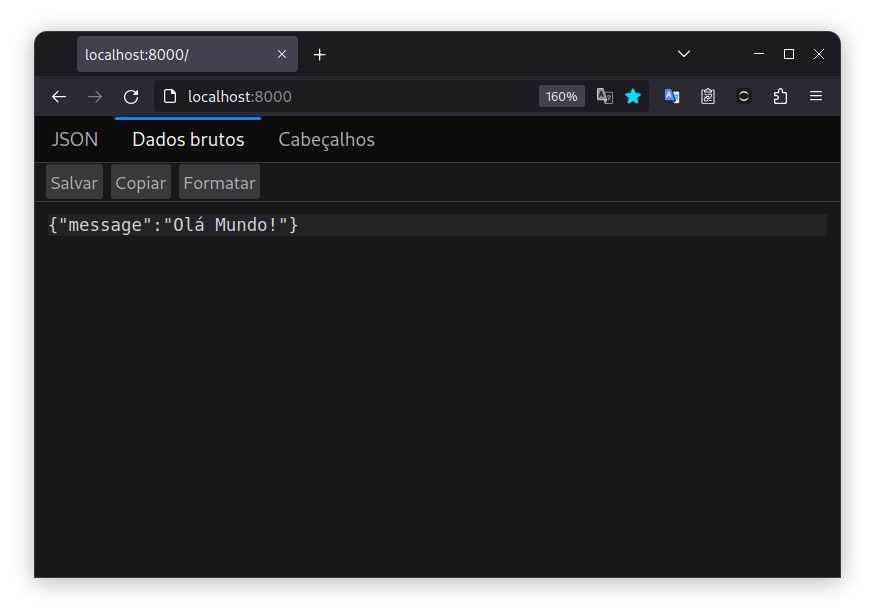
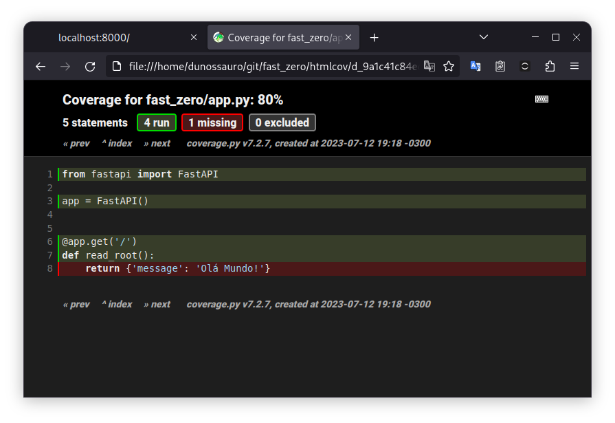

# Configurando o Ambiente de Desenvolvimento

---

Objetivos dessa aula:

- Introdução ao ambiente de desenvolvimento (terminal, ferramentas, etc.)
- Instalação do FastAPI e suas dependências
- Configuração das ferramentas de desenvolvimento
- Execução do primeiro "Hello, World!" com FastAPI com testes!

??? tip "Caso prefira ver a aula em vídeo"
	

[Aula :fontawesome-brands-youtube:](#){ .md-button }
[Slides :fontawesome-solid-file-powerpoint:](https://github.com/dunossauro/fastapi-do-zero/blob/main/slides/pdf/aula_01.pdf){ .md-button }
[Código :fontawesome-solid-code:](https://github.com/dunossauro/fast_zero/tree/01){ .md-button }

---

Nesta aula prática, vamos começar nossa jornada na construção de uma API com FastAPI. Esse é um moderno e rápido (altamente performático) framework web para construção de APIs com Python 3.7+ baseado em Python type hints.

Partiremos do básico, configurando nosso ambiente de desenvolvimento. Discutiremos desde a escolha e instalação da versão correta do Python até a instalação e configuração do Poetry, um gerenciador de pacotes e dependências para Python. Além disso, instalaremos e configuraremos uma série de ferramentas de desenvolvimento úteis, como Ruff, Blue, Isort, pytest e Taskipy.

Depois de configurado o nosso ambiente, criaremos nosso primeiro programa "Hello, World!" com FastAPI. Isso nos permitirá confirmar que tudo está funcionando corretamente. E, finalmente, exploraremos uma parte crucial do Desenvolvimento Orientado por Testes (TDD), escrevendo nosso primeiro teste com Pytest.


## Ambiente de Desenvolvimento

Para iniciar essa aula você vai precisar de algumas ferramentas.

1. Um editor de texto a sua escolha (Eu vou usar o [GNU/Emacs](https://www.gnu.org/software/emacs/){:target="_blank"})
2. Um terminal a sua escolha (Usarei o [Terminator](https://gnome-terminator.org/){:target="_blank"})
3. A versão 3.11 do Python instalada.
	- Caso não tenha essa versão você pode baixar do [site oficial](https://www.python.org/downloads/){:target="_blank"}
	- Ou instalar via [pyenv](https://github.com/pyenv/pyenv){:target="_blank"}
	- Embora a versão 3.7 seja suficiente para executar o FastAPI em si, neste curso usaremos recursos de Python que estão presentes apenas a partir da versão 3.11. Portanto, essa é a versão mínima obrigatória para o curso.
4. O [Poetry](https://python-poetry.org/){:target="_blank"} para gerenciar os pacotes e seu ambiente virtual (caso não conheça o poetry temos uma [live de python sobre ele](https://youtu.be/ZOSWdktsKf0){:target="_blank"})
5. [Git](https://git-scm.com/){:target="_blank"}: Para gerenciar versões
6. [Docker](https://www.docker.com/){:target="_blank"}: Para criar um container da nossa aplicação (caso não tenha nenhum experiência com docker a [Linuxtips](https://www.youtube.com/playlist?list=PLf-O3X2-mxDn1VpyU2q3fuI6YYeIWp5rR){:target="_blank"} tem uma playlist completa e grátis sobre docker no canal deles no Youtube)
7. **OPCIONAL**: O [pipx](https://github.com/pypa/pipx){:target="_blank"} pode te
 ajudar bastante nesses momentos de instalações
 8. **OPCIONAL**: O [ignr](https://github.com/Antrikshy/ignr.py){:target="_blank"} para criar nosso gitignore
 7. **OPCIONAL**: O [gh](https://cli.github.com/){:target="_blank"} para criar o repositório e fazer alterações sem precisar acessar a página do Github

## Instalação do Python 3.11

Se você precisar reconstruir o ambiente usado nesse curso, é recomendado que você use o [pyenv](https://github.com/pyenv/pyenv){:target="_blank"}.

Caso tenha problemas durante a instalação. O pyenv conta com dois assistentes simplificados para sua configuração. Para windows, use o [pyenv-windows](https://pyenv-win.github.io/pyenv-win/){:target="_blank"}. Para GNU/Linux e MacOS, use o [pyenv-installer](https://github.com/pyenv/pyenv-installer){:target="_blank"}.

Navegue até o diretório onde fará os exercícios e executará os códigos de exemplo no seu terminal e digite os seguintes comandos:

```shell title="$ Execução no terminal!"
pyenv update
pyenv install 3.11:latest
```

Certifique que a versão do python 3.11 esteja instalada:


```shell title="$ Execução no terminal!" hl_lines="4"
pyenv versions
* system (set by /home/dunossauro/.pyenv/version)
  3.10.12
  3.11.4
  3.12.0b1
```

A resposta esperada é que o `Python 3.11.4` (a maior versão do python 3.11 enquanto escrevia esse material) esteja nessa lista.

## Gerenciamento de Dependências com Poetry

Após instalar o Python, o próximo passo é instalar o Poetry, um gerenciador de pacotes e dependências para Python. O Poetry facilita a criação, o gerenciamento e a distribuição de pacotes Python.

??? info "Caso esse seja seu primeiro contato com o Poetry"
	Temos uma live de python explicando somente ele

	

	[:fontawesome-brands-youtube: Link direto](https://youtu.be/ZOSWdktsKf0){ .md-button }


Para instalar o Poetry, você pode seguir as instruções presentes na [documentação oficial](https://python-poetry.org/docs/#installation){:target="_blank"} do Poetry para o seu sistema operacional. Alternativamente, se você optou por usar o pipx, pode instalar o Poetry com o seguinte comando:

```shell title="$ Execução no terminal!"
pipx install poetry
```

## Criação do Projeto FastAPI e Instalação das Dependências

Agora que temos o Python e o Poetry prontos, podemos começar a criar nosso projeto FastAPI.

Vamos inicialmente criar um novo diretório para nosso projeto e navegar para ele:

```shell title="$ Execução no terminal!"
poetry new fast_zero
cd fast_zero
```

Ele criará uma estrutura como essa:

```
.
├── fast_zero
│  └── __init__.py
├── pyproject.toml
├── README.md
└── tests
   └── __init__.py
```

Para que a versão que instalamos com pyenv seja usada em nosso projeto criado com poetry, devemos dizer ao pyenv qual versão do python será usada nesse diretório:

```shell title="$ Execução no terminal!"
pyenv local 3.11.4  # Essa era a maior versão do 3.11 quando escrevi
```

Em conjunto com essa instrução, devemos dizer ao poetry que usaremos essa versão em nosso projeto. Para isso vamos alterar o arquivo de configuração do projeto o `pyproject.toml` na raiz do projeto:

```toml title="pyproject.toml" linenums="9"
[tool.poetry.dependencies]
python = "3.11.*"  # .* quer dizer qualquer versão da 3.11
```

Desta forma, temos uma versão do python selecionada para esse projeto e uma garantia que o poetry usará essa versão para a criação do nosso ambiente virtual.


Em seguida, inicializaremos um novo projeto Python com Poetry e instalaremos as dependências necessárias - FastAPI e Uvicorn:

```shell title="$ Execução no terminal!"
poetry install
poetry add fastapi uvicorn
```

## Primeira Execução de um "Hello, World!"

Para garantir que tudo está configurado corretamente, vamos criar um pequeno programa "Hello, World!" com FastAPI. Em um novo arquivo chamado `app.py` no diretório `fast_zero` adicione o seguinte código:


```python title="fast_zero/app.py" linenums="1"
from fastapi import FastAPI

app = FastAPI()

@app.get('/')
def read_root():
    return {'message': 'Olá Mundo!'}
```

Agora, podemos ativar o ambiente virtual e iniciar nosso servidor FastAPI com os seguintes comandos:

```shell title="$ Execução no terminal!"
poetry shell
uvicorn fast_zero.app:app --reload
```

Acesse http://localhost:8000 no seu navegador, e você deve ver a mensagem "Hello, World!" em formato JSON.

{: .center .shadow }

## Instalando as ferramentas de desenvolvimento

As ferramentas de desenvolvimento escolhidas podem variar de acordo com a preferência pessoal. Nesta aula, utilizaremos algumas que são particularmente úteis para demonstrar certos conceitos:

- [taskipy](https://github.com/taskipy/taskipy){:target="_blank"}: Ferramenta para automatizar alguns comandos e simplificar o fluxo
- [ruff](https://beta.ruff.rs/docs/){:target="_blank"}: Um linter, para dizer se não estamos fazendo nada esquisito no código
- [blue](https://blue.readthedocs.io/en/latest/index.html){:target="_blank"}: Um formatador de código bastante amigável
- [isort](https://pycqa.github.io/isort/){:target="_blank"}: Uma ferramenta para ordenar os imports em ordem alfabética
- [pytest](https://docs.pytest.org/en/7.4.x/){:target="_blank"}: Ferramenta para executar testes

Para instalar as dependências, podemos usar um grupo do poetry focado nelas, para não serem usadas em produção:

```shell title="$ Execução no terminal!"
poetry add --group dev pytest pytest-cov taskipy blue ruff httpx isort
```

> O [HTTPX](https://www.python-httpx.org/){:target="_blank"} foi incluído, pois ele é uma dependência do cliente de testes do FastAPI.

## Configurando as ferramentas de desenvolvimento

Após a instalação das dependências, vamos precisar configurar todas as ferramentas de desenvolvimento no arquivo `pyproject.toml`.

### Ruff

Começando pelo ruff, vamos definir o comprimento de linha para 79 caracteres (conforme sugerido na PEP 8) e em seguida, informaremos que o diretório de ambiente virtual e o de migrações de banco de dados deverão ser ignorados:

```toml title="pyproject.toml" linenums="23"
[tool.ruff]
line-length = 79
exclude = ['.venv', 'migrations']
```

### isort

Para evitar conflitos de formatação entre o isort e o blue, definiremos o black como perfil de formatação a ser seguido, já que o blue é um fork dele.
Como o black utiliza 88 caracteres por linha, vamos alterar para 79 que é o padrão que o blue segue e que também estamos seguindo:

```toml title="pyproject.toml" linenums="27"
[tool.isort]
profile = "black"
line_length = 79
extend_skip = ['migrations']
```

### pytest

Configuraremos o pytest para reconhecer o caminho base para execução dos testes na raiz do projeto `.`:

```toml title="pyproject.toml" linenums="31"
[tool.pytest.ini_options]
pythonpath = "."
```

### blue

Configuraremos o blue para excluir o caminho das migrações quando essas forem utilizadas:

```toml title="pyproject.toml" linenums="34"
[tool.blue]
extend-exclude = '(migrations/)'
```

### Taskipy

Para simplificar a execução de certos comandos, vamos criar algumas tarefas com o Taskipy.

```toml title="pyproject.toml" linenums="37"
[tool.taskipy.tasks]
lint = 'ruff . && blue --check . --diff'
format = 'blue .  && isort .'
run = 'uvicorn fast_zero.app:app --reload'
pre_test = 'task lint'
test = 'pytest -s -x --cov=fast_zero -vv'
post_test = 'coverage html'
```

Os comandos definidos fazem o seguinte:

- lint: executa o ruff para ver se não temos nenhum problema com o código e checa se estamos de acordo com a PEP-8
- format: formata o código usando blue e isort
- run: executa o servidor de desenvolvimento do FastAPI
- pre_test: executa a camada de lint antes de executar os teste
- test: executa os testes com pytest de forma verbosa (-vv) e adiciona nosso código como base de cobertura
- post_test: gera um report de cobertura após os testes


Para executar um comando, é bem mais simples, precisando somente passar a palavra `task <comando>`.

??? warning "Caso precise ver o arquivo todo"

	O meu está exatamente assim:

	```toml title="pyproject.toml" linenums="1"
	[tool.poetry]
	name = "fast-zero"
	version = "0.1.0"
	description = ""
	authors = ["dunossauro <mendesxeduardo@gmail.com>"]
	readme = "README.md"
	packages = [{include = "fast_zero"}]

	[tool.poetry.dependencies]
	python = "3.11.*"
	fastapi = "^0.100.0"
	uvicorn = "^0.22.0"

	[tool.poetry.group.dev.dependencies]
	pytest = "^7.4.0"
	pytest-cov = "^4.1.0"
	taskipy = "^1.11.0"
	blue = "^0.9.1"
	ruff = "^0.0.278"
	httpx = "^0.24.1"
	isort = "^5.12.0"

	[tool.ruff]
	line-length = 79
	exclude = ['.venv', 'migrations']

	[tool.isort]
	profile = "black"
	line_length = 79
	extend_skip = ['migrations']

	[tool.pytest.ini_options]
	pythonpath = "."

	[tool.blue]
	extend-exclude = '(migrations/)'

	[tool.taskipy.tasks]
	lint = 'ruff . && blue --check . --diff'
	format = 'blue .  && isort .'
	run = 'uvicorn fast_zero.app:app --reload'
	pre_test = 'task lint'
	test = 'pytest -s -x --cov=fast_zero -vv'
	post_test = 'coverage html'

	[build-system]
	requires = ["poetry-core"]
	build-backend = "poetry.core.masonry.api"
	```


## Os efeitos dessas configurações de desenvolvimento

Caso você tenha copiado o código que usamos para definir `fast_zero/app.py`, pode testar os comandos que criamos para o `taskipy`:

```shell title="$ Execução no terminal!"
task lint
```

Dessa forma, veremos que cometemos algumas infrações na formatação da PEP-8. O blue nos informará que deveríamos ter adicionado duas linhas antes de uma definição de função:


```diff
--- fast_zero/app.py    2023-07-12 21:40:14.590616 +0000
+++ fast_zero/app.py    2023-07-12 21:48:17.017190 +0000
@@ -1,7 +1,8 @@
 from fastapi import FastAPI

 app = FastAPI()

+
 @app.get('/')
 def read_root():
     return {'message': 'Olá Mundo!'}
would reformat fast_zero/app.py

Oh no! 💥 💔 💥
1 file would be reformatted, 2 files would be left unchanged.
```

Para corrigir isso, podemos usar o nosso comando de formatação de código:

=== "Comando"

	```shell title="$ Execução no terminal!"
	task format
	reformatted fast_zero/app.py

	All done! ✨ 🍰 ✨
	1 file reformatted, 2 files left unchanged.
	Skipped 2 files
	```

=== "Resultado"
	```py title="fast_zero/app.py" linenums="1" hl_lines="5"
	from fastapi import FastAPI

	app = FastAPI()


	@app.get('/')
	def read_root():
		return {'message': 'Olá Mundo!'}
	```

## Introdução ao Pytest: Testando o "Hello, World!"

Antes de entendermos a dinâmica dos testes, precisamos entender o efeito que eles têm no nosso código. Um bom lugar para começar isso é analisando a cobertura. Vamos executar os testes.

```shell title="$ Execução no terminal!"
task test
```

Teremos uma resposta como essa:

```shell title="$ Execução no terminal!"
All done! ✨ 🍰 ✨
3 files would be left unchanged.
=========================== test session starts ===========================
platform linux -- Python 3.11.3, pytest-7.4.0, pluggy-1.2.
cachedir: .pytest_cache
rootdir: /home/dunossauro/git/fast_zero
configfile: pyproject.toml
plugins: cov-4.1.0, anyio-3.7.1
collected 0 items

/<path>/site-packages/coverage/control.py:860:
  CoverageWarning: No data was collected. (no-data-collected)
    self._warn("No data was collected.", slug="no-data-collected")

---------- coverage: platform linux, python 3.11.3-final-0 -----------
Name                    Stmts   Miss  Cover
-------------------------------------------
fast_zero/__init__.py       0      0   100%
fast_zero/app.py            5      5     0%
-------------------------------------------
TOTAL                       5      5     0%
```

As primeiras duas linhas são referentes ao comando do `taskipy` `pre_test` que executa o `blue` e o `ruff` antes de cada teste. As linhas seguintes são referentes ao pytest, que disse que coletou 0 itens. Nenhum teste foi executado.

??? info "Caso não tenha muita experiência com Pytest"
	Temos uma live de Python explicando os conceitos básicos da biblioteca
	

	[:fontawesome-brands-youtube: Link direto](https://youtu.be/MjQCvJmc31A){ .md-button }


A parte importante dessa Mensagem está na tabela gerada pelo `coverage`. Que diz que temos 5 linhas de código (Stmts) no arquivo `fast_zero/app.py` e nenhuma delas está coberta pelos nossos testes. Como podemos ver na coluna `Miss`.

Por não ter encontrado nenhum teste, o pytest retornou um "erro". Isso significa que nossa tarefa `post_test` não foi executada. Podemos executá-la manualmente:

```shell title="$ Execução no terminal!"
task post_test
Wrote HTML report to htmlcov/index.html
```

Isso gera um relatório de cobertura de testes em formato HTML. Podemos abrir esse arquivo em nosso navegador e entender exatamente quais linhas do código não estão sendo testadas.

{: .center .shadow }

Se clicarmos no arquivo `fast_zero/app.py` podemos ver em vermelho as linhas que não estão sendo testadas

{: .center .shadow }

Isto significa que precisamos testar todo esse arquivo.

### Escrevendo o teste

Agora, vamos escrever nosso primeiro teste com Pytest.

Para testar o FastAPI, precisamos de um cliente de teste. Isso pode ser obtido no módulo `fastapi.testclient` com o objeto `TestClient`, que precisa receber nosso app como parâmetro:

```python title="tests/test_app.py" linenums="1"
from fastapi.testclient import TestClient
from fast_zero.app import app

client = TestClient(app)
```

Só o fato de termos definido um cliente, já nos mostra uma cobertura bastante diferente:

```shell title="$ Execução no terminal!" hl_lines="3 9"
task test
# parte da mensagem foi omitida
collected 0 items

---------- coverage: platform linux, python 3.11.3-final-0 -----------
Name                    Stmts   Miss  Cover
-------------------------------------------
fast_zero/__init__.py       0      0   100%
fast_zero/app.py            5      1    80%
-------------------------------------------
TOTAL                       5      1    80%
```


Devido ao fato de não ter coletado nenhum teste, o pytest ainda retornou um "erro". Para ver a cobertura, precisaremos executar novamente o `post_test` manualmente:

```shell title="$ Execução no terminal!"
task post_test
Wrote HTML report to htmlcov/index.html
```

No navegador, podemos ver que a única linha não "testada" é aquela onde temos a lógica do endpoint:

{: .center .shadow }

No verde vemos o que foi executado quando chamamos o teste, no vermelho o que não foi.

Para resolver isso, temos que criar um teste de fato, fazendo uma chamada para nossa API usando o cliente de teste que definimos:

```python title="tests/test_app.py" linenums="1"
from fastapi.testclient import TestClient
from fast_zero.app import app

def test_root_deve_retornar_200_e_ola_mundo():
    client = TestClient(app)

    response = client.get('/')

    assert response.status_code == 200
    assert response.json() == {'message': 'Olá Mundo!'}
```

Esse teste faz uma requisição GET no endpoint `/` e verifica se o código de status da resposta é 200 e se o conteúdo da resposta é `{'message': 'Olá Mundo!'}`.

```shell title="$ Execução no terminal!" hl_lines="3 5 11 16"
task test
# parte da mensagem foi omitida
collected 1 item

tests/test_app.py::test_root_deve_retornar_200_e_ola_mundo PASSED

---------- coverage: platform linux, python 3.11.3-final-0 -----------
Name                    Stmts   Miss  Cover
-------------------------------------------
fast_zero/__init__.py       0      0   100%
fast_zero/app.py            5      0   100%
-------------------------------------------
TOTAL                       5      0   100%

================ 1 passed in 1.39s ================
Wrote HTML report to htmlcov/index.html
```

Dessa forma, temos um teste que coletou 1 item (1 teste). Esse teste foi aprovado e a cobertura não deixou de abranger nenhuma linha de código.

Como conseguimos coletar um item, o `post_test` foi executado e também gerou um HTML com a cobertura atualizada.

{: .center .shadow }


## Estrutura de um teste

Agora que escrevemos nosso teste de forma intuitiva, podemos entender o que cada passo do teste faz. Essa compreensão é vital, pois pode nos ajudar a escrever testes no futuro com mais confiança e eficácia. Para desvendar o método por trás da nossa abordagem, vamos explorar a estratégia conhecida como [AAA](https://xp123.com/articles/3a-arrange-act-assert/){:target="_blank"}, que divide o teste em três fases distintas: Arrange, Act, Assert.

??? info "Caso fazer testes ainda seja complicado para você"
	Temos uma live de python focada em ensinar os primeiros passos no mundo dos testes.
	

	[:fontawesome-brands-youtube: Link direto](https://youtu.be/-8H2Pyxnoek){ .md-button }

Vamos pegar esse teste que fizemos e entender os passos que fizemos para conseguir testar esse endpoint:

```python title="tests/test_app.py" linenums="1"
from fastapi.testclient import TestClient
from fast_zero.app import app

def test_root_deve_retornar_200_e_ola_mundo():
    client = TestClient(app)  # Arrange

    response = client.get('/')  # Act

    assert response.status_code == 200  # Assert
    assert response.json() == {'message': 'Olá Mundo!'}  # Assert
```

Com base nesse código, podemos observar as três fases:

### Fase 1 - Organizar (Arrange)

Nesta primeira etapa, estamos preparando o ambiente para o teste. No exemplo, a linha com o comentário `Arrange` não é o teste em si, ela monta o ambiente para que o teste possa ser executado. Estamos configurando um `client` de testes para fazer a requisição ao `app`.

### Fase 2 - Agir (Act)

Aqui é a etapa onde acontece a ação principal do teste, que consiste em chamar o Sistema Sob Teste ([SUT](http://xunitpatterns.com/SUT.html){:target="_blank"}). No nosso caso, o SUT é a rota `/`, e a ação é representada pela linha `response = client.get('/')`. Estamos exercitando a rota e armazenando sua resposta na variável `response`. É a fase em que o código de testes executa o código de produção que está sendo testado. Agir aqui significa interagir diretamente com a parte do sistema que queremos avaliar, para ver como ela se comporta.

### Fase 3 - *Afirmar* (Assert)

Esta é a etapa de verificar se tudo correu como esperado. É fácil notar onde estamos fazendo a verificação, pois essa linha sempre tem a palavra reservada `assert`. A verificação é booleana, ou está correta ou não está. Por isso, um teste deve sempre incluir um `assert` para verificar se o comportamento esperado está correto.

---

Agora que compreendemos o que cada linha de teste faz em específico, podemos nos orientar de forma clara nos testes que escreveremos no futuro. Cada uma das linhas usadas tem uma razão de estar no teste, e conhecer essa estrutura não só nos dá uma compreensão mais profunda do que estamos fazendo, mas também nos dá confiança para explorar e escrever testes mais complexos.


## Criando nosso repositório no git

Antes de concluirmos a aula, precisamos criar nosso repositório no git e criar nosso arquivo `.gitignore`:

```shell title="$ Execução no terminal!"
ignr -p python > .gitignore
git init .
gh repo create
git add .
git commit -m "Configuração inicial do projeto"
git push
```


## Conclusão

Pronto! Agora temos um ambiente de desenvolvimento totalmente configurado para começar a trabalhar com FastAPI e já fizemos nossa primeira imersão no Desenvolvimento Orientado por Testes. Na próxima aula, vamos aprofundar na estruturação da nossa aplicação FastAPI. Até lá!
