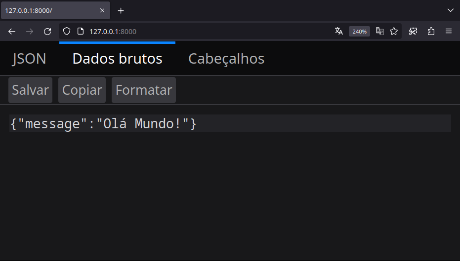
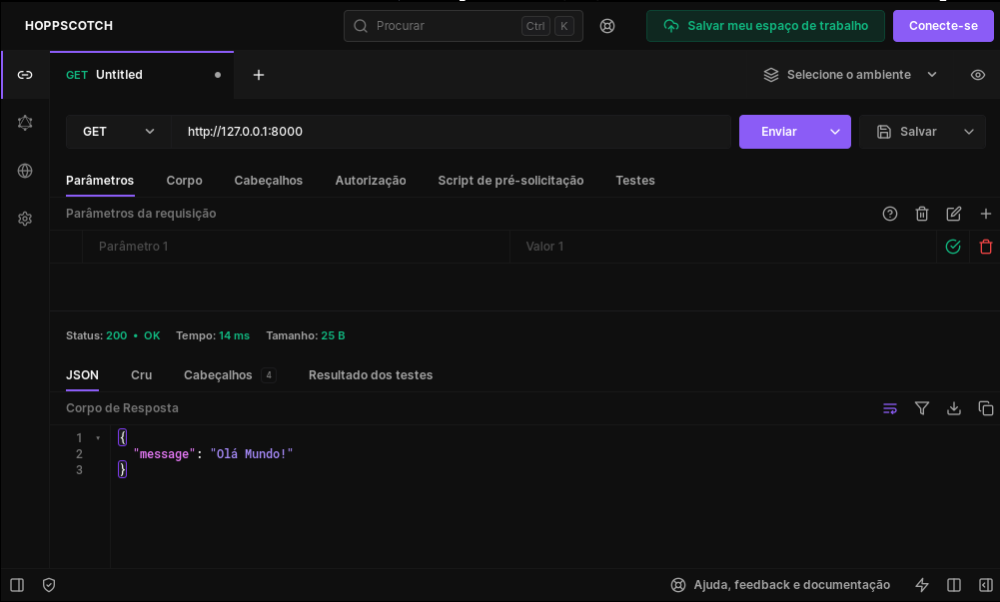
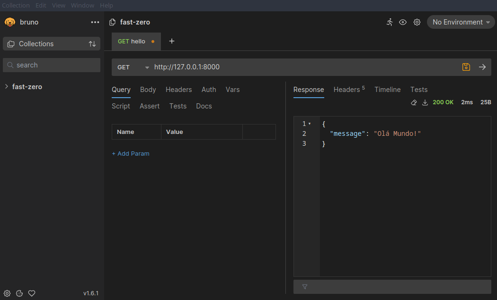
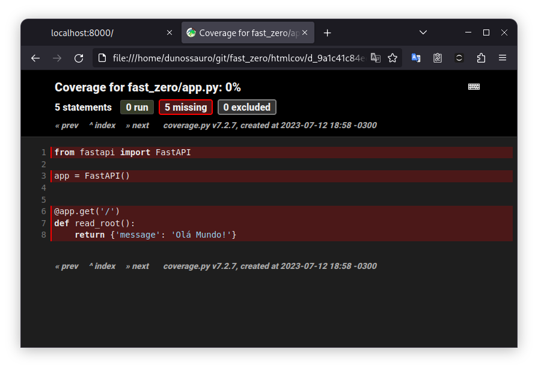
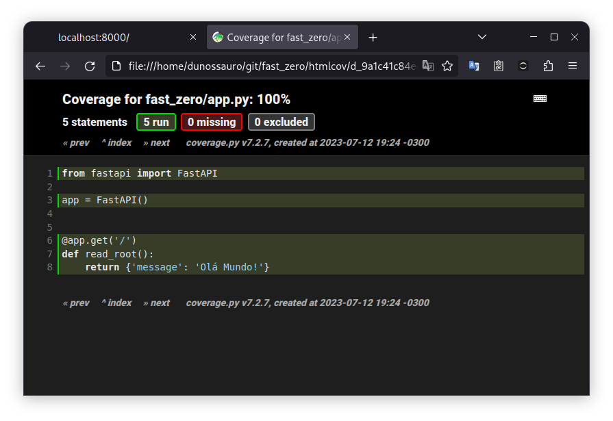

# Configurando o Ambiente de Desenvolvimento


---
Objetivos dessa aula:

- Introdução ao ambiente de desenvolvimento (terminal, ferramentas, etc.)
- Instalação do FastAPI e suas dependências
- Configuração das ferramentas de desenvolvimento
- Execução do primeiro "Hello, World!" com FastAPI com testes!

??? tip "Caso prefira ver a aula em vídeo"
	Esse aula ainda não está disponível em formato de vídeo, somente em texto!
	


[Aula :fontawesome-brands-youtube:](#){ .md-button }
[Slides :fontawesome-solid-file-powerpoint:](https://github.com/dunossauro/fastapi-do-zero/blob/main/slides/pdf/aula_01.pdf){ .md-button }
[Código :fontawesome-solid-code:](https://github.com/dunossauro/fastapi-do-zero/tree/main/codigo_das_aulas/01){ .md-button }

---

Nesta aula começaremos nossa jornada na construção de uma API com FastAPI. Partiremos do básico, configurando nosso ambiente de desenvolvimento. Discutiremos desde a escolha e instalação da versão correta do Python até a instalação e configuração do Poetry, um gerenciador de pacotes e dependências para Python. Além disso, instalaremos e configuraremos uma série de ferramentas de desenvolvimento úteis, como Ruff, pytest e Taskipy.

Após configurado o nosso ambiente, criaremos nosso primeiro programa "Hello, World!" com FastAPI. Isso nos permitirá confirmar que tudo está funcionando corretamente. E, finalmente, exploraremos uma parte crucial do Desenvolvimento Orientado por Testes (TDD), escrevendo nosso primeiro teste com Pytest.


## Ambiente de Desenvolvimento

Para iniciar esse curso você precisa de algumas ferramentas instaladas:

1. Um editor de texto a sua escolha (Usarei o [GNU/Emacs](https://www.gnu.org/software/emacs/){:target="_blank"})
2. Um terminal a sua escolha (Usarei o [Terminator](https://gnome-terminator.org/){:target="_blank"})
3. A versão 3.11 do Python instalada.
	- Caso não tenha essa versão você pode baixar do [site oficial](https://www.python.org/downloads/){:target="_blank"}
	- Ou instalar via [pyenv](https://github.com/pyenv/pyenv){:target="_blank"}
	- Embora a versão 3.7 seja suficiente para executar o FastAPI em si, neste curso usaremos recursos de Python que estão presentes apenas a partir da versão 3.11. Portanto, essa é a versão mínima obrigatória para o curso.
4. O [Poetry](https://python-poetry.org/){:target="_blank"} para gerenciar os pacotes e seu ambiente virtual (caso não conheça o poetry temos uma [live de python sobre ele](https://youtu.be/ZOSWdktsKf0){:target="_blank"})
5. [Git](https://git-scm.com/){:target="_blank"}: Para gerenciar versões
6. [Docker](https://www.docker.com/){:target="_blank"}: Para criar um container da nossa aplicação (caso não tenha nenhuma experiência com docker a [Linuxtips](https://www.youtube.com/playlist?list=PLf-O3X2-mxDn1VpyU2q3fuI6YYeIWp5rR){:target="_blank"} tem uma playlist completa e grátis sobre docker no canal deles no YouTube)[^1]
7. **OPCIONAL**: O [pipx](https://github.com/pypa/pipx){:target="_blank"} pode te
 ajudar bastante nesses momentos de instalações
8. **OPCIONAL**: O [ignr](https://github.com/Antrikshy/ignr.py){:target="_blank"} para criar nosso gitignore
9. **OPCIONAL (extremamente recomendado)**: O [gh](https://cli.github.com/){:target="_blank"} para criar o repositório e fazer alterações sem precisar acessar a página do Github

[^1]: Você não precisa se preocupar com o docker inicialmente, ele será usado da aula 09 em diante

## Instalação do Python 3.11

Se você precisar (re)construir o ambiente usado nesse curso, é **recomendado** que você use o [pyenv](https://github.com/pyenv/pyenv){:target="_blank"}.

Caso encontre dificuldades durante a instalação, o pyenv conta com dois assistentes simplificados para sua configuração. Para windows, use o [pyenv-windows](https://pyenv-win.github.io/pyenv-win/){:target="_blank"}. Para GNU/Linux e MacOS, use o [pyenv-installer](https://github.com/pyenv/pyenv-installer){:target="_blank"}.

Navegue até o diretório onde fará os exercícios e irá executar os códigos de exemplo no seu terminal e digite os seguintes comandos:

```shell title="$ Execução no terminal!"
pyenv update
pyenv install 3.11:latest
```

??? bug "Para quem usa Windows"
    O pyenv-win tem um [bug intermitente](https://github.com/pyenv-win/pyenv-win/issues/407){:target="_blank"} em relação ao uso de `:latest`:

	```powershell
	PS C:\Users\vagrant> pyenv install 3.11:latest
	:: [Info] ::  Mirror: https://www.python.org/ftp/python
	pyenv-install: definition not found: 3.11:latest

	See all available versions with `pyenv install --list`.
	Does the list seem out of date? Update it using `pyenv update`.
	```
	Caso você se depare com esse erro, pode rodar o comando `pyenv install --list` e ver a maior versão disponível do python no momento da sua instalação. Em seguida executar `pyenv install 3.11.<a maior versão disponível>`. Nesse momento em que escrevo é a versão 3.11.7:

	```powershell
	PS C:\Users\vagrant> pyenv install 3.11.7
	:: [Info] ::  Mirror: https://www.python.org/ftp/python
	:: [Downloading] ::  3.11.7 ...
	:: [Downloading] ::  From https://www.python.org/ftp/python/3.11.7/python-3.11.7-amd64.exe
	:: [Downloading] ::  To   C:\Users\vagrant\.pyenv\pyenv-win\install_cache\python-3.11.7-amd64.exe
	:: [Installing] ::  3.11.7 ...
	:: [Info] :: completed! 3.11.7
	```
	Desta forma os próximos comandos podem ser executados normalmente.

Certifique que a versão do python 3.11 esteja instalada:


```shell title="$ Execução no terminal!" hl_lines="4"
pyenv versions
* system (set by /home/dunossauro/.pyenv/version)
  3.10.12
  3.11.7
  3.12.0b1
```

A resposta esperada é que o `Python 3.11.7` (a maior versão do python 3.11 enquanto escrevia esse material) esteja nessa lista.

## Gerenciamento de Dependências com Poetry

Após instalar o Python, o próximo passo é instalar o [Poetry](https://python-poetry.org/){:target="_blank"}, um gerenciador de pacotes e dependências para Python. O Poetry facilita a criação, o gerenciamento e a distribuição de pacotes Python.

??? info "Caso esse seja seu primeiro contato com o Poetry"
	Temos uma live de python explicando somente ele:

	

	[:fontawesome-brands-youtube: Link direto](https://youtu.be/ZOSWdktsKf0){ .md-button }


Para instalar o Poetry, você pode seguir as instruções presentes na [documentação oficial](https://python-poetry.org/docs/#installation){:target="_blank"} do Poetry para o seu sistema operacional. Alternativamente, se você optou por usar o pipx, pode instalar o Poetry com o seguinte comando:

```shell title="$ Execução no terminal!"
pipx install poetry
```

## Criação do Projeto FastAPI e Instalação das Dependências

Agora que temos o Python e o Poetry prontos, podemos começar a criar nosso projeto FastAPI.

Inicialmente criaremos um novo projeto python usando o Poetry, com o comando `poetry new` e em seguida navegaremos até o diretório criado:

```shell title="$ Execução no terminal!"
poetry new fast_zero
cd fast_zero
```

Ele criará uma estrutura de arquivos e pastas como essa:

```
.
├── fast_zero
│  └── __init__.py
├── pyproject.toml
├── README.md
└── tests
   └── __init__.py
```

Para que a versão do python que instalamos via pyenv seja usada em nosso projeto criado com poetry, devemos dizer ao pyenv qual versão do python será usada nesse diretório:

```shell title="$ Execução no terminal!"
pyenv local 3.11.7  # (1)!
```

1. Essa era a maior versão do 3.11 quando escrevi

Esse comando criará um arquivo oculto chamado `.python-version` na raiz do nosso projeto:

```title=".python-version"
3.11.7
```

Esse arquivo fará com que toda vez que o terminal for aberto nesse diretório, o pyenv use a versão descrita no arquivo quando o python interpretador for chamado.

Em conjunto com essa instrução, devemos dizer ao poetry que usaremos exatamente a versão `3.11` em nosso projeto. Para isso alteraremos o arquivo de configuração do projeto o `pyproject.toml` na raiz do projeto:

```toml title="pyproject.toml" linenums="9"
[tool.poetry.dependencies]
python = "3.11.*"  # (1)!
```

1. `.*` quer dizer qualquer versão da 3.11

Desta forma, temos uma versão do python selecionada para esse projeto e uma garantia que o poetry usará essa versão para a criação do nosso ambiente virtual.

Em seguida, inicializaremos nosso ambiente virtual com Poetry e instalaremos as dependências necessárias. O FastAPI e o Uvicorn:

```shell title="$ Execução no terminal!"
poetry install  # (1)!
poetry add fastapi uvicorn  # (2)!
```

1. Cria o ambiente virtual (venv)
2. Adicionada em nosso ambiente virtual o fastapi e o uvicorn

### Uvicorn

O FastAPI é ótimo para criar APIs, mas não pode disponibilizá-las na rede sozinho. Para podermos acessar essas APIs por um navegador ou de outras aplicações clientes, é necessário um servidor. É aí que o [Uvicorn](https://www.uvicorn.org/){:target="_blank"} entra em cena. Ele atua como esse servidor, disponibilizando a API do FastAPI em rede. Isso permite que a API seja acessada de outros dispositivos ou programas.

Sempre que quisermos usar ou testar nossa aplicação, devemos iniciá-la pelo uvicorn, como veremos mais adiante. Por isso sua instalação é imprescindível nesse primeiro momento.

??? tip "Nota sobre versões do Uvicorn"
	Caso você tenha ido até a [página oficial do Uvicorn](https://www.uvicorn.org/){:target="_blank"}, você pode ter se deparado com duas versões diferentes do uvicorn, o `uvicorn` e o `uvicorn[standard]`. A versão tradicional e que instalamos é baseada em python puro. O que significa que ela só depende do interpretador do python para ser executada. A versão `uvicorn[standard]` é baseada em [Cython](https://cython.org/){:target="_blank"} e troca o loop tradicional do python pelo [UVloop](https://uvloop.readthedocs.io/){:target="_blank"}, sendo muito mais performático em relação à versão em python, caso esteja usando um sistema baseado em Unix, como GNU/Linux ou MacOS, esta versão oferecerá mais performance. Fica o adendo, porém, que o UVloop não oferece uma versão para windows.

	Usaremos a versão em python puro por questões de compatibilidade entre os ambientes, porém, em produção é **extremamente recomendado** usar a versão standard, baseada em Cython.

## Primeira Execução de um "Hello, World!"

Uma coisa bastante interessante sobre o FastAPI é que ele é um framework web baseado em funções. Da mesma forma em que criamos funções tradicionalmente em python, podemos estender essas funções para que elas sejam servidas pelo servidor. Por exemplo:

```py title="fast_zero/app.py" linenums="1"
def read_root():
    return {'message': 'Olá Mundo!'}
```

Essa função em python basicamente retorna um dicionário com uma chave chamada `#!python 'message'` e uma mensagem `#!python 'Olá Mundo!'`. Se adicionarmos essa função em novo arquivo chamado `app.py` no diretório `fast_zero`. Podemos fazer a chamada dela pelo terminal interativo (**REPL**):

```py title=">>> Terminal interativo!"
>>> read_root()
{'message': 'Olá Mundo!'}
```

De forma tradicional, como todas as funções em python.

??? tip "Dica: Como abrir o terminal interativo (REPL)"
	Para abrir o terminal interativo com o seu código carregado, você deve chamar o Python no terminal usando -i:

	```shell title="$ Execução no terminal!"
	python -i <seu_arquivo.py>
	```

	O interpretador do Python executa o código do arquivo e retorna o shell após executar tudo que está escrito no arquivo.

	Para o nosso caso específico, como o nome do arquivo é `fast_zero/app.py`, devemos executar esse comando no terminal:

	```shell title="$ Execução no terminal!"
	python -i fast_zero/app.py
	```

Desta forma, usando somente um decorador do FastAPI, podemos fazer com que uma determinada função seja acessível pela rede:

```python title="fast_zero/app.py" linenums="1" hl_lines="5"
from fastapi import FastAPI # (1)!

app = FastAPI()  # (2)!

@app.get('/')  # (3)!
def read_root():  # (4)!
	return {'message': 'Olá Mundo!'} # (5)!
```

1. Importando da biblioteca fastapi o objeto FastAPI
2. Iniciando uma aplicação FastAPI
3. Definindo um endpoint com o endereço `/` acessível pelo método HTTP `GET`
4. Função que será executada quando o endereço `/` for acessado por um cliente
5. Os dados que serão retornados pelo endereço quando for chamado

A linha em destaque `#!python @app.get('/')` expõem a nossa função para ser servida pelo FastAPI. Dizendo que quando um cliente acessar o nosso endereço de rede no caminho `/`, usando o método HTTP GET[^2], a função será executada. Desta maneira, temos todo o código necessário para criar nossa primeira aplicação web com FastAPI.

[^2]: Exploraremos mais a fundo a relação de métodos e o protocolo HTTP na próxima aula.

Antes de iniciarmos nossa aplicação, temos que fazer um passo importante, habilitar o ambiente virtual, para que o python consiga enxergar nossas dependências instaladas. O poetry tem um comando específico para isso:

```shell title="$ Execução no terminal!"
poetry shell
```

Agora com o ambiente virtual ativo, podemos iniciar nosso servidor FastAPI com o comando do uvicorn para iniciar nossa aplicação:

```shell title="$ Execução no terminal!"
uvicorn fast_zero.app:app
```

Esse comando diz ao uvicorn o seguinte: na pasta `fast_zero` existe um arquivo chamado `app`. Dentro desse arquivo, temos uma aplicação para ser servida com o nome de `app`. O comando é composto por `uvicorn pasta.arquivo:variável`.

A resposta do comando no terminal deve ser parecida com essa:

```shell title="Resposta do comando `uvicorn fast_zero.app:app`" hl_lines="4"
INFO:     Started server process [127946]
INFO:     Waiting for application startup.
INFO:     Application startup complete.
INFO:     Uvicorn running on http://127.0.0.1:8000 (Press CTRL+C to quit)
```

A mensagem que o Uvicorn nos apresenta na última linha `http://127.0.0.1:8000` tem uma informação bastante importante.

{: .center }
{: .center  }

1. Ela nos diz qual o protocolo que ele está servido `HTTP`, o protocolo padrão da web;
2. O endereço de rede (IP) no qual ele está escutando `127.0.0.1`, endereço especial ([loopback](https://pt.wikipedia.org/wiki/Loopback#Protocolo_de_Interface_de_Rede_Virtual_da_Internet){:target="_blank"}) que aponta para a nossa própria máquina;
3. A porta `:8000`, a qual é a porta da nossa máquina que está reservada para nossa aplicação.

Agora, com o servidor inicializado, podemos usar um cliente para acessar o endereço [http://127.0.0.1:8000](http://127.0.0.1:8000){:target="_blank"}.

O cliente mais tradicional da web é o navegador, podemos digitar o endereço na barra de navegação e se tudo ocorreu corretamente, você deve ver a mensagem "Olá Mundo!" em formato JSON.

{: .center .shadow }

> Para parar a execução do uvicorn no shell, você pode digitar ++ctrl+c++ e a mensagem `Shutting down` aparecerá mostrando que o servidor foi finalizado.

??? example "Diferentes clientes para nossa aplicação"
	Caso exista uma curiosidade sobre outros clientes HTTP que não o browser, podemos usar aplicações de linha de comando como tradicional [curl](https://curl.se/){:target="_blank"}:

	```shell title="$ Execução no terminal!"
	curl 127.0.0.1:8000
	{"message":"Olá Mundo!"}
	```

	Ou o meu cliente HTTP preferido (escrito em python), o [HTTPie](https://httpie.io/){:target="_blank"}:

	```shell title="$ Execução no terminal!"
	http 127.0.0.1:8000
	HTTP/1.1 200 OK
	content-length: 25
	content-type: application/json
	date: Thu, 11 Jan 2024 11:46:32 GMT
	server: uvicorn

	{
		"message": "Olá Mundo!"
	}
	```

	Existem até mesmo aplicações gráficas de código aberto pensadas para serem clientes HTTP para APIs. Como o [hoppscotch](https://hoppscotch.io/){:target="_blank"}:

	{: .center .shadow }

	Ou como o [Bruno](https://www.usebruno.com/){:target="_blank"}:
	{: .center .shadow }

## Instalando as ferramentas de desenvolvimento

As escolhas de ferramentas de desenvolvimento, de forma geral, são escolhas bem particulares. Não costumam ser consensuais nem mesmo em times de desenvolvimento. Dito isso, selecionei algumas ferramentas que gosto de usar e alinhadas com a utilidade que elas apresentam no desenvolvimento do projeto.

As ferramentas escolhidas são:

- [taskipy](https://github.com/taskipy/taskipy){:target="_blank"}: ferramenta usada para criação de comandos. Como executar a aplicação, rodar os testes, etc.
- [pytest](https://docs.pytest.org/){:target="_blank"}: ferramenta para escrever e executar testes
- [ruff](https://docs.astral.sh/ruff/){:target="_blank"}: Uma ferramenta que tem duas funções no nosso código. 
    1. Um analisador estático de código (um [linter](https://pt.wikipedia.org/wiki/Linter_(computa%C3%A7%C3%A3o)){:target="_blank"}), para dizer se não estamos infringido alguma [boa prática de programação](https://docs.astral.sh/ruff/rules/){:target="_blank"};
	2. Um formatador de código. Para seguirmos um estilo único de código. Vamos nos basear na [PEP-8](https://peps.python.org/pep-0008/){:target="_blank"}.

Para instalar essas ferramentas que usaremos em desenvolvimento, podemos usar um grupo do poetry focado nelas, para não serem instaladas quando nossa aplicação estiver em produção:

```shell title="$ Execução no terminal!"
poetry add --group dev pytest pytest-cov taskipy ruff httpx
```

> O [HTTPX](https://www.python-httpx.org/){:target="_blank"} foi incluído, pois ele é uma dependência do cliente de testes do FastAPI.

## Configurando as ferramentas de desenvolvimento

Após a instalação das ferramentas de desenvolvimento, precisamos definir as configurações de cada uma individualmente no arquivo `pyproject.toml`.

### Ruff

O [Ruff](https://docs.astral.sh/ruff/){:target="_blank"} é uma ferramenta moderna em python, escrita em rust, compatível[^1] com os projetos de análise estática escritos e mantidos originalmente pela comunidade no projeto [PYCQA](https://github.com/PyCQA/){:target="_blank"}[^2] e tem duas funções principais:

[^1]: Em alguns casos existe uma divergência de opiniões em os linter mais tradicionais. Mas, em geral funciona bem.
[^2]: Em versões antigas do texto usávamos as ferramentas do PyCQA como o pylint e o isort.

1. Analisar o código de forma estática (Linter): Efetuar a verificação se estamos programando de acordo com boas práticas do python.
2. Formatar o código (Formatter): Efetuar a verificação do código para padronizar um estilo de código pré-definido.


Para configurar o ruff montamos a configuração em 3 [tabelas](https://toml.io/pt/v1.0.0#tabela){:target="_blank"} distintas no arquivo `pyproject.toml`. Uma para as configurações globais, uma para o linter e uma para o formatador.

**Configuração global**

Na configuração global do Ruff queremos alterar somente duas coisas. O comprimento de linha para 79 caracteres (conforme sugerido na [PEP-8](https://peps.python.org/pep-0008/){:target="_blank"}) e em seguida, informaremos que o diretório de migrações de banco de dados será ignorado na checagem e na formatação:

```toml title="pyproject.toml" linenums="20"
--8<-- "aulas/codigos/01/pyproject.toml:20:23"
```

???+ example "Nota sobre "migrations""
	Nessa fase de configuração, excluiremos a pasta `migrations`, isso pode não fazer muito sentido nesse momento. Contudo, quando iniciarmos o trabalho com o banco de dados, a ferramenta `Alembic` faz geração de código automático. Por serem códigos gerados automaticamente, não queremos alterar a configuração feita por ela.

**Linter**

Durante a análise estática do código, queremos buscar por coisas específicas. No Ruff, precisamos dizer exatamente o que ele deve analisar. Isso é feito por códigos. Usaremos estes:

- `I` ([Isort](https://pycqa.github.io/isort/){:target="_blank"}): Checagem de ordenação de imports em ordem alfabética
- `F` ([Pyflakes](https://github.com/PyCQA/pyflakes){:target="_blank"}): Procura por alguns erros em relação a boas práticas de código
- `E` (Erros [pycodestyle](https://pycodestyle.pycqa.org/en/latest/){:target="_blank"}): Erros de estilo de código
- `W` (Avisos [pycodestyle](https://pycodestyle.pycqa.org/en/latest/){:target="_blank"}): Avisos de coisas não recomendadas no estilo de código
- `PL` ([Pylint](https://pylint.pycqa.org/en/latest/index.html){:target="_blank"}): Como o `F`, também procura por erros em relação a boas práticas de código
- `PT` ([flake8-pytest](https://pypi.org/project/flake8-pytest-style/){:target="_blank"}): Checagem de boas práticas do Pytest

```toml title="pyproject.toml" linenums="24"
--8<-- "aulas/codigos/01/pyproject.toml:24:27"
```

> Para mais informações sobre a configuração e sobre os códigos do ruff e dos projetos do PyCQA, você pode checar a [documentação do ruff](https://docs.astral.sh/ruff/rules){:target="_blank"} ou as documentações originais dos projetos [PyQCA](https://github.com/PyCQA){:target="_blank"}.

**Formatter**

A formatação do Ruff praticamente não precisa ser alterada. Pois ele vai seguir as boas práticas e usar a configuração global de `79` caracteres por linha. A única alteração que farei é o uso de aspas simples `'` no lugar de aspas duplas `"`:

```toml title="pyproject.toml" linenums="28"
--8<-- "aulas/codigos/01/pyproject.toml:28:31"
```

> Lembrando que a opção de usar aspas simples é totalmente pessoal, você pode usar aspas duplas se quiser.

### pytest

O [Pytest](https://docs.pytest.org/){:target="_blank"} é uma framework de testes, que usaremos para escrever e executar nossos testes. O configuraremos para reconhecer o caminho base para execução dos testes na raiz do projeto `.`:

```toml title="pyproject.toml" linenums="32"
--8<-- "aulas/codigos/01/pyproject.toml:32:34"
```

Na segunda linha dizemos para o pytest adicionar a opção `no:warnings`. Para ter uma visualização mais limpa dos testes, caso alguma biblioteca exiba uma mensagem de warning, isso será suprimido pelo pytest.

### Taskipy

A ideia do [Taskipy](https://github.com/taskipy/taskipy){:target="_blank"} é ser um executor de tarefas (*task runner*) complementar em nossa aplicação. No lugar de ter que lembrar comandos como o do uvicorn, que vimos na execução da aplicação, que tal substituir ele simplesmente por `task run`?

Isso funcionaria para qualquer comando complicado em nossa aplicação. Simplificando as chamadas e também para não termos que lembrar de como executar todos os comandos de cabeça.

Alguns comandos que criaremos agora no início:

```toml title="pyproject.toml" linenums="36"
--8<-- "aulas/codigos/01/pyproject.toml:36:43"
```

Os comandos definidos fazem o seguinte:

- lint: Executa duas variações da checagem:
     - `check .`: Mostra os códigos de infrações de boas práticas
	 - `check . --diff`: Mostra o que precisa ser alterado no código para que as boas práticas sejam seguidas
- format: Executa duas variações da formatação:
    - `check . --fix`: Faz algumas correções de boas práticas automaticamente
	- `ruff format .`: Executa a formatação do código em relação as convenções de estilo de código
- run: executa o servidor de desenvolvimento do FastAPI
- pre_test: executa a camada de lint antes de executar os testes
- test: executa os testes com pytest de forma verbosa (-vv) e adiciona nosso código como base de cobertura
- post_test: gera um report de cobertura após os testes


Para executar um comando, é bem mais simples, precisando somente passar a palavra `task <comando>`.

??? warning "Caso precise ver o arquivo todo"

	O meu está exatamente assim:

	```toml title="pyproject.toml" linenums="1"
	--8<-- "aulas/codigos/01/pyproject.toml"
	```

	Um ponto importante é que as versões dos pacotes podem variar dependendo da data em que você fizer a instalação dos pacotes. Esse arquivo é somente um exemplo.


### Os efeitos dessas configurações de desenvolvimento

Caso você tenha copiado o código que usamos para definir `fast_zero/app.py`, pode testar os comandos que criamos para o `taskipy`:

```shell title="$ Execução no terminal!"
task lint
```

Dessa forma, veremos que cometemos algumas infrações na formatação da PEP-8. O ruff nos informará que deveríamos ter adicionado duas linhas antes de uma definição de função:

```diff
fast_zero/app.py:5:1: E302 [*] Expected 2 blank lines, found 1
Found 1 error.
[*] 1 fixable with the `--fix` option.
--- fast_zero/app.py
+++ fast_zero/app.py
@@ -2,6 +2,7 @@
 
 app = FastAPI()
 
+
 @app.get('/')
 def read_root():
     return {'message': 'Olá Mundo!'}

Would fix 1 error.
```

Para corrigir isso, podemos usar o nosso comando de formatação de código:

=== "Comando"
	```shell title="$ Execução no terminal!"
	task format
	Found 1 error (1 fixed, 0 remaining).
	3 files left unchanged
	```

=== "Resultado"
	```py title="fast_zero/app.py" linenums="1" hl_lines="5"
	from fastapi import FastAPI

	app = FastAPI()


	@app.get('/')
	def read_root():
		return {'message': 'Olá Mundo!'}
	```

## Introdução ao Pytest: Testando o "Hello, World!"

Antes de entendermos a dinâmica dos testes, precisamos entender o efeito que eles têm no nosso código. Podemos começar analisando a cobertura (o quanto do nosso código está sendo efetivamente testado). Vamos executar os testes:

```shell title="$ Execução no terminal!"
task test
```

Teremos uma resposta como essa:

```shell title="$ Execução no terminal!" hl_lines="7"
=========================== test session starts ===========================
platform linux -- Python 3.11.7, pytest-7.4.4, pluggy-1.3.0
cachedir: .pytest_cache
rootdir: /home/dunossauro/git/fast_zero
configfile: pyproject.toml
plugins: cov-4.1.0, anyio-4.2.0
collected 0 items

---------- coverage: platform linux, python 3.11.7-final-0 -----------
Name                    Stmts   Miss  Cover
-------------------------------------------
fast_zero/__init__.py       0      0   100%
fast_zero/app.py            5      5     0%
-------------------------------------------
TOTAL                       5      5     0%
```

As linhas no terminal são referentes ao pytest, que disse que coletou 0 itens. Nenhum teste foi executado.

??? info "Caso não tenha muita experiência com Pytest"
	Temos uma live de Python explicando os conceitos básicos da biblioteca
	

	[:fontawesome-brands-youtube: Link direto](https://youtu.be/MjQCvJmc31A){ .md-button }


A parte importante dessa Mensagem está na tabela gerada pelo `coverage`. Que diz que temos 5 linhas de código (Stmts) no arquivo `fast_zero/app.py` e nenhuma delas está coberta pelos nossos testes. Como podemos ver na coluna `Miss`.

Por não encontrar nenhum teste, o pytest retornou um "erro". Isso significa que nossa tarefa `post_test` não foi executada. Podemos executá-la manualmente:

```shell title="$ Execução no terminal!"
task post_test
Wrote HTML report to htmlcov/index.html
```

Isso gera um relatório de cobertura de testes em formato HTML. Podemos abrir esse arquivo em nosso navegador e entender exatamente quais linhas do código não estão sendo testadas.

{: .center }

Se clicarmos no arquivo `fast_zero/app.py` podemos ver em vermelho as linhas que não estão sendo testadas:

{: .center  }

Isto significa que precisamos testar todo esse arquivo.

### Escrevendo o teste

Agora, escreveremos nosso primeiro teste com Pytest. Mas, antes de escrever o teste, precisamos criar um arquivo específico para eles. Na pasta `tests`, vamos criar um arquivo chamado `test_app.py`.

> Por convenção, todos os arquivos de teste do pytest devem iniciar com um prefixo test_<algo>.py

Para testar o código feito com FastAPI, precisamos de um cliente de teste. A grande vantagem é que o FastAPI já conta com um cliente de testes no módulo `fastapi.testclient` com o objeto `TestClient`, que precisa receber nosso app como parâmetro:

```python title="tests/test_app.py" linenums="1"
--8<-- "aulas/codigos/01/tests/test_app.py::5"
```

1. Importa do módulo `testclient` o objeto `TestClient`
2. Importa o nosso `app` definido em `fast_zero`
3. Cria um cliente de testes usando a nossa aplicação como base

Só o fato de termos definido um cliente, já nos mostra uma cobertura bastante diferente:

```shell title="$ Execução no terminal!" hl_lines="3 9"
task test
# parte da mensagem foi omitida
collected 0 items

---------- coverage: platform linux, python 3.11.3-final-0 -----------
Name                    Stmts   Miss  Cover
-------------------------------------------
fast_zero/__init__.py       0      0   100%
fast_zero/app.py            5      1    80%
-------------------------------------------
TOTAL                       5      1    80%
```


Por não coletar nenhum teste, o pytest ainda retornou um "erro". Para ver a cobertura, precisaremos executar novamente o `post_test` manualmente:

```shell title="$ Execução no terminal!"
task post_test
Wrote HTML report to htmlcov/index.html
```

No navegador, podemos ver que a única linha não "testada" é aquela onde temos a lógica (o corpo) da função `read_root`. As linhas de definição estão todas verdes:

{: .center  }

No verde vemos o que foi executado quando chamamos o teste, no vermelho o que não foi.

Para resolver isso, temos que criar um teste de fato, fazendo uma chamada para nossa API usando o cliente de teste que definimos:

```python title="tests/test_app.py" linenums="1"
--8<-- "aulas/codigos/01/tests/test_app.py:8:22"
```

1. No nome da função, geralmente escrevemos o que o teste de fato faz. Aqui estamos dizendo que root deve retornar o status OK e a mensagem "olá mundo". Root é o nome dado a raiz da URL. O caminho `/`, que colocamos na definição do `#!python @app.get('/')`. OK é o status que diz que a requisição aconteceu com sucesso no protocolo HTTP.
2. Aqui criamos o cliente de teste do nosso app
3. Nesse ponto, o `client` faz uma requisição. Da mesma forma que o browser, um cliente da API. Nisso, chamamos o endereço de root, usando o método GET.
4. Aqui fazemos a validação do código de resposta, para saber se a resposta é referente ao código `200`, que significa `OK`. Mais informações sobre esse tópico [aqui](02.md#boas-praticas-para-constantes){:target="_blank"}.
5. No final, validamos se o dicionário que enviamos na função é o mesmo que recebemos quando fizemos a requisição.
6. Importação da biblioteca nativa do python que abstrai os códigos de resposta e nos apresenta o status. Mais informações sobre esse tópico [aqui](02.md#boas-praticas-para-constantes){:target="_blank"}.

Esse teste faz uma requisição GET no endpoint `/` e verifica se o código de status da resposta é 200 e se o conteúdo da resposta é `{'message': 'Olá Mundo!'}`.

```shell title="$ Execução no terminal!" hl_lines="3 5 11 16"
task test
# parte da mensagem foi omitida
collected 1 item

tests/test_app.py::test_root_deve_retornar_ok_e_ola_mundo PASSED

---------- coverage: platform linux, python 3.11.3-final-0 -----------
Name                    Stmts   Miss  Cover
-------------------------------------------
fast_zero/__init__.py       0      0   100%
fast_zero/app.py            5      0   100%
-------------------------------------------
TOTAL                       5      0   100%

================ 1 passed in 1.39s ================
Wrote HTML report to htmlcov/index.html
```

Dessa forma, temos um teste que coletou 1 item (1 teste). Esse teste foi aprovado e a cobertura não deixou de abranger nenhuma linha de código.

Como conseguimos coletar um item, o `post_test` foi executado e também gerou um HTML com a cobertura atualizada.

{: .center }


## Estrutura de um teste

Agora que escrevemos nosso primeiro teste de forma intuitiva, podemos entender o que cada passo do teste faz. Essa compreensão é vital, pois nos ajudará a escrever testes com mais confiança e eficácia. Para desvendar o método por trás da nossa abordagem, exploraremos uma estratégia conhecida como [AAA](https://xp123.com/articles/3a-arrange-act-assert/){:target="_blank"}, que divide o teste em três fases distintas: Arrange, Act, Assert.

??? info "Caso fazer testes ainda seja complicado para você"
	Temos uma live de python focada em ensinar os primeiros passos no mundo dos testes.
	

	[:fontawesome-brands-youtube: Link direto](https://youtu.be/-8H2Pyxnoek){ .md-button }

Para analisar todas as etapas de um teste, usaremos como exemplo este primeiro teste que escrevemos:

```python title="tests/test_app.py" linenums="1"
--8<-- "aulas/codigos/01/tests/test_app.py:24"
```

Com base nesse código, podemos observar as três fases:

### Fase 1 - Organizar (Arrange)

Nesta primeira etapa, estamos preparando o ambiente para o teste. No exemplo, a linha com o comentário `Arrange` não é o teste em si, ela monta o ambiente para que o teste possa ser executado. Estamos configurando um `client` de testes para fazer a requisição ao `app`.

### Fase 2 - Agir (Act)

Aqui é a etapa onde acontece a ação principal do teste, que consiste em chamar o Sistema Sob Teste ([SUT](http://xunitpatterns.com/SUT.html){:target="_blank"}). No nosso caso, o SUT é a rota `/`, e a ação é representada pela linha `response = client.get('/')`. Estamos exercitando a rota e armazenando sua resposta na variável `response`. É a fase em que o código de testes executa o código de produção que está sendo testado. Agir aqui significa interagir diretamente com a parte do sistema que queremos avaliar, para ver como ela se comporta.

### Fase 3 - *Afirmar* (Assert)

Esta é a etapa de verificar se tudo correu como esperado. É fácil notar onde estamos fazendo a verificação, pois essa linha sempre tem a palavra reservada `assert`. A verificação é booleana, ou está correta, ou não está. Por isso, um teste deve sempre incluir um `assert` para verificar se o comportamento esperado está correto.

---

Agora que compreendemos o que cada linha de teste faz em específico, podemos nos orientar de forma clara nos testes que escreveremos no futuro. Cada uma das linhas usadas tem uma razão de estar no teste, e conhecer essa estrutura não só nos dá uma compreensão mais profunda do que estamos fazendo, mas também nos dá confiança para explorar e escrever testes mais complexos.


## Criando nosso repositório no git

Antes de concluirmos a aula, precisamos executar alguns passos:

1. Criar um arquivo `.gitignore` para não adicionar o ambiente virtual e outros arquivos desnecessários no versionamento de código.
2. Criar um novo repositório no GitHub para versionar o código.
3. Subir o código que fizemos para o GitHub.

**Criando o arquivo .gitignore**

Vamos iniciar com a criação de um arquivo `.gitignore` específico para Python. Existem diversos modelos disponíveis na internet, como os [disponíveis pelo próprio GitHub](https://github.com/github/gitignore){:target="_blank"}, ou o [gitignore.io](https://gitignore.io){:target="_blank"}. Uma ferramenta útil é a [`ignr`](https://github.com/Antrikshy/ignr.py){:target="_blank"}, feita em Python, que faz o download automático do arquivo para a nossa pasta de trabalho atual:

```shell title="$ Execução no terminal!"
ignr -p python > .gitignore
```

O `.gitignore` é importante porque ele nos ajuda a evitar que arquivos desnecessários ou sensíveis sejam enviados para o repositório. Isso inclui o ambiente virtual, arquivos de configuração pessoal, entre outros.

**Criando um repositório no github**

Agora, com nossos arquivos indesejados ignorados, podemos iniciar o versionamento de código usando o `git`. Para criar um repositório local, usamos o comando `git init .`. Para criar esse repositório no GitHub, utilizaremos o `gh`, um utilitário de linha de comando que nos auxilia nesse processo:

```shell title="$ Execução no terminal!"
git init .
gh repo create
```

Ao executar `gh repo create`, algumas informações serão solicitadas, como o nome do repositório e se ele será público ou privado. Isso irá criar um repositório tanto localmente quanto no GitHub.

**Subindo nosso código para o github**

Com o repositório pronto, vamos versionar nosso código. Primeiro, adicionamos o código ao próximo commit com `git add .`. Em seguida, criamos um ponto na história do projeto com `git commit -m "Configuração inicial do projeto"`. Por fim, sincronizamos o repositório local com o remoto no GitHub usando `git push`:

```shell title="$ Execução no terminal!"
git add .
git commit -m "Configuração inicial do projeto"
git push
```

> Caso seja a primeira vez que está utilizando o `git push`, talvez seja necessário configurar suas credenciais do GitHub.

Esses passos garantem que todo o código criado na aula esteja versionado e disponível para compartilhamento no GitHub.

## Exercício

1. Crie um repositório para acompanhar o curso e suba em alguma plataforma, como [Github](https://github.com/), [gitlab](https://gitlab.com/), [codeberg](https://codeberg.org/), etc. E compartilhe o link no [repositório do curso](https://github.com/dunossauro/fastapi-do-zero/issues/91) para podermos aprender juntos.

## Conclusão

Pronto! Agora temos um ambiente de desenvolvimento totalmente configurado para começar a trabalhar com FastAPI e já fizemos nossa primeira imersão no Desenvolvimento Orientado por Testes. Na próxima aula nos aprofundaremos na estruturação da nossa aplicação FastAPI. Até lá!
