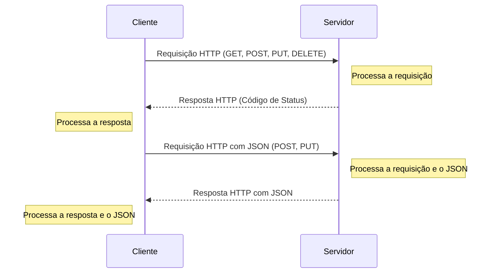

# [REV] Estruturando o Projeto e Criando Rotas CRUD

**Revisões**

- Remover dumps dos schemas, eles não são necessários
- Usar a tag correta de bloco nos commits

---

Objetivos dessa aula:

- Entendimento dos verbos HTTP, JSON e códigos de resposta
- Compreender a estrutura de um projeto FastAPI e como estruturar rotas CRUD (Criar, Ler, Atualizar, Deletar)
- Aprender sobre a biblioteca Pydantic e sua utilidade na validação e serialização de dados
- Implementação de rotas CRUD em FastAPI
- Escrita e execução de testes para validar o comportamento das rotas

??? tip "Caso prefira ver a aula em vídeo"
	

[Aula :fontawesome-brands-youtube:](#){ .md-button }
[Slides :fontawesome-solid-file-powerpoint:](https://github.com/dunossauro/fastapi-do-zero/blob/main/slides/pdf/aula_02.pdf){ .md-button }
[Código :fontawesome-solid-code:](https://github.com/dunossauro/fast_zero/tree/02){ .md-button }

---

Boas-vindas de volta à nossa série de cursos "FastAPI do Zero: Criando um Projeto com Bancos de Dados, Testes e Deploy". Hoje, na Aula 3, avançaremos na estruturação do nosso projeto FastAPI e implementar todas as rotas CRUD (Criar, Ler, Atualizar e Deletar) para o nosso recurso de usuário.

## O que é uma API?

Acrônimo de Application Programming Interface (Interface de Programação de Aplicações), uma API é um conjunto de regras e protocolos que permitem a comunicação entre diferentes softwares. As APIs servem como uma ponte entre diferentes programas, permitindo que eles se comuniquem e compartilhem informações de maneira eficiente e segura.

No mundo moderno, as APIs geralmente comunicam usando o formato de dados JSON (JavaScript Object Notation), que é uma maneira leve e eficiente de transmitir dados entre a API e o cliente.

As APIs são fundamentais no mundo da programação moderna, ao permitirem a interação entre diferentes sistemas, independentemente de como foram projetados ou em que linguagem foram escritos.


## O que é HTTP?

HTTP, ou Hypertext Transfer Protocol (Protocolo de Transferência de Hipertexto), é o protocolo fundamental na web para a transferência de dados e comunicação entre clientes e servidores.

No contexto das APIs, o HTTP é o protocolo que permite a comunicação entre o cliente (geralmente o navegador de um usuário, mas pode ser qualquer coisa que saiba como fazer solicitações HTTP) e o servidor onde a API está hospedada. As informações entre o cliente e o servidor são trocadas na forma de JSON, tornando-se uma linguagem universal para a troca de informações na web.

O HTTP é baseado no modelo de requisição-resposta: o cliente faz uma requisição para o servidor, e o servidor responde a essa requisição. Essas requisições e respostas são formatadas de acordo com as regras do protocolo HTTP.

A seguir, vamos explorar como os verbos HTTP, os códigos de resposta e os códigos de erro são utilizados para gerenciar a comunicação entre o cliente e a API.


## Compreendendo os Verbos HTTP, Códigos de Resposta e Códigos de Erro

Quando trabalhamos com APIs REST, o uso apropriado dos verbos HTTP, códigos de resposta e códigos de erro é crucial para criar uma API clara e consistente.

### Verbos HTTP

Os verbos HTTP indicam a ação desejada a ser executada em um determinado recurso. Os verbos mais comuns são:

- **GET**: Recupera recursos. Deve retornar o status HTTP 200 (OK) se bem-sucedido.
- **POST**: Cria um novo recurso. Deve retornar o status HTTP 201 (Criado) se bem-sucedido.
- **PUT**: Atualiza um recurso existente. Deve retornar o status HTTP 200 (OK) se bem-sucedido.
- **DELETE**: Exclui um recurso. Deve retornar o status HTTP 200 (OK) se bem-sucedido.

### Códigos de Resposta HTTP

Os códigos de resposta HTTP informam ao cliente sobre o resultado de sua solicitação. Aqui estão alguns dos códigos de resposta mais comuns:

- **200 OK**: A solicitação foi bem-sucedida. O significado exato depende do método HTTP utilizado na solicitação.
- **201 Created**: A solicitação foi bem-sucedida e um novo recurso foi criado como resultado.
- **404 Not Found**: O recurso solicitado não pôde ser encontrado. Este código é frequentemente usado quando o recurso é inexistente.

### Códigos de Erro HTTP

Os códigos de erro HTTP indicam que houve um problema com a solicitação. Alguns códigos de erro comuns incluem:

- **400 Bad Request**: A solicitação era inválida ou malformada.
- **401 Unauthorized**: A solicitação requer autenticação. Se a solicitação incluía credenciais de autenticação e mesmo assim retornou 401, isso significa que as credenciais não foram aceitas.
- **403 Forbidden**: O cliente não tem permissões para acessar o recurso solicitado, apesar de estar autenticado.
- **404 Not Found**: O recurso solicitado não existe no servidor.
- **422 Unprocessable Entity**: A solicitação está bem formada, mas os parâmetros semânticos são inválidos ou incompatíveis.
- **500 Internal Server Error**: Ocorreu um erro inesperado no servidor.

Ao trabalhar com APIs REST, é importante lidar corretamente com esses códigos de resposta e erro para proporcionar uma boa experiência para os usuários da API.

## Como acontece a comunicação web entre cliente e servidor

A comunicação entre cliente e servidor na web é um processo que ocorre em várias etapas e é governado por protocolos de comunicação específicos. O protocolo mais comum é o HTTP (Hypertext Transfer Protocol). Essa forma de comunicação é geralmente descrita como stateless, o que significa que cada requisição é processada de forma independente, sem qualquer conhecimento das requisições anteriores.

A informação é trocada na forma de mensagens HTTP, que contêm dados e informações sobre como esses dados devem ser processados. Um aspecto fundamental dessa comunicação é a troca de dados na forma de objetos JSON, que são uma maneira eficiente e flexível de representar dados estruturados.



Este diagrama representa a sequência básica de uma comunicação cliente-servidor usando HTTP e JSON:

- O cliente, geralmente um navegador web ou uma aplicação, faz uma requisição HTTP para o servidor. Essa requisição pode ser de diferentes tipos, como GET (para recuperar dados), POST ou PUT (para enviar dados), ou DELETE (para excluir dados).
- O servidor recebe a requisição, processa-a e, em seguida, prepara a resposta. A resposta inclui um código de status que indica se a requisição foi bem-sucedida ou não.
- O cliente recebe a resposta do servidor e processa-a. Se os dados foram solicitados, eles são exibidos ao usuário. Se foi uma operação de envio de dados, a resposta do servidor indicará se a operação foi bem-sucedida.
- Para operações que envolvem o envio de dados (como POST e PUT), o cliente inclui os dados na forma de um objeto JSON na requisição. O JSON é um formato de dados leve e fácil de usar que permite a representação de estruturas de dados complexas.
- O servidor recebe a requisição com os dados JSON, processa a requisição e os dados, e envia uma resposta ao cliente. Esta resposta também pode incluir dados no formato JSON.
- Finalmente, o cliente processa a resposta do servidor e quaisquer dados JSON incluídos nela.

Essa é uma visão geral simplificada do processo. Na prática, a comunicação entre cliente e servidor pode envolver muitas outras nuances, como autenticação, redirecionamento, cookies e muito mais.

## Pydantic e a validação de dados

Antes de mergulharmos no código, vamos entender alguns conceitos importantes.

??? tip "Caso esse seja seu primeiro contato com Pydantic"
	Temos uma live de python exclusiva sobre esse assunto

	

	[:fontawesome-brands-youtube: Link direto](https://www.youtube.com/watch?v=UdfLu1G47BU){ .md-button }

O Pydantic é uma biblioteca Python que oferece validação de dados e configurações usando anotações de tipos Python. Ela é utilizada extensivamente em FastAPI para lidar com a validação e serialização/desserialização de dados. O Pydantic tem um papel crucial ao trabalhar com JSON, pois permite a validação dos dados recebidos neste formato, assim como sua conversão para formatos nativos do Python e vice-versa.

**Esquemas**: No contexto da programação, um esquema é uma representação estrutural de um objeto ou entidade. Por exemplo, no nosso caso, um usuário pode ser representado por um esquema que contém campos para nome de usuário, e-mail e senha. Esquemas são úteis porque permitem definir a estrutura de um objeto de uma maneira clara e reutilizável.

**Validação de dados**: Este é o processo de verificar se os dados recebidos estão em conformidade com as regras e restrições definidas. Por exemplo, se esperamos que o campo "email" contenha um endereço de e-mail válido, a validação de dados garantirá que os dados inseridos nesse campo de fato correspondam a um formato de e-mail válido.

Agora, vamos falar sobre a biblioteca Pydantic.

O Pydantic é uma biblioteca Python que oferece validação de dados e configurações usando anotações de tipos Python. Ela é utilizada extensivamente em FastAPI para lidar com a validação e serialização/desserialização de dados.

O uso do Pydantic nos permite definir modelos de dados, ou "esquemas", com campos anotados com tipos de dados. O Pydantic garante que as instâncias desses modelos sempre estejam em conformidade com o esquema definido.

Vamos considerar um exemplo onde recebemos o seguinte objeto JSON, representando um novo usuário que quer se registrar em nosso serviço:

```json
{
    "username": "joao123",
    "email": "joao123@email.com",
    "password": "segredo123"
}
```

Para lidar com esta entrada de dados, devemos definir um esquema Pydantic que corresponda à estrutura deste objeto JSON. Usamos anotações de tipos Python para definir o tipo de dado de cada campo:

```python
from pydantic import BaseModel, EmailStr


class UserSchema(BaseModel):
    username: str
    email: EmailStr
    password: str
```

Neste exemplo, o campo `username` é esperado como uma string, o campo `email` como uma string que valida o formato de um endereço de email (graças à anotação `EmailStr` do Pydantic), e o campo `password` também é esperado como uma string.

Ao usar este esquema, qualquer tentativa de criar um usuário com dados que não correspondam a este formato (por exemplo, um email que não é válido, ou um campo de nome de usuário que não é uma string) resultará em um erro de validação.

### Suporte a emails

Para que o Pydantic suporte a validação de emails, é necessário instalar o `pydantic[email]`

Ademais, se tentarmos criar um usuário com um email inválido, o Pydantic irá automaticamente validar o campo e retornar um erro útil. Isso nos poupa muito trabalho de validação manual e ajuda a manter nossa API robusta e confiável.


## Implementando as Rotas CRUD

CRUD é um acrônimo que representa as quatro operações básicas que você pode realizar em qualquer banco de dados persistente:

- **C**reate (Criar): Adicionar novos registros ao banco de dados. No HTTP, essa ação geralmente é associada ao verbo POST.
- **R**ead (Ler): Recuperar registros existentes do banco de dados. No HTTP, essa ação geralmente é associada ao verbo GET.
- **U**pdate (Atualizar): Modificar registros existentes no banco de dados. No HTTP, essa ação geralmente é associada ao verbo PUT ou PATCH.
- **D**elete (Excluir): Remover registros existentes do banco de dados. No HTTP, essa ação geralmente é associada ao verbo DELETE.

Os códigos de status HTTP são usados para indicar o resultado de cada operação CRUD. Por exemplo, uma solicitação POST bem-sucedida (create) retorna o status HTTP 201 (Criado), enquanto uma solicitação GET bem-sucedida (read) retorna o status HTTP 200 (OK).

É importante notar que, ao trabalhar com FastAPI e Pydantic, nossos esquemas desempenham um papel vital na operação de "Create" (criar). Ao usar a operação POST para adicionar um novo registro ao nosso banco de dados, vamos aproveitar a validação de dados do Pydantic para garantir que o novo registro esteja em conformidade com o esquema do nosso modelo de dados. Se os dados enviados na solicitação POST não passarem na validação do Pydantic, nossa API retornará um código de status HTTP 422 (Unprocessable Entity), indicando que os dados fornecidos são inválidos ou incompletos.

Agora que temos uma compreensão clara do que é o CRUD, como se relaciona com os verbos HTTP, os códigos de status e a validação do Pydantic, podemos passar para a implementação dessas operações em nossa API FastAPI.

Na nossa API, vamos criar rotas correspondentes para cada operação CRUD, começando com a operação "create" (criar), que será implementada pela rota POST.

### Implementando a Rota POST

A rota POST é usada para criar um novo usuário em nosso sistema. Lembrando, o verbo HTTP POST está relacionado à operação "Create" do CRUD. Se tudo ocorrer como esperado e um novo usuário for criado com sucesso, a rota deve retornar o status HTTP 201 (Criado).

Para a criação dessa rota, vamos usar de base o JSON que criamos anteriormente. Para que a pessoa se cadastre na nossa plataforma, ela precisa enviar os dados de nome de usuário, email e senha:

```json
{
    "username": "joao123",
    "email": "joao123@email.com",
    "password": "segredo123"
}
```

Para isso, vamos criar um esquema Pydantic equivalente em um arquivo de esquemas: `fast_zero/schemas.py`:

```python title="fast_zero/schemas.py" linenums="1"
from pydantic import BaseModel, EmailStr


class UserSchema(BaseModel):
    username: str
    email: EmailStr
    password: str
```

Agora vamos criar nosso endpoint que esperará receber esse esquema Pydantic e retornará 201, caso o JSON enviado seja válido:

```python title="fast_zero/app.py"
from fastapi import FastAPI
from fast_zero.schemas import UserSchema

# Código da nossa rota de olá mundo omitido

@app.post('/users/', status_code=201)
def create_user(user: UserSchema):
    return user
```

Com esse endpoint criado, podemos executar a nossa aplicação:

```shell title="$ Execução no terminal!"
task run
```

E acessar a página [http://localhost:8000/docs](http://localhost:8000/docs). Isso nos mostrará as definições do nosso endpoint usando o Swagger.

{: .center .shadow }

Dessa forma, podemos testar de forma simplificada a nossa API, enviando o JSON e realizando alguns testes.

{: .center .shadow }

Entretanto, precisamos prestar atenção a um detalhe: nosso modelo retorna a senha do usuário, o que é uma péssima prática de segurança.

{: .center .shadow }

Para evitar isso, podemos criar um novo modelo que será usado somente para resposta. Dessa forma, não expomos os dados que não queremos na API:

```python title="fast_zero/schemas.py" linenums="10"
class UserPublic(BaseModel):
    username: str
    email: EmailStr
```

Precisamos também dizer ao FastAPI que esse será o modelo de resposta, e converter nosso `user` em `UserPublic`:


```python title="fast_zero/app.py" hl_lines="5 7"
from fast_zero.schemas import UserSchema, UserPublic

# código omitido

@app.post('/users/', status_code=201, response_model=UserPublic)
def create_user(user: UserSchema):
    return UserPublic(**user.model_dump())
```

Agora, se fizermos de novo a chamada no Swagger, receberemos o mesmo objeto, mas sem expor a senha.

{: .center .shadow }

??? tip "Caso nunca tenha usado o swagger"
	Temos uma live focada em OpenAPI que são as especificações do swagger
	

	[:fontawesome-brands-youtube: Link direto](https://youtu.be/TfGHNBaK9a0){ .md-button }

#### Criando um banco de dados falso

Finalmente, para brincar com essas rotas, podemos criar uma lista provisória para simular um banco de dados. Assim, podemos adicionar nossos dados e entender como o FastAPI funciona. Para isso, adicionamos uma lista provisória para o "banco" e alteramos nosso endpoint para inserir nossos modelos do Pydantic nessa lista:


```python title="fast_zero/app.py" hl_lines="5 10-14"
from fast_zero.schemas import UserSchema, UserPublic, UserDB

# código omitido

database = []  # provisório para estudo!


@app.post('/users/', status_code=201, response_model=UserPublic)
def create_user(user: UserSchema):
    user_with_id = UserDB(**user.model_dump(), id=len(database) + 1)

    database.append(user_with_id)

    return UserPublic(**user_with_id.model_dump())
```

Se queremos uma simulação de banco de dados, precisamos ter um `ID` para cada usuário registrado no nosso "banco". Sendo assim, vamos alterar nosso modelo de resposta pública (`UserPublic`) para que ele forneça o ID de criação do usuário. Vamos também criar um novo modelo que represente o usuário com sua senha e identificador, que chamaremos de `UserDB`:

```python title="fast_zero/schemas.py" linenums="10"
class UserPublic(BaseModel):
    id: int
    username: str
    email: EmailStr


class UserDB(UserSchema):
    id: int
```

Dessa forma, nada muda. No entanto, podemos prosseguir com a construção dos outros endpoints. E lembre-se, é importante testar esse endpoint para garantir que tudo esteja funcionando corretamente.


#### Implementando o teste da rota POST

Antes de criar o teste de fato, vamos executá-los para ver como anda a nossa cobertura:

```shell title="$ Execução no terminal!"
task test

# parte da resposta foi omitida

---------- coverage: platform linux, python 3.11.3-final-0 -----------
Name                    Stmts   Miss  Cover
-------------------------------------------
fast_zero/__init__.py       0      0   100%
fast_zero/app.py           12      3    75%
fast_zero/schemas.py       11      0   100%
-------------------------------------------
TOTAL                      23      3    87%

# parte da resposta foi omitida
```

Vemos que temos 3 Miss. Possivelmente das linhas que acabamos de escrever.

{: .center .shadow }

Então, vamos escrever nosso teste. Esse teste para a rota POST precisa verificar se a criação de um novo usuário funciona corretamente. Nós enviamos uma solicitação POST com um novo usuário para a rota /users/. Em seguida, verificamos se a resposta tem o status HTTP 201 (Criado) e se a resposta contém o novo usuário criado.

```python title="tests/test_app.py"
def test_create_user():
    response = client.post(
        '/users/',
        json={
            'username': 'alice',
            'email': 'alice@example.com',
            'password': 'secret',
        },
    )
    assert response.status_code == 201
    assert response.json() == {
        'username': 'alice',
        'email': 'alice@example.com',
        'id': 1,
    }
```

Ao executar o teste:

```shell title="$ Execução no terminal!"
task test

# parte da resposta foi omitida

tests/test_app.py::test_root_deve_retornar_200_e_ola_mundo PASSED
tests/test_app.py::test_create_user PASSED

---------- coverage: platform linux, python 3.11.3-final-0 -----------
Name                    Stmts   Miss  Cover
-------------------------------------------
fast_zero/__init__.py       0      0   100%
fast_zero/app.py           12      0   100%
fast_zero/schemas.py       11      0   100%
-------------------------------------------
TOTAL                      23      0   100%

# parte da resposta foi omitida
```

Vemos que estamos no caminho certo. Agora que a rota POST está implementada, vamos seguir para a próxima operação CRUD: Read.

### Implementando a Rota GET

A rota GET é usada para recuperar informações de um ou mais usuários do nosso sistema. No contexto do CRUD, o verbo HTTP GET está associado à operação "Read". Se a solicitação for bem-sucedida, a rota deve retornar o status HTTP 200 (OK).

Para estruturar a resposta dessa rota, podemos criar um novo modelo chamado `UserList`. Este modelo representará uma lista de usuários e contém apenas um campo chamado `users`, que é uma lista de `UserPublic`. Isso nos permite retornar múltiplos usuários de uma vez.

```python title="fast_zero/schemas.py" linenums="20"
class UserList(BaseModel):
    users: list[UserPublic]
```

Com esse modelo definido, podemos criar nosso endpoint GET. Este endpoint retornará uma instância de `UserList`, que por sua vez contém uma lista de `UserPublic`. Cada `UserPublic` é criado a partir dos dados de um usuário em nosso banco de dados fictício.

```python title="fast_zero/app.py"
from fast_zero.schemas import UserSchema, UserPublic, UserDB, UserList

# código omitido

@app.get('/users/', response_model=UserList)
def read_users():
    return {'users': database}
```

Com essa implementação, nossa API agora pode retornar uma lista de usuários. No entanto, nosso trabalho ainda não acabou. A próxima etapa é escrever testes para garantir que nossa rota GET está funcionando corretamente. Isso nos ajudará a identificar e corrigir quaisquer problemas antes de prosseguirmos com a implementação de outras rotas.

#### Implementando o teste da rota de GET

Nosso teste da rota GET tem que verificar se a recuperação dos usuários está funcionando corretamente. Nós enviamos uma solicitação GET para a rota /users/. Em seguida, verificamos se a resposta tem o status HTTP 200 (OK) e se a resposta contém a lista de usuários.

```python title="tests/test_app.py" linenums="30"
def test_read_users():
    response = client.get('/users/')
    assert response.status_code == 200
    assert response.json() == {
        'users': [
            {
                'username': 'alice',
                'email': 'alice@example.com',
                'id': 1,
            }
        ]
    }
```

Com as rotas POST e GET implementadas, agora podemos criar e recuperar usuários. Vamos implementar a próxima operação CRUD: Update.

### Implementando a Rota PUT

A rota PUT é usada para atualizar as informações de um usuário existente. No contexto do CRUD, o verbo HTTP PUT está associado à operação "Update". Se a solicitação for bem-sucedida, a rota deve retornar o status HTTP 200 (OK). No entanto, se o usuário solicitado não for encontrado, deveríamos retornar o status HTTP 404 (Não Encontrado).

```python title="fast_zero/app.py"
from fastapi import FastAPI, HTTPException

# ...

@app.put('/users/{user_id}', response_model=UserPublic)
def update_user(user_id: int, user: UserSchema):
    if user_id > len(database) or user_id < 1:
        raise HTTPException(status_code=404, detail='User not found')

    user_with_id = UserPublic(**user.model_dump(), id=user_id)
    database[user_id - 1] = user_with_id

    return user_with_id
```

#### Implementando o teste da rota de PUT

Nosso teste da rota PUT precisa verificar se a atualização de um usuário existente funciona corretamente. Nós enviamos uma solicitação PUT com as novas informações do usuário para a rota `/users/{user_id}`. Em seguida, verificamos se a resposta tem o status HTTP 200 (OK) e se a resposta contém o usuário atualizado.

```python title="tests/test_app.py"
def test_update_user():
    response = client.put(
        '/users/1',
        json={
            'username': 'bob',
            'email': 'bob@example.com',
            'password': 'mynewpassword',
        },
    )
    assert response.status_code == 200
    assert response.json() == {
        'username': 'bob',
        'email': 'bob@example.com',
        'id': 1,
    }
```

Com as rotas POST, GET e PUT implementadas, agora podemos criar, recuperar e atualizar usuários. A última operação CRUD que precisamos implementar é Delete.

### Implementando a Rota DELETE

A rota DELETE é usada para excluir um usuário do nosso sistema. No contexto do CRUD, o verbo HTTP DELETE está associado à operação "Delete". Se a solicitação for bem-sucedida, a rota deve retornar o status HTTP 200 (OK). No entanto, se o usuário solicitado não for encontrado, deveríamos retornar o status HTTP 404 (Não Encontrado).

Para transmitir uma mensagem de sucesso ou falha na operação de exclusão, podemos criar um modelo chamado `Message`. Esse modelo será responsável por embalar uma mensagem que será retornada na nossa API.

```python title="fast_zero/schemas.py" linenums="20"
class Message(BaseModel):
    detail: str
```

Agora podemos criar nosso endpoint DELETE. Este endpoint receberá o ID do usuário que queremos excluir. Note que, estamos lançando uma exceção HTTP quando o ID do usuário está fora do range da nossa lista (simulação do nosso banco de dados). Quando conseguimos excluir o usuário com sucesso, retornamos a mensagem de sucesso em um modelo do tipo `Message`.

```python title="fast_zero/app.py"
from fast_zero.schemas import UserSchema, UserPublic, UserDB, UserList, Message

# ...

@app.delete('/users/{user_id}', response_model=Message)
def delete_user(user_id: int):
    if user_id > len(database) or user_id < 1:
        raise HTTPException(status_code=404, detail='User not found')
    del database[user_id - 1]
    return {'detail': 'User deleted'}
```

Com a implementação da rota DELETE concluída, é fundamental garantirmos que essa rota está funcionando conforme o esperado. Para isso, precisamos escrever testes para essa rota.

#### Implementando o teste da rota de DELETE

Nosso teste da rota DELETE precisa verificar se a exclusão de um usuário existente funciona corretamente. Nós enviamos uma solicitação DELETE para a rota /users/{user_id}. Em seguida, verificamos se a resposta tem o status HTTP 200 (OK) e se a resposta contém uma mensagem informando que o usuário foi excluído.

```python title="tests/test_app.py"
def test_delete_user():
    response = client.delete('/users/1')
    assert response.status_code == 200
    assert response.json() == {'detail': 'User deleted'}
```

## Commit

Após toda essa jornada de aprendizado, construção e teste de rotas, chegou a hora de registrar nosso progresso utilizando o git. Fazer commits regulares é uma boa prática, pois mantém um histórico detalhado das alterações e facilita a volta a uma versão anterior do código, se necessário.

Primeiramente, vamos verificar as alterações feitas no projeto com o comando `git status`. Este comando nos mostrará todos os arquivos modificados que ainda não foram incluídos em um commit.

```bash
$ git status
```

Em seguida, vamos adicionar todas as alterações para o próximo commit. O comando `git add .` adiciona todas as alterações feitas em todos os arquivos do projeto.

```bash
$ git add .
```

Agora, estamos prontos para fazer o commit. Com o comando `git commit`, criamos uma nova entrada no histórico do nosso projeto. É importante adicionar uma mensagem descritiva ao commit, para que outras pessoas (ou nós mesmos, no futuro) possam entender o que foi alterado. Nesse caso, a mensagem do commit poderia ser "Implementando rotas CRUD".

```bash
$ git commit -m "Implementando rotas CRUD"
```

Por fim, enviamos nossas alterações para o repositório remoto com `git push`. Se você tiver várias branches, certifique-se de estar na branch correta antes de executar este comando.

```bash
$ git push
```

E pronto! As alterações estão seguras no histórico do git, e podemos continuar com o próximo passo do projeto.

## Conclusão

Com a implementação bem-sucedida das rotas CRUD, demos um passo significativo na construção de uma API robusta e funcional com FastAPI. Agora podemos manipular usuários - criar, ler, atualizar e excluir - o que é fundamental para muitos sistemas de informação.

O papel dos testes em cada etapa não pode ser subestimado. Testes não apenas nos ajudam a assegurar que nosso código está funcionando como esperado, mas também nos permitem refinar nossas soluções e detectar problemas potenciais antes que eles afetem a funcionalidade geral do nosso sistema. Nunca subestime a importância de executar seus testes sempre que fizer uma alteração em seu código!

Até aqui, no entanto, trabalhamos com um "banco de dados" provisório, na forma de uma lista Python, que é volátil e não persiste os dados de uma execução do aplicativo para outra. Para nosso aplicativo ser útil em um cenário do mundo real, precisamos armazenar nossos dados de forma mais duradoura. É aí que os bancos de dados entram.

No próximo tópico, vamos explorar uma das partes mais críticas de qualquer aplicativo - a conexão e interação com um banco de dados. Vamos aprender a integrar nosso aplicativo FastAPI com um banco de dados real, permitindo a persistência de nossos dados de usuário entre as sessões do aplicativo.
