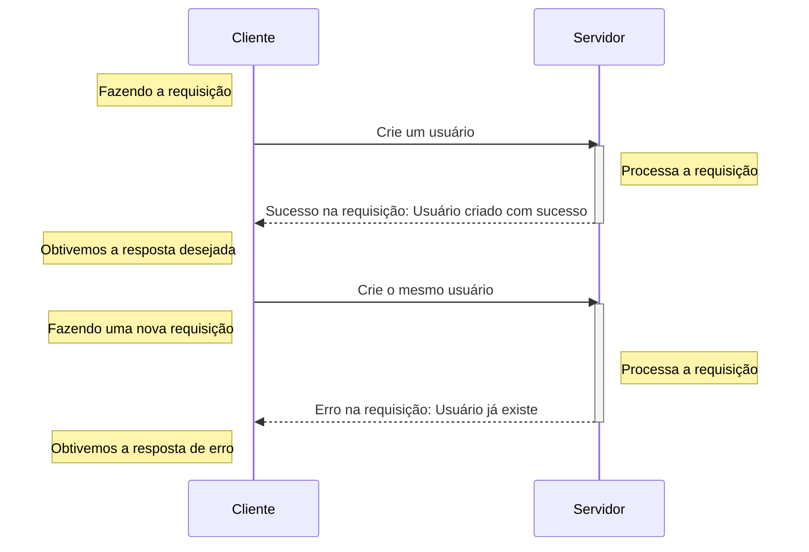
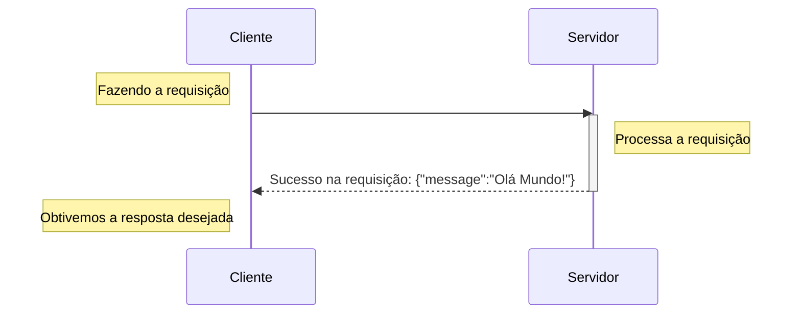
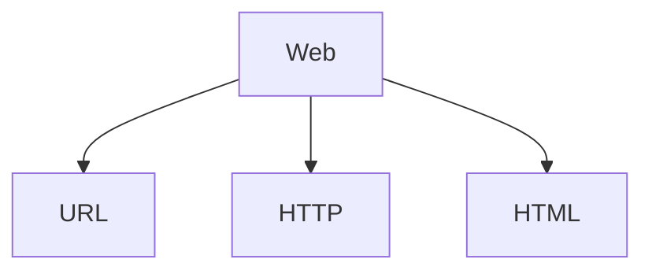

# Introdução ao desenvolvimento WEB

---

Objetivos dessa aula:

- Introduzir conceitos sobre desenvolvimento web
- Apresentar o OpenAPI
- Introduzir os schemas usando Pydantic

??? tip "Caso prefira ver a aula em vídeo"
	Esse aula ainda não está disponível em formato de vídeo, somente em texto!

	

[Aula :fontawesome-brands-youtube:](#){ .md-button }
[Slides :fontawesome-solid-file-powerpoint:](https://github.com/dunossauro/fastapi-do-zero/blob/main/slides/pdf/aula_02.pdf){ .md-button }
[Código :fontawesome-solid-code:](https://github.com/dunossauro/fast_zero/tree/02){ .md-button }

---

Boas-vindas à segunda aula do nosso curso de FastAPI. Agora que já temos o ambiente preparado, com algum código escrito e testado, é o momento ideal para entendermos o que viemos fazer aqui. Até este ponto, você já deve saber que o FastAPI é um framework para desenvolvimento de aplicações web, mais especificamente para o desenvolvimento de APIs web. É aqui que ter um bom referencial teórico se torna importante para compreendermos exatamente o que o framework é capaz de fazer.


## A web

Sempre que nos referimos a aplicações web, estamos falando de aplicações que funcionam em rede. Essa rede pode ser privativa, como a sua rede doméstica ou uma rede empresarial, ou podemos estar nos referindo à [World Wide Web](https://pt.wikipedia.org/wiki/World_Wide_Web){:target="_blank"} (WWW), comumente conhecida como "internet". A internet, que tem uma longa história iniciada na década de 1960, possui diversos padrões definidos e vem se aperfeiçoando desde então. Compreender completamente sua complexidade é um desafio, especialmente 6 décadas após seu início.

Quando falamos em comunicação em rede, geralmente nos referimos à comunicação entre dois ou mais dispositivos interconectados. A ideia é que possamos nos comunicar com outros dispositivos usando a rede.

### O modelo cliente-servidor

No contexto de aplicações web, geralmente nos referimos a um modelo específico de comunicação: o cliente-servidor. Neste modelo, temos clientes, como aplicativos móveis, terminais de comando, navegadores, etc., acessando recursos fornecidos por outro computador, conhecido como servidor.

Neste modelo, fazemos chamadas de um cliente, via rede, [seguindo alguns padrões](#o-modelo-padrao-da-web), e recebemos respostas da nossa aplicação, o servidor. Por exemplo, podemos enviar um comando ao servidor: "Crie um usuário para mim". Em resposta, ele nos fornece um retorno, seja uma confirmação de sucesso ou uma mensagem de erro.



A comunicação é bidirecional: um cliente faz uma requisição ao servidor, que por sua vez emite uma resposta.

Por exemplo, ao construir um servidor, precisamos de uma biblioteca que consiga "servir" nossa aplicação. É aí que entra o Uvicorn, responsável por servir nossa aplicação com FastAPI.

Quando executamos:

```shell title="$ Execução no terminal!"
uvicorn fast_zero.app:app
```

Iniciamos um servidor em loopback, acessível apenas internamente no nosso computador. Por isso, ao acessarmos [http://127.0.0.1:8000/](http://127.0.0.1:8000/) no navegador, estamos fazendo uma requisição ao servidor em `127.0.0.1:8000`.



#### Usando o uvicorn na rede local

Falando em redes, o Uvicorn no seu PC também pode servir o FastAPI na sua rede local:

```shell title="$ Execução no terminal!"
uvicorn fast_zero.app:app --host 0.0.0.0
```

Assim, você pode acessar a aplicação de outro computador na sua rede usando o endereço IP da sua máquina.

??? tip "Descobrindo o seu endereço local usando python"
	Caso não esteja familiarizado com o terminal ou ferramentas para descobrir seu endereço IP:

	```py title=">>> Terminal interativo!"
	>>> import socket
	>>> s = socket.socket(socket.AF_INET, socket.SOCK_DGRAM)
	>>> s.connect(("8.8.8.8", 80))
	>>> s.getsockname()[0]
	'192.168.0.100'# (1)!
	```

	1. O endereço do meu computador na rede local

{: .center .shadow }

### O modelo padrão da web

Ignorando muita história e diversas camadas de padrões, podemos nos concentrar nos três padrões principais que serão mais importantes para nós neste momento:



- [URL](https://pt.wikipedia.org/wiki/URL){:target="_blank"}: *Localizador Uniforme de Recursos*. Um endereço de rede pelo qual podemos nos comunicar com um computador na rede.
- [HTTP](https://pt.wikipedia.org/wiki/Hypertext_Transfer_Protocol){:target="_blank"}: um protocolo que especifica como deve ocorrer a comunicação entre dispositivos.
- [HTML](https://pt.wikipedia.org/wiki/HTML){:target="_blank"}: a linguagem usada para criar e estruturar páginas na web.

#### URL

Uma URL (Uniform Resource Locator) é como um endereço que nos ajuda a encontrar um recurso específico em uma rede, como a URL `http://127.0.0.1:8000` que usamos para acessar nossa aplicação.

Uma URL é composta por várias partes, como neste exemplo: `protocolo://endereço:porta/caminho/recurso?query_string#fragmento`. Neste primeiro momento, focaremos nos primeiros quatro componentes, que são essenciais para o andamento da aula:

1. **Protocolo**: A primeira parte da URL, terminando com "://". Os mais comuns são "http://" e "https://". Este protocolo define como os dados são trocados entre seu computador e o local onde o recurso está armazenado, seja na internet ou numa rede local.

2. **Endereço do Host**: Pode ser um endereço IP (como "192.168.1.10") ou um endereço de [DNS](https://pt.wikipedia.org/wiki/Sistema_de_Nomes_de_Dom%C3%ADnio){:target="_blank"} (como "youtube.com"). Ele identifica o dispositivo na rede que contém o recurso desejado.

3. **Porta (opcional)**: Após o endereço do host, pode haver um número após dois pontos, como em "192.168.1.10:8080". Este número é a porta, usada para direcionar sua solicitação ao serviço específico dentro do dispositivo. Por padrão, as portas são `80` para HTTP e `443` para HTTPS, quando não especificadas.

4. **Caminho**: Indica a localização exata do recurso dentro do servidor ou dispositivo. Por exemplo, em "192.168.1.10:8000/busca", `/busca` é o nome do recurso. Quando não especificado, o servidor responde com o recurso na raiz (`/`).

Ao acessarmos via navegador a URL `http://127.0.0.1:8000`, estamos acessando o servidor via protocolo `HTTP`, no endereço do nosso próprio computador, na porta `8000`, solicitando o recurso `/`.

#### HTTP

Quando o cliente inicia uma requisição para um endereço na rede, isso é feito através de um protocolo e direcionado ao servidor do recurso. Em aplicações web, a maioria da comunicação ocorre via protocolo HTTP ou sua versão segura, o HTTPS.

HTTP, ou *Hypertext Transfer Protocol* (Protocolo de Transferência de Hipertexto), é o protocolo fundamental na web para a transferência de dados e comunicação entre clientes e servidores. Ele baseia-se no modelo de requisição-resposta: o cliente faz uma requisição ao servidor, que responde a essa requisição. Essas requisições e respostas são formatadas de acordo com as regras do protocolo HTTP.

##### Verbos

Quando um cliente faz uma requisição HTTP, ele indica sua intenção ao servidor utilizando verbos. Estes verbos sinalizam diferentes ações dentro do protocolo HTTP. Vejamos alguns exemplos:


- **GET**: utilizado para recuperar recursos. Empregamos este verbo quando queremos solicitar um dado já existente no servidor.
- **POST**: serve para criar um novo recurso. Por exemplo, enviar dados para registrar um novo usuário.
- **PUT**: Atualiza um recurso existente. Como, por exemplo, atualizar as informações de um usuário existente.
- **DELETE**: Exclui um recurso. Por exemplo, remover um usuário específico do sistema.

Na nossa aplicação FastAPI, definimos que a função `read_root` que  será executada quando uma requisição GET for feita por um cliente no caminho `/`:

```py title="fast_zero/app.py" linenums="5" hl_lines="1"
@app.get('/')
def read_root():
    return {'message': 'Olá Mundo!'}
```

Quando realizamos a requisição via navegador, o verbo padrão é o GET. Por isso, obtemos na tela a mensagem `{'message': 'Olá Mundo!'}`.

{: .center .shadow }

Essa é exatamente a resposta fornecida pela execução da função `read_root`. No futuro, criaremos funções para lidar com os outros verbos HTTP.

##### Códigos de resposta

No mundo das requisições usando o protocolo HTTP, além da resposta obtida quando nos comunicamos com o servidor, também recebemos um código de resposta (*status code*). Os códigos são formas de mostrar ao cliente como o servidor lidou com a sua requisição. Os códigos são divididos em classes e as classes são distribuídas por centenas:

- 1xx: Informativo - utilizada para enviar informações para o cliente de que sua requisição foi recebida e está sendo processada.
- 2xx: Sucesso - Indica que a requisição foi bem-sucedida (por exemplo, 200 OK, 201 Created).
- 3xx: Redirecionamento - Informa que mais ações são necessárias para completar a requisição (por exemplo, 301 Moved Permanently, 302 Found).
- 4xx: Erro no Cliente - Significa que houve um erro na requisição feita pelo cliente (por exemplo, 400 Bad Request, 404 Not Found).
- 5xx: Erro no Servidor - Indica um erro no servidor ao processar a requisição válida do cliente (por exemplo, 500 Internal Server Error, 503 Service Unavailable).

Sempre que fazemos uma requisição, obtemos um código de resposta. Por exemplo, em nosso arquivo de teste, quando efetuamos a requisição, fazemos a checagem para ver se recebemos um código de sucesso, o código `200`:

```py title="tests/test_app.py" linenums="5" hl_lines="6"
def test_root_deve_retornar_200_e_ola_mundo():
    client = TestClient(app)

    response = client.get('/')

    assert response.status_code == 200
```

Para garantir que a resposta obtida pelo cliente seja considerada um sucesso, o FastAPI, por padrão, envia o código de sucesso `200` para o método GET. No entanto, também podemos deixar isso explícito na definição da rota:

```py title="fast_zero/app.py" linenums="5" hl_lines="1"
@app.get("/", status_code=200)
def read_root():
    return {'message': 'Olá Mundo!'}
```

Temos diversos códigos a explorar durante nossa jornada, mas gostaria de listar os mais comuns dentro do nosso escopo:

- **200 OK**: a solicitação foi bem-sucedida. O significado exato depende do método HTTP utilizado na solicitação.
- **201 Created**: a solicitação foi bem-sucedida e um novo recurso foi criado como resultado.
- **404 Not Found**: o recurso solicitado não pôde ser encontrado, sendo frequentemente usado quando o recurso é inexistente.
- **422 Unprocessable Entity**: usado quando a requisição está bem-formada, mas não pode ser seguida devido a erros semânticos. É comum em APIs ao validar dados de entrada.

Assim, podemos ir ao terceiro pilar do desenvolvimento web que são os conteúdos relacionados as respostas.

#### HTML

!!! example "Sobre o código apresentado nesse tópico!"
	Todo o código apresentado neste tópico é apenas um exemplo básico do uso de HTML com FastAPI e não será utilizado no curso. No entanto, é extremamente importante mencionar este tópico.

	Embora este tópico abranja apenas HTML puro, o FastAPI pode utilizar [Jinja](https://jinja.palletsprojects.com/){:target="_blank"} como sistema de templates para uma aplicação mais eficiente.

	??? tip "Interessado em aprender sobre a aplicação de templates?"
		Na live sobre websockets com FastAPI, discutimos bastante sobre templates. Você pode assistir ao vídeo aqui:
		

	A documentação do FastAPI também oferece um tópico focado em [Templates](https://fastapi.tiangolo.com/pt/advanced/templates/){:target="_blank"}.

O terceiro pilar fundamental da web é o HTML, sigla para *Hypertext Markup Language*. Trata-se da linguagem de marcação padrão usada para criar e estruturar páginas na internet. Quando acessamos um site, o que vemos em nossos navegadores é o resultado da interpretação do HTML. Esta linguagem utiliza uma série de 'tags' – como `<html>`, `<head>`, `<body>`, `<h1>`, `<p>` e outras – para definir a estrutura e o conteúdo de uma página web.

A beleza do HTML reside em sua simplicidade e eficácia. Mais do que uma linguagem, é uma forma de organizar e apresentar informações na web. Cada tag tem um propósito específico: `<h1>` a `<h6>` são usadas para títulos e subtítulos; `<p>` para parágrafos; `<a>` para links; enquanto `<div>` e `<span>` auxiliam na organização e estilo do conteúdo. Juntas, essas tags formam a espinha dorsal de quase todas as páginas da internet.

Se nosso objetivo fosse apresentar um HTML simples, poderíamos usar a classe de resposta `HTMLResponse`:

```py linenums="1" hl_lines="2 7"
from fastapi import FastAPI
from fastapi.responses import HTMLResponse

app = FastAPI()


@app.get('/', response_class=HTMLResponse)
def read_root():
    return """
    <html>
      <head>
        <title> Nosso olá mundo!</title>
      </head>
      <body>
        <h1> Olá Mundo </h1>
      </body>
    </html>"""
```

Ao acessarmos nossa URL no navegador, podemos ver o HTML sendo renderizado:

{: .center }

Embora o HTML seja crucial para a estruturação de páginas web, nosso curso foca em uma perspectiva diferente: a transferência de dados. Enquanto o HTML é usado para apresentar dados visualmente nos navegadores, existe uma outra camada focada na transferência de informações entre sistemas e servidores. Aqui entra o conceito de APIs (Application Programming Interfaces), que frequentemente utilizam JSON (JavaScript Object Notation) para a troca de dados. JSON é um formato leve de troca de dados, fácil de ler e escrever para humanos, e simples de interpretar e gerar para máquinas.

Portanto, embora não aprofundemos no HTML como linguagem, é importante entender seu papel como a camada de apresentação padrão da web. Agora, vamos direcionar nossa atenção para as APIs e a troca de dados em JSON, explorando como essas tecnologias permitem a comunicação eficiente entre diferentes sistemas e aplicativos.

## APIs

Quando falamos sobre aplicações web que não envolvem uma camada de visualização, como HTML, geralmente estamos nos referindo a APIs. A sigla API vem de *Application Programming Interface* (Interface de Programação de Aplicações). Uma API é projetada para ser uma interface claramente definida e documentada, que facilita a interação por meio do protocolo HTTP.

A essência das APIs reside no modelo cliente-servidor, onde o cliente troca dados com o servidor através de [*endpoints*](#endpoint), respeitando as regras estabelecidas pelo protocolo HTTP. Por exemplo, para solicitar dados ao servidor, usamos o verbo GET, direcionando a requisição a um endpoint específico do servidor, que em resposta nos fornece o dado ou recurso solicitado.

### Endpoint

O termo "endpoint" refere-se a um ponto específico dentro de uma API para onde as requisições são enviadas. Basicamente, é um endereço na web (URL) onde o servidor ou a API está ativo e pronto para responder a requisições dos clientes. Cada endpoint está associado a uma função específica da API, como recuperar dados, criar novos registros, atualizar ou deletar dados existentes.

A localização e estrutura de um endpoint, que incluem o caminho na URL e os métodos HTTP permitidos, definem como os clientes devem formatar suas requisições para serem compreendidas e processadas pelo servidor. Por exemplo, um endpoint para recuperar informações de um usuário pode ter um endereço como `https://api.exemplo.com/usuarios/{id}`, onde `{id}` é o identificador único do usuário desejado.

Atualmente, em nossa aplicação, temos apenas um endpoint disponível: o `/`. Vejamos o exemplo:

```py title="aula_00.py" linenums="1" hl_lines="1"
@app.get('/')
def read_root():
    return {'message': 'Olá Mundo!'}
```

Quando utilizamos o decorador `#!python @app.get('/')`, estamos instruindo nossa API que, para chamadas de método `GET` no endpoint `/`, a função `read_root` será executada. O resultado dessa função, neste caso `{'message': 'Olá Mundo!'}`, é o que será retornado ao cliente.

### Documentação

Uma pergunta comum nesse estágio é: "Ok, mas como descobrir ou conhecer os endpoints disponíveis em uma API?". A resposta reside na documentação. Uma documentação eficaz é essencial em APIs, especialmente quando muitos clientes diferentes precisam se comunicar com o servidor. A melhor prática é fornecer uma documentação detalhada, clara e acessível sobre os endpoints disponíveis, incluindo informações sobre o formato e a estrutura dos dados que podem ser enviados e recebidos.

A documentação de uma API serve como um guia ou um manual, facilitando o entendimento e a utilização por desenvolvedores e usuários finais. Ela desempenha um papel crucial ao:

- Definir claramente os endpoints e suas funcionalidades.
- Especificar os métodos HTTP suportados (GET, POST, PUT, DELETE, etc.).
- Descrever os parâmetros esperados em requisições e respostas.
- Fornecer exemplos de requisições e respostas para facilitar o entendimento.

#### OpenAPI e documentação automática

Uma das soluções mais eficazes para a documentação de APIs é a utilização da especificação OpenAPI, disponível em [OpenAPI Specification](https://swagger.io/specification/){:target="_blank"}. Essa especificação fornece um padrão robusto para descrever APIs, permitindo aos desenvolvedores criar documentações precisas e testáveis de forma automática. Esta abordagem não apenas simplifica o processo de documentação, mas também garante que a documentação seja consistentemente atualizada e precisa.

Para visualizar e interagir com essa documentação, ferramentas como [Swagger UI](https://swagger.io/tools/swagger-ui/){:target="_blank"} e [Redoc](https://redocly.github.io/redoc/){:target="_blank"} são amplamente utilizadas. Elas transformam a especificação OpenAPI em visualizações interativas, fornecendo uma interface fácil de navegar onde os usuários podem não apenas ler a documentação, mas também experimentar a API diretamente na interface. Esta funcionalidade interativa é fundamental para uma compreensão prática de como a API funciona, além de oferecer uma maneira eficiente de testar suas funcionalidades em tempo real.

No contexto do FastAPI, há suporte automático tanto para Swagger UI quanto para Redoc. Para explorar a documentação atual da nossa aplicação, basta iniciar o servidor com o seguinte comando:

```shell title="$ Execução no terminal!"
task run
```

#### Swagger UI

Ao acessarmos o endereço [http://127.0.0.1/docs](http://127.0.0.1/docs){:target="_blank"}, nos deparamos com a interface do Swagger UI:

{: .center .shadow }

Esta imagem nos dá uma visão geral dos endpoints disponíveis na nossa aplicação, neste caso, o endpoint `/` que aceita o verbo HTTP `GET`. Ao explorar mais a fundo e clicar nesse método:

{: .center .shadow }

Na documentação, é possível observar diversas informações cruciais, como o código de resposta `200`, que indica sucesso, o tipo de dado retornado (`application/json`) e um exemplo do valor de retorno. Contudo, a documentação atual sugere, de forma incorreta, que o retorno é uma `string`, quando, na verdade, nossa aplicação retorna um objeto [JSON](#json){:target="_blank"}. Essa diferença será abordada em breve.

Um aspecto interessante do Swagger UI é a possibilidade de interagir diretamente com a API através da interface. Ao clicar em `Try it out`, um botão `Execute` se torna disponível:

{: .center .shadow }

Clicar em `Execute` faz do Swagger um cliente temporário da nossa API, enviando uma requisição ao servidor e exibindo a resposta:

{: .center .shadow }

A resposta ilustra como fazer a chamada usando o [Curl](https://curl.se/docs/manpage.html){:target="_blank"}, a [URL](#url){:target="_blank"} utilizada, o código de resposta 200, e detalhes da resposta do servidor, incluindo o corpo da mensagem ([body](#body){:target="_blank"}) e os cabeçalhos ([headers](#headers){:target="_blank"}).


??? tip "Caso queira saber mais sobre OpenAPI e Swagger"
	Temos uma live focada em OpenAPI, que são as especificações do Swagger:
	

#### Redoc

Assim como o Swagger UI, o [Redoc](https://redocly.github.io/redoc/){:target="_blank"} é outra ferramenta popular para visualizar a documentação de APIs OpenAPI, mas com um foco em uma apresentação mais limpa e legível. Para acessar a documentação Redoc da nossa aplicação, podemos visitar o endereço [http://127.0.0.1/redoc](http://127.0.0.1/redoc){:target="_blank"}. O Redoc organiza a documentação de uma maneira mais linear e de fácil leitura, destacando as descrições dos endpoints, os métodos HTTP disponíveis, os schemas dos dados de entrada e saída, além de exemplos de requisições e respostas.

{: .center .shadow }

### Respostas da API

<Ainda não feito>

#### Body

<Ainda não feito>

##### json

<Ainda não feito>

#### Headers

<Ainda não feito>

---

#### Códigos apra o resto do texto
**Explicação básica sobre o pydantic**
```python
class Message(BaseModel):
    message: str
```

```python
@app.get('/', response_model=Message)
def read_root():
    return {'message': 'Olá Mundo!'}
```
