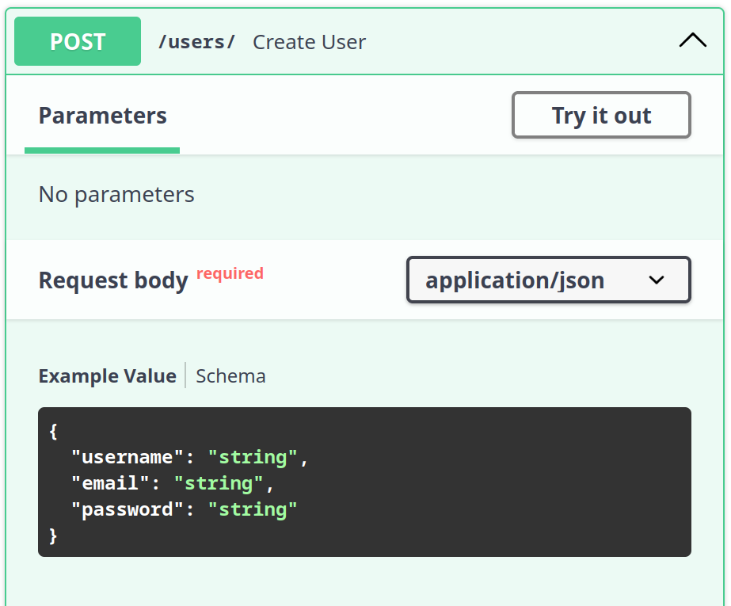
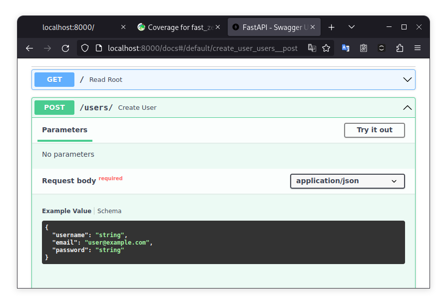
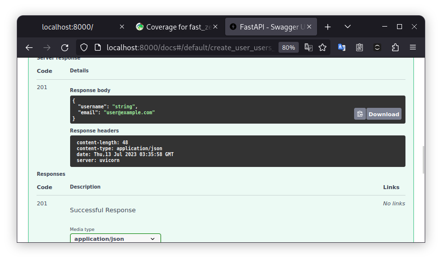

# [WIP] Estruturando o Projeto e Criando Rotas CRUD

---

Objetivos dessa aula:

- Compreender a estrutura de um projeto FastAPI e como estruturar rotas CRUD (Criar, Ler, Atualizar, Deletar)
- Aprimorar nosso conhecimento sobre Pydantic e sua utilidade na validação e serialização de dados
- Implementação de rotas CRUD em FastAPI
- Escrita e execução de testes para validar o comportamento das rotas

??? tip "Caso prefira ver a aula em vídeo"
	Esse aula ainda não está disponível em formato de vídeo, somente em texto!

	

[Aula :fontawesome-brands-youtube:](#){ .md-button }
[Slides :fontawesome-solid-file-powerpoint:](https://github.com/dunossauro/fastapi-do-zero/blob/main/slides/pdf/aula_03.pdf){ .md-button }
[Código :fontawesome-solid-code:](https://github.com/dunossauro/fast_zero/tree/03){ .md-button }

---

Boas-vindas de volta à nossa série de aulas sobre a construção de uma aplicação utilizando FastAPI. Na última aula, abordamos conceitos básicos do desenvolvimento web e finalizamos a configuração do nosso ambiente. Hoje, avançaremos na estruturação dos primeiros endpoints da nossa API, concentrando-nos nas quatro operações fundamentais de **CRUD** - Criar, Ler, Atualizar e Deletar. Exploraremos como estas operações se aplicam tanto à comunicação web quanto à interação com o banco de dados.

O objetivo desta aula é implementar um sistema de cadastro de usuários na nossa aplicação. Ao final, você conseguirá cadastrar, listar, alterar e deletar usuários, além de realizar testes para validar estas funcionalidades.

## CRUD e HTTP

No mundo do desenvolvimento de APIs, existem algumas operações básicas que gostaríamos de fazer com os dados. Essas operações se relacionam com a base de dados e a aplicação web. Vamos nos focar nesse primeiro momento nas relações entre os dados.

CRUD é um acrônimo que representa as quatro operações básicas que você pode realizar em qualquer banco de dados persistente:

- **C**reate (Criar): adicionar novos registros ao banco de dados.
- **R**ead (Ler): recuperar registros existentes do banco de dados. 
- **U**pdate (Atualizar): modificar registros existentes no banco de dados.
- **D**elete (Excluir): remover registros existentes do banco de dados.

Com essas operações podemos realizar qualquer tipo de comportamento em uma base dados. Podemos criar um registro, em seguida alterá-lo, quem sabe depois disso tudo deletá-lo.

Quando falamos de APIs servindo dados, todas essas operações têm alguma forma similar no protocolo HTTP. O protocolo tem verbos para indicar essas mesmas ações que queremos representar no banco de dados.

- **POST**: é usado para solicitar que o servidor aceite um dado (recurso) enviado pelo cliente.
- **GET**: é usado para quando o cliente deseja requisitar uma informação do servidor.
- **PUT**: é usando no momento em que o cliente deseja informar alguma alteração nos dados para o servidor.
- **DELETE**: usado para dizer ao servidor que delete determinado recurso.

Dessa forma podemos criar associações entre os endpoints e a base de dados. Por exemplo: quando quisermos inserir um dado no banco de dados, nós como clientes devemos comunicar essa intenção ao servidor usando o método POST enviando os dados (em nosso caso no formato JSON) que devem ser persistidos na base de dados. Com isso iniciamos o processo de *create* na base de dados.

### Respostas da API

A forma de responder o cliente como as operações do CRUD se sucederam no servidor é via códigos de status. Por isso vamos investir mais algum momento aqui.

Os códigos que devemos prestar atenção para responder de forma correta as requisições. Os casos de sucesso incluem:

- **200 OK**: Indica sucesso na requisição.
    - **GET**: Quando um dado é solicitado e retornado com sucesso.
	- **PUT**: Quando dados são alterados com sucesso.
- **201 CREATED**: Significa que a solicitação resultou na criação de um novo recurso.
	- **POST**: Aplicável quando um dado é enviado e criado com sucesso.
	- **PUT**: Usado quando uma alteração resulta na criação de um novo recurso.
- **204 NO CONTENT**: Retorno do servidor sem conteúdo na mensagem.
	- **PUT**: Aplicável se a alteração não gerar um retorno.
	- **DELETE**: Usado quando a ação de deletar não gera um retorno.

Os códigos de erro mais comuns que temos que conhecer para lidar com possíveis erros na aplicação, são:

- **404 NOT FOUND**: O recurso solicitado não pôde ser encontrado.
- **422 UNPROCESSABLE ENTITY**: o pedido foi bem formado (ou seja, sintaticamente correto), mas não pôde ser processado.
- **500 INTERNAL SERVER ERROR**: Uma mensagem de erro genérica, dada quando uma condição inesperada foi encontrada. Geralmente ocorre quando nossa aplicação apresenta um erro.

Compreendendo esses códigos, estamos prontos para iniciar a implementação de alguns endpoints e colocar esses conceitos em prática.

## Implementado endpoints

Para facilitar o aprendizado, sugiro dividir a criação de novos endpoints em três etapas:

1. Relação com o HTTP: Determinar o verbo HTTP esperado e os códigos de resposta para situações de sucesso e erro.
2. Modelos de Dados: Definir o formato do JSON esperado, campos e seus tipos, e pensar nos modelos de resposta para situações de sucesso e erro.
3. Implementação do Corpo: Decidir o tratamento dos dados recebidos e o tipo de processamento aplicado.

As duas primeiras etapas nos ajudam a definir a interface de comunicação e como ela será documentada. A terceira etapa é mais específica e envolve decisões sobre a interação com o banco de dados, validações adicionais e a definição do que constitui sucesso ou erro na requisição.

Essas etapas nos orientam na implementação completa do endpoint, garantindo que nada seja esquecido.

## Iniciando a implementação da rota POST

Nesta aula, nosso foco principal será desenvolver um sistema de cadastro de usuários. Para isso, a implementação de uma forma eficiente para criar novos usuários na base de dados é essencial. Exploraremos como utilizar o verbo HTTP POST, fundamental para comunicar ao serviço a nossa intenção de enviar novos dados, como no cadastro de usuários..

### Implementação do endpoint

Para iniciar, criaremos um endpoint que aceita o verbo `POST` com dados em formato JSON. Esse endpoint responderá com o status `201` em caso de sucesso na criação do recurso. Com isso, estabelecemos a base para a nossa funcionalidade de cadastro.

Usaremos o decorador `#!python @app.post()` do FastAPI para definir nosso endpoint, que começará com a URL `/users/`, indicando onde receberemos os dados para criar novos usuários:

```python title="fast_zero/app.py" linenums="13"
@app.post('/users/')
def create_user():
	...
```

#### Status code de resposta

É crucial definir que, ao cadastrar um usuário com sucesso, o sistema deve retornar o código de resposta `#!python 201`, indicando a criação bem-sucedida do recurso. Para isso, adicionamos o parâmetro `status_code` ao decorador:

```python title="fast_zero/app.py" linenums="13" hl_lines="1"
@app.post('/users/', status_code=201)
def create_user():
    ...
```

> Conversaremos em breve sobre o código de resposta em [TODO: tópico do pydantic]

### [WIP] Modelo de dados

O modelo de dados é uma parte fundamental, onde consideramos tanto os dados recebidos do cliente quanto os dados que serão retornados a ele. Esta abordagem assegura uma comunicação eficaz e clara.

#### Modelo de entrada de dados

Para os dados de entrada, como estamos pensando em um cadastro de usuário na aplicação, é importante que tenhamos insumos para identificá-lo como o `email`, uma senha (`password`) para que ele consiga fazer o login no futuro e seu nome de usuário (`username`). Dessa forma, podemos imaginar um modelo de entrada desta forma:


```json
{
    "username": "joao123",
    "email": "joao123@email.com",
    "password": "segredo123"
}
```

Para a aplicação conseguir expor esse modelo na documentação, devemos criar uma classe do pydantic em nosso arquivo de schemas (`fast_zero/schemas.py`) que represente esse schema:

```python title="fast_zero/schemas.py" linenums="8"
class UserSchema(BaseModel):
    username: str
    email: str
    password: str
```

Como já temos o endpoint definido, precisamos fazer a associação do modelo com ele. Para fazer isso basta que o endpoint receba um parâmetro e esse parâmetro esteja associado a um modelo via anotação de parâmetros:

```python title="fast_zero/app.py" hl_lines="6"
from fast_zero.schemas import Message, UserSchema

# Código do olá mundo homitido

@app.post('/users/', status_code=201)
def create_user(user: UserSchema):
    ...
```

Dessa forma, o modelo de entrada, o que o endpoint espera receber já está documentado e aparecerá no swagger UI.

Para visualizar, temos que iniciar o servidor:

```shell title="$ Execução no terminal!"
task run
```

E acessar a página [http://127.0.01:8000/docs](http://localhost:8000/docs){:target="_blank"}. Isso nos mostrará as definições do nosso endpoint usando o o modelo no swagger:

{: .center width="600" }

#### Modelo de saída de dados

O modelo de saída explica ao cliente quais dados serão retornados quando a chamada a esse endpoint for feita. Para a API ter um uso fluído, temos que especificar o retorno corretamente na documentação.

Se dermos uma olhada no estado atual de resposta da nossa API, podemos ver que a resposta no swagger é `#!python "string"` para o código de resposta `#!python 201`:

{: .center .shadow }

Quando fazemos uma chamada com o método POST o esperado é que os dados criados sejam retornados ao cliente. Poderíamos usar o mesmo modelo de antes o `UserSchema`, porém, por uma questão de segurança, seria ideal não retornar a senha do usuário. Quanto menos ela trafegar na rede, melhor.

Desta forma, podemos pensar no mesmo schema, porém, sem a senha. Algo como:

```json
{
    "username": "joao123",
    "email": "joao123@email.com"
}
```

Transcrevendo isso em um modelo do pydantic em nosso arquivo de schemas (`fast_zero/schemas.py`) temos isso:

```python title="fast_zero/schemas.py" linenums="14"
class UserPublic(BaseModel):
    username: str
    email: EmailStr
```

Para aplicar um modelo a resposta do endpoint, temos que passar o modelo ao parâmetro `response_model`, como fizemos na [aula passada](02/#integrando-o-pydantic-com-o-fastapi){:target="_blank"}:

```py title="aula_00.py" linenums="1" hl_lines="1 5"
from fast_zero.schemas import Message, UserSchema, UserPublic

# Código omitido

@app.post('/users/', status_code=201, response_model=UserPublic)
def create_user(user: UserSchema):
    ...
```

Tendo um modelo descritivo de resposta para o cliente na documentação:

{: .center .shadow }


## Validação e pydantic

Uma característica importante do Pydantic e que deve ser considerada é o fato de ele validar os schemas em tempo de execução. Fazendo com que caso o cliente envie um dado que não corresponde com o schema definido, seja levantado um erro `#!python 422`. E caso a nossa resposta como servidor também não siga o schema, será levantado um erro `#!python 500`. Fazendo com que ele seja uma garantia de duas vias que nossa API segue a especificação da documentação.

> TODO: Mostrar o erro 422 no swagger

> TODO: Fazer uma requisição que não siga o schema

> TODO: Ver a resposta do 422

> TODO: Conversar sobre a implementação do nosso endpoint e ver que ela não retorna nada.

> TODO: Fazer uma requisição correta e mostrar o erro 500

Vamos usar o endpoint em seu estado atual, sem nenhuma resposta e ver o que acontecerá com a nossa requisição.

## De volta ao POST

---

> Texto Antigo!!!

Com esse endpoint criado, podemos executar a nossa aplicação:

```shell title="$ Execução no terminal!"
task run
```

E acessar a página [http://localhost:8000/docs](http://localhost:8000/docs). Isso nos mostrará as definições do nosso endpoint usando o Swagger.

{: .center }

Dessa forma, podemos testar de forma simplificada a nossa API, enviando o JSON e realizando alguns testes.

{: .center }

Entretanto, precisamos prestar atenção a um detalhe: nosso modelo retorna a senha do usuário, o que é uma péssima prática de segurança.

{: .center }

Para evitar isso, podemos criar um novo modelo que será usado somente para resposta. Dessa forma, não expomos os dados que não queremos na API:

```python title="fast_zero/schemas.py" linenums="10"
class UserPublic(BaseModel):
    username: str
    email: EmailStr
```

Precisamos também dizer ao FastAPI que esse será o modelo de resposta, e converter nosso `user` em `UserPublic`:


```python title="fast_zero/app.py" hl_lines="5"
from fast_zero.schemas import UserSchema, UserPublic

# código omitido

@app.post('/users/', status_code=201, response_model=UserPublic)
def create_user(user: UserSchema):
    return user
```

Note que somente adicionando o `response_model`, o FastAPI já faz a conversão de `UserSchema` em `UserPublic`

Agora, se fizermos de novo a chamada no Swagger, receberemos o mesmo objeto, mas sem expor a senha.

{: .center }

### Criando um banco de dados falso

Finalmente, para brincar com essas rotas, podemos criar uma lista provisória para simular um banco de dados. Assim, podemos adicionar nossos dados e entender como o FastAPI funciona. Para isso, adicionamos uma lista provisória para o "banco" e alteramos nosso endpoint para inserir nossos modelos do Pydantic nessa lista:


```python title="fast_zero/app.py" hl_lines="5 10-14"
from fast_zero.schemas import UserSchema, UserPublic, UserDB

# código omitido

database = []  # provisório para estudo!


@app.post('/users/', status_code=201, response_model=UserPublic)
def create_user(user: UserSchema):
    user_with_id = UserDB(**user.model_dump(), id=len(database) + 1)

    database.append(user_with_id)

    return user_with_id
```

Se queremos uma simulação de banco de dados, precisamos ter um `ID` para cada usuário registrado no nosso "banco". Sendo assim, alteraremos nosso modelo de resposta pública (`UserPublic`) para que ele forneça o ID de criação do usuário. Também criaremos um novo modelo que represente o usuário com sua senha e identificador, que chamaremos de `UserDB`:

```python title="fast_zero/schemas.py" linenums="10"
class UserPublic(BaseModel):
    id: int
    username: str
    email: EmailStr


class UserDB(UserSchema):
    id: int
```

Dessa forma, nada muda. No entanto, podemos prosseguir com a construção dos outros endpoints. E lembre-se, é importante testar esse endpoint para garantir que tudo esteja funcionando corretamente.


### Implementando o teste da rota POST

Antes de criar o teste de fato, executaremos a task de teste para ver como anda a nossa cobertura:

```shell title="$ Execução no terminal!"
task test

# parte da resposta foi omitida

---------- coverage: platform linux, python 3.11.3-final-0 -----------
Name                    Stmts   Miss  Cover
-------------------------------------------
fast_zero/__init__.py       0      0   100%
fast_zero/app.py           12      3    75%
fast_zero/schemas.py       11      0   100%
-------------------------------------------
TOTAL                      23      3    87%

# parte da resposta foi omitida
```

Vemos que temos 3 Miss. Possivelmente das linhas que acabamos de escrever.

{: .center }

Então, vamos escrever nosso teste. Esse teste para a rota POST precisa verificar se a criação de um novo usuário funciona corretamente. Enviamos uma solicitação POST com um novo usuário para a rota /users/. Em seguida, verificamos se a resposta tem o status HTTP 201 (Criado) e se a resposta contém o novo usuário criado.

```python title="tests/test_app.py"
def test_create_user():
    client = TestClient(app)

    response = client.post(
        '/users/',
        json={
            'username': 'alice',
            'email': 'alice@example.com',
            'password': 'secret',
        },
    )
    assert response.status_code == 201
    assert response.json() == {
        'username': 'alice',
        'email': 'alice@example.com',
        'id': 1,
    }
```

Ao executar o teste:

```shell title="$ Execução no terminal!"
task test

# parte da resposta foi omitida

tests/test_app.py::test_root_deve_retornar_200_e_ola_mundo PASSED
tests/test_app.py::test_create_user PASSED

---------- coverage: platform linux, python 3.11.3-final-0 -----------
Name                    Stmts   Miss  Cover
-------------------------------------------
fast_zero/__init__.py       0      0   100%
fast_zero/app.py           12      0   100%
fast_zero/schemas.py       11      0   100%
-------------------------------------------
TOTAL                      23      0   100%

# parte da resposta foi omitida
```

#### Não se repita (DRY)

Você deve ter notado que a linha `client = TestClient(app)` está repetida na primeira linha dos dois testes que fizemos. Repetir código pode tornar o gerenciamento de testes mais complexo à medida que cresce, e é aqui que o princípio de "Não se repita" ([DRY](https://pt.wikipedia.org/wiki/Don't_repeat_yourself){:target="_blank"}) entra em jogo. DRY incentiva a redução da repetição, criando um código mais limpo e manutenível.

Para solucionar essa repetição, podemos usar uma funcionalidade do pytest chamada Fixture. Uma fixture é como uma função que prepara dados ou estado necessários para o teste. Pode ser pensada como uma forma de não repetir a fase de Arrange de um teste, simplificando a chamada e não repetindo código.

??? info "Se fixtures são uma novidade para você"
	Existe uma live de Python onde discutimos especificamente sobre fixtures
	

	[:fontawesome-brands-youtube: Link direto ](https://youtu.be/sidi9Z_IkLU){ .md-button }


Neste caso, criaremos uma fixture que retorna nosso `client`. Para fazer isso, precisamos criar o arquivo `tests/conftest.py`. O arquivo `conftest.py` é um arquivo especial reconhecido pelo pytest que permite definir fixtures que podem ser reutilizadas em diferentes módulos de teste em um projeto. É uma forma de centralizar recursos comuns de teste.


```python title="tests/conftest.py"
import pytest
from fastapi.testclient import TestClient
from fast_zero.app import app

@pytest.fixture
def client():
    return TestClient(app)
```

Agora, em vez de repetir a criação do `client` em cada teste, podemos simplesmente passar a fixture como um argumento nos nossos testes:

```python title="tests/test_app.py"
# ...

def test_root_deve_retornar_200_e_ola_mundo(client):
    response = client.get('/')
	# ...

def test_create_user(client):
    response = client.post(
        '/users/',
        json={
            'username': 'alice',
            'email': 'alice@example.com',
            'password': 'secret',
        },
    )
    # ...
```

Com essa simples mudança, conseguimos tornar nosso código mais limpo e fácil de manter, seguindo o princípio DRY.

---

Vemos que estamos no caminho certo. Agora que a rota POST está implementada, seguiremos para a próxima operação CRUD: Read.

## Implementando a Rota GET

A rota GET é usada para recuperar informações de um ou mais usuários do nosso sistema. No contexto do CRUD, o verbo HTTP GET está associado à operação "Read". Se a solicitação for bem-sucedida, a rota deve retornar o status HTTP 200 (OK).

Para estruturar a resposta dessa rota, podemos criar um novo modelo chamado `UserList`. Este modelo representará uma lista de usuários e contém apenas um campo chamado `users`, que é uma lista de `UserPublic`. Isso nos permite retornar múltiplos usuários de uma vez.

```python title="fast_zero/schemas.py" linenums="20"
class UserList(BaseModel):
    users: list[UserPublic]
```

Com esse modelo definido, podemos criar nosso endpoint GET. Este endpoint retornará uma instância de `UserList`, que por sua vez contém uma lista de `UserPublic`. Cada `UserPublic` é criado a partir dos dados de um usuário em nosso banco de dados fictício.

```python title="fast_zero/app.py"
from fast_zero.schemas import UserSchema, UserPublic, UserDB, UserList

# código omitido

@app.get('/users/', response_model=UserList)
def read_users():
    return {'users': database}
```

Com essa implementação, nossa API agora pode retornar uma lista de usuários. No entanto, nosso trabalho ainda não acabou. A próxima etapa é escrever testes para garantir que nossa rota GET está funcionando corretamente. Isso nos ajudará a identificar e corrigir quaisquer problemas antes de prosseguirmos com a implementação de outras rotas.

#### Implementando o teste da rota de GET

Nosso teste da rota GET tem que verificar se a recuperação dos usuários está funcionando corretamente. Enviamos uma solicitação GET para a rota /users/. Em seguida, verificamos se a resposta tem o status HTTP 200 (OK) e se a resposta contém a lista de usuários.

```python title="tests/test_app.py" linenums="30"
def test_read_users(client):
    response = client.get('/users/')
    assert response.status_code == 200
    assert response.json() == {
        'users': [
            {
                'username': 'alice',
                'email': 'alice@example.com',
                'id': 1,
            }
        ]
    }
```

Com as rotas POST e GET implementadas, agora podemos criar e recuperar usuários. Implementaremos a próxima operação CRUD: Update.

## Implementando a Rota PUT

A rota PUT é usada para atualizar as informações de um usuário existente. No contexto do CRUD, o verbo HTTP PUT está associado à operação "Update". Se a solicitação for bem-sucedida, a rota deve retornar o status HTTP 200 (OK). No entanto, se o usuário solicitado não for encontrado, deveríamos retornar o status HTTP 404 (Não Encontrado).

```python title="fast_zero/app.py"
from fastapi import FastAPI, HTTPException

# ...

@app.put('/users/{user_id}', response_model=UserPublic)
def update_user(user_id: int, user: UserSchema):
    if user_id > len(database) or user_id < 1:
        raise HTTPException(status_code=404, detail='User not found')

    user_with_id = UserDB(**user.model_dump(), id=user_id)
    database[user_id - 1] = user_with_id

    return user_with_id
```

#### Implementando o teste da rota de PUT

Nosso teste da rota PUT precisa verificar se a atualização de um usuário existente funciona corretamente. Enviamos uma solicitação PUT com as novas informações do usuário para a rota `/users/{user_id}`. Em seguida, verificamos se a resposta tem o status HTTP 200 (OK) e se a resposta contém o usuário atualizado.

```python title="tests/test_app.py"
def test_update_user(client):
    response = client.put(
        '/users/1',
        json={
            'username': 'bob',
            'email': 'bob@example.com',
            'password': 'mynewpassword',
        },
    )
    assert response.status_code == 200
    assert response.json() == {
        'username': 'bob',
        'email': 'bob@example.com',
        'id': 1,
    }
```

Com as rotas POST, GET e PUT implementadas, agora podemos criar, recuperar e atualizar usuários. A última operação CRUD que precisamos implementar é Delete.

## Implementando a Rota DELETE

A rota DELETE é usada para excluir um usuário do nosso sistema. No contexto do CRUD, o verbo HTTP DELETE está associado à operação "Delete". Se a solicitação for bem-sucedida, a rota deve retornar o status HTTP 200 (OK). No entanto, se o usuário solicitado não for encontrado, deveríamos retornar o status HTTP 404 (Não Encontrado).

[TODO: Texto foi removido daqui, confirmar a continuidade]

Agora podemos criar nosso endpoint DELETE. Este endpoint receberá o ID do usuário que queremos excluir. Note que, estamos lançando uma exceção HTTP quando o ID do usuário está fora do range da nossa lista (simulação do nosso banco de dados). Quando conseguimos excluir o usuário com sucesso, retornamos a mensagem de sucesso em um modelo do tipo `Message`.

```python title="fast_zero/app.py"
from fast_zero.schemas import UserSchema, UserPublic, UserDB, UserList, Message

# ...

@app.delete('/users/{user_id}', response_model=Message)
def delete_user(user_id: int):
    if user_id > len(database) or user_id < 1:
        raise HTTPException(status_code=404, detail='User not found')

    del database[user_id - 1]

    return {'detail': 'User deleted'}
```

Com a implementação da rota DELETE concluída, é fundamental garantirmos que essa rota está funcionando conforme o esperado. Para isso, precisamos escrever testes para essa rota.

#### Implementando o teste da rota de DELETE

Nosso teste da rota DELETE precisa verificar se a exclusão de um usuário existente funciona corretamente. Enviamos uma solicitação DELETE para a rota /users/{user_id}. Em seguida, verificamos se a resposta tem o status HTTP 200 (OK) e se a resposta contém uma mensagem informando que o usuário foi excluído.

```python title="tests/test_app.py"
def test_delete_user(client):
    response = client.delete('/users/1')

    assert response.status_code == 200
    assert response.json() == {'detail': 'User deleted'}
```

#### Checando tudo antes do commit

Antes de fazermos o commit, é uma boa prática checarmos todo o código, e podemos fazer isso com as ações que criamos com o taskipy.

```shell title="$ Execução no terminal!"
$ task lint
All done! ✨ 🍰 ✨
5 files would be left unchanged.

$ task format
All done! ✨ 🍰 ✨
5 files left unchanged.
Skipped 1 files

$ task test
...
tests/test_app.py::test_root_deve_retornar_200_e_ola_mundo PASSED
tests/test_app.py::test_create_user PASSED
tests/test_app.py::test_read_users PASSED
tests/test_app.py::test_update_user PASSED
tests/test_app.py::test_delete_user PASSED

---------- coverage: platform linux, python 3.11.4-final-0 -----------
Name                   Stmts   Miss  Cover
------------------------------------------
fastzero/__init__.py       0      0   100%
fastzero/app.py           28      2    93%
fastzero/schemas.py       15      0   100%
------------------------------------------
TOTAL                     43      2    95%


============================================ 5 passed in 1.48s =============================================
Wrote HTML report to htmlcov/index.html

```

## Commit

Após toda essa jornada de aprendizado, construção e teste de rotas, chegou a hora de registrar nosso progresso utilizando o git. Fazer commits regulares é uma boa prática, pois mantém um histórico detalhado das alterações e facilita a volta a uma versão anterior do código, se necessário.

Primeiramente, verificaremos as alterações feitas no projeto com o comando `git status`. Este comando nos mostrará todos os arquivos modificados que ainda não foram incluídos em um commit.

```shell title="$ Execução no terminal!"
git status
```

Em seguida, adicionaremos todas as alterações para o próximo commit. O comando `git add .` adiciona todas as alterações feitas em todos os arquivos do projeto.

```shell title="$ Execução no terminal!"
git add .
```

Agora, estamos prontos para fazer o commit. Com o comando `git commit`, criamos uma nova entrada no histórico do nosso projeto. É importante adicionar uma mensagem descritiva ao commit, para que, no futuro, outras pessoas ou nós mesmos entendamos o que foi alterado. Nesse caso, a mensagem do commit poderia ser "Implementando rotas CRUD".

```shell title="$ Execução no terminal!"
git commit -m "Implementando rotas CRUD"
```

Por fim, enviamos nossas alterações para o repositório remoto com `git push`. Se você tiver várias branches, certifique-se de estar na branch correta antes de executar este comando.

```shell title="$ Execução no terminal!"
git push
```

E pronto! As alterações estão seguras no histórico do git, e podemos continuar com o próximo passo do projeto.

## Conclusão

Com a implementação bem-sucedida das rotas CRUD, demos um passo significativo na construção de uma API robusta e funcional com FastAPI. Agora podemos manipular usuários - criar, ler, atualizar e excluir - o que é fundamental para muitos sistemas de informação.

O papel dos testes em cada etapa não pode ser subestimado. Testes não apenas nos ajudam a assegurar que nosso código está funcionando como esperado, mas também nos permitem refinar nossas soluções e detectar problemas potenciais antes que eles afetem a funcionalidade geral do nosso sistema. Nunca subestime a importância de executar seus testes sempre que fizer uma alteração em seu código!

Até aqui, no entanto, trabalhamos com um "banco de dados" provisório, na forma de uma lista Python, que é volátil e não persiste os dados de uma execução do aplicativo para outra. Para nosso aplicativo ser útil em um cenário do mundo real, precisamos armazenar nossos dados de forma mais duradoura. É aí que os bancos de dados entram.

No próximo tópico, exploraremos uma das partes mais críticas de qualquer aplicativo - a conexão e interação com um banco de dados. Aprenderemos a integrar nosso aplicativo FastAPI com um banco de dados real, permitindo a persistência de nossos dados de usuário entre as sessões do aplicativo.
