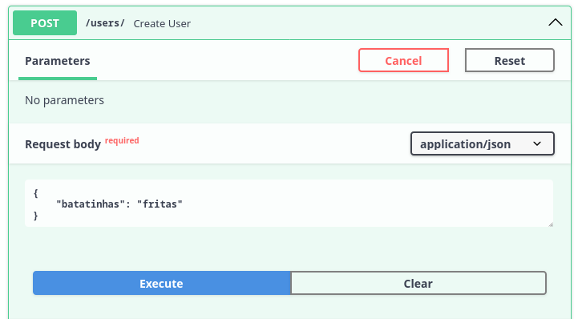
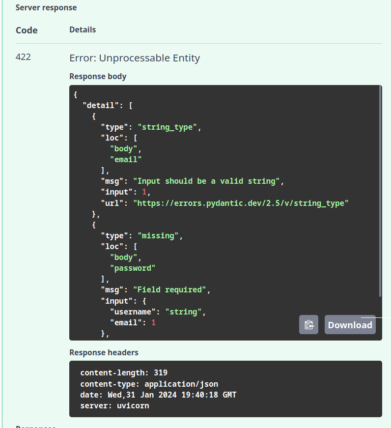
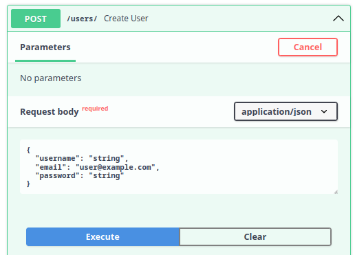

# Estruturando o Projeto e Criando Rotas CRUD

---

Objetivos dessa aula:

- Compreender a estrutura de um projeto FastAPI e como estruturar rotas CRUD (Criar, Ler, Atualizar, Deletar)
- Aprimorar nosso conhecimento sobre Pydantic e sua utilidade na validação e serialização de dados
- Implementação de rotas CRUD em FastAPI
- Escrita e execução de testes para validar o comportamento das rotas





---

Boas-vindas de volta à nossa série de aulas sobre a construção de uma aplicação utilizando FastAPI. Na última aula, abordamos conceitos básicos do desenvolvimento web e finalizamos a configuração do nosso ambiente. Hoje, avançaremos na estruturação dos primeiros endpoints da nossa API, concentrando-nos nas quatro operações fundamentais de **CRUD** - Criar, Ler, Atualizar e Deletar. Exploraremos como estas operações se aplicam tanto à comunicação web quanto à interação com o banco de dados.

O objetivo desta aula é implementar um sistema de cadastro de usuários na nossa aplicação. Ao final, você conseguirá cadastrar, listar, alterar e deletar usuários, além de realizar testes para validar estas funcionalidades.

??? note "Nota para pessoas **mais experiente** sobre essa aula"
	O princípio por trás dessa aula é demonstrar como construir os endpoints e os testes mais básicos possíveis.

	Talvez lhe cause estranhamento o uso de um banco de dados em uma lista e os testes sendo construídos a partir de efeitos colaterais. Mas o objetivo principal é que as pessoas consigam se concentrar na criação dos primeiros testes sem muito atrito.

	Estas questões serão resolvidas nas aulas seguintes.

## CRUD e HTTP

No desenvolvimento de APIs, existem quatro ações principais que fazemos com os dados: criar, ler, atualizar e excluir. Essas ações ajudam a gerenciar os dados no banco de dados e na aplicação web. Vamos nos focar nesse primeiro momento nas relações entre os dados.

CRUD é um acrônimo que representa as quatro operações básicas que você pode realizar em qualquer banco de dados persistente:

- **C**reate (Criar): adicionar novos registros ao banco de dados.
- **R**ead (Ler): recuperar registros existentes do banco de dados.
- **U**pdate (Atualizar): modificar registros existentes no banco de dados.
- **D**elete (Excluir): remover registros existentes do banco de dados.

Com essas operações podemos realizar qualquer tipo de comportamento em uma base dados. Podemos criar um registro, em seguida alterá-lo, quem sabe depois disso tudo deletá-lo.

Quando falamos de APIs servindo dados, todas essas operações têm alguma forma similar no protocolo HTTP. O protocolo tem verbos para indicar essas mesmas ações que queremos representar no banco de dados.

- **POST**: é usado para solicitar que o servidor aceite um dado (recurso) enviado pelo cliente.
- **GET**: é usado para quando o cliente deseja requisitar uma informação do servidor.
- **PUT**: é usando no momento em que o cliente deseja informar alguma alteração nos dados para o servidor.
- **DELETE**: usado para dizer ao servidor que delete determinado recurso.

Dessa forma podemos criar associações entre os endpoints e a base de dados. Por exemplo: quando quisermos inserir um dado no banco de dados, nós como clientes devemos comunicar essa intenção ao servidor usando o método POST enviando os dados (em nosso caso no formato JSON) que devem ser persistidos na base de dados. Com isso iniciamos o processo de *create* na base de dados.

### Respostas da API

Usamos códigos de status para informar ao cliente o resultado das operações no servidor, como se um dado foi criado, encontrado, atualizado ou excluído com sucesso. Por isso investiremos mais algum momento aqui.

Os códigos que devemos prestar atenção para responder corretamente as requisições. Os casos de sucesso incluem:

- **200 OK**: Indica sucesso na requisição.
	- **GET**: Quando um dado é solicitado e retornado com sucesso.
	- **PUT**: Quando dados são alterados com sucesso.
- **201 CREATED**: Significa que a solicitação resultou na criação de um novo recurso.
	- **POST**: Aplicável quando um dado é enviado e criado com sucesso.
	- **PUT**: Usado quando uma alteração resulta na criação de um novo recurso.
- **204 NO CONTENT**: Retorno do servidor sem conteúdo na mensagem.
	- **PUT**: Aplicável se a alteração não gerar um retorno.
	- **DELETE**: Usado quando a ação de deletar não gera um retorno.

Os códigos de erro mais comuns que temos que conhecer para lidar com possíveis erros na aplicação, são:

- **404 NOT FOUND**: O recurso solicitado não pôde ser encontrado.
- **422 UNPROCESSABLE ENTITY**: o pedido foi bem formado (ou seja, sintaticamente correto), mas não pôde ser processado.
- **500 INTERNAL SERVER ERROR**: Uma mensagem de erro genérica, dada quando uma condição inesperada foi encontrada. Geralmente ocorre quando nossa aplicação apresenta um erro.

Compreendendo esses códigos, estamos prontos para iniciar a implementação de alguns endpoints e colocar esses conceitos em prática.

## Implementando endpoints

Para facilitar o aprendizado, sugiro dividir a criação de novos endpoints em três etapas:

1. Relação com o HTTP: Determinar o verbo HTTP esperado e os códigos de resposta para situações de sucesso e erro.
2. Modelos de Dados: Definir o formato do JSON esperado, campos e seus tipos, e pensar nos modelos de resposta para situações de sucesso e erro.
3. Implementação do Corpo: Decidir o tratamento dos dados recebidos e o tipo de processamento aplicado.

As duas primeiras etapas nos ajudam a definir a interface de comunicação e como ela será documentada. A terceira etapa é mais específica e envolve decisões sobre a interação com o banco de dados, validações adicionais e a definição do que constitui sucesso ou erro na requisição.

Essas etapas nos orientam na implementação completa do endpoint, garantindo que nada seja esquecido.

## Iniciando a implementação da rota POST

Nesta aula, nosso foco principal será desenvolver um sistema de cadastro de usuários. Para isso, a implementação de uma forma eficiente para criar novos usuários na base de dados é essencial. Exploraremos como utilizar o verbo HTTP POST, fundamental para comunicar ao serviço a nossa intenção de enviar novos dados, como no cadastro de usuários.

### Implementação do endpoint

Para iniciar, criaremos um endpoint que aceita o verbo `POST` com dados em formato JSON. Esse endpoint responderá com o status `201` em caso de sucesso na criação do recurso. Com isso, estabelecemos a base para a nossa funcionalidade de cadastro.

Usaremos o decorador `#!python @app.post()` do FastAPI para definir nosso endpoint, que começará com a URL `/users/`, indicando onde receberemos os dados para criar novos usuários:

```python title="fast_zero/app.py" linenums="15"
--8<-- "aulas/codigos/03/fast_zero/app.py:6:9"
```

#### Status code de resposta

É crucial definir que, ao cadastrar um usuário com sucesso, o sistema deve retornar o código de resposta `#!python 201 CREATED`, indicando a criação bem-sucedida do recurso. Para isso, adicionamos o parâmetro `status_code` ao decorador:

```python title="fast_zero/app.py" hl_lines="1" linenums="15"
--8<-- "aulas/codigos/03/fast_zero/app.py:15:18"
```

> Conversaremos em breve sobre os códigos de resposta no tópico do [pydantic](#validacao-e-pydantic){:target="_blank"}

### Modelo de dados

O modelo de dados é uma parte fundamental, onde consideramos tanto os dados recebidos do cliente quanto os dados que serão retornados a ele. Esta abordagem assegura uma comunicação eficaz e clara.

#### Modelo de entrada de dados

Para os dados de entrada, como estamos pensando em um cadastro de usuário na aplicação, é importante que tenhamos insumos para identificá-lo como o `email`, uma senha (`password`) para que ele consiga fazer o login no futuro e seu nome de usuário (`username`). Dessa forma, podemos imaginar um modelo de entrada desta forma:


```json
{
    "username": "joao123",
    "email": "joao123@email.com",
    "password": "segredo123"
}
```

Para a aplicação conseguir expor esse modelo na documentação, devemos criar uma classe do pydantic em nosso arquivo de schemas (`fast_zero/schemas.py`) que represente esse schema:

```python title="fast_zero/schemas.py" linenums="8"
--8<-- "aulas/codigos/03/fast_zero/schemas.py:28:31"
```

Como já temos o endpoint definido, precisamos fazer a associação do modelo com ele. Para fazer isso basta que o endpoint receba um parâmetro e esse parâmetro esteja associado a um modelo via anotação de parâmetros:

```python title="fast_zero/app.py" hl_lines="6"
--8<-- "aulas/codigos/03/fast_zero/app.py:20:26"
```

Dessa forma, o modelo de entrada, o que o endpoint espera receber já está documentado e aparecerá no swagger UI.

Para visualizar, temos que iniciar o servidor:

```shell title="$ Execução no terminal!"
task run
```

E acessar a página [http://127.0.01:8000/docs](http://localhost:8000/docs){:target="_blank"}. Isso nos mostrará as definições do nosso endpoint usando o modelo no swagger:

{: .center width="400" }

#### Modelo de saída de dados

O modelo de saída explica ao cliente quais dados serão retornados quando a chamada a esse endpoint for feita. Para a API ter um uso fluído, temos que especificar o retorno corretamente na documentação.

Se dermos uma olhada no estado atual de resposta da nossa API, podemos ver que a resposta no swagger é `#!python "string"` para o código de resposta `#!python 201`:

{: .center .shadow }

Quando fazemos uma chamada com o método POST o esperado é que os dados criados sejam retornados ao cliente. Poderíamos usar o mesmo modelo de antes o `UserSchema`, porém, por uma questão de segurança, seria ideal não retornar a senha do usuário. Quanto menos ela trafegar na rede, melhor.

Desta forma, podemos pensar no mesmo schema, porém, sem a senha. Algo como:

```json
{
    "username": "joao123",
    "email": "joao123@email.com"
}
```

Transcrevendo isso em um modelo do pydantic em nosso arquivo de schemas (`fast_zero/schemas.py`) temos isso:

```python title="fast_zero/schemas.py" linenums="14"
--8<-- "aulas/codigos/03/fast_zero/schemas.py:34:37"
```

Para aplicar um modelo a resposta do endpoint, temos que passar o modelo ao parâmetro `response_model`, como fizemos na [aula passada](02.md#integrando-o-pydantic-com-o-fastapi){:target="_blank"}:

```python title="fast_zero/app.py" hl_lines="1 5"
--8<-- "aulas/codigos/03/fast_zero/app.py:29:36"
```

Tendo um modelo descritivo de resposta para o cliente na documentação:

{: .center .shadow }


## Validação e pydantic

Um ponto crucial do Pydantic é sua habilidade de checar se os dados estão corretos enquanto o programa está rodando, garantindo que tudo esteja conforme esperado. Fazendo com que, caso o cliente envie um dado que não corresponde com o schema definido, seja levantado um erro `#!python 422`. E caso a nossa resposta como servidor também não siga o schema, será levantado um erro `#!python 500`. Fazendo com que ele seja uma garantia de duas vias, nossa API segue a especificação da documentação.

Quando relacionamos um modelo à resposta do enpoint, o Pydantic de forma automática, cria um schema chamado `HTTPValidationError`:

{: .center .shadow }

Esse modelo é usado quando o JSON enviado na requisição não cumpre os requisitos do schema.

Por exemplo, se fizermos uma requisição que foge dos padrões definidos no schema:

{: .center .shadow width=500}

Essa requisição foge dos padrões, pois não envia o campo `password` e envia o tipo de dado errado para `email`.

Com isso, receberemos um erro `422 UNPROCESSABLE ENTITY`, dizendo que nosso schema foi violado e a resposta contém os detalhes dos campos faltantes ou mal formatados:

{: .center .shadow width=500}

A mensagem completa de retorno do servidor mostra de forma detalhada os erros de validação encontrados em cada campo, individualmente no campo `details`:

```python
{
  "detail": [
    {
      "type": "string_type", # (1)!
      "loc": [
        "body",
        "email" # (2)!
      ],
      "msg": "Input should be a valid string", #(3)!
      "input": 1,
      "url": "https://errors.pydantic.dev/2.5/v/string_type"
    },
    {
      "type": "missing", #(4)!
      "loc": [
        "body",
        "password" #(5)!
      ],
      "msg": "Field required", #(6)!
      "input": {
        "username": "string",
        "email": 1
      },
      "url": "https://errors.pydantic.dev/2.5/v/missing"
    }
  ]
}
```

1. Tipo de erro no campo: Era esperado que o valor fosse string (*string_type*)
2. Campo notificado
3. Mensagem que acompanha o erro
4. Tipo de erro no campo: Era esperado que o valor fosse enviado (*missing*)
5. Campo notificado
6. Mensagem que acompanha o erro

Vemos que o pydantic desempenha um papel bastante importante no funcionamento da API. Pois ele consegue "barrar" o request antes dele ser exposto à nossa função de endpoint. Evitando que diversos casos estranhos sejam cobertos de forma transparente. Tanto em relação aos tipos dos campos, quanto em relação aos campos que deveriam ser enviados, mas não foram.

### Estendendo a validação com e-mail

Outro ponto que deve ser considerado é a capacidade de estender os campos usados pelo pydantic nas anotações de tipo.

Para garantir que o campo `email` realmente contenha um e-mail válido, podemos usar uma ferramenta especial do Pydantic que verifica se o e-mail tem o formato correto, como a presença de `@` e um domínio válido.

Para isso, o pydantic tem um tipo de dado específico, o [`EmailStr`](https://docs.pydantic.dev/latest/api/networks/#pydantic.networks.EmailStr){:target="_blank"}. Que garante que o valor que será recebido pelo schema, seja de fato um e-mail em formato válido. Podemos adicioná-lo ao campo `email` nos modelos `UserSchema` e `UserPublic`:


```python
from pydantic import BaseModel, EmailStr

# Código omitido

class UserSchema(BaseModel):
    username: str
    email: EmailStr
    password: str

class UserPublic(BaseModel):
    username: str
    email: EmailStr
```

Com isso, o pydantic irá oferecer um exemplo de email no swagger `"user@example.com"` e acerta os schemas para fazer essas validações:

{: .center .shadow }

Dessa forma, o campo esperará não somente uma string como antes, mas um endereço de email válido.

### Validação da resposta

Após aperfeiçoarmos nossos modelos do Pydantic para garantir que os dados de entrada e saída estejam corretamente validados, chegamos a um ponto crucial: a implementação do corpo do nosso endpoint. Até agora, nosso endpoint está definido, mas sem uma lógica de processamento real, conforme mostrado abaixo:

```python title="fast_zero/app.py" hl_lines="3" linenums="13"
--8<-- "aulas/codigos/03/fast_zero/app.py:32:35"
```

Este é o momento perfeito para realizar um request e observar diretamente a atuação do Pydantic na validação da resposta. Ao tentarmos executar um request válido, sem a implementação adequada do endpoint, nos deparamos com uma situação interessante: o Pydantic tenta validar a resposta que o nosso endpoint deveria fornecer, mas, como ainda não implementamos essa lógica, o resultado não atende ao schema definido.

{: .center .shadow }

A tentativa resulta em uma mensagem de erro exibida diretamente no Swagger, indicando um erro de servidor interno (HTTP 500). Esse tipo de erro sugere que algo deu errado no lado do servidor, mas não oferece detalhes específicos sobre a natureza do problema para o cliente. O erro 500 é uma resposta genérica para indicar falhas no servidor.

{: .center .shadow }

Para investigar a causa exata do erro 500, é necessário consultar o console ou os logs de nossa aplicação, onde os detalhes do erro são registrados. Neste caso, o erro apresentado nos logs é o seguinte:

```python
raise ResponseValidationError( # (1)!
fastapi.exceptions.ResponseValidationError: 1 validation errors:
{
  "type":"model_attributes_type",
  "loc": ("response"),
  "msg":"Input should be a valid dictionary or object to extract fields from",#(2)!
  "input":"None", #(3)!
  "url":"https://errors.pydantic.dev/2.6/v/model_attributes_type"
}
```

1. O json dessa mensagem de erro aparece em uma única linha. Eu fiz a quebra para que ficasse mais fácil de lermos a resposta.
2. A mensagem de erro diz que o input passado ao modelo do pydantic deveria ser um dicionário válido ou um objeto onde os campos poderiam ser extraídos.
3. O objeto enviado ao modelo

Essencialmente, o erro nos informa que o modelo esperava receber um objeto válido para processamento, mas, em vez disso, recebeu `None`. Isso ocorre porque ainda não implementamos a lógica para processar o input recebido e retornar uma resposta adequada que corresponda ao modelo `UserPublic`.

Agora, tendo identificado a capacidade do Pydantic em validar as respostas e encontrarmos um erro devido à falta de implementação, podemos proceder com uma solução simples. Para começar, podemos utilizar diretamente os dados recebidos em `user` e retorná-los. Esta ação simples já é suficiente para satisfazer o schema, pois o objeto `user` contém os atributos `email` e `username`, esperados pelo modelo `UserPublic`:

```python title="fast_zero/app.py" hl_lines="3"
--8<-- "aulas/codigos/03/fast_zero/app.py:38:41"
```

Este retorno simples do objeto `user` garante que o schema seja cumprido. Agora, ao realizarmos novamente a chamada no Swagger, o objeto que enviamos é retornado conforme esperado, mas sem expor a senha, alinhado ao modelo `UserPublic` e emitindo uma resposta com o código 201:

{: .center }

Essa abordagem nos permite fechar o ciclo de validação, demonstrando a eficácia do Pydantic na garantia de que os dados de resposta estejam corretos. Com essa implementação simples, estabelecemos a base para o desenvolvimento real do código do endpoint POST, preparando o terreno para uma lógica mais complexa que envolverá a criação e o manejo de usuários dentro de nossa aplicação.

## De volta ao POST

Agora que já dominamos a definição dos modelos, podemos prosseguir com a aula e a implementação dos endpoints. Vamos retomar a implementação do POST, adicionando um banco de dados falso/simulado em memória. Isso nos permitirá explorar as operações do CRUD sem a complexidade da implementação de um banco de dados real, facilitando a assimilação dos muitos conceitos discutidos nesta aula.

### Criando um banco de dados falso

Para interagir com essas rotas de maneira prática, vamos criar uma lista provisória que simulará um banco de dados. Isso nos permitirá adicionar dados e entender o funcionamento do FastAPI. Portanto, introduzimos uma lista provisória para atuar como nosso "banco" e modificamos nosso endpoint para inserir nossos modelos do Pydantic nessa lista:


```python title="fast_zero/app.py" hl_lines="5 11-15"
--8<-- "aulas/codigos/03/fast_zero/app.py:43:58"
```

1. A lista `database` é provisória. Ela está aqui só para entendermos os conceitos de crud, nas próximas aulas vamos trabalhar com a criação do banco de dados definitivo.

2. `.model_dump()` é um método de modelos do pydantic que converte o objeto em dicionário. Por exemplo, `user.model_dump()` faria a conversão em `#!python {'username': 'nome do usuário', 'password': 'senha do usuário', 'email': 'email do usuário'}`. Os `**` querem dizer que o dicionário será desempacotado em parâmetros. Fazendo com que a chamada seja equivalente a `#!python UserDB(username='nome do usuário', password='senha do usuário', email='email do usuário',  id=len(database) + 1)`

Para simular um banco de dados de forma mais realista, é essencial que cada usuário tenha um ID único. Portanto, ajustamos nosso modelo de resposta pública (`UserPublic`) para incluir o ID do usuário. Também introduzimos um novo modelo, `UserDB`, que inclui tanto a senha do usuário quanto seu identificador único:

```python title="fast_zero/schemas.py" linenums="14"
--8<-- "aulas/codigos/03/fast_zero/schemas.py:14:21"
```

Essa abordagem simples nos permite avançar na construção dos outros endpoints. É crucial testar esse endpoint para assegurar seu correto funcionamento.


### Implementando o teste da rota POST

Antes de prosseguir, vamos verificar a cobertura de nossos testes:

```shell title="$ Execução no terminal!"
task test

# parte da resposta foi omitida

---------- coverage: platform linux, python 3.11.3-final-0 -----------
Name                    Stmts   Miss  Cover
-------------------------------------------
fast_zero/__init__.py       0      0   100%
fast_zero/app.py           12      3    75%
fast_zero/schemas.py       11      0   100%
-------------------------------------------
TOTAL                      23      3    87%

# parte da resposta foi omitida
```

Vemos que temos 3 Miss. Possivelmente das linhas que acabamos de escrever. Podemos olhar o HTML do coverage para ter certeza:

{: .center .shadow width=700}

Então, vamos escrever nosso teste. Esse teste para a rota POST precisa verificar se a criação de um novo usuário funciona corretamente. Enviamos uma solicitação POST com um novo usuário para a rota /users/. Em seguida, verificamos se a resposta tem o status HTTP 201 (Criado) e se a resposta contém o novo usuário criado.

```python title="tests/test_app.py" linenums="17"
def test_create_user():
    client = TestClient(app)

    response = client.post(
        '/users/',
        json={
            'username': 'alice',
            'email': 'alice@example.com',
            'password': 'secret',
        },
    )
	assert response.status_code == HTTPStatus.CREATED
    assert response.json() == {
        'username': 'alice',
        'email': 'alice@example.com',
        'id': 1,
    }
```

Ao executar o teste:

```shell title="$ Execução no terminal!"
task test

# parte da resposta foi omitida

tests/test_app.py::test_root_deve_retornar_ok_e_ola_mundo PASSED
tests/test_app.py::test_create_user PASSED

---------- coverage: platform linux, python 3.11.3-final-0 -----------
Name                    Stmts   Miss  Cover
-------------------------------------------
fast_zero/__init__.py       0      0   100%
fast_zero/app.py           12      0   100%
fast_zero/schemas.py       11      0   100%
-------------------------------------------
TOTAL                      23      0   100%

# parte da resposta foi omitida
```

#### Não se repita (DRY)

Você deve ter notado que a linha `client = TestClient(app)` está repetida na primeira linha dos dois testes que fizemos. Repetir código pode tornar o gerenciamento de testes mais complexo à medida que cresce, e é aqui que o princípio de "Não se repita" ([DRY](https://pt.wikipedia.org/wiki/Don't_repeat_yourself){:target="_blank"}) entra em jogo. DRY incentiva a redução da repetição, criando um código mais limpo e manutenível.

Para solucionar essa repetição, podemos usar uma funcionalidade do pytest chamada Fixture. Uma fixture é como uma função que prepara dados ou estado necessários para o teste. Pode ser pensada como uma forma de não repetir a fase de Arrange de um teste, simplificando a chamada e não repetindo código.

??? info "Se fixtures são uma novidade para você"
	Existe uma live de Python onde discutimos especificamente sobre fixtures
	

	[:fontawesome-brands-youtube: Link direto ](https://youtu.be/sidi9Z_IkLU){ .md-button }


Neste caso, criaremos uma fixture que retorna nosso `client`. Para fazer isso, precisamos criar o arquivo `tests/conftest.py`. O arquivo `conftest.py` é um arquivo especial reconhecido pelo pytest que permite definir fixtures que podem ser reutilizadas em diferentes módulos de teste em um projeto. É uma forma de centralizar recursos comuns de teste.


```python title="tests/conftest.py" linenums="1"
--8<-- "aulas/codigos/03/tests/conftest.py"
```

Agora, em vez de repetir a criação do `client` em cada teste, podemos simplesmente passar a fixture como um argumento nos nossos testes:

```python title="tests/test_app.py" linenums="1" hl_lines="4 11"
--8<-- "aulas/codigos/03/tests/test_app.py::26"
```

Com essa simples mudança, conseguimos tornar nosso código mais limpo e fácil de manter, seguindo o princípio DRY.

---

Vemos que estamos no caminho certo. Agora que a rota POST está implementada, seguiremos para a próxima operação CRUD: Read.

## Implementando a Rota GET

A rota GET é usada para recuperar informações de um ou mais usuários do nosso sistema. No contexto do CRUD, o verbo HTTP GET está associado à operação "Read". Se a solicitação for bem-sucedida, a rota deve retornar o status HTTP 200 (OK).

Para estruturar a resposta dessa rota, podemos criar um novo modelo chamado `UserList`. Este modelo representará uma lista de usuários e contém apenas um campo chamado `users`, que é uma lista de `UserPublic`. Isso nos permite retornar múltiplos usuários de uma vez.

```python title="fast_zero/schemas.py" linenums="24"
--8<-- "aulas/codigos/03/fast_zero/schemas.py:24:26"
```

Com esse modelo definido, podemos criar nosso endpoint GET. Este endpoint retornará uma instância de `UserList`, que por sua vez contém uma lista de `UserPublic`. Cada `UserPublic` é criado a partir dos dados de um usuário em nosso banco de dados fictício.

```python title="fast_zero/app.py"
--8<-- "aulas/codigos/03/fast_zero/app.py:60:67"
```

Com essa implementação, nossa API agora pode retornar uma lista de usuários. No entanto, nosso trabalho ainda não acabou. A próxima etapa é escrever testes para garantir que nossa rota GET está funcionando corretamente. Isso nos ajudará a identificar e corrigir quaisquer problemas antes de prosseguirmos com a implementação de outras rotas.

#### Implementando o teste da rota de GET

Nosso teste da rota GET tem que verificar se a recuperação dos usuários está funcionando corretamente. Enviamos uma solicitação GET para a rota /users/. Em seguida, verificamos se a resposta tem o status HTTP 200 (OK) e se a resposta contém a lista de usuários.

```python title="tests/test_app.py" linenums="28"
--8<-- "aulas/codigos/03/tests/test_app.py:28:40"
```

Com as rotas POST e GET implementadas, agora podemos criar e recuperar usuários. Implementaremos a próxima operação CRUD: Update.

!!! warning "Coisas que devemos considerar sobre este e os próximos testes"
	Note que para que esse teste seja executado com sucesso o teste do endpoint de `POST` tem que ser executado antes. Isso é problemático no mundo dos testes. Pois cada teste deve estar isolado e não depender da execução de nada externo a ele.

	Para que isso aconteça, precisaremos de um mecanismo que reinicie o banco de dados a cada teste, mas ainda não temos um banco de dados real. O banco de dados será introduzido na aplicação na [aula 04](04.md).

	O mecanismo que fará com que os testes não interfiram em outros e sejam independentes será introduzido na [aula 05](05.md/#testando-o-endpoint-post-users-com-pytest-e-fixtures).

## Implementando a Rota PUT

A rota PUT é usada para atualizar as informações de um usuário existente. No contexto do CRUD, o verbo HTTP PUT está associado à operação "Update". Se a solicitação for bem-sucedida, a rota deve retornar o status HTTP 200 (OK). No entanto, se o usuário solicitado não for encontrado, deveríamos retornar o status HTTP 404 (Não Encontrado).

Uma característica importante do verbo PUT é que ele é direcionado a um recurso em específico. Nesse caso, estamos direcionando a alteração a um `user` em específico na base de dados. O identificador de `user` é o campo `id` que estamos usando nos modelos do Pydantic. Nesse caso, nosso endpoint deve receber o identificador de quem será alterado.

Para fazer essa identificação do recurso na [URL](02.md/#url){:target="_blank"} usamos a seguinte combinação `/caminho/recurso`. Mas, como o recurso é dinâmico, ele deve ser enviado pelo cliente. Fazendo com que o valor tenha que ser uma variável. Dentro do FastAPI, as variáveis de recursos são descritas dentro de {}, como `{user_id}`. Fazendo com que o caminho completo do nosso endpoint seja `#!python '/users/{user_id}'`. Da seguinte forma:

```python title="fast_zero/app.py" hl_lines="5 6"
--8<-- "aulas/codigos/03/fast_zero/app.py:69:83"
```

1. Aqui fazemos uma validação simples, verificamos se o id não é maior que o tamanho da lista `#!python user_id > len(database)` e o número enviado para o `user_id` é um valor positivo `#!python user_id < 1`.
2. Levantamos um erro do tipo `HTTPException` para dizer que o usuário não existe na base de dados. Esse modelo já está presente no swagger com `HTTPValidationError`.
3. Nessa linha, estamos substituindo a posição (`user_id - 1`) na lista pelo novo objeto.

Para que essa variável definida na URL seja transferida para nosso endpoint, devemos adicionar um parâmetro na função com o mesmo nome da variável definida. Como `#!python def update_user(user_id: int)` na linha em destaque.

#### Implementando o teste da rota de PUT

Nosso teste da rota PUT precisa verificar se a atualização de um usuário existente funciona corretamente. Enviamos uma solicitação PUT com as novas informações do usuário para a rota `/users/{user_id}`. Em seguida, verificamos se a resposta tem o status HTTP 200 (OK) e se a resposta contém o usuário atualizado.

```python title="tests/test_app.py" linenums="42"
--8<-- "aulas/codigos/03/tests/test_app.py:42:56"
```

Com as rotas POST, GET e PUT implementadas, agora podemos criar, recuperar e atualizar usuários. A última operação CRUD que precisamos implementar é Delete.

## Implementando a Rota DELETE

A rota DELETE é usada para excluir um usuário do nosso sistema. No contexto do CRUD, o verbo HTTP DELETE está associado à operação "Delete". Se a solicitação for bem-sucedida, a rota deve retornar o status HTTP 200 (OK). No entanto, se o usuário solicitado não for encontrado, deveríamos retornar o status HTTP 404 (Não Encontrado).

Este endpoint receberá o ID do usuário que queremos excluir. Note que, estamos lançando uma exceção HTTP quando o ID do usuário está fora do range da nossa lista (simulação do nosso banco de dados). Quando conseguimos excluir o usuário com sucesso, retornamos a mensagem de sucesso em um modelo do tipo `Message`.

```python title="fast_zero/app.py" linenums="44"
--8<-- "aulas/codigos/03/fast_zero/app.py:84:97"
```

Com a implementação da rota DELETE concluída, é fundamental garantirmos que essa rota está funcionando conforme o esperado. Para isso, precisamos escrever testes para essa rota.

#### Implementando o teste da rota de DELETE

Nosso teste da rota DELETE precisa verificar se a exclusão de um usuário existente funciona corretamente. Enviamos uma solicitação DELETE para a rota /users/{user_id}. Em seguida, verificamos se a resposta tem o status HTTP 200 (OK) e se a resposta contém uma mensagem informando que o usuário foi excluído.

```python title="tests/test_app.py" linenums="59"
--8<-- "aulas/codigos/03/tests/test_app.py:59:63"
```

#### Checando tudo antes do commit

Antes de fazermos o commit, é uma boa prática checarmos todo o código, e podemos fazer isso com as ações que criamos com o taskipy.

```shell title="$ Execução no terminal!"
$ task lint
```

```shell title="$ Execução no terminal!"
$ task format
6 files left unchanged
```

```shell title="$ Execução no terminal!"
$ task test
...
tests/test_app.py::test_root_deve_retornar_ok_e_ola_mundo PASSED
tests/test_app.py::test_create_user PASSED
tests/test_app.py::test_read_users PASSED
tests/test_app.py::test_update_user PASSED
tests/test_app.py::test_delete_user PASSED

---------- coverage: platform linux, python 3.11.4-final-0 -----------
Name                   Stmts   Miss  Cover
------------------------------------------
fastzero/__init__.py       0      0   100%
fastzero/app.py           28      2    93%
fastzero/schemas.py       15      0   100%
------------------------------------------
TOTAL                     43      2    95%


============================ 5 passed in 1.48s =============================
Wrote HTML report to htmlcov/index.html

```

## Commit

Após toda essa jornada de aprendizado, construção e teste de rotas, chegou a hora de registrar nosso progresso utilizando o git. Fazer commits regulares é uma boa prática, pois mantém um histórico detalhado das alterações e facilita a volta a uma versão anterior do código, se necessário.

Primeiramente, verificaremos as alterações feitas no projeto com o comando `git status`. Este comando nos mostrará todos os arquivos modificados que ainda não foram incluídos em um commit.

```shell title="$ Execução no terminal!"
git status
```

Em seguida, adicionaremos todas as alterações para o próximo commit. O comando `git add .` adiciona todas as alterações feitas em todos os arquivos do projeto.

```shell title="$ Execução no terminal!"
git add .
```

Agora, estamos prontos para fazer o commit. Com o comando `git commit`, criamos uma nova entrada no histórico do nosso projeto. É importante adicionar uma mensagem descritiva ao commit, para que, no futuro, outras pessoas ou nós mesmos entendamos o que foi alterado. Nesse caso, a mensagem do commit poderia ser "Implementando rotas CRUD".

```shell title="$ Execução no terminal!"
git commit -m "Implementando rotas CRUD"
```

Por fim, enviamos nossas alterações para o repositório remoto com `git push`. Se você tiver várias branches, certifique-se de estar na branch correta antes de executar este comando.

```shell title="$ Execução no terminal!"
git push
```

E pronto! As alterações estão seguras no histórico do git, e podemos continuar com o próximo passo do projeto.

## Exercícios

1. Escrever um teste para o erro de `#!python 404` (NOT FOUND) para o endpoint de PUT;
2. Escrever um teste para o erro de `#!python 404` (NOT FOUND) para o endpoint de DELETE;
3. Criar um endpoint de GET para pegar um único recurso como `users/{id}` e fazer seus testes para `#!python 200` e `#!python 404`.



## Conclusão

Com a implementação bem-sucedida das rotas CRUD, demos um passo significativo na construção de uma funcional com FastAPI. Agora podemos manipular usuários - criar, ler, atualizar e excluir - o que é fundamental para muitos sistemas de informação.

O papel dos testes em cada etapa não pode ser subestimado. Testes não apenas nos ajudam a assegurar que nosso código está funcionando como esperado, mas também nos permitem refinar nossas soluções e detectar problemas potenciais antes que eles afetem a funcionalidade geral do nosso sistema. Nunca subestime a importância de executar seus testes sempre que fizer uma alteração em seu código!

Até aqui, no entanto, trabalhamos com um "banco de dados" provisório, na forma de uma lista Python, que é volátil e não persiste os dados de uma execução do aplicativo para outra. Para nosso aplicativo ser útil em um cenário do mundo real, precisamos armazenar nossos dados de forma mais duradoura. É aí que os bancos de dados entram.

Outro ponto que deve ser destacado é que nossas implementações de testes sofrem interferência dos testes anteriores. Testes devem funcionar de forma isolada, sem a dependência de um teste anterior. Vamos ajustar isso no futuro.

No próximo tópico, exploraremos uma das partes mais críticas de qualquer aplicativo - a conexão e interação com um banco de dados. Aprenderemos a integrar nosso aplicativo FastAPI com um banco de dados real, permitindo a persistência de nossos dados de usuário entre as sessões do aplicativo.


