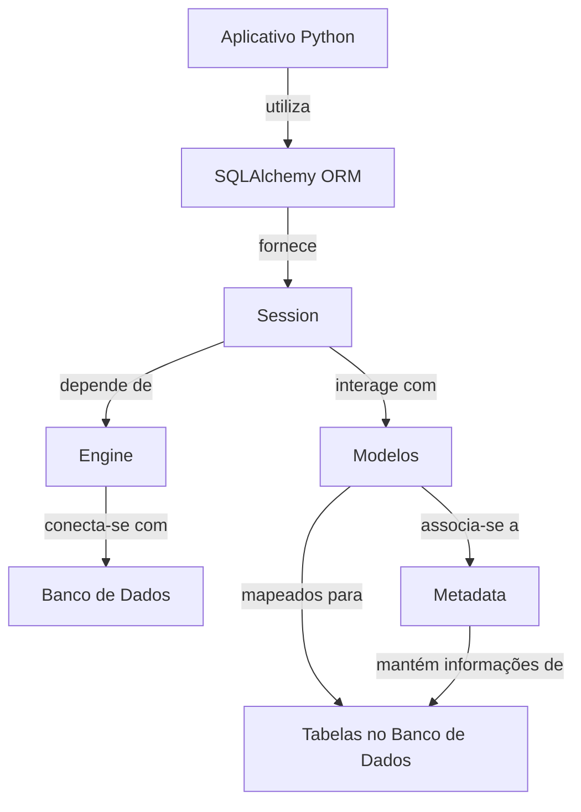

# Configurando o Banco de Dados e Gerenciando Migrações com Alembic

---
Objetivos dessa aula:

-  Introdução ao SQLAlchemy e Alembic
-  Instalando SQLAlchemy e Alembic
-  Configurando e criando o banco de dados
-  Criando e localizando tabelas utilizando SQLAlchemy
-  Testando a criação de tabelas
-  Gerenciando migrações do banco de dados com Alembic

??? tip "Caso prefira ver a aula em vídeo"
	Esse aula ainda não está disponível em formato de vídeo, somente em texto!

	

[Aula :fontawesome-brands-youtube:](#){ .md-button }
[Slides :fontawesome-solid-file-powerpoint:](https://github.com/dunossauro/fastapi-do-zero/blob/main/slides/pdf/aula_04.pdf){ .md-button }
[Código :fontawesome-solid-code:](https://github.com/dunossauro/fastapi-do-zero/tree/main/codigo_das_aulas/04/){ .md-button }

---

Com os endpoints da nossa API já estabelecidos, estamos, por ora, utilizando um banco de dados simulado, armazenando uma lista em memória. Nesta aula, iniciaremos o processo de configuração do nosso banco de dados real. Nossa agenda inclui a instalação do SQLAlchemy, a definição do modelo de usuários, e a execução da primeira migração com o Alembic para um banco de dados evolutivo. Além disso, exploraremos como desacoplar as configurações do banco de dados da aplicação, seguindo os princípios dos 12 fatores.

Antes de prosseguirmos com a instalação e a configuração, é crucial entender alguns conceitos fundamentais sobre ORMs (*Object-Relational Mapping*).

### O que é um ORM e por que usamos um?

ORM significa Mapeamento Objeto-Relacional. É uma técnica de programação que vincula (ou mapeia) objetos a registros de banco de dados. Em outras palavras, um ORM permite que você interaja com seu banco de dados, como se você estivesse trabalhando com objetos Python.

O SQLAlchemy é um exemplo de ORM. Ele permite que você trabalhe com bancos de dados SQL de maneira mais natural aos programadores Python. Em vez de escrever consultas SQL cruas, você pode usar métodos e atributos Python para manipular seus registros de banco de dados.

Mas por que usaríamos um ORM? Aqui estão algumas razões:

- Abstração de banco de dados: ORMs permitem que você mude de um tipo de banco de dados para outro com poucas alterações no código.

- Segurança: ORMs lidam geralmente com escapagem de consultas e para prevenir injeções SQL, um tipo comum de vulnerabilidade de segurança.

- Eficiência no desenvolvimento: ORMs podem gerar automaticamente esquemas, realizar migrações e outras tarefas que seriam demoradas para fazer manualmente.

### Configurações de ambiente e os 12 fatores

Uma boa prática no desenvolvimento de aplicações é separar as configurações do código. Configurações, como credenciais de banco de dados, são propensas a mudanças entre ambientes diferentes (como desenvolvimento, teste e produção). Misturá-las com o código pode tornar o processo de mudança entre esses ambientes complicado e propenso a erros.

??? tip "Caso queira saber mais sobre 12 fatores"
	Temos uma live focada nesse assunto com a participação especial do [Bruno Rocha](https://twitter.com/rochacbruno){:target="_blank"}

	

	[:fontawesome-brands-youtube: Link direto](https://www.youtube.com/watch?v=DA-hOskxOxE){ .md-button }

Além disso, expor credenciais de banco de dados e outras informações sensíveis no código-fonte é uma prática de segurança ruim. Se esse código fosse comprometido, essas informações poderiam ser usadas para acessar e manipular seus recursos.

Por isso, usaremos o `pydantic-settings` para gerenciar nossas configurações de ambiente. A biblioteca permite que você defina configurações em arquivos separados ou variáveis de ambiente e acesse-as de uma maneira estruturada e segura em seu código.

Isso está alinhado com a metodologia dos 12 fatores, um conjunto de melhores práticas para desenvolvimento de aplicações modernas. O terceiro fator, "Config", afirma que as configurações que variam entre os ambientes devem ser armazenadas no ambiente e não no código.


Agora que entendemos melhor esses conceitos, começaremos instalando as bibliotecas que iremos usar. O primeiro passo é instalar o SQLAlchemy, um ORM que nos permite trabalhar com bancos de dados SQL de maneira Pythonica. Além disso, o Alembic, que é uma ferramenta de migração de banco de dados, funciona muito bem com o SQLAlchemy e nos ajudará a gerenciar as alterações do esquema do nosso banco de dados.

```shell title="$ Execução no terminal!"
poetry add sqlalchemy
```

Além disso, para evitar a escrita de configurações do banco de dados diretamente no código-fonte, usaremos o `pydantic-settings`. Este pacote nos permite gerenciar as configurações do nosso aplicativo de uma maneira mais segura e estruturada.

```shell title="$ Execução no terminal!"
poetry add pydantic-settings
```

Agora estamos prontos para mergulhar na configuração do nosso banco de dados! Vamos em frente.

## O básico sobre SQLAlchemy

SQLAlchemy é uma biblioteca Python versátil, concebida para intermediar a interação entre Python e bancos de dados relacionais, como MySQL, PostgreSQL e SQLite. A biblioteca é constituída por duas partes principais: o Core e o ORM (Object Relational Mapper).

- **Core**: O Core do SQLAlchemy disponibiliza uma interface SQL abstrata, que possibilita a manipulação de bancos de dados relacionais de maneira segura, alinhada com as convenções do Python. Através do Core, é possível construir, analisar e executar instruções SQL, além de conectar-se a diversos tipos de bancos de dados utilizando a mesma API.

- **ORM**: ORM, ou Mapeamento Objeto-Relacional, é uma técnica que facilita a comunicação entre o código orientado a objetos e bancos de dados relacionais. Com o ORM do SQLAlchemy, os desenvolvedores podem interagir com o banco de dados utilizando classes e objetos Python, eliminando a necessidade de escrever instruções SQL diretamente.

Além do Core e do ORM, o SQLAlchemy conta com outros componentes cruciais que serão foco desta aula, a Engine e a Session:

### Engine

A 'Engine' do SQLAlchemy é o ponto de contato com o banco de dados, estabelecendo e gerenciando as conexões. Ela é instanciada através da função `create_engine()`, que recebe as credenciais do banco de dados, o endereço de conexão (URI) e configura o pool de conexões.

### Session

Quanto à persistência de dados e consultas ao banco de dados utilizando o ORM, a Session é a principal interface. Ela atua como um intermediário entre o aplicativo Python e o banco de dados, mediada pela Engine. A Session é encarregada de todas as transações, fornecendo uma API para conduzi-las.

Agora que conhecemos a Engine e a Session, vamos explorar a definição de modelos de dados.

## Definindo os Modelos de Dados com SQLAlchemy

Os modelos de dados definem a estrutura de como os dados serão armazenados no banco de dados. No ORM do SQLAlchemy, esses modelos são definidos como classes Python que herdam de uma classe base comum. A classe base é criada a partir de `DeclarativeBase`.

Cada classe que herda da classe base é automaticamente mapeada para uma tabela no banco de dados. Adicionalmente, a classe base inclui um objeto de metadados que é uma coleção de todas as tabelas declaradas. Este objeto é utilizado para gerenciar operações como criação, modificação e exclusão de tabelas.

Agora definiremos nosso modelo `User`. No diretório `fast_zero`, crie um novo arquivo chamado `models.py` e incluiremos o seguinte código no arquivo:

```python title="fast_zero/models.py" linenums="1"
from sqlalchemy.orm import DeclarativeBase, Mapped, mapped_column


class Base(DeclarativeBase):
    pass


class User(Base):
    __tablename__ = 'users'

    id: Mapped[int] = mapped_column(primary_key=True)
    username: Mapped[str]
    password: Mapped[str]
    email: Mapped[str]
```

Aqui, `Mapped` refere-se a um atributo Python que é associado (ou mapeado) a uma coluna específica em uma tabela de banco de dados. Por exemplo, `Mapped[int]` indica que este atributo é um inteiro que será mapeado para uma coluna correspondente em uma tabela de banco de dados. Da mesma forma, `Mapped[str]` se referiria a um atributo de string que seria mapeado para uma coluna de string correspondente. Esta abordagem permite ao SQLAlchemy realizar a conversão entre os tipos de dados Python e os tipos de dados do banco de dados, além de oferecer uma interface Pythonica para a interação entre eles.


## Testando as Tabelas

Antes de prosseguirmos, uma boa prática seria criar um teste para validar se toda a estrutura do banco de dados funciona. Criaremos um arquivo para validar isso: `test_db.py`.

A partir daqui, você pode prosseguir com a estruturação do conteúdo desse arquivo para definir os testes necessários para validar o seu modelo de usuário e sua interação com o banco de dados.

### Antes de Escrever os Testes

A essa altura, se estivéssemos buscando apenas cobertura, poderíamos simplesmente testar utilizando o modelo, e isso seria suficiente. No entanto, queremos verificar se toda a nossa interação com o banco de dados ocorrerá com sucesso. Isso inclui saber se os tipos de dados na tabela foram mapeados corretamente, se é possível interagir com o banco de dados, se o ORM está estruturado adequadamente com a classe base. Precisamos garantir que todo esse esquema funcione.



Neste diagrama, vemos a relação completa entre o aplicativo Python e o banco de dados. A conexão é estabelecida através do SQLAlchemy ORM, que fornece uma Session para interagir com os Modelos. Esses modelos são mapeados para as tabelas no banco de dados, enquanto a Engine se conecta com o banco de dados e depende de Metadata para manter as informações das tabelas.

Portanto, criaremos uma fixture para podermos usar todo esse esquema sempre que necessário.

### Criando uma Fixture para interações com o Banco de Dados

Para testar o banco, temos que fazer diversos passos, e isso pode tornar nosso teste bastante grande. Uma fixture pode ajudar a isolar toda essa configuração do banco de dados fora do teste. Assim, evitamos repetir o mesmo código em todos os testes e ainda garantimos que cada teste tenha sua própria versão limpa do banco de dados.

Criaremos uma fixture para a conexão com o banco de dados chamada `session`:

```python title="tests/conftest.py"
--8<-- "aulas/codigos/04/tests/conftest.py::7"

# ...


--8<-- "aulas/codigos/04/tests/conftest.py:15:21"
```

Aqui, estamos utilizando o SQLite como o banco de dados em memória para os testes. Essa é uma prática comum em testes unitários, pois a utilização de um banco de dados em memória é mais rápida do que um banco de dados persistido em disco. Com o SQLite em memória, podemos criar e destruir bancos de dados facilmente, o que é útil para isolar os testes e garantir que os dados de um teste não afetem outros testes. Além disso, não precisamos nos preocupar com a limpeza dos dados após a execução dos testes, já que o banco de dados em memória é descartado quando o programa é encerrado.

O que cada linha da fixture faz?

1. `create_engine('sqlite:///:memory:')`: cria um mecanismo de banco de dados SQLite em memória usando SQLAlchemy. Este mecanismo será usado para criar uma sessão de banco de dados para nossos testes.

2. `Session = sessionmaker(bind=engine)`: cria uma fábrica de sessões para criar sessões de banco de dados para nossos testes.

3. `Base.metadata.create_all(engine)`: cria todas as tabelas no banco de dados de teste antes de cada teste que usa a fixture `session`.

4. `yield Session()`: fornece uma instância de Session que será injetada em cada teste que solicita a fixture `session`. Essa sessão será usada para interagir com o banco de dados de teste.

5. `Base.metadata.drop_all(engine)`: após cada teste que usa a fixture `session`, todas as tabelas do banco de dados de teste são eliminadas, garantindo que cada teste seja executado contra um banco de dados limpo.

Resumindo, essa fixture está configurando e limpando um banco de dados de teste para cada teste que o solicita, assegurando que cada teste seja isolado e tenha seu próprio ambiente limpo para trabalhar. Isso é uma boa prática em testes de unidade, já que queremos que cada teste seja independente e não afete os demais.

### Criando um Teste para a Nossa Tabela

Agora, no arquivo `test_db.py`, escreveremos um teste para a criação de um usuário. Este teste adiciona um novo usuário ao banco de dados, faz commit das mudanças, e depois verifica se o usuário foi devidamente criado consultando-o pelo nome de usuário. Se o usuário foi criado corretamente, o teste passa. Caso contrário, o teste falha, indicando que há algo errado com nossa função de criação de usuário.

```python title="tests/test_db.py" linenums="1"
--8<-- "aulas/codigos/04/tests/test_db.py"
```

### Executando o teste

A execução de testes é uma parte vital do desenvolvimento de qualquer aplicação. Os testes nos ajudam a identificar e corrigir problemas antes que eles se tornem mais sérios. Eles também fornecem a confiança de que nossas mudanças não quebraram nenhuma funcionalidade existente. No nosso caso, executaremos os testes para validar nossos modelos de usuário e garantir que eles estejam funcionando como esperado.

Para executar os testes, digite o seguinte comando:

```shell title="$ Execução no terminal!"
task test
```

```{.console .no-copy}
# ...

tests/test_app.py::test_root_deve_retornar_ok_e_ola_mundo PASSED
tests/test_app.py::test_create_user PASSED
tests/test_app.py::test_read_users PASSED
tests/test_app.py::test_update_user PASSED
tests/test_app.py::test_delete_user PASSED
tests/test_db.py::test_create_user PASSED

---------- coverage: platform linux, python 3.11.3-final-0 -----------
Name                    Stmts   Miss  Cover
-------------------------------------------
fast_zero/__init__.py       0      0   100%
fast_zero/app.py           28      2    93%
fast_zero/models.py        11      0   100%
fast_zero/schemas.py       15      0   100%
-------------------------------------------
TOTAL                      54      2    96%
```

Neste caso, podemos ver que todos os nossos testes passaram com sucesso. Isso significa que nossa funcionalidade de criação de usuário está funcionando corretamente e que nosso modelo de usuário está sendo corretamente persistido no banco de dados.

Com nossos modelos e testes de banco de dados agora em ordem, estamos prontos para avançar para a próxima fase de configuração de nosso banco de dados e gerenciamento de migrações.

## Configuração do ambiente do banco de dados

Por fim, configuraremos nosso banco de dados. Primeiro, criaremos um novo arquivo chamado `settings.py` dentro do diretório `fast_zero`. Aqui, usaremos o Pydantic para criar uma classe `Settings` que irá pegar as configurações do nosso arquivo `.env`. Neste arquivo, a classe `Settings` é definida como:

```python title="fast_zero/settings.py"
from pydantic_settings import BaseSettings, SettingsConfigDict


class Settings(BaseSettings):
    model_config = SettingsConfigDict(
        env_file='.env', env_file_encoding='utf-8'
    )

    DATABASE_URL: str
```

Agora, definiremos o `DATABASE_URL` no nosso arquivo de ambiente `.env`. Crie o arquivo na raiz do projeto e adicione a seguinte linha:

```shell title=".env"
DATABASE_URL="sqlite:///database.db"
```

Com isso, quando a classe `Settings` for instanciada, ela irá automaticamente carregar as configurações do arquivo `.env`.

Finalmente, adicione o arquivo de banco de dados, `database.db`, ao `.gitignore` para garantir que não seja incluído no controle de versão. Adicionar informações sensíveis ou arquivos binários ao controle de versão é geralmente considerado uma prática ruim.

```shell title="$ Execução no terminal!"
echo 'database.db' >> .gitignore
```

## Instalando o Alembic e Criando a Primeira Migração

Antes de avançarmos, é importante entender o que são migrações de banco de dados e por que são úteis. As migrações são uma maneira de fazer alterações ou atualizações no banco de dados, como adicionar uma tabela ou uma coluna a uma tabela, ou alterar o tipo de dados de uma coluna. Elas são extremamente úteis, pois nos permitem manter o controle de todas as alterações feitas no esquema do banco de dados ao longo do tempo. Elas também nos permitem reverter para uma versão anterior do esquema do banco de dados, se necessário.

??? tip "Caso nunca tenha trabalhado com Migrações"
	Temos uma live de Python focada nesse assunto em específico

	

	[:fontawesome-brands-youtube: Link direto](https://youtu.be/yQtqkq9UkDA){ .md-button }

Agora, começaremos instalando o Alembic, que é uma ferramenta de migração de banco de dados para SQLAlchemy. Usaremos o Poetry para adicionar o Alembic ao nosso projeto:

```shell title="$ Execução no terminal!"
poetry add alembic
```

Após a instalação do Alembic, precisamos iniciá-lo em nosso projeto. O comando de inicialização criará um diretório `migrations` e um arquivo de configuração `alembic.ini`:

```shell title="$ Execução no terminal!"
alembic init migrations
```

Com isso, a estrutura do nosso projeto sofre algumas alterações e novos arquivos são criados:

```{.plaintext hl_lines="3 10-14" .no-copy}
.
├── .env
├── alembic.ini
├── fast_zero
│  ├── __init__.py
│  ├── app.py
│  ├── models.py
│  ├── schemas.py
│  └── settings.py
├── migrations
│  ├── env.py
│  ├── README
│  ├── script.py.mako
│  └── versions
├── poetry.lock
├── pyproject.toml
├── README.md
└── tests
   ├── __init__.py
   ├── conftest.py
   ├── test_app.py
   └── test_db.py
```

No arquivo `alembic.ini`: ficam as configurações gerais das nossas migrações. Na pasta `migrations` foram criados um arquivo chamado `env.py`, esse arquivo é responsável por como as migrações serão feitas, e o arquivo `script.py.mako` é um template para as novas migrações.

### Criando uma migração automática

Com o Alembic devidamente instalado e iniciado, agora é o momento de gerar nossa primeira migração. Mas, antes disso, precisamos garantir que o Alembic consiga acessar nossas configurações e modelos corretamente. Para isso, faremos algumas alterações no arquivo `migrations/env.py`.

Neste arquivo, precisamos:

1. Importar as `Settings` do nosso arquivo `settings.py` e a `Base` dos nossos modelos.
2. Configurar a URL do SQLAlchemy para ser a mesma que definimos em `Settings`.
3. Verificar a existência do arquivo de configuração do Alembic e, se presente, lê-lo.
4. Definir os metadados de destino como `Base.metadata`, que é o que o Alembic utilizará para gerar automaticamente as migrações.

O arquivo `migrations/env.py` modificado ficará assim:

```python title="migrations/env.py" linenums="1"
from logging.config import fileConfig

from sqlalchemy import engine_from_config
from sqlalchemy import pool

from alembic import context
from fast_zero.settings import Settings
from fast_zero.models import Base

config = context.config
config.set_main_option('sqlalchemy.url', Settings().DATABASE_URL)

if config.config_file_name is not None:
    fileConfig(config.config_file_name)

target_metadata = Base.metadata

# other values from the config, defined by the needs of env.py,
# ...
```

Feitas essas alterações, estamos prontos para gerar nossa primeira migração automática. O Alembic é capaz de gerar migrações a partir das mudanças detectadas nos nossos modelos do SQLAlchemy.

Para criar a migração, utilizamos o seguinte comando:

```shell title="$ Execução no terminal!"
alembic revision --autogenerate -m "create users table"
```

Este comando instrui o Alembic a criar uma nova revisão de migração no diretório `migrations/versions`. A revisão gerada conterá os comandos SQL necessários para aplicar a migração (criar a tabela de usuários) e para reverter essa migração, caso seja necessário.

## Analisando a migração automática

Ao criar uma migração automática com o Alembic, um arquivo é gerado dentro da pasta `migrations/versions`. O nome deste arquivo começa com um ID de revisão (um hash único gerado pelo Alembic), seguido por uma breve descrição que fornecemos no momento da criação da migração, neste caso, `create_users_table`.

Vamos analisar o arquivo de migração:

```{.python title="migrations/versions/e018397cecf4_create_users_table.py" .no-copy}
"""create users table

Revision ID: e018397cecf4
Revises:
Create Date: 2023-07-13 03:43:03.730534

"""
from typing import Sequence, Union

from alembic import op
import sqlalchemy as sa


# revision identifiers, used by Alembic.
revision: str = 'e018397cecf4'
down_revision: Union[str, None] = None
branch_labels: Union[str, Sequence[str], None] = None
depends_on: Union[str, Sequence[str], None] = None


def upgrade() -> None:
    # ### commands auto generated by Alembic - please adjust! ###
    op.create_table('users',
    sa.Column('id', sa.Integer(), nullable=False),
    sa.Column('username', sa.String(), nullable=False),
    sa.Column('password', sa.String(), nullable=False),
    sa.Column('email', sa.String(), nullable=False),
    sa.PrimaryKeyConstraint('id')
    )
    # ### end Alembic commands ###


def downgrade() -> None:
    # ### commands auto generated by Alembic - please adjust! ###
    op.drop_table('users')
    # ### end Alembic commands ###
```

Esse arquivo descreve as mudanças a serem feitas no banco de dados. Ele usa a linguagem core do SQLAlchemy, que é mais baixo nível que o ORM. As funções `upgrade` e `downgrade` definem, respectivamente, o que fazer para aplicar e para desfazer a migração. No nosso caso, a função `upgrade` cria a tabela 'users' com os campos que definimos em `fast_zero/models.py`e a função `downgrade` a remove.


#### Analisando o banco de dados

Ao criar a migração, o Alembic teve que observar se já existiam migrações anteriores no banco de dados. Como o banco de dados não existia, ele criou um novo banco sqlite com o nome que definimos na variável de ambiente `DATABASE_URL`. No caso `database.db`.

Se olharmos a estrutura de pastas, esse arquivo agora existe:

```{.plaintext hl_lines="4" .no-copy}
.
├── .env
├── alembic.ini
├── database.db
├── fast_zero
│  └── ...
├── migrations
│  └── ...
├── poetry.lock
├── pyproject.toml
├── README.md
└── tests
   └── ...
```

> Pelo fato do sqlite3 ser um banco baseado em um único arquivo, no momento das migrações, o sqlalchemy faz a criação do arquivo de banco de dados caso ele não exista.

No momento da verificação, caso não exista a tabela de migrações, ela será criada. A tabela de migrações é nomeada como `alembic_version`.

Vamos acessar o console do sqlite e verificar se isso foi feito. Precisamos chamar `sqlite3 nome_do_arquivo.db`:

```shell title="$ Execução no terminal!"
sqlite3 database.db
```
	
??? tip "Caso não tenha o SQLite instalado na sua máquina:"

	```shell title="Arch"
	pacman -S sqlite
	```

	```shell title="Debian/Ubuntu"
	sudo apt install sqlite3
	```

	```shell title="Mac"
	brew install sqlite
	```
     
	```shell title="Windows"
	winget install --id SQLite.SQLite
	```

Quando executamos esse comando, o console do sqlite será inicializado. E dentro dele podemos executar alguns comandos. Como fazer consultas, ver as tabelas criadas, adicionar dados, etc.

A cada do console é essa:
```{.sql .no-copy}
SQLite version 3.45.1 2024-01-30 16:01:20
Enter ".help" for usage hints.
sqlite>
```

Aqui você pode digitar comandos, da mesma forma em que fazemos no terminal interativo do python. O comando `.schema` nos mostra todas as tabelas criadas no banco de dados:

```{.sql .no-copy}
sqlite> .schema
CREATE TABLE alembic_version (
	version_num VARCHAR(32) NOT NULL,
	CONSTRAINT alembic_version_pkc PRIMARY KEY (version_num)
);
```

Nisso vemos que o Alembic criou uma tabela chamada `alembic_version` no banco de dados. Nessa tabela temos um único campo chamado `version_num` que é o campo que marca a versão atual da migração no banco.

Para ver a versão atual do banco, podemos executar uma busca no campo e ver o resultado:

```{.sql .no-copy}
sqlite> select version_num from alembic_version;
```

O resultado deve ser vazio, pois não aplicamos nenhuma migração, ele somente criou a tabela de migrações.

Para sair do console do sqlite temos que digitar o comando `.quit`:

```{.sql .no-copy}
sqlite> .quit
```

Agora que temos o terminal de volta, podemos aplicar as migrações.

#### Aplicando a migração

Para aplicar as migrações, usamos o comando `upgrade` do CLI Alembic. O argumento `head` indica que queremos aplicar todas as migrações que ainda não foram aplicadas:

```shell title="$ Execução no terminal!"
alembic upgrade head
```

Teremos a seguinte resposta:

```{.console .no-copy hl_lines="3"}
INFO  [alembic.runtime.migration] Context impl SQLiteImpl.
INFO  [alembic.runtime.migration] Will assume non-transactional DDL.
INFO  [alembic.runtime.migration] Running upgrade  -> e018397cecf4, create users table
```

Vemos na última linha executada a migração de código `e018397cecf4`, com o nome `create users table`.

Agora, se examinarmos nosso banco de dados novamente:

```shell title="$ Execução no terminal!"
sqlite3 database.db
```

Podemos verificar se a tabela `users` foi criada no schema do banco:

```{.sql .no-copy hl_lines="6-13"}
sqlite> .schema
CREATE TABLE alembic_version (
	version_num VARCHAR(32) NOT NULL,
	CONSTRAINT alembic_version_pkc PRIMARY KEY (version_num)
);
CREATE TABLE users (
	id INTEGER NOT NULL,
	username VARCHAR NOT NULL,
	password VARCHAR NOT NULL,
	email VARCHAR NOT NULL,
	PRIMARY KEY (id)
);
```

Se examinarmos os dados da tabela `alembic_version` podemos ver que o número da migração é referente ao valor criado no arquivo de migração `e018397cecf4_create_users_table.py`


```{.sql .no-copy hl_lines hl_lines="2"}
sqlite> select version_num from alembic_version;
e018397cecf4
sqlite> .quit
```

Com isso, finalizamos a criação do banco de dados. Lembre-se de que todas essas mudanças que fizemos só existem localmente no seu ambiente de trabalho até agora. Para serem compartilhadas com outras pessoas, precisamos fazer commit dessas mudanças no nosso sistema de controle de versão.

## Commit

Primeiro, verificaremos o status do nosso repositório para ver as mudanças que fizemos:

```shell title="$ Execução no terminal!"
git status
```

Você verá uma lista de arquivos modificados ou adicionados. As alterações devem incluir os arquivos de migração que criamos, bem como quaisquer alterações que fizemos em nossos arquivos de modelo e configuração.

Em seguida, adicionaremos todas as mudanças ao próximo commit:

```shell title="$ Execução no terminal!"
git add .
```

Agora, estamos prontos para fazer o commit das nossas alterações. Escreveremos uma mensagem de commit que descreve as mudanças que fizemos:

```shell title="$ Execução no terminal!"
git commit -m "Adicionada a primeira migração com Alembic. Criada tabela de usuários."
```

Finalmente, enviaremos as mudanças para o repositório remoto:

```shell title="$ Execução no terminal!"
git push
```

E pronto! As mudanças que fizemos foram salvas no histórico do Git e agora estão disponíveis no GitHub.


## Conclusão

Nesta aula, demos passos significativos para preparar nosso projeto FastAPI para interagir com um banco de dados. Começamos definindo nosso primeiro modelo de dados, o `User`, utilizando o SQLAlchemy. Além disso, conforme as práticas de Desenvolvimento Orientado por Testes (TDD), implementamos um teste para assegurar que a funcionalidade de criação de um novo usuário no banco de dados esteja operando corretamente.

Avançamos para configurar o ambiente de desenvolvimento, onde estabelecemos um arquivo `.env` para armazenar nossa `DATABASE_URL` e ajustamos o SQLAlchemy para utilizar essa URL. Complementarmente, incluímos o arquivo do banco de dados ao `.gitignore` para evitar que seja rastreado pelo controle de versão.

Na última parte desta aula, focamos na instalação e configuração do Alembic, uma ferramenta de migração de banco de dados para SQLAlchemy. Usando o Alembic, criamos nossa primeira migração que, automaticamente, gera o esquema do banco de dados a partir dos nossos modelos SQLAlchemy.

Com esses passos, nosso projeto está bem encaminhado para começar a persistir dados. Na próxima aula, avançaremos para a fase crucial de conectar o SQLAlchemy aos endpoints do nosso projeto. Isso permitirá a realização de operações de CRUD nos nossos usuários diretamente através da API.
