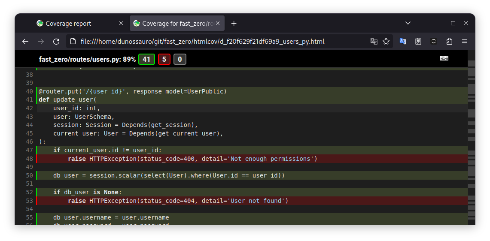

# Tornando o sistema de autenticação robusto

---
Objetivos da Aula:

- Testar os casos de autenticação de forma correta
- Implementar o refresh do token
- Introduzir testes que param o tempo com `freezegun`
- Introduzir geração de modelos automática com `factory-boy`

??? tip "Caso prefira ver a aula em vídeo"
	

[Aula :fontawesome-brands-youtube:](#){ .md-button }
[Slides :fontawesome-solid-file-powerpoint:](#){ .md-button }
[Código :fontawesome-solid-code:](https://github.com/dunossauro/fastapi-do-zero/tree/main/codigo_das_aulas/07/){ .md-button }

---

Na aula de hoje, vamos aprofundar nosso sistema de autenticação. Já vimos em aulas anteriores como criar um sistema de autenticação básico, mas há muitas áreas em que podemos torná-lo mais robusto. Por exemplo, como podemos lidar com situações em que as coisas dão errado? Como podemos garantir que nosso sistema seja seguro mesmo em cenários adversos? Essas são algumas das questões que vamos explorar hoje.

Vamos começar examinando mais de perto os testes para autenticação. Até agora, só testamos os casos que dão certo - ou seja, quando o usuário sempre existe. Mas é igualmente importante testar o que acontece quando as coisas dão errado. Afinal, não podemos simplesmente assumir que tudo sempre vai correr bem. Por isso, vamos aprender como testar esses casos negativos.

Em seguida, vamos implementar um recurso importante em qualquer sistema de autenticação: o refresh do token. Isso nos permite manter a sessão do usuário ativa, mesmo se o token original expirar.

## Testes para autenticação

Antes de mergulharmos nos testes, vamos falar um pouco sobre por que eles são tão importantes. Na programação, é fácil cair na armadilha de pensar que, se algo funciona na maioria das vezes, então está tudo bem. Mas a verdade é que é nos casos marginais que os bugs mais difíceis de encontrar e corrigir costumam se esconder.

Por exemplo, o que acontece se tentarmos autenticar um usuário que não existe? Ou se tentarmos autenticar com as credenciais erradas? Se não testarmos esses cenários, podemos acabar com um sistema que parece funcionar na superfície, mas que na verdade está cheio de falhas de segurança.

{: .center .shadow }

No código apresentado, se observarmos atentamente, vemos que o erro `HTTPException(status_code=400, detail='Not enough permissions')` em `users.py` na rota `/{user_id}` não está sendo coberto por nossos testes. Essa exceção é lançada quando um usuário não autenticado ou um usuário sem permissões adequadas tenta acessar ou alterar um recurso que não deveria.

Essa lacuna em nossos testes representa um risco potencial, pois não estamos verificando como nosso sistema se comporta quando alguém tenta, por exemplo, alterar os detalhes de um usuário sem ter permissões adequadas. Embora possamos assumir que nosso sistema se comportará corretamente, a falta de testes nos deixa sem uma confirmação concreta.

### Testando a alteração de um usuário não autorizado

Agora, vamos começar a escrever alguns testes para esses casos. Vamos começar com um cenário simples: o que acontece quando um usuário tenta alterar as informações de outro usuário?

Para testar isso, vamos criar um novo teste chamado test_update_user_with_wrong_user.

```python title="tests/test_users.py"
def test_update_user_with_wrong_user(client, user, token):
    response = client.put(
        f'/users/{user.id}',
        headers={'Authorization': f'Bearer {token}'},
        json={
            'username': 'bob',
            'email': 'bob@example.com',
            'password': 'mynewpassword',
        },
    )
    assert response.status_code == 400
	assert response.json() == {'detail': 'Not enough permissions'}
```
Este teste vai simular um usuário tentando alterar as informações de outro usuário. Se nosso sistema estiver funcionando corretamente, ele deverá rejeitar essa tentativa e retornar um erro.

#### Criando modelos por demanda com factory-boy

Embora o teste que escrevemos esteja tecnicamente correto, ele ainda não funcionará adequadamente porque, atualmente, só temos um usuário em nosso banco de dados de testes. Precisamos de uma maneira de criar múltiplos usuários de teste facilmente, e é aí que entra o `factory-boy`.

O `factory-boy` é uma biblioteca que nos permite criar objetos de modelo de teste de forma rápida e fácil. Com ele, podemos criar uma "fábrica" de usuários que produzirá novos objetos de usuário sempre que precisarmos. Isso nos permite criar múltiplos usuários de teste com facilidade, o que é perfeito para nosso cenário atual.

Para começar, precisamos instalar o `factory-boy` em nosso ambiente de desenvolvimento:

```shell title="$ Execução no terminal!"
poetry add --group dev factory-boy
```

Depois de instalar o `factory-boy`, podemos criar uma `UserFactory`. Esta fábrica será responsável por criar novos objetos de usuário sempre que precisarmos de um para nossos testes. A estrutura da fábrica será a seguinte:

```python title="tests/conftest.py"
import factory

# ...

class UserFactory(factory.Factory):
    class Meta:
        model = User

    id = factory.Sequence(lambda n: n)
    username = factory.LazyAttribute(lambda obj: f'test{obj.id}')
    email = factory.LazyAttribute(lambda obj: f'{obj.username}@test.com')
    password = factory.LazyAttribute(lambda obj: f'{obj.username}@example.com')
```

Explicando linha a linha, esse código faz o seguinte:

- `class UserFactory(factory.Factory):` Define uma fábrica para o modelo `User`, herdando de `factory.Factory`.
- `class Meta:` Uma classe interna `Meta` é usada para configurar a fábrica.
  - `model = User`: Define o modelo para o qual a fábrica está construindo instâncias. No caso, estamos referenciando a classe `User`, que deve ser um modelo de banco de dados, como o SQLAlchemy.
- `id = factory.Sequence(lambda n: n)`: Define um campo `id` que recebe uma sequência. A cada chamada da fábrica, o valor `n` é incrementado, então cada instância gerada terá um `id` único.
- `username = factory.LazyAttribute(lambda obj: f'test{obj.id}')`: Define o campo `username` usando um atributo preguiçoso, baseado no `id`.
- `email = factory.LazyAttribute(lambda obj: f'{obj.username}@test.com')`: Define o campo `email` gerado a partir do `username`.
- `password = factory.LazyAttribute(lambda obj: f'{obj.username}@example.com')`: Define o campo `password` similar ao campo `email`.

Essa fábrica pode ser usada em testes para criar instâncias de `User` com dados predefinidos, facilitando a escrita de testes que requerem a presença de usuários no banco de dados. Isso é extremamente útil ao escrever testes que requerem o estado pré-configurado do banco de dados e ajuda a tornar os testes mais legíveis e manuteníveis.

A seguir, podemos usar essa nova fábrica para criar múltiplos usuários de teste. Para fazer isso, modificamos nossa fixture de usuário existente para usar a UserFactory. Assim, sempre que executarmos nossos testes, teremos usuários diferentes disponíveis.

```python title="tests/conftest.py"
@pytest.fixture
def user(session):
    password = 'testtest'
    user = UserFactory(password=get_password_hash(password))

    session.add(user)
    session.commit()
    session.refresh(user)

    user.clean_password = 'testtest'

    return user


@pytest.fixture
def other_user(session):
    password = 'testtest'
    user = UserFactory(password=get_password_hash(password))

    session.add(user)
    session.commit()
    session.refresh(user)

    user.clean_password = 'testtest'

    return user
```

A criação de outra fixture chamada `other_user` é crucial para simular o cenário de um usuário tentando acessar ou modificar as informações de outro usuário no sistema. Ao criar duas fixtures diferentes, `user` e `other_user`, podemos efetivamente simular dois usuários diferentes em nossos testes. Isso nos permite avaliar como nosso sistema reage quando um usuário tenta realizar uma ação não autorizada, como alterar as informações de outro usuário.

Um aspecto interessante no uso das fábricas é que, sempre que forem chamadas, elas retornarão um novo `User`, pois estamos fixando apenas a senha. Dessa forma, cada chamada a essa fábrica de usuários retornará um `User` diferente, com base nos atributos "lazy" que usamos.

Com essa nova configuração, podemos finalmente testar o cenário de um usuário tentando alterar as informações de outro usuário. E como você pode ver, nossos testes passaram com sucesso, o que indica que nosso sistema está lidando corretamente com essa situação.

```python title="tests/test_users.py"
def test_update_user_with_wrong_user(client, other_user, token):
    response = client.put(
        f'/users/{other_user.id}',
        headers={'Authorization': f'Bearer {token}'},
        json={
            'username': 'bob',
            'email': 'bob@example.com',
            'password': 'mynewpassword',
        },
    )
    assert response.status_code == 400
    assert response.json() == {'detail': 'Not enough permissions'}
```

Neste caso, não estamos usando a fixture `user` porque queremos simular um cenário em que o usuário associado ao token (autenticado) está tentando realizar uma ação sobre outro usuário, representado pela fixture `other_user`. Ao usar a `other_user`, garantimos que o id do usuário que estamos tentando modificar ou deletar não seja o mesmo do usuário associado ao token, mas que ainda assim exista no banco de dados.

Para enfatizar, a fixture `user` está sendo usada para representar o usuário que está autenticado através do token. Se usássemos a mesma fixture `user` neste teste, o sistema consideraria que a ação está sendo realizada pelo próprio usuário, o que não corresponderia ao cenário que queremos testar. Além disso, é importante entender que o escopo das fixtures implica que, quando chamadas no mesmo teste, elas devem retornar o mesmo valor. Portanto, usar a `user` e `other_user` permite uma simulação mais precisa do comportamento desejado.


Com o teste implementado, vamos executá-lo para ver se nosso sistema está protegido contra essa ação indevida:

```shell title="$ Execução no terminal!"
task test

# ...

tests/test_app.py::test_root_deve_retornar_200_e_ola_mundo PASSED
tests/test_auth.py::test_get_token PASSED
tests/test_db.py::test_create_user PASSED
tests/test_users.py::test_create_user PASSED
tests/test_users.py::test_read_users PASSED
tests/test_users.py::test_read_users_with_users PASSED
tests/test_users.py::test_update_user PASSED
tests/test_users.py::test_update_user_with_wrong_user PASSED
tests/test_users.py::test_delete_user PASSED
```

Se todos os testes passaram com sucesso, isso indica que nosso sistema está se comportando como esperado, inclusive no caso de tentativas indevidas de deletar um usuário.


### Testando o DELETE com o usuário errado

Continuando nossos testes, agora vamos testar o que acontece quando tentamos deletar um usuário com um usuário errado.

Talvez você esteja se perguntando, por que precisamos fazer isso? Bem, lembre-se de que a segurança é uma parte crucial de qualquer sistema de autenticação. Precisamos garantir que um usuário não possa deletar a conta de outro usuário - apenas a própria conta. Portanto, é importante que testemos esse cenário para garantir que nosso sistema está seguro.

Aqui está o teste que vamos usar:

```python title="tests/test_users.py"
def test_delete_user_wrong_user(client, other_user, token):
    response = client.delete(
        f'/users/{other_user.id}',
        headers={'Authorization': f'Bearer {token}'},
    )
    assert response.status_code == 400
    assert response.json() == {'detail': 'Not enough permissions'}
```

Como você pode ver, esse teste tenta deletar o user de um id diferente usando o token do user. Se nosso sistema estiver funcionando corretamente, ele deverá rejeitar essa tentativa e retornar um status 400 com uma mensagem de erro indicando que o usuário não tem permissões suficientes para realizar essa ação.

Vamos executar esse teste agora e ver o que acontece:

```shell title="$ Execução no terminal!"
task test

# ...

tests/test_users.py::test_delete_user_wrong_user PASSED
```

Ótimo, nosso teste passou! Isso significa que nosso sistema está corretamente impedindo um usuário de deletar a conta de outro usuário.

Agora que terminamos de testar a autorização, vamos passar para o próximo desafio: testar tokens expirados. Lembre-se, em um sistema de autenticação robusto, um token deve expirar após um certo período de tempo por motivos de segurança. Portanto, é importante que testemos o que acontece quando tentamos usar um token expirado. Vamos ver isso na próxima seção.


## Testando a expiração do token

Continuando com nossos testes de autenticação, a próxima coisa que precisamos testar é a expiração do token. Tokens de autenticação são normalmente projetados para expirar após um certo período de tempo por motivos de segurança. Isso evita que alguém que tenha obtido um token possa usá-lo indefinidamente se ele for roubado ou perdido. Portanto, é importante que verifiquemos que nosso sistema esteja tratando corretamente a expiração dos tokens.

Para realizar esse teste, vamos usar uma biblioteca chamada `freezegun`. `freezegun` é uma biblioteca Python que nos permite controlar o tempo durante nossos testes, o que é perfeito para testar a expiração do token. {aqui você deve expandir esse tópico explicando um pouco mais sobre o freezegun}

Primeiro, vamos precisar instalar a biblioteca:

```shell
poetry add --group dev freezegun
```

Agora vamos criar nosso teste. Vamos começar pegando um token para um usuário, congelando o tempo, esperando pelo tempo de expiração do token e, em seguida, tentando usar o token para acessar um endpoint que requer autenticação.

```python title="tests/test_auth.py"
from freezegun import freeze_time

# ...

def test_token_expiry(client, user):
    with freeze_time('2023-07-14 12:00:00'):
        response = client.post(
            '/auth/token',
            data={'username': user.email, 'password': user.clean_password},
        )
        assert response.status_code == 200
        token = response.json()['access_token']

    with freeze_time('2023-07-14 13:00:00'):
        response = client.post(
            '/auth/refresh_token',
            headers={'Authorization': f'Bearer {token}'},
        )
        assert response.status_code == 401
        assert response.json() == {'detail': 'Could not validate credentials'}
```

Lembre-se de que configuramos nosso token para expirar após 30 minutos. Portanto, nós avançamos o tempo em 31 minutos para garantir que o token tenha expirado.

Agora, vamos executar nosso teste e ver o que acontece:

```shell title="$ Execução no terminal!"
task test

# ...

tests/test_users.py::test_token_expiry PASSED
```

Ótimo, nosso teste passou! Isso confirma que nosso sistema está lidando corretamente com a expiração dos tokens.

No entanto, ainda há uma coisa que precisamos implementar: a atualização de tokens. Atualmente, quando um token expira, o usuário teria que fazer login novamente para obter um novo token. Isso não é uma ótima experiência para o usuário. Em vez disso, gostaríamos de oferecer a possibilidade de o usuário atualizar seu token quando ele estiver prestes a expirar. Vamos ver como fazer isso na próxima seção.

## Testando o usuário não existente e senha incorreta

Na construção de qualquer sistema de autenticação, é crucial garantir que os casos de erro sejam tratados corretamente. Isso não só previne possíveis falhas de segurança, mas também permite fornecer feedback útil aos usuários.

Em nossa implementação atual, temos duas situações específicas que devem retornar um erro: quando um usuário inexistente tenta fazer login e quando uma senha incorreta é fornecida. Vamos abordar esses casos de erro em nossos próximos testes.

Embora possa parecer redundante testar esses casos já que ambos resultam no mesmo erro, é importante verificar que ambos os cenários estão corretamente tratados. Isso nos permitirá manter a robustez do nosso sistema conforme ele evolui e muda ao longo do tempo.

### Testando a exceção para um usuário inexistente

Para este cenário, precisamos enviar um request para o endpoint de token com um e-mail que não existe no banco de dados. A resposta esperada é um HTTP 400 com a mensagem de detalhe 'Incorrect email or password'.

```python title="tests/test_auth.py"
def test_token_inexistent_user(client):
    response = client.post(
        '/token',
        data={'username': 'no_user@no_domain.com', 'password': 'testtest'},
    )
    assert response.status_code == 400
    assert response.json() == {'detail': 'Incorrect email or password'}
```

### Testando a exceção para uma senha incorreta

Aqui, precisamos enviar um request para o endpoint de token com uma senha incorreta para um usuário existente. A resposta esperada é um HTTP 400 com a mensagem de detalhe 'Incorrect email or password'.

```python title="tests/test_auth.py"
def test_token_wrong_password(client, user):
    response = client.post(
        '/token', data={'username': user.email, 'password': 'wrong_password'}
    )
    assert response.status_code == 400
    assert response.json() == {'detail': 'Incorrect email or password'}
```

Com esses testes, garantimos que nossas exceções estão sendo lançadas corretamente. Essa é uma parte importante da construção de um sistema de autenticação robusto, pois nos permite ter confiança de que estamos tratando corretamente os casos de erro.


## Implementando o refresh do token

O processo de renovação de token é uma parte essencial na implementação de autenticação JWT. Em muitos sistemas, por razões de segurança, os tokens de acesso têm um tempo de vida relativamente curto. Isso significa que eles expiram após um determinado período de tempo, e quando isso acontece, o cliente precisa obter um novo token para continuar acessando os recursos do servidor. Aqui é onde o processo de renovação de token entra: permite que um cliente obtenha um novo token de acesso sem a necessidade de autenticação completa (por exemplo, sem ter que fornecer novamente o nome de usuário e senha).


Agora vamos implementar a função de renovação de token em nosso código.


```python title="fast_zero/routes/auth.py"
from fast_zero.security import (
    create_access_token,
    get_current_user,
    verify_password,
)

# ...

@router.post('/refresh_token', response_model=Token)
def refresh_access_token(
    user: User = Depends(get_current_user),
):
    new_access_token = create_access_token(data={'sub': user.email})

    return {'access_token': new_access_token, 'token_type': 'bearer'}
```

Vamos também implementar um teste para verificar se a função de renovação de token está funcionando corretamente.


```python title="tests/test_auth.py"
def test_refresh_token(client, user, token):
    response = client.post(
        '/refresh_token',
        headers={'Authorization': f'Bearer {token}'},
    )

    data = response.json()

    assert response.status_code == 200
    assert 'access_token' in data
    assert 'token_type' in data
    assert response.json()['token_type'] == 'bearer'
```


Ainda é importante garantir que nosso sistema trate corretamente os tokens expirados. Para isso, vamos adicionar um teste que verifica se um token expirado não pode ser usado para renovar um token.

```python title="tests/test_auth.py"
def test_token_expiry(client, user):
    with freeze_time('2023-07-14 12:00:00'):
        response = client.post(
            '/token',
            data={'username': user.email, 'password': user.clean_password},
        )
        assert response.status_code == 200
        token = response.json()['access_token']

    with freeze_time('2023-07-14 13:00:00'):
        response = client.post(
            '/refresh_token',
            headers={'Authorization': f'Bearer {token}'},
        )
        assert response.status_code == 401
        assert response.json() == {'detail': 'Could not validate credentials'}
```


Agora, se executarmos nossos testes, todos eles devem passar, incluindo os novos testes que acabamos de adicionar.

```shell title="$ Execução no terminal!"
task test

# ...

tests/test_app.py::test_root_deve_retornar_200_e_ola_mundo PASSED
tests/test_auth.py::test_get_token PASSED
tests/test_auth.py::test_token_inexistent_user PASSED
tests/test_auth.py::test_token_wrong_password PASSED
tests/test_auth.py::test_refresh_token PASSED
tests/test_auth.py::test_token_expiry PASSED
tests/test_db.py::test_create_user PASSED
tests/test_users.py::test_create_user PASSED
tests/test_users.py::test_read_users PASSED
tests/test_users.py::test_read_users_with_users PASSED
tests/test_users.py::test_update_user PASSED
tests/test_users.py::test_update_user_with_wrong_user PASSED
tests/test_users.py::test_delete_user PASSED
tests/test_users.py::test_delete_user_wrong_user PASSED
tests/test_users.py::test_token_expiry PASSED
```

Com esses testes, podemos ter certeza de que cobrimos alguns casos importantes relacionados à autenticação de usuários em nossa API.

## Commit

Agora, vamos fazer um commit com as alterações que fizemos.

```shell title="$ Execução no terminal!"
git add .
git commit -m "Implement refresh token and add relevant tests"
```


## Conclusão

Nesta aula, abordamos uma grande quantidade de tópicos cruciais para a construção de uma aplicação web segura e robusta. Começamos com a implementação da funcionalidade de renovação do token JWT, uma peça fundamental na arquitetura de autenticação baseada em token. Este processo garante que os usuários possam continuar acessando a aplicação, mesmo após o token inicial ter expirado, sem a necessidade de fornecer suas credenciais novamente.

Porém, a implementação do código foi apenas a primeira parte do que fizemos. Uma parte significativa da nossa aula foi dedicada a testar de maneira exaustiva a nossa aplicação. Escrevemos testes para verificar o comportamento básico das nossas rotas de autenticação, mas não paramos por aí. Também consideramos vários casos de borda que podem surgir durante a autenticação de um usuário.

Testamos, por exemplo, o que acontece quando se tenta obter um token com credenciais incorretas. Verificamos o comportamento da nossa aplicação quando um token expirado é utilizado. Esses testes nos ajudam a garantir que nossa aplicação se comporte de maneira adequada não apenas nas situações mais comuns, mas também quando algo sai do esperado.

Além disso, ao implementar esses testes, nós garantimos que futuras alterações no nosso código não irão quebrar funcionalidades já existentes. Testes automatizados são uma parte fundamental de qualquer aplicação de alta qualidade, e o que fizemos hoje vai além do básico, mostrando como lidar com cenários complexos e realistas.

A implementação e os testes que fizemos hoje nos levam um passo adiante no desenvolvimento da nossa aplicação, deixando-a mais próxima de estar pronta para um ambiente de produção.

Na próxima aula, vamos utilizar a infraestrutura de autenticação que criamos hoje para permitir que os usuários criem, leiam, atualizem e deletem suas próprias listas de tarefas. Isso vai nos permitir explorar ainda mais as funcionalidades do FastAPI e do SQLAlchemy, além de continuar a expandir a nossa suíte de testes. Esperamos ver você na próxima aula!
