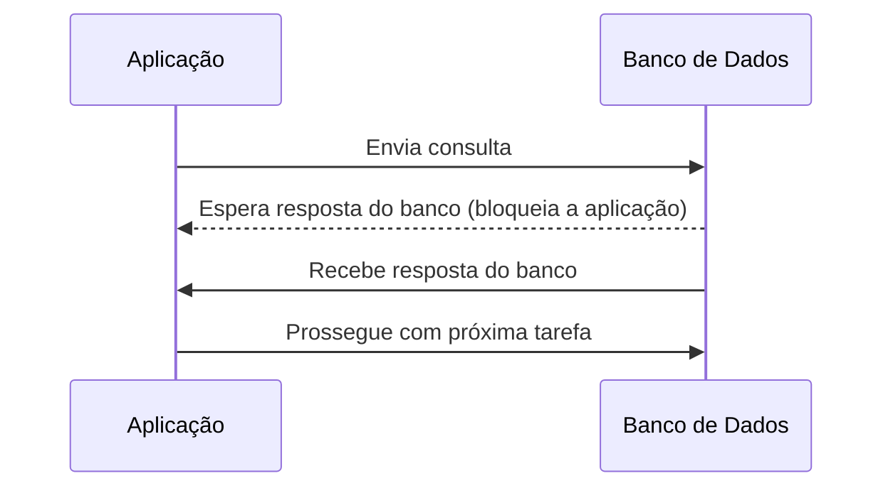
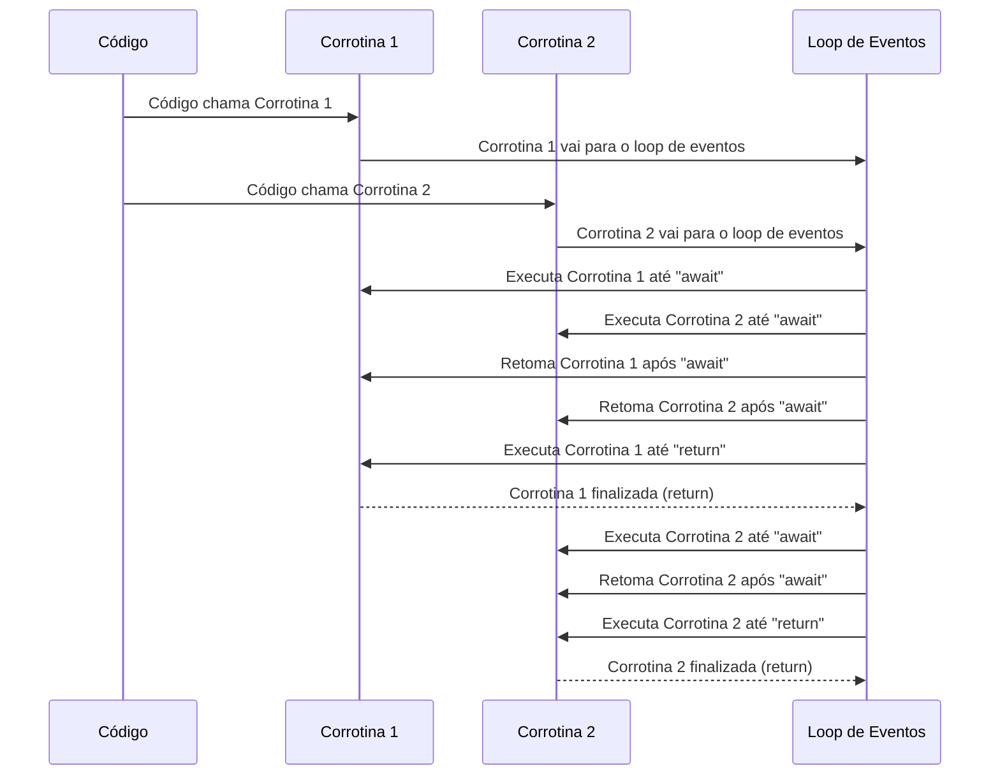
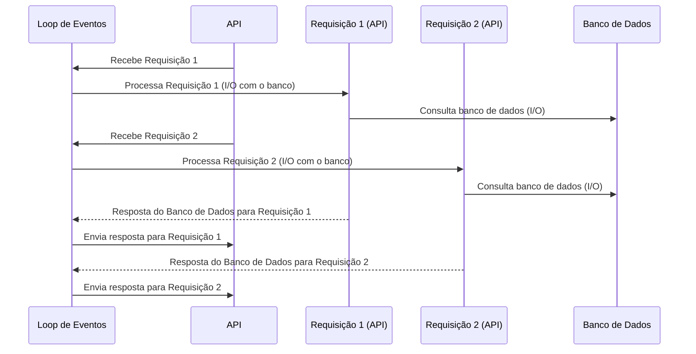
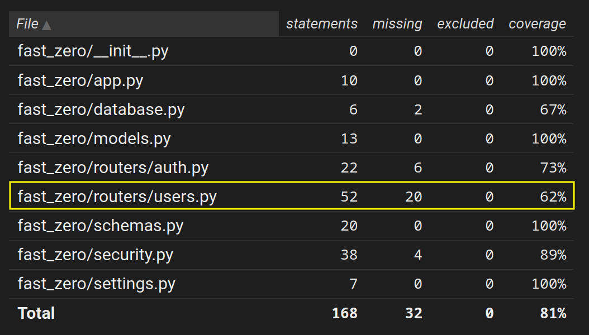
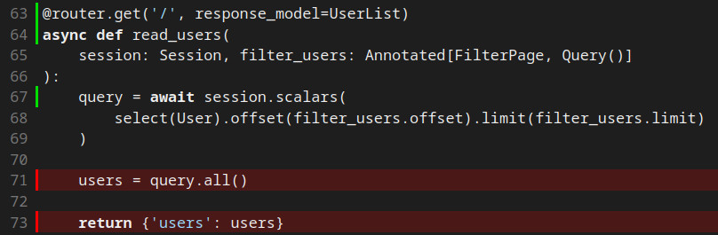
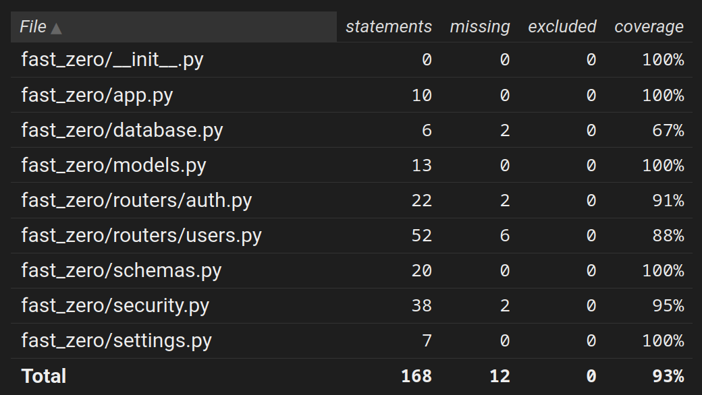

# Tornando o projeto assíncrono

Objetivos dessa aula:

- Introduzir os conceitos de programação assíncrona
- Refatorar nossa aplicação para suportar asyncio





---

Uma das características mais apreciadas do FastAPI é o suporte à programação assíncrona. Isso nos permite usar concorrência nos momentos de entrada e saída, fazendo com que, enquanto buscamos por um dado no banco de dados, por exemplo, o nosso aplicativo esteja disponível para receber e também responder novas requisições sem a necessidade de aguardar pela finalização do bloqueio.


## Uma pequena introdução ao asyncio

Um dos problemas mais comuns ao lidarmos com uma aplicação web é a necessidade de estarmos sempre disponíveis para responder a requisições enviadas pelos clientes. Quando recebemos uma requisição, normalmente precisamos processá-la: validar o schema, conectar ao banco de dados, realizar algumas operações e, finalmente, retornar o recurso solicitado.

Em um cenário síncrono, nosso cenário até o momento, enquanto processamos uma requisição, não conseguimos processar outra até que a primeira seja concluída. Esse fluxo de execução é chamado de [**bloqueante**](#bloqueio-de-io){:target="_blank"}, pois a aplicação fica "parada", aguardando a resposta de sistemas externos, como o banco de dados. Esse tempo de espera, conhecido como bloqueio por I/O (Input/Output) [Entrada/Saída], prejudica o desempenho, pois a aplicação não pode atender a novas requisições enquanto espera.

???+ example "Bloqueio de aplicação VS bloqueio do servidor"
    Quando dizemos que a aplicação está bloqueada, estamos nos referindo somente ao código explícito da aplicação. O servidor de aplicação, em nosso caso o [`uvicorn`](01.md#uvicorn){:target="_blank"}, já trabalha de forma não bloqueante. Ele cria uma fila de requisições e vai passando uma a uma à nossa aplicação conforme as respostas forem sendo retornadas.
	
	Além disso, ele pode inicializar diversas cópias da nossa aplicação (mesmo síncronas) em um formato de workers e executar diversos processos para nossa aplicação. Se quisermos inicializar o uvicorn nesse modo, a única alteração necessária seria adicionar a flag `--workers <int>`. Algo como:
	
	```shell title="$ Execução no terminal!" hl_lines="4 7 10"
	uvicorn fast_zero.app:app --workers 3
	INFO:     Uvicorn running on http://127.0.0.1:8000 (Press CTRL+C to quit)
	INFO:     Started parent process [96097]
	INFO:     Started server process [96100]
	INFO:     Waiting for application startup.
	INFO:     Application startup complete.
	INFO:     Started server process [96099]
	INFO:     Waiting for application startup.
	INFO:     Application startup complete.
	INFO:     Started server process [96101]
	INFO:     Waiting for application startup.
	INFO:     Application startup complete.
	```
	
	Fazendo com que nossa aplicação seja "clonada" em três processos e consequêntemente resolva três requisições por vez:
	```mermaid
	flowchart LR
	   Cliente --> Uvicorn
	   Uvicorn --> copia_01
	   Uvicorn --> copia_02
	   Uvicorn --> copia_03
	```

Uma forma de contornar esse comportamento é o uso de [corrotinas assíncronas](#corrotinas-assincronas){:target="_blank"}.

### Bloqueio de I/O

Quando o código precisa interagir com sistemas externos — como um banco de dados, a escrita de um arquivo no sistema operacional ou uma requisição web — ele fica "parado", aguardando a resposta para seguir com a execução. Esse comportamento de espera é chamado de bloqueio por I/O, e ocorre quando a aplicação não está realizando outra tarefa enquanto espera pela conclusão da operação externa.



Esse comportamento de bloqueio pode prejudicar a escalabilidade da aplicação. Em um cenário com várias requisições simultâneas, uma aplicação bloqueante pode ficar "presa" esperando a resposta de um sistema externo (como o banco de dados), o que impede que outras requisições sejam atendidas, resultando em uma perda de desempenho e capacidade de atendimento.

### Corrotinas assíncronas

Uma corrotina assíncrona é um tipo especial de "função" que pode ser suspensa em determinados pontos (normalmente quando há uma operação de bloqueio, como I/O) e retomar a execução mais tarde. Isso permite que a aplicação não fique "parada" enquanto espera por uma resposta, permitindo que o Python execute outras tarefas enquanto aguarda a conclusão da operação.

Em python, corrotinas são definidas com a palavra-chave `#!python async`, no início da função:

```python title="Código de exemplo"
async def corrotina():
    # Operações que podem ser suspensas
    ...
    return <algo>
```

Diferente de uma função tradicional, que realiza toda a execução de uma vez (até encontrar o `#!python return`), a corrotina pode ser [**escalonada**](#cooperatividade-e-escalonamento){:target="_blank"} usando a palavra-chave `#!python await`.

O `#!python await` é usado para chamar operações que podem levar algum tempo, pelo bloqueio de I/O. Isso permite que o Python "libere" o controle de volta para o [loop de eventos](#loop-de-eventos){:target="_blank"}, que pode executar outras tarefas enquanto aguarda a operação "espera" a resposta de O/O ser concluída:

```python title="Código de exemplo"
async def corrotina():
    await <chamada-no-banco-de-dados>
    await <chamada-para-api-externa>
    await <chamada-para-o-sistema-operacional>
    return <algo>
```

Sendo menos formal, dizemos que quando um `await` é encontrado, ele "cede a vez" para outra corrotina ser executada durante a espera de I/O.

O uso de `await` torna a execução [cooperativa](#cooperatividade-e-escalonamento){:target="_blank"}, pois a corrotina avisa ao loop que precisa "esperar por algo", fazendo com que outras tarefas sejam executadas durante a espera, tornando o fluxo não bloqueante.

??? example "Toda corrotina é assíncrona?"
    Embora quase todas às vezes que dizemos "corrotina", em python moderno, estamos nos referindo a código assíncrono, em teoria esse termo já era largamente utilizado antes. Para funções geradoras com a palavra `#!python yield`, que podem passar o controle a outro bloco de código e voltarem a ser executadas de onde pararam.

    Damos ao nome a esse tipo de corrotina de "corrotinas clássicas", vimos diversas delas aqui no curso quando criamos fixtures com `#!python yield`:

    ```python title="Pseudocódigo de exemplo"
    def exemplo_fixture():
        coloque_a_aplicação_no_estado_x()
		yield  # Aqui existe uma pausa na execução, mas não é assíncrona
	    retorne_a_aplicação_no_estado_y()
    ```

### Loop de eventos

O loop de eventos é o coração da programação assíncrona, sendo responsável por coordenar a execução das corrotinas. Em termos simples, o loop de eventos é um loop infinito que gerencia todas as corrotinas e garante que elas sejam executadas em ordem, permitindo o [escalonamento](#cooperatividade-e-escalonamento){:target="_blank"} de várias tarefas eficientemente e sem bloqueios.

Todas as [corrotinas](#corrotinas-assincronas){:target="_blank"} são enviadas para o loop de eventos, no momento em que são chamadas, para que ele as execute. Essas corrotinas são executadas sequencialmente, como uma função qualquer. No entanto, quando o loop encontra a palavra-chave `#!python await`, ele a "deixa de lado" temporariamente, até que a tarefa que estava sendo aguardada termine. O loop então retoma a execução da próxima corrotina, ou a que estiver pronta para ser executada, até encontrar outro `#!python await`.

Vamos visualizar isso:



Neste exemplo, o código chama duas corrotinas. O loop de eventos vai alternando entre elas, executando-as até encontrar o await, e então "pausa" a execução de uma e passa para a próxima, sem bloquear o andamento do programa. Isso permite que o código continue a processar outras tarefas enquanto espera por operações mais lentas (como I/O), otimizando a performance e a escalabilidade da aplicação.

### Cooperatividade e Escalonamento

Corrotinas são chamadas de cooperativas porque elas "cedem" voluntariamente o controle para outras corrotinas durante sua execução. Em vez de interromper o processo de outra corrotina de maneira forçada, cada corrotina permite que o controle seja transferido para outra, quando encontra um ponto de espera (como um await). Isso é uma característica importante da programação assíncrona, ao garantir que a execução das corrotinas seja feita de forma eficiente, sem bloqueios desnecessários.

O loop de eventos é o responsável por coordenar esse processo de "ceder a vez". Quando uma corrotina encontra um ponto de espera, como uma operação de I/O (por exemplo, uma consulta ao banco de dados ou uma chamada HTTP), ela "cede" o controle de volta para o loop de eventos. O loop de eventos, então, verifica se há outras corrotinas prontas para serem executadas e as executa até que o controle seja novamente cedido, geralmente quando outra corrotina encontra um await.

Esse processo de alternar entre corrotinas é chamado de escalonamento. O escalonamento não ocorre de forma aleatória; ele segue uma ordem que depende de quando as corrotinas encontram os pontos de espera e como o loop de eventos as organiza. Durante esse processo, o loop de eventos alterna entre as corrotinas, maximizando o uso de CPU e diminuindo o tempo de execução, sem que o programa sofra com bloqueios de I/O

### Exemplo prático com `asyncio`

Eu sei, eu sei... Esse contexto é complicado de entender no início, então vamos detalhar um exemplo simples usando asyncio para observar como a troca de corrotinas acontece e como o escalonamento é realizado.

Aqui está o código:

```python title="Exemplo de código do escalonamento" linenums="1"
from asyncio import gather, run, sleep


async def corrotina(n):
    print(f'Iniciando corrotina {n}')
    await sleep(1)
    print(f'Retomando corrotina {n}')
    await sleep(1)
    print(f'Retomando corrotina {n}')
    await sleep(1)
    print(f'Corrotina {n} finalizada')


async def main():
    await gather(corrotina(1), corrotina(2)) #(1)!


run(main()) #(2)!
```

1. `gather` é uma corrotina que inicia outras corrotinas. Neste exemplo, ela inicia as duas corrotinas de forma simultânea, enviando-as para o loop de eventos.
2. `asyncio.run` envia a corrotina `main` para o loop de eventos e aguarda a execução ser concluída de forma bloqueante.


Ao executar esse código, teríamos essa saída:

```shell title="$ Execução no terminal!"
python -i exemplo_asyncio.py
Iniciando corrotina 1
Iniciando corrotina 2
Retomando corrotina 1
Retomando corrotina 2
Retomando corrotina 1
Retomando corrotina 2
Corrotina 1 finalizada
Corrotina 2 finalizada
```

Mas como exatamente isso está ocorrendo?

1. **Início da execução:**
    - A função `run(main())` é chamada e inicia a execução da corrotina `main()`.
    - Dentro de `main()`, a função `gather()` chama as duas corrotinas, `corrotina(1)` e `corrotina(2)`. Ambas são enviadas para o **loop de eventos**.

2. **Primeiro `await sleep(1)` em ambas as corrotinas:**
    - Ambas as corrotinas chegam ao `await sleep(1)`. Nesse momento, o **loop de eventos** alterna entre elas, já que ambas estão esperando.

3. **Retomada após 1 segundo:**
    - O loop de eventos retoma a execução das corrotinas, uma de cada vez, e elas imprimem:
        - `Retomando corrotina 1`
        - `Retomando corrotina 2`

4. **Repete-se o processo:**
    - O ciclo se repete até que todas as operações de `sleep` sejam concluídas.

#### Conexão com a teoria

O que vemos aqui é a alternância de execução entre as corrotinas, feita pelo loop de eventos. Quando uma corrotina encontra um `await`, ela "cede" o controle ao loop de eventos, permitindo que outra corrotina seja executada enquanto a primeira aguarda uma operação (como I/O). Isso evita o bloqueio do sistema e melhora a escalabilidade e o desempenho da aplicação.

Com a combinação de `async/await` e o loop de eventos, podemos otimizar o processamento de múltiplas requisições simultâneas sem bloqueios, o que é uma das maiores vantagens da programação assíncrona.


## SQLAlchemy e bloqueios

Tradicionalmente, a comunicação entre uma aplicação e um banco de dados segue um modelo bloqueante, onde a aplicação aguarda a conclusão da operação de entrada/saída (I/O) antes de continuar a execução de outras tarefas. Esse modelo pode ser problemático em sistemas com alto tráfego ou que necessitam de respostas rápidas, pois as operações de I/O, como consultas ou inserções em bancos de dados, são relativamente lentas em comparação com a velocidade de execução do código da aplicação.

### SQLAlchemy não bloqueante

O modelo não bloqueante, ou assíncrono, visa resolver os problemas de desempenho causados pelas operações bloqueantes, permitindo que a aplicação continue executando outras tarefas enquanto aguarda a resposta de I/O — por exemplo, uma consulta ao banco de dados. Esse comportamento é possível através do uso de corrotinas e do agendamento de tarefas, uma técnica que suspende e retoma funções eficientemente.

A principal diferença entre o modelo bloqueante e o assíncrono é que, no modelo não bloqueante, a aplicação não "fica parada" esperando pela resposta do banco. Em vez disso, a aplicação inicia uma operação de I/O e, enquanto espera pela conclusão, pode realizar outras tarefas simultaneamente. Quando a resposta do banco chega, a aplicação retoma a execução da operação que estava aguardando.



Esse modelo é especialmente útil em sistemas com alta concorrência, onde múltiplas operações precisam ser realizadas simultaneamente. A programação assíncrona permite que a aplicação não precise esperar que cada consulta ao banco seja concluída antes de iniciar outra tarefa, melhorando significativamente o desempenho e a escalabilidade.

### Configuração para o SQLAlchemy assíncrono

Embora o SQLAlchemy suporte programação assíncrona na instalação padrão, algumas arquiteturas [não instalam a biblioteca `greenlet` por padrão](https://docs.sqlalchemy.org/en/20/orm/extensions/asyncio.html#asyncio-platform-installation-notes-including-apple-m1){:target="_blank"} (como em macs com chip M1). A `greenlet` é responsável por criar as corrotinas cooperativas no SQLAlchemy, permitindo que o código assíncrono seja executado de forma eficiente. Para garantir que o SQLAlchemy funcione corretamente em todas as arquiteturas de forma assíncrona, é necessário instalar o pacote adequado:

```bash title="$ Execução no terminal!"
poetry add "sqlalchemy[asyncio]"
```

Nunca chamaremos a `greenlet` diretamente, o SQLAlchemy a utiliza de forma transparente. No entanto, é importante garantir que ela esteja instalada, especialmente quando se trabalha com ambientes assíncronos.

#### SQLite assíncrono

Além disso, como estamos utilizando o banco de dados SQLite, que não possui suporte nativo a asyncio no Python, precisamos instalar uma extensão chamada `aiosqlite`. Ela permite a execução assíncrona com bancos SQLite:

```bash title="$ Execução no terminal!"
poetry add aiosqlite
```

Para que nossa conexão esteja ciente que o `aiosqlite` está sendo usado, devemos alterar a variável de ambiente para contemplar essa alteração:

```bash title=".env"
DATABASE_URL="sqlite{+++aiosqlite++}:///database.db"
```

Embora isso pareça o suficiente, nossa `Sessão` do banco de dados ainda não está preparada para lidar com uma conexão assíncrona. Isso quer dizer que precisamos alterar como ela é criada e deixar explícito que agora vamos fazer uma conexão assíncrona:

```python title="fast_zero/database.py" hl_lines="9"
from sqlalchemy.ext.asyncio import AsyncSession, create_async_engine

from fast_zero.settings import Settings

engine = create_async_engine(Settings().DATABASE_URL)#(1)!


async def get_session():
    async with AsyncSession(engine, expire_on_commit=False) as session: #(2)!
        yield session
```

1. `create_async_engine` cria a engine de conexão assíncrona com o banco de dados 
2. `AsyncSession` gerencia a sessão de banco de dados de forma assíncrona.

As alterações feitas aqui somente dizem que a nossa engine agora deve ser criada de maneira assíncrona e que a sessão do ORM também será assíncrona.

Uma mudança importante `expire_on_commit=False`, estamos dizendo ao SQLAlchemy para não expirar os objetos carregados após um commit, o que é importante no contexto assíncrono. O comportamento padrão do SQLAlchemy é expirar o cache de objetos após um commit, o que pode causar problemas em operações assíncronas, pois o objeto pode ser descartado enquanto estamos aguardando em outra corrotina. Por isso, usamos `expire_on_commit=False` para evitar esse tipo de comportamento.

??? note "mais informações sobre a expiração"
	Você pode encontrar mais explicações sobre a necessidade de não expiração do commit [nesta página da documentação](https://docs.sqlalchemy.org/en/20/orm/extensions/asyncio.html#preventing-implicit-io-when-using-asyncsession){:target="_blank"}

Agora, todo I/O que acontece no banco pode ser assíncrono, isso em potencial. Mas precisamos adequar nosso código para que o escalonamento entre tarefas possa ser feito.


### Ajustando a sessão de testes

Embora o SQLAlchemy e o FastAPI lidem de forma nativa com programação assíncrona, o `pytest` ainda não. Para isso, precisamos instalar uma extensão que adicione esse suporte. A `pytest-asyncio` fornece um mecanismo de marcação para testes e também um para criação de fixtures assíncronas:

```bash title="$ Execução no terminal!"
poetry add --group dev pytest-asyncio
```

Uma exigência formal do `pytest-asyncio` é que seja configurado o escopo padrão das fixtures:

```toml title="pyproject.toml" hl_lines="4"
[tool.pytest.ini_options]
pythonpath = "."
addopts = '-p no:warnings'
asyncio_default_fixture_loop_scope = 'function'
```

> Para evitar cair em mais um assunto, esse tópico será tratado na aula 11 em [Fixtures de sessao](11.md#fixtures-de-sessao){:target="_blank"}.

---

Desta forma, podemos alterar nossa fixture de `session` para fornecer uma sessão assíncrona:

```python title="tests/conftest.py" hl_lines="3 4 8 9 11 15 16"
# ...

import pytest_asyncio
from sqlalchemy.ext.asyncio import AsyncSession, create_async_engine

# ...

@pytest_asyncio.fixture #(1)!
async def session():
    engine = create_async_engine(
        'sqlite+aiosqlite:///:memory:',
        connect_args={'check_same_thread': False},
        poolclass=StaticPool,
    )
    async with engine.begin() as conn: #(2)!
        await conn.run_sync(table_registry.metadata.create_all) #(3)!

    async with AsyncSession(engine, expire_on_commit=False) as session:
        yield session

    async with engine.begin() as conn:
        await conn.run_sync(table_registry.metadata.drop_all)
```

1. `@pytest_asyncio.fixture` serve para marcar a função como uma fixture assíncrona que o pytest pode usar. Com essa anotação, o pytest-asyncio pode gerenciar fixtures que fazem operações assíncronas, como interagir com o banco de dados. Quando utilizamos o pytest_asyncio.fixture, o pytest sabe que a função é assíncrona e precisa ser aguardada (await). Essa fixture pode ser usada como uma dependência dentro dos testes, facilitando a configuração do ambiente de testes de forma eficiente.
2. O método begin() do engine é usado para iniciar uma transação no banco de dados. O engine cria uma conexão assíncrona e, ao usar begin(), estamos dizendo ao SQLAlchemy para iniciar uma transação dentro do contexto de execução assíncrona. Ele é necessário para que possamos executar operações no banco de dados de forma eficiente e transacional.
3. O run_sync é uma forma de rodar código síncrono dentro de um ambiente assíncrono. No caso do SQLAlchemy, ele é usado para executar operações que não são assíncronas (como a criação de tabelas) enquanto ainda estamos dentro do loop de eventos assíncrono.

Para que a fixture seja declarada como assíncrona, precisamos importá-la do `pytest_asyncio` e fazer a declaração com `@pytest_asyncio.fixture`. Também devemos alterar a engine para o formato async.

Uma alteração substancial no código é a forma em que criamos nossas tabelas usando os metadados:

```python title="Pedaço do bloco anterior"
async with engine.begin() as conn:
    await conn.run_sync(table_registry.metadata.create_all)
```

Aqui, `engine.begin()` inicia uma transação assíncrona com o banco de dados. Dentro dessa transação, usamos o run_sync para executar a criação das tabelas, uma operação síncrona por natureza. Esse processo assegura que a criação das tabelas ocorra de forma não bloqueante, permitindo que o loop de eventos continue a processar outras tarefas assíncronas enquanto essa operação é realizada.

Em resumo, o uso de `run_sync` em uma operação assíncrona é uma estratégia importante para integrar operações tradicionais síncronas com a arquitetura assíncrona do Python, garantindo que a performance e escalabilidade do sistema sejam preservadas.

### Ajustando o teste do banco de dados

Agora que temos as fixtures preparadas para serem executadas no contexto assíncrono, podemos iniciar nossa jornada em direção aos testes, performando operações assíncronas.

Vamos iniciar fazendo com que o nosso teste inicial do banco de dados seja não bloqueante:

```python title="testes/test_db.py" hl_lines="3 9 10 16 18"
from dataclasses import asdict

import pytest
from sqlalchemy import select

from fast_zero.models import User


@pytest.mark.asyncio #(1)!
async def test_create_user(session, mock_db_time):
    with mock_db_time(model=User) as time:
        new_user = User(
            username='alice', password='secret', email='teste@test'
        )
        session.add(new_user)
        await session.commit() #(2)!

    user = await session.scalar(select(User).where(User.username == 'alice')) #(3)!

    assert asdict(user) == {
        'id': 1,
        'username': 'alice',
        'password': 'secret',
        'email': 'teste@test',
        'created_at': time,
    }
```

1. Essa marcação, diz ao pytest que esse teste contém código assíncrono
2. Como `.commit` faz uma chamada ao banco de dados é categorizada como I/O. Logo, essa chamada pode escalonar o async, então usamos `await`
3. Outra chamada que depende de I/O, a chamada no banco espera a consulta ser concluída, logo, também usamos `await`.

Testes também podem ser corrotinas assíncronas, porém o pytest não os executa em um loop de eventos. Para isso ser feito, temos que indicar que um determinado teste é assíncrono. Para isso, usamos a marcação `@pytest.mark.asyncio`.

Com isso feito, podemos adicionar `#!python await` em todas as chamadas diretas ao banco de dados que apresentam bloqueios, como:

- `session.commit()`: Que persiste os dados que estão na sessão, fazendo uma chamada ao banco de dados.
- `session.scalar()`: Que pede uma busca de dados ao banco e aguarda o seu resultado.


Isso deve ser o suficiente para o teste ser executado com sucesso:

```shell title="$ Execução no terminal!"
task test tests/test_db.py

# ...
tests/test_db.py::test_create_user PASSED
```

Agora que temos certeza de que o banco e as fixtures estão funcionando. Podemos passar à refatoração do projeto de fato.

## Técnica de refatoração usando testes

Uma das grandes vantagens de termos uma boa cobertura de testes é que podemos fazer mudanças estruturais no projeto e garantir que tudo funcione da forma como já estava antes. Os testes nos trazem uma **segurança** para que tudo possa mudar internamente sem alterar os resultados da API. Para isso, a estratégia que vamos usar aqui é a de caminhar executando um teste por vez.

Uma das funcionalidades legais do `pytest` é poder executar somente um único teste, ou um grupo deles, usando o nome do teste como base. Para isso, podemos chamar `task test` passando a flag `-k` seguida do nome do teste. Algo como:

```shell title="$ Execução no terminal!"
task test -k test_create_user

# ...
tests/test_users.py::test_create_user FAILED
```

Para cada teste que falhar, vamos nos organizando para fazer a conversão do código para assíncrono.


Para listar todos os testes presentes no nosso projeto, podemos usar a flag `--collect-only` do pytest:

```shell title="$ Execução no terminal!"
task test --collect-only
```

Que nos retornará algo parecido com isso:

```shell title="Saída do --colect-pnly"
<Dir fast_zero>
  <Package tests>
    <Module test_app.py>
      <Function test_root_deve_retornar_ok_e_ola_mundo>
    <Module test_auth.py>
      <Function test_get_token>
    <Module test_db.py>
      <Coroutine test_create_user>
    <Module test_security.py>
      <Function test_jwt>
      <Function test_jwt_invalid_token>
    <Module test_users.py>
      <Function test_create_user>
      <Function test_read_users>
      <Function test_read_users_with_users>
      <Function test_update_user>
      <Function test_update_integrity_error>
      <Function test_delete_user>
```

Onde `Module` é o nome do arquivo com os testes e `Function` é o nome da função de testes. Note que o teste do banco de dados que já alteramos para teste a fixture de session tem outro nome `Coroutine`, pois já está no estado assíncrono.


## Endpoints não bloqueantes

Para que os endpoints não sejam bloqueantes, a primeira coisa a se fazer é adicionar a palavra reservada `#!python async` no início de todos eles.

### Router `auth`

Acredito que começar pelo router `auth` pode ser menos assustador, já que até o momento ele tem somente um endpoint (`login_for_access_token`) e um teste (`test_get_token`).


Vamos iniciar executando o teste e coletando o que está acontecendo de errado:

```shell title="$ Execução no terminal!"
task test -k test_get_token
# ...
FAILED tests/test_auth.py::test_get_token - AttributeError: 'coroutine' object has no attribute 'password'
```

Esse erro é interessante, pois o que ele notifica é que um objeto corrotina não tem o atributo password. Precisamos analisar o código para entender em qual o objeto está buscando password:

```py title="fast_zero/routers/auth.py" hl_lines="3 7"
@router.post('/token', response_model=Token)
def login_for_access_token(form_data: OAuth2Form, session: Session):
    user = session.scalar(select(User).where(User.email == form_data.username))
	
	# ...
	
	if not verify_password(form_data.password, user.password):
	# ...
```

Nesse bloco de código, podemos ver que existe uma chamada de banco de dados em `session.scalar`. Devemos lembrar que todas essas chamadas, com a transformação da sessão em assíncrona, precisam ter sua resposta aguardada pelo loop de eventos, logo ele deve ter `#!python await`. E para podermos usar `#!python await` a função deve ser uma corrotina definida com a palavra `#!python async`:


```python title="fast_zero/routers/auth.py" hl_lines="2 3"
@router.post('/token', response_model=Token)
async def login_for_access_token(form_data: OAuth2Form, session: Session):
    user = await session.scalar(
        select(User).where(User.email == form_data.username)
    )
	
	# ...
```

Essa simples alteração já deve ser o suficiente para o código passar no teste:

```python title="$ Execução no terminal!"
task test -k test_get_token

# ...

tests/test_auth.py::test_get_token /home/dunossauro/07/tests/conftest.py:75: RuntimeWarning: coroutine 'AsyncSession.commit' was never awaited
  session.commit()
RuntimeWarning: Enable tracemalloc to get the object allocation traceback
/home/dunossauro/07/tests/conftest.py:76: RuntimeWarning: coroutine 'AsyncSession.refresh' was never awaited
  session.refresh(user)
RuntimeWarning: Enable tracemalloc to get the object allocation traceback
PASSED
```

De fato, o teste obteve `PASSED`, porém ao usar a fixture `user` no teste:

```py title="tests/test_auth.py" hl_lines="1"
def test_get_token(client, user):
    # ...
```

E ela não estar preparada para ser assíncrona, obtivemos `RuntimeWarning: coroutine 'AsyncSession.commit' was never awaited`. Dizendo que a instrução de `commit`, nunca foi aguardada. Podemos corrigir isso:

```py title="tests/confitest.py" linenums="1" hl_lines="1 2 10 11"
@pytest_asyncio.fixture #(1)!
async def user(session):
    password = 'testtest'
    user = User(
        username='Teste',
        email='teste@test.com',
        password=get_password_hash(password),
    )
    session.add(user)
    await session.commit()
    await session.refresh(user)

    user.clean_password = password

    return user
```

1. Também recebe a fixture de `pytest_asyncio`.

Como temos duas interações de I/O com o banco nesse fixture `.commit` e `.refresh`, devemos aguardar as duas.

Desta forma, devemos ter um teste passando com sucesso e sem avisos:

```shell title="$ Execução no terminal!"
task test -k test_get_token
# ...
tests/test_auth.py::test_get_token PASSED
```

Embora o comportamento do código esteja correto e sem nenhum problema aparente. Precisamos corrigir o tipo usado para injeção de depenências que não é mais `Session`, mas `AsyncSession`:

```py title="fast_zero/routers/auth.py" linenums="1" hl_lines="3 7"
# ...
from sqlalchemy import select
from sqlalchemy.ext.asyncio import AsyncSession
# ...

OAuth2Form = Annotated[OAuth2PasswordRequestForm, Depends()]
Session = Annotated[AsyncSession, Depends(get_session)]
```

Desta forma dizemos ao FastAPI que `get_session` retorna uma `AsyncSession`.

### Router `users`

Seguindo para o router de `users`, sabemos que aqui teremos um pouco mais de trabalho. Pois temos muitos testes e também diversos endpoits.

### O cabeçalho

Mas, antes de tudo, já que acabamos de fazer isso, vamos começar pelo cabeçalho do arquivo. Ajustando a tipagem:

```python title="fast_zero/routers/users.py"
# ...
from sqlalchemy.ext.asyncio import AsyncSession

# ...

Session = Annotated[AsyncSession, Depends(get_session)]

# ...
```

#### Endpoint de POST

Vamos começar pelo teste `test_create_user`:

```shell title="$ Execução no terminal!"
task test -k test_create_user
# ...
FAILED tests/test_users.py::test_create_user - AttributeError: 'coroutine' object has no attribute 'username'
```

Temos o mesmo problema das corrotinas. Então vamos adicionar `async` e `await` no nosso endpoint:

```python title="fast_zero/routers/users.py"
@router.post('/', status_code=HTTPStatus.CREATED, response_model=UserPublic)
async def create_user(user: UserSchema, session: Session):
    db_user = await session.scalar(
        select(User).where(
            (User.username == user.username) | (User.email == user.email)
        )
    )
	# ...
	session.add(db_user)
    await session.commit()
    await session.refresh(db_user)

    return db_user
```

Dessa forma, já podemos executar os testes com sucesso:

```shell title="$ Execução no terminal!"
task test -k test_create_user
# ...
tests/test_users.py::test_create_user PASSED
```

#### Endpoint de GET

Para o endpoint de get, temos dois testes, chegou a hora de aprender mais um truque da flag `-k` do pytest. Usando um pedaço do nome do teste, podemos selecionar todos que têm parte desse nome. Algo como:

```shell title="$ Execução no terminal!"
task test -k test_read
```

Deve ser capaz de executar os testes `test_read_users` e também `test_read_users_with_users`.

Não temos, no entanto, um resultado favorável:

```title="resposta de task test -k test_read"
FAILED tests/test_users.py::test_read_users - AttributeError: 'coroutine' object has no attribute 'all'
```

Embora esse erro seja quase que idêntico ao que obtivemos até agora, por falta de `await`. A forma como o código está escrita depende de um fator um pouco diferente de refatoração. Vamos olhar o estado atual do código com atenção:

```python title="fast_zero/routers/users.py" hl_lines="5"
@router.get('/', response_model=UserList)
def read_users(session: Session, filter_users: Annotated[FilterPage, Query()]):
    users = session.scalars(
        select(User).offset(filter_users.offset).limit(filter_users.limit)
    ).all()
```

Usamos o resultado de `session.scalars` e concatenamos o método `.all()`. A transformação dessa chamada em assíncrona demandará a separação do `scalars` do método `all`. Desta forma:


```python title="fast_zero/routers/users.py" hl_lines="5 8"
@router.get('/', response_model=UserList)
async def read_users(
    session: Session, filter_users: Annotated[FilterPage, Query()]
):
    query = await session.scalars(
        select(User).offset(filter_users.offset).limit(filter_users.limit)
    )
    users = query.all()

    return {'users': users}
```

Pois precisamos obter o resultado de `await` antes de chamar o método `.all()`.

Dessa forma, temos os dois testes envolvendo GET passando:

```shell title="$ Execução no terminal!"
task test -k test_read
# ...
tests/test_users.py::test_read_users PASSED
tests/test_users.py::test_read_users_with_users PASSED
```


#### Endpoint de PUT

Também temos mais de um teste envolvendo o PUT e ambos têm o mesmo prefixo, dessa forma podemos executar os dois em conjunto:

```shell title="$ Execução no terminal!"
task test -k test_update
# ...
FAILED tests/test_users.py::test_update_user - AttributeError: 'coroutine' object has no attribute 'id'
```

"Para surpresa de zero pessoas", temos os problemas de corrotinas que vamos arrumar agora, mas, se **olharmos com atenção**, o erro ainda não está no endpoint:

```python title="parte da mensagem de erro" hl_lines="8"
    @router.put('/{user_id}', response_model=UserPublic)
    async def update_user(
        user_id: int,
        user: UserSchema,
        session: Session,
        current_user: CurrentUser,
    ):
>       if current_user.id != user_id:
E       AttributeError: 'coroutine' object has no attribute 'id'
```

Ele vem de `current_user`, que chama a função `get_current_user` em `fast_zero/security.py`.

##### Ajustando security.py

No momento em que checamos os tokens para validar quem é o usuário corrente existem chamadas para o banco de dados também:

```python title="fast_zero/security.py" hl_lines="2 6"
def get_current_user(
    session: Session = Depends(get_session),
    token: str = Depends(oauth2_scheme),
):
    # ...
	user = session.scalar(select(User).where(User.email == subject_email))
	# ...
```

Aqui temos o problema da `Session` não ser tipada como `AsyncSession` e de não existir `await` para a busca no banco de dados. Podemos resolver dessa forma:

```python title="fast_zero/security.py"
# ...
from sqlalchemy.ext.asyncio import AsyncSession
# ...

async def get_current_user(
    session: AsyncSession = Depends(get_session),
    token: str = Depends(oauth2_scheme),
):
    # ...
    user = await session.scalar(
        select(User).where(User.email == subject_email)
    )
	# ...
```

Agora podemos voltar aos testes

```python title="$ Execução no terminal!"
task test -k test_update
# ...
tests/test_users.py::test_update_user /home/dunossauro/07/fast_zero/routers/users.py:91: RuntimeWarning: coroutine 'AsyncSession.commit' was never awaited
  session.commit()
RuntimeWarning: Enable tracemalloc to get the object allocation traceback
/home/dunossauro/07/fast_zero/routers/users.py:92: RuntimeWarning: coroutine 'AsyncSession.refresh' was never awaited
  session.refresh(current_user)
RuntimeWarning: Enable tracemalloc to get the object allocation traceback
PASSED
```

Embora `test_update_user` passe, ele levanta os warnings de corrotinas que nunca foram aguardadas. Então, voltemos ao PUT.

##### De volta ao PUT

Como já é de se imaginar, a correção é transformar nosso endpoint em `async` e adicionar `await` nas chamadas do SQLAlchemy:

```python title="fast_zero/routers/users.py"
@router.put('/{user_id}', response_model=UserPublic)
async def update_user(
    user_id: int,
    user: UserSchema,
    session: Session,
    current_user: CurrentUser,
):
    # ...
    try:
        current_user.username = user.username
        current_user.password = get_password_hash(user.password)
        current_user.email = user.email
        await session.commit()
        await session.refresh(current_user)

        return current_user
    # ...
```

Desta forma temos os testes passando de volta:

```shell title="$ Execução no terminal!"
task test -k test_update
# ...

tests/test_users.py::test_update_user PASSED
tests/test_users.py::test_update_integrity_error PASSED
```

#### Endpoint de delete

Como agora só temos o `delete` para arrumar, vamos fazer invertido, ajustas as chamadas e depois rodar os testes:

```python title="fast_zero/routers/users.py"
@router.delete('/{user_id}', response_model=Message)
async def delete_user(
    user_id: int,
    session: Session,
    current_user: CurrentUser,
):
    # ...
    await session.delete(current_user)
    await session.commit()
```

Executando o teste para ver se tudo ocorre bem:

```shell title="$ Execução no terminal!"
task test -k test_delete
# ...
tests/test_users.py::test_delete_user PASSED
```

---

Pra finalizar, gostaria de executar todos os testes. Para garantir que todo o projeto está funcionando como deveria de maneira assíncrona:

```shell title="$ Execução no terminal!"
task test
# ...
tests/test_app.py::test_root_deve_retornar_ok_e_ola_mundo PASSED
tests/test_auth.py::test_get_token PASSED
tests/test_db.py::test_create_user PASSED
tests/test_security.py::test_jwt PASSED
tests/test_security.py::test_jwt_invalid_token PASSED
tests/test_users.py::test_create_user PASSED
tests/test_users.py::test_read_users PASSED
tests/test_users.py::test_read_users_with_users PASSED
tests/test_users.py::test_update_user PASSED
tests/test_users.py::test_update_integrity_error PASSED
tests/test_users.py::test_delete_user PASSED
```

Com isso temos todos os endpoints funcionando de forma correta e assíncrona!

## Cobertura de testes assíncrona

Como o fluxo de execução deixa de ser linear, algumas coisas costumam aparecer não cobertas, mesmo quando executadas. Se você prestou atenção durante a execução dos testes, parece que temos coisas substancialmente erradas:

{: .center .shadow }

Um exemplo disso é o [endpoint GET](#endpoint-de-get){:target="_blank"}, devidamente testado, mas ao olhar a cobertura:

{: .center .shadow }

Todo o código executado após o `#!python await` é mostrado como não coberto, pois no momento do escalonamento o coverage não estava configurado para lidar concorrência.

A solução para isso é dizer ao coverage que nosso código usa determinado tipo de concorrência. Como, por exemplo:

```toml title="pyproject.toml"
[tool.coverage.run]
concurrency = ["thread", "{++greenlet++}"]
```

Precisamos ativar a concorrência no coverage em dois casos, para threads (conversamos sobre isso [na aula 05](05.md#threads-e-conexoes){:target="_blank"}) e para o [greenlet](#configuracao-para-o-sqlalchemy-assincrono){:target="_blank"} adicionado pela conexão assíncrona do SQLAlchemy.

Com essa pequena alteração, podemos executar os testes novamente e olhar a cobertura:

```shell title="$ Execução no terminal!"
task test
# ...
```

Assim, voltamos aos 93% que tínamos antes desta aula:

{: .center .shadow }

## Migrações assíncronas

As migrações com alembic em teoria devem ser sempre síncronas. Afinal, você não gostaria que ele fizesse escalonamento na hora de aplicar as migrações e aplicasse um pedaço de cada em pedaços diferentes de migrações de arquivos diferentes.

Mas, o problema surge quando temos uma URL de conexão assíncrona. Ao tentar aplicar as migrações, teremos um erro como esse:

```python title="$ Execução no terminal!"
alembic upgrade head
# ...
sqlalchemy.exc.MissingGreenlet: greenlet_spawn has not been called; can't call await_only() here. Was IO attempted in an unexpected place? (Background on this error at: https://sqlalche.me/e/20/xd2s)
```

Isso acontece, pois agora estamos usando uma forma assíncrona do sqlite, quando [adicionamos](#sqlite-assincrono){:target="_blank"} "+aiosqlite" na variável de ambiente `DATABASE_URL`.

Por conta desses dois motivos, agora precisamos fazer com que as migrações sejam executadas de forma síncrona, contudo a engine deve ser assíncrona:

```python title="fast_zero/migration/env.py" hl_lines="1 8-29" linenums="1"
import asyncio

from logging.config import fileConfig

from sqlalchemy.ext.asyncio import async_engine_from_config #(1)!
from sqlalchemy import pool

def do_run_migrations(connection): #(2)!
    context.configure(connection=connection, target_metadata=target_metadata)

    with context.begin_transaction():
        context.run_migrations()


async def run_async_migrations(): #(3)!
    connectable = async_engine_from_config(
        config.get_section(config.config_ini_section),
        prefix="sqlalchemy.",
        poolclass=pool.NullPool,
    )

    async with connectable.connect() as connection:
        await connection.run_sync(do_run_migrations)

    await connectable.dispose()


def run_migrations_online(): #(4)!
    asyncio.run(run_async_migrations())


if context.is_offline_mode():
    # ...
```

1. Essa linha será alterada. A linha com `engine_from_config` será deletada e será substituída por `async_engine_from_config`.
2. Essa função será criada, ela não existia na migração. Essa Função será usada para criar a migração. Como o conector do sqlalchemy suporta executar somente funções de forma síncrona, separamos a efetividade da migração na função `do_run_migrations`.
3. Essa função será criada, ela não existia na migração. Função que efetivamente cria a engine de forma assíncrona e executa a migração de forma síncrona chamando `do_run_migrations`.
4. Essa função será **alterada**. Como o alembic por padrão não executa operações async, precisamos fazer com que ela chame o `asyncio.run`.

A função principal `run_migrations_online` é executada pelo alembic, então ela não pode ser alterada para uma corrotina. Então motamos `run_async_migrations` para criar a conexão assíncrona e executar no modo síncrono as migrações carregadas por `do_run_migrations`.

Com isso, as migrações devem ser executadas em erros:

```shell title="$ Execução no terminal!"
alembic upgrade head
INFO  [alembic.runtime.migration] Context impl SQLiteImpl.
INFO  [alembic.runtime.migration] Will assume non-transactional DDL.
```

Desta forma, continuamos executando as migrações de forma síncrona, mas com uma engine de conexão assíncrono.

## Commit

Para finalizar, criaremos um commit para registrar todas as alterações que fizemos na nossa aplicação. Como essa é uma grande mudança que envolve reestruturar como lidamos com as rotas e mover as constantes para variáveis de ambiente, podemos usar uma mensagem de commit descritiva que explique todas as principais alterações:

```shell title="$ Execução no terminal!"
git add .
git commit -m "Refatorando estrutura do projeto: Suporte a asyncio, tornando o projeto não bloqueante"
```

## Suplementar / Para próxima aula

Na próxima aula, vamos adicionar randomização em testes para facilitar a criação dos dados de teste. Caso não conheça o Faker ou Factory-boy, pode ser uma boa para entender melhor a próxima aula:

- [Randomização de dados em testes unitários com Faker e Factory-boy | Live de Python #281](https://youtu.be/q_P-2h5L1cE){:target="_blank"}


## Exercícios

1. Reveja os endpoints criados por você em exercícios anteriores e adicione `#!python async` e `#!python await` para que eles se tornem não bloqueantes também.
2. Altere o endpoint `read_root` para suportar `asyncio`.


## Conclusão

Nesta aula passamos por uma grande refatoração no sistema ao fazer com que todo o nosso projeto possa ser executado de forma não bloqueante. Essas alterações aproveitam melhor os recursos computacionais e também aumentam a disponibilidade em responder novas requisições enquanto outras estão sendo processadas.

Embora a adição do `asyncio` no projeto pareça complicada no início, os benefícios dessa migração acabam se pagando em custo da disponibilidade na web. Atendendo mais requisições com os mesmos recursos.
