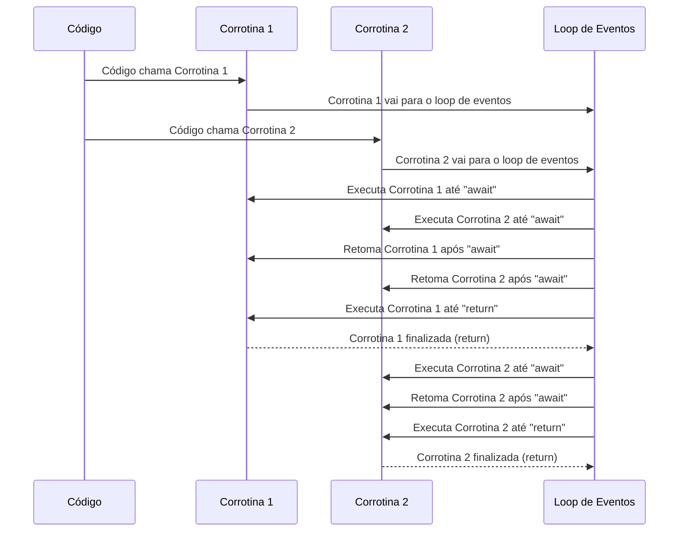
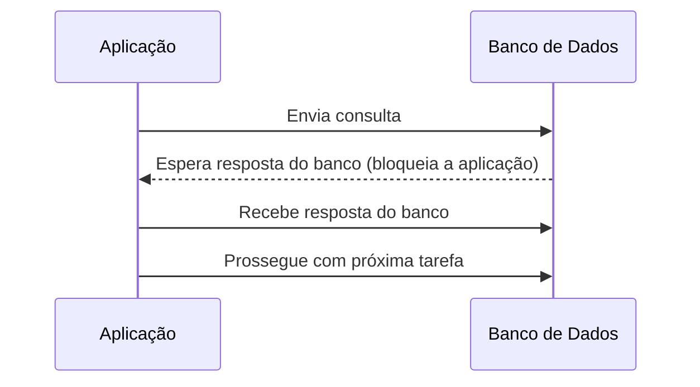
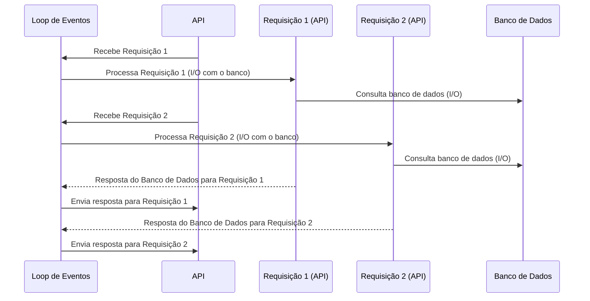

# [WIP] Tornando o projeto assíncrono

Objetivos dessa aula:

- Introduzir os conceitos de programação assíncrona
- Refatorar nossa aplicação para suportar asyncio





---

Uma das características mais apreciadas do FastAPI é o suporte a programação assíncrona. Isso nos permite usar concorrência nos momentos de entrada e saída, fazendo com que enquanto buscamos por um dado no banco dedados, por exemplo, o nosso aplicativo esteja disponível para receber e também responder novas requisições.


## [WIP] Uma pequena introdução ao asyncio

> TODO: Ainda vou escrever isso...

### Uma tarefa bloqueante

Sempre que existe uma chamada no código que precisa receber ou enviar um dado ao um sistema externo, como o banco de dados, escrever um arquivo no sistema operacional, fazer uma requisição web. O nosso código fica "parado" esperando que o sistema externo nos responda, para a partir daí, executar a próxima instrução do código. Quando nosso código "pausa" a execução dele está bloqueada por I/O. A aplicação não está fazendo nada além de aguardar a resposta.

Isso prejudica o funcionamento da aplicação, de forma que ao "pausar" não podemos responder a mais de uma requisição por vez em nossa aplicação. Quando um cliente nos envia um request, nada mais está sendo feito além de aguardar que a operação seja concluída, para assim iniciarmos uma nova requisição.

Uma das formas de fugir desse comportamento "bloqueante" é a partir do uso de corrotinas.

### O que são corrotinas

Uma **corrotina** é uma função especial no Python, que pode ser pausada e retomada durante sua execução, sem bloquear o restante do programa. Ao contrário de uma função normal, que executa todo o seu código até retornar um valor, uma corrotina pode ser suspensa em determinados pontos e retomar a execução mais tarde.

Em Python, corrotinas são definidas com a palavra-chave `#!python async`, no início da função:

```python title="Código de exemplo"
async def corrotina():
    # Operações que podem ser suspensas
    ...
    return <algo>
```

Diferente de uma função tradicional, que realiza toda a execução de uma vez, a corrotina pode ser **pausada** usando a palavra-chave `#!python await`. O `#!python await` é usado para chamar operações que podem levar algum tempo, pelo bloqueio de I/O. Isso permite que o Python "libere" o controle de volta para o [loop de eventos](#o-que-e-o-loop-de-eventos){:target="_blank"} que pode executar outras tarefas enquanto aguarda a operação de bloqueio ser concluída:

```python title="Código de exemplo"
async def corrotina():
    await <chamada-no-banco-de-dados>
    await <chamada-para-api-externa>
    await <chamada-para-o-sistema-operacinal>
	return <algo>
```


> TODO: Ainda vou escrever isso...


### O que é o Loop de Eventos?

O loop de eventos é o coração da programação assíncrona, sendo responsável por coordenar a execução das corrotinas. Em termos simples, o loop de eventos é um ciclo contínuo que gerencia todas as corrotinas e garante que elas sejam executadas na ordem apropriada, permitindo a execução de várias tarefas de forma eficiente e sem bloqueios.

Todas as [corrotinas](#o-que-sao-corrotinas){:target="_blank"} são enviadas para o loop de eventos, no momento em que são chamadas, para que ele as execute. Essas corrotinas são executadas de forma sequencial, como uma função qualquer. No entanto, quando o loop encontra a palavra-chave `#!python await`, ele a "deixa de lado" temporariamente, até que a tarefa que estava sendo aguardada termine. O loop então retoma a execução da próxima corrotina, ou a que estiver pronta para ser executada, até encontrar outro `#!python await`.

Isso permite que as corrotinas sejam executadas de forma [escalonada](#cooperatividade-e-escalonamento){:target="_blank"}, ou seja, o loop de eventos alterna entre as tarefas enquanto aguarda as operações assíncronas (como requisições ao banco de dados ou APIs) serem completadas.

Veja como isso funciona:



Neste exemplo, o código chama duas corrotinas. O loop de eventos vai alternando entre elas, executando-as até encontrar o await, e então "pausa" a execução de uma e passa para a próxima, sem bloquear o andamento do programa. Isso permite que o código continue a processar outras tarefas enquanto espera por operações mais lentas (como I/O), otimizando a performance e a escalabilidade da aplicação.

### Cooperatividade e Escalonamento

A essa troca de execução de corrotinas pela palavra `#!python await` damos o nome de **cooperação**. Toda vez que existe um bloqueio de I/O a operação é realizada usando `#!python await`. Dizendo ao loop de eventos que ela precisa aguardar por algo externo ao sistema, como uma chamada ao banco de dados, por exemplo.

Nesse momento, o loop de eventos sabe que pode executar outra corrotina, a troca entre uma corrotina e outra, damos o nome de **escalonamento**.

### Exemplo do `asyncio` puro
Esse contexto é bastante complicado de entender no início, então gostaria de fazer um código bem simples usando `asyncio` puro. Somente forçando esperas (sleep) de 1 segundo e escalonando as corrotinas:
```python title="Exemplo de código do escalonamento" linenums="1"
from asyncio import gather, run, sleep


async def corrotina(n):
    print(f'Iniciando corrotina {n}')
    await sleep(1)
    print(f'Retomando corrotina {n}')
    await sleep(1)
    print(f'Retomando corrotina {n}')
    await sleep(1)
    print(f'Corrotina {n} finalizada')


async def main():
    await gather(corrotina(1), corrotina(2)) #(1)!


run(main()) #(2)!
```

1. `gather` é uma corrotina que inicia outras corrotinas. Nesse exemplo ela inicia as duas corrotinas de forma conjunta. As enviando para o loop de eventos.
2. `asyncio.run` envia uma corrotina para o loop de eventos, nesse caso main, e espera de forma bloqueante até que o resultado da corrotina chamada seja efetuado.


O resultado desse código:
```shell title="$ Execução no terminal!"
python -i exemplo_asyncio.py
Iniciando corrotina 1
Iniciando corrotina 2
Retomando corrotina 1
Retomando corrotina 2
Retomando corrotina 1
Retomando corrotina 2
Corrotina 1 finalizada
Corrotina 2 finalizada
```

Embora não tenhamos que interagir com o `asyncio` diretamente durante a execução do FastAPI, somente adicionar os `#!python async`s e `#!python await`s. Espero que esse exemplo te ajude a elucidar melhor o que está acontecendo por trás da execução do FastAPI.


## [WIP] SQLAlchemy e bloqueios

Tradicionalmente, a comunicação entre uma aplicação e um banco de dados segue um modelo **bloqueante**, onde a aplicação aguarda a conclusão da operação de entrada/saída (I/O) antes de prosseguir com a execução de outras tarefas. Esse modelo pode ser problemático, especialmente em sistemas com alto tráfego ou que necessitam de respostas rápidas, pois as operações de I/O — como consultas ou inserções em bancos de dados — são relativamente lentas em comparação com a velocidade de execução do código da aplicação.



O modelo não bloqueante, assíncrono, visa solucionar os problemas de desempenho associados às operações bloqueantes, permitindo que a aplicação continue executando outras tarefas enquanto aguarda a resposta de I/O, como uma consulta ao banco de dados. Isso é possível devido ao uso de corrotinas e ao agendamento de tarefas, uma técnica que permite suspender e retomar funções de maneira eficiente.

A principal diferença está no fato de que a aplicação não "fica parada" esperando a resposta do banco. Em vez disso, ela pode iniciar uma operação de I/O e, enquanto espera pela conclusão dessa operação, pode realizar outras tarefas simultaneamente. Quando a resposta do banco chega, a aplicação retoma a execução da operação que estava aguardando.



Esse modelo é particularmente útil em sistemas de alta concorrência, onde muitas operações precisam ser feitas ao mesmo tempo. Com a programação assíncrona, a aplicação não precisa esperar que cada consulta ao banco seja concluída antes de iniciar outra tarefa, o que melhora consideravelmente o desempenho e a escalabilidade.


Embora o SQLAlchemy suporte programação assíncrona na instalação padrão, algumas arquiteturas [não instalam a `greenlet` por padrão](https://docs.sqlalchemy.org/en/20/orm/extensions/asyncio.html#asyncio-platform-installation-notes-including-apple-m1){:target="_blank"}. A `greenlet` é responsável por criar as corrotinas cooperativas no SQLAlchemy, permitindo que o código assíncrono seja executado de forma eficiente. Para garantir que o SQLAlchemy funcione corretamente em todas as arquiteturas de forma assíncrona, é necessário instalar o pacote adequado:

```bash title="$ Execução no terminal!"
pip install "sqlalchemy[asyncio]"
```

Nunca chamaremos a `greenlet` diretamente, o SQLAlchemy faz uso dela de baixo dos panos, mas é importante garantir que ele esteja instalado. Mas, para garantir que estejamos na mesma página, é interessante termos o mesmo ambiente.

Outro ponto que devemos nos precaver é que o sqlite, banco que usamos até o momento, não suporta asyncio na implementação nativa do python. Para isso, temos instalar uma extensão chamada `aiosqlite`. Isso vai nos dar a opção de manusear o banco de dados em um único arquivo, de forma assíncrona:

```bash title="$ Execução no terminal!"
poetry add aiosqlite
```

Para que nossa conexão esteja ciente que o `aiosqlite` está sendo usado, devemos alterar a variável de ambiente para contemplar essa alteração:

```bash title=".env"
DATABASE_URL="sqlite+aiosqlite:///database.db"
```

Embora isso pareça o suficiente, nossa `Sessão` do banco de dados ainda não está preparada para lidar com uma conexão assíncrona. Isso quer dizer que precisamos alterar a forma como ela é criada e deixar explícito que agora vamos fazer uma conexão assíncrona:

```python title="fast_zero/database.py"
from sqlalchemy.ext.asyncio import AsyncSession, create_async_engine

from fast_zero.settings import Settings

engine = create_async_engine(Settings().DATABASE_URL)#(1)!


async def get_session():
    async with AsyncSession(engine, expire_on_commit=False) as session: #(2)!
        yield session
```

1. > TODO: Escrever a nota sobre async engine
2. > TODO: Escrever a nota sobre async session

> TODO: Escrever sobre o código

??? note "Expiração do commit"
    > TODO: Escrever essa nota
	https://docs.sqlalchemy.org/en/20/orm/extensions/asyncio.html#preventing-implicit-io-when-using-asyncsession


Agora todo I/O que acontece no banco pode ser assíncrono, isso em potencial. Mas precisamos adequar nosso código para que o escalonamento entre tarefas possa ser feito.


#### Ajustando a sessão de testes

Embora o SQLAlchemy e o FastAPI lidem de forma nativa com programação assíncrona, o `pytest` ainda não. Para isso precisamos instalar uma extensão que adicione esse suporte. A `pytest-asyncio`:

```bash title="$ Execução no terminal!"
poetry add --group dev pytest-asyncio
```

Essa extensão vai adicionar duas coisas importantes ao pytest, a oportunidade de criar fixtures assíncronas e testes assíncronos.

Uma exigência formal do `pytest-asyncio` é que seja configurado e escopo padrão das fixtures:

```toml title="pyproject.toml" hl_lines="4"
[tool.pytest.ini_options]
pythonpath = "."
addopts = '-p no:warnings'
asyncio_default_fixture_loop_scope = 'function'
```

> Para evitar cair em mais um assunto, esse tópico é tratado em [Fixtures de sessao, na aula 11](/11/#fixtures-de-sessao)

---

Vamos ajustar a nossa fixture de `session` para utilizar asyncio:

```python title="tests/conftest.py" hl_lines="3 4 8 9 11 15 16 18"
# ...

import pytest_asyncio
from sqlalchemy.ext.asyncio import AsyncSession, create_async_engine

# ...

@pytest_asyncio.fixture#(1)!
async def session():
    engine = create_async_engine(
        'sqlite+aiosqlite:///:memory:',
        connect_args={'check_same_thread': False},
        poolclass=StaticPool,
    )
    async with engine.begin() as conn:#(2)!
        await conn.run_sync(table_registry.metadata.create_all)#(3)!

    async with AsyncSession(engine, expire_on_commit=False) as session:
        yield session

    async with engine.begin() as conn:
        await conn.run_sync(table_registry.metadata.drop_all)
```

1. > TODO: Nota sobre `@pytest_asyncio.fixture`
2. > TODO: Nota sobre `engine.begin()`
3. > Nota sobre `run.sync`

> TODO: Escrever sobre o código, explicar o `run_sync`

### Ajustando o teste do banco de dados

> TODO: Introduzir esse tópico

```python title="testes/test_db.py" hl_lines="3 9 10 16 18"
from dataclasses import asdict

import pytest
from sqlalchemy import select

from fast_zero.models import User


@pytest.mark.asyncio #(1)!
async def test_create_user(session, mock_db_time):
    with mock_db_time(model=User) as time:
        new_user = User(
            username='alice', password='secret', email='teste@test'
        )
        session.add(new_user)
        await session.commit() #(2)!

    user = await session.scalar(select(User).where(User.username == 'alice')) #(3)!

    assert asdict(user) == {
        'id': 1,
        'username': 'alice',
        'password': 'secret',
        'email': 'teste@test',
        'created_at': time,
    }
```

1. Essa marcação, diz ao pytest que esse teste contém código assíncrono
2. Como `.commit` faz uma chamada ao banco de dados é categorizada como I/O. Logo, essa chamada pode escalonar o async, então usamos `await`
3. Outra chamada que depende de I/O, a chamada no banco espera a consulta ser concluída, logo, também usamos `await`.

> TODO: Explicação sobre a alteração do código. Sobre os awaits e sobre o `@pytest.mark.asyncio`.

Executando o teste:

```shell title="$ Execução no terminal!"
task test tests/test_db.py

# ...
tests/test_db.py::test_create_user PASSED
```

## Técnica de refatoração usando testes

A estratégia que vamos usar aqui é a de andar um teste por vez. Uma das funcionalidades legais do pytest é poder executar somente um único teste. Para isso podemos chamar `task test` passando a flag `-k` seguida do nome do teste. Algo como:

```shell title="$ Execução no terminal!"
task test -k test_create_user

# ...
tests/test_users.py::test_create_user FAILED
```

Para cada teste que falhar, vamos nos organizando para fazer sua conversão para assíncrono.


Para listar os testes presentes na nossa coleção, podemos usar uma flag do pytest chamada `--collect-only`:

```shell title="$ Execução no terminal!"
task test --collect-only
```

Que nos retornará algo parecido com isso:

```shell title="Saída do --colect-pnly"
<Dir fast_zero>
  <Package tests>
    <Module test_app.py>
      <Function test_root_deve_retornar_ok_e_ola_mundo>
    <Module test_auth.py>
      <Function test_get_token>
    <Module test_db.py>
      <Coroutine test_create_user>
    <Module test_security.py>
      <Function test_jwt>
      <Function test_jwt_invalid_token>
    <Module test_users.py>
      <Function test_create_user>
      <Function test_read_users>
      <Function test_read_users_with_users>
      <Function test_update_user>
      <Function test_update_integrity_error>
      <Function test_delete_user>
```

Onde `Module` é o nome do arquivo com os testes e `Function` é o nome da função de testes. Note que o teste do banco de dados que já alteramos para teste a fixture de session tem outro nome `Coroutine`, pois já está no estado assíncrono.


## Endpoints não bloqueantes

Para que os endpoints não sejam bloqueantes, a primeira coisa a se fazer é adicionar a palavra reservada `#!python async` no inicio de todos eles.

### Router `auth`

Acredito que começar pelo router `auth` pode ser menos assustador, já que até o momento ele tem somente um endpoint (`login_for_access_token`) e um teste (`test_get_token`).


Vamos iniciar executando o teste e coletando o que está acontecendo de errado:

```shell title="$ Execução no terminal!"
task test -k test_get_token
# ...
FAILED tests/test_auth.py::test_get_token - AttributeError: 'coroutine' object has no attribute 'password'
```

Esse erro é interessante, pois o que ele notifica é que um objeto corrotina não tem o atributo password. Precisamos analisar o código para entender de fato de qual objeto ele está buscando password:

```py title="fast_zero/routers/auth.py" hl_lines="3 7"
@router.post('/token', response_model=Token)
def login_for_access_token(form_data: OAuth2Form, session: Session):
    user = session.scalar(select(User).where(User.email == form_data.username))
	
	# ...
	
	if not verify_password(form_data.password, user.password):
	# ...
```

Nesse bloco de código, podemos ver que existe uma chamada de banco de dados em `session.scalar`. Devemos lembrar que todas essas chamadas, com a transformação da sessão em assíncrona, precisam tem sua resposta aguardada pelo loop de eventos, logo ele deve ter `#!python await`. E para que possamos usar `#!python await` a função deve ser uma corrotina definida com a palavra `#!python async`:


```python title="fast_zero/routers/auth.py" hl_lines="2 3"
@router.post('/token', response_model=Token)
async def login_for_access_token(form_data: OAuth2Form, session: Session):
    user = await session.scalar(
        select(User).where(User.email == form_data.username)
    )
	
	# ...
```

Essa simples alteração já deve ser o suficiente para o código passar no teste:

```python title="$ Execução no terminal!"
task test -k test_get_token

# ...

tests/test_auth.py::test_get_token /home/dunossauro/07/tests/conftest.py:75: RuntimeWarning: coroutine 'AsyncSession.commit' was never awaited
  session.commit()
RuntimeWarning: Enable tracemalloc to get the object allocation traceback
/home/dunossauro/07/tests/conftest.py:76: RuntimeWarning: coroutine 'AsyncSession.refresh' was never awaited
  session.refresh(user)
RuntimeWarning: Enable tracemalloc to get the object allocation traceback
PASSED
```

De fato, o teste obteve `PASSED`, porém ao usar a fixture `user` no teste:

```py title="tests/test_auth.py" hl_lines="1"
def test_get_token(client, user):
    # ...
```

E ela não estar preparada para ser assíncrona, obtivemos `RuntimeWarning: coroutine 'AsyncSession.commit' was never awaited`. Dizendo que a instrução de `commit`, nunca foi aguardada. Podemos corrigir isso:

```py title="tests/confitest.py" linenums="1" hl_lines="1 2 10 11"
@pytest_asyncio.fixture #(1)!
async def user(session):
    password = 'testtest'
    user = User(
        username='Teste',
        email='teste@test.com',
        password=get_password_hash(password),
    )
    session.add(user)
    await session.commit()
    await session.refresh(user)

    user.clean_password = password

    return user
```

1. Também recebe a fixture de `pytest_asyncio`.

Como temos duas interações de I/O com o banco nesse fixture `.commit` e `.refresh`, devemos aguardar as duas.

Desta forma, devemos ter um teste passando com sucesso e sem avisos:

```shell title="$ Execução no terminal!"
task test -k test_get_token
# ...
tests/test_auth.py::test_get_token PASSED
```

Embora o comportamento do código esteja correto e sem nenhum problema aparente. Precisamos corrigir o tipo usado para injeção de depenências que não é mais `Session`, mas `AsyncSession`:

```py title="fast_zero/routers/auth.py" linenums="1" hl_lines="3 7"
# ...
from sqlalchemy import select
from sqlalchemy.ext.asyncio import AsyncSession
# ...

OAuth2Form = Annotated[OAuth2PasswordRequestForm, Depends()]
Session = Annotated[AsyncSession, Depends(get_session)]
```

Desta forma dizemos ao FastAPI que `get_session` retorna uma `AsyncSession`.

### Router `users`

Seguindo para o router de `users`, sabemos que aqui teremos um pouco mais de trabalho. Pois temos muitos testes e também diversos endpoits.

### O cabeçalho

Mas, antes de tudo, já que acabamos de fazer isso, vamos começar pelo cabeçalho do arquivo. Ajustando a tipagem:

```python title="fast_zero/routers/users.py"
# ...
from sqlalchemy.ext.asyncio import AsyncSession

# ...

Session = Annotated[AsyncSession, Depends(get_session)]

# ...
```

#### Endpoint de POST

Vamos começar pelo teste `test_create_user`:

```shell title="$ Execução no terminal!"
task test -k test_create_user
# ...
FAILED tests/test_users.py::test_create_user - AttributeError: 'coroutine' object has no attribute 'username'
```

Temos o mesmo problema das corrotinas. Então vamos adicionar `async` e `await` no nosso endpoint:

```python title="fast_zero/routers/users.py"
@router.post('/', status_code=HTTPStatus.CREATED, response_model=UserPublic)
async def create_user(user: UserSchema, session: Session):
    db_user = await session.scalar(
        select(User).where(
            (User.username == user.username) | (User.email == user.email)
        )
    )
	# ...
	session.add(db_user)
    await session.commit()
    await session.refresh(db_user)

    return db_user
```

Dessa forma, já podemos executar os testes com sucesso:

```shell title="$ Execução no terminal!"
task test -k test_create_user
# ...
tests/test_users.py::test_create_user PASSED
```

#### Endpoint de GET

Para o endpoint de get, temos dois testes, chegou a hora de aprender mais um truque da flag `-k` do pytest. Usando um pedaço do nome do teste, podemos selecionar todos que têm parte desse nome. Algo como:

```shell title="$ Execução no terminal!"
task test -k test_read
```

Deve ser capaz de executar os testes `test_read_users` e também `test_read_users_with_users`.

Não temos, no entanto, um resultado favorável:

```title="resposta de task test -k test_read"
FAILED tests/test_users.py::test_read_users - AttributeError: 'coroutine' object has no attribute 'all'
```

Embora esse erro seja quase que idêntico ao que obtivemos até agora, por falta de `await`. A forma como o código está escrita depende de um fator um pouco diferente de refatoração. Vamos olhar o estado atual do código com atenção:

```python title="fast_zero/routers/users.py" hl_lines="5"
@router.get('/', response_model=UserList)
def read_users(session: Session, filter_users: Annotated[FilterPage, Query()]):
    users = session.scalars(
        select(User).offset(filter_users.offset).limit(filter_users.limit)
    ).all()
```

Usamos o resultado de `session.scalars` e concatenamos o método `.all()`. A transformação dessa chamada em assíncrona demandará a separação do `scalars` do método `all`. Desta forma:


```python title="fast_zero/routers/users.py" hl_lines="5 8"
@router.get('/', response_model=UserList)
async def read_users(
    session: Session, filter_users: Annotated[FilterPage, Query()]
):
    query = await session.scalars(
        select(User).offset(filter_users.offset).limit(filter_users.limit)
    )
    users = query.all()

    return {'users': users}
```

Pois precisamos obter o resultado de `await` antes de chamar o método `.all()`.

Dessa forma, temos os dois testes envolvendo GET passando:

```shell title="$ Execução no terminal!"
task test -k test_read
# ...
tests/test_users.py::test_read_users PASSED
tests/test_users.py::test_read_users_with_users PASSED
```


#### Endpoint de PUT

Também temos mais de um teste envolvendo o PUT e ambos tem o mesmo prefixo, dessa forma podemos executar os dois em conjunto:

```shell title="$ Execução no terminal!"
task test -k test_update
# ...
FAILED tests/test_users.py::test_update_user - AttributeError: 'coroutine' object has no attribute 'id'
```

Pra surpresa de zero pessoas, temos os problemas de corrotinas que vamos arrumar agora, mas, se **olharmos com atenção**, o erro ainda não está no endpoint:

```python title="parte da mensagem de erro" hl_lines="8"
    @router.put('/{user_id}', response_model=UserPublic)
    async def update_user(
        user_id: int,
        user: UserSchema,
        session: Session,
        current_user: CurrentUser,
    ):
>       if current_user.id != user_id:
E       AttributeError: 'coroutine' object has no attribute 'id'
```

Ele vem de `current_user`, que chama a função `get_current_user` em `fast_zero/secutiry.py`.

##### Ajustando secutiry.py

No momento em que checamos os tokens para validar quem é o usuário corrente existem chamadas para o banco de dados também:

```python title="fast_zero/secutiry.py" hl_lines="2 6"
def get_current_user(
    session: Session = Depends(get_session),
    token: str = Depends(oauth2_scheme),
):
    # ...
	user = session.scalar(select(User).where(User.email == subject_email))
	# ...
```

Aqui temos o problema da `Session` não ser tipada como `AsyncSession` e de não existir `await` para a busca no banco de dados. Podemos resolver dessa forma:

```python title="fast_zero/secutiry.py"
# ...
from sqlalchemy.ext.asyncio import AsyncSession
# ...

async def get_current_user(
    session: AsyncSession = Depends(get_session),
    token: str = Depends(oauth2_scheme),
):
    # ...
    user = await session.scalar(
        select(User).where(User.email == subject_email)
    )
	# ...
```

Agora podemos voltar aos testes

```python title="$ Execução no terminal!"
task test -k test_update
# ...
tests/test_users.py::test_update_user /home/dunossauro/07/fast_zero/routers/users.py:91: RuntimeWarning: coroutine 'AsyncSession.commit' was never awaited
  session.commit()
RuntimeWarning: Enable tracemalloc to get the object allocation traceback
/home/dunossauro/07/fast_zero/routers/users.py:92: RuntimeWarning: coroutine 'AsyncSession.refresh' was never awaited
  session.refresh(current_user)
RuntimeWarning: Enable tracemalloc to get the object allocation traceback
PASSED
```

Embora `test_update_user` passe, ele levanta os warnings de corrotinas que nunca foram aguardadas. Então, voltemos ao PUT.

##### De volta ao PUT

Como já é de se imaginar, a correção é transformar nosso endpoint em `async` e adicionar `await` nas chamadas do SQLAlchemy:

```python title="fast_zero/routers/users.py"
@router.put('/{user_id}', response_model=UserPublic)
async def update_user(
    user_id: int,
    user: UserSchema,
    session: Session,
    current_user: CurrentUser,
):
    # ...
    try:
        current_user.username = user.username
        current_user.password = get_password_hash(user.password)
        current_user.email = user.email
        await session.commit()
        await session.refresh(current_user)

        return current_user
    # ...
```

Desta forma temos os testes passando de volta:

```shell title="$ Execução no terminal!"
task test -k test_update
# ...

tests/test_users.py::test_update_user PASSED
tests/test_users.py::test_update_integrity_error PASSED
```

#### Endpoint de delete

Como agora só temos o `delete` para arrumar, vamos fazer invertido, ajustas as chamadas e depois rodar os testes:

```python title="fast_zero/routers/users.py"
@router.delete('/{user_id}', response_model=Message)
async def delete_user(
    user_id: int,
    session: Session,
    current_user: CurrentUser,
):
    # ...
    await session.delete(current_user)
    await session.commit()
```

Executando o teste para ver se tudo ocorre bem:

```shell title="$ Execução no terminal!"
task test -k test_delete
# ...
tests/test_users.py::test_delete_user PASSED
```

---

Pra finalizar, gostaria de executar todos os testes. Para garantir que todo o projeto está funcionando como deveria de maneira assíncrona:

```shell title="$ Execução no terminal!"
task test
# ...
tests/test_app.py::test_root_deve_retornar_ok_e_ola_mundo PASSED
tests/test_auth.py::test_get_token PASSED
tests/test_db.py::test_create_user PASSED
tests/test_security.py::test_jwt PASSED
tests/test_security.py::test_jwt_invalid_token PASSED
tests/test_users.py::test_create_user PASSED
tests/test_users.py::test_read_users PASSED
tests/test_users.py::test_read_users_with_users PASSED
tests/test_users.py::test_update_user PASSED
tests/test_users.py::test_update_integrity_error PASSED
tests/test_users.py::test_delete_user PASSED
```

Com isso temos todos os endpoints funcionando de forma correta e assíncrona!

## Cobertura de testes assíncrona

Como o fluxo de execução deixa de ser linear, algumas coisas costumam aparecer não cobertas, mesmo quando executadas. Se você prestou atenção durante a execução dos testes, parece que temos coisas substancialmente erradas:

{: .center .shadow }

> TODO: texto. Link com [endpoint GET](#endpoint-de-get){:target="_blank"}

{: .center .shadow }

> TODO: Explicar o problema da cobertura assíncrona

```toml title="pyproject.toml"
[tool.coverage.run]
concurrency = ["thread", "greenlet"]
```

> TODO: Marcar o problema das threads na sessão e linkar com o greenlet dessa aula

> TODO: Adicionar captura de tela após a alteração

## [NF] Migrações assíncronas

> TODO: Introduzir o problema

```python title="$ Execução no terminal!"
alembic upgrade head
# ...
sqlalchemy.exc.MissingGreenlet: greenlet_spawn has not been called; can't call await_only() here. Was IO attempted in an unexpected place? (Background on this error at: https://sqlalche.me/e/20/xd2s)
```

> TODO: Texto sobre possível solução

```python hl_lines="1 8-29" linenums="1"
import asyncio

from logging.config import fileConfig

from sqlalchemy.ext.asyncio import async_engine_from_config #(1)!
from sqlalchemy import pool

def do_run_migrations(connection): #(2)!
    context.configure(connection=connection, target_metadata=target_metadata)

    with context.begin_transaction():
        context.run_migrations()


async def run_async_migrations(): #(3)!
    connectable = async_engine_from_config(
        config.get_section(config.config_ini_section),
        prefix="sqlalchemy.",
        poolclass=pool.NullPool,
    )

    async with connectable.connect() as connection:
        await connection.run_sync(do_run_migrations)

    await connectable.dispose()


def run_migrations_online(): #(4)!
    asyncio.run(run_async_migrations())


if context.is_offline_mode():
    # ...
```

1. Essa linha será alterada. A linha com `engine_from_config` será deletada e será substituída por `async_engine_from_config`.
2. Essa função será criada, ela não existia na migração. Essa Função será usada para criar a migração. Como o conector do sqlalchemy suporta executar somente funções de forma síncrona, separamos a efetividade da migração na função `do_run_migrations`.
3. Essa função será criada, ela não existia na migração. Função que efetivamente cria a engine de forma assíncrona e executa a migração de forma síncrona chamando `do_run_migrations`.
4. Essa função será **alterada**. Como o alembic por padrão não executa operações async, precisamos fazer com que ela chame o `asyncio.run`.

> TODO: Comentários sobre as alterações do código

```shell title="$ Execução no terminal!"
alembic upgrade head
INFO  [alembic.runtime.migration] Context impl SQLiteImpl.
INFO  [alembic.runtime.migration] Will assume non-transactional DDL.
```

> TODO: Texto finalizando o tópico

## Commit

Para finalizar, criaremos um commit para registrar todas as alterações que fizemos na nossa aplicação. Como essa é uma grande mudança que envolve reestruturar a forma como lidamos com as rotas e mover as constantes para variáveis de ambiente, podemos usar uma mensagem de commit descritiva que explique todas as principais alterações:

```shell title="$ Execução no terminal!"
git add .
git commit -m "Refatorando estrutura do projeto: Suporte a asyncio, tornando o projeto não bloqueante"
```

## Exercícios

1. Reveja os endpoints criados por você em exercícios anteriores e adicione `#!python async` e `#!python await` para que eles se tornem não bloqueantes também.
2. Altere o endpoint `read_root` para suportar `asyncio`.


## [NF] Conclusão
