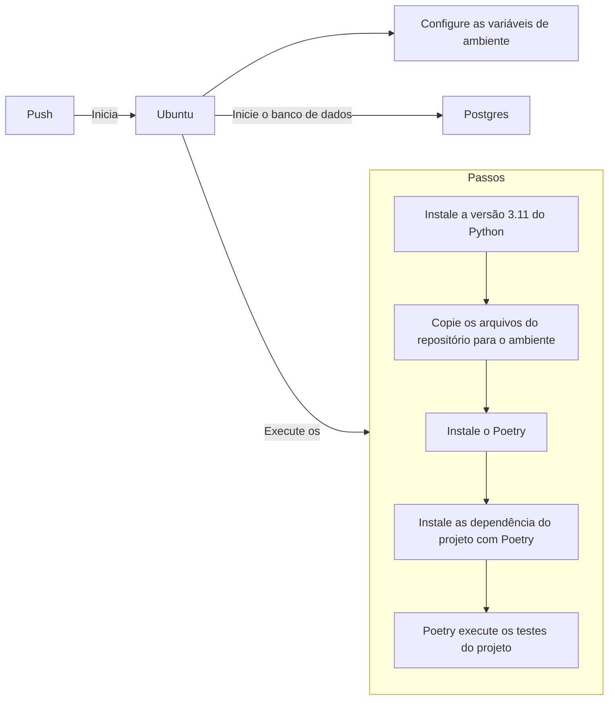
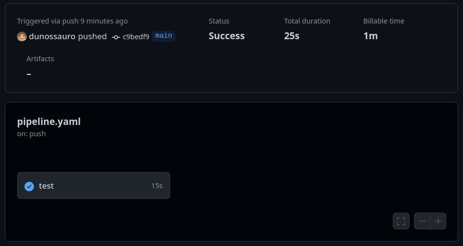
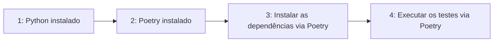
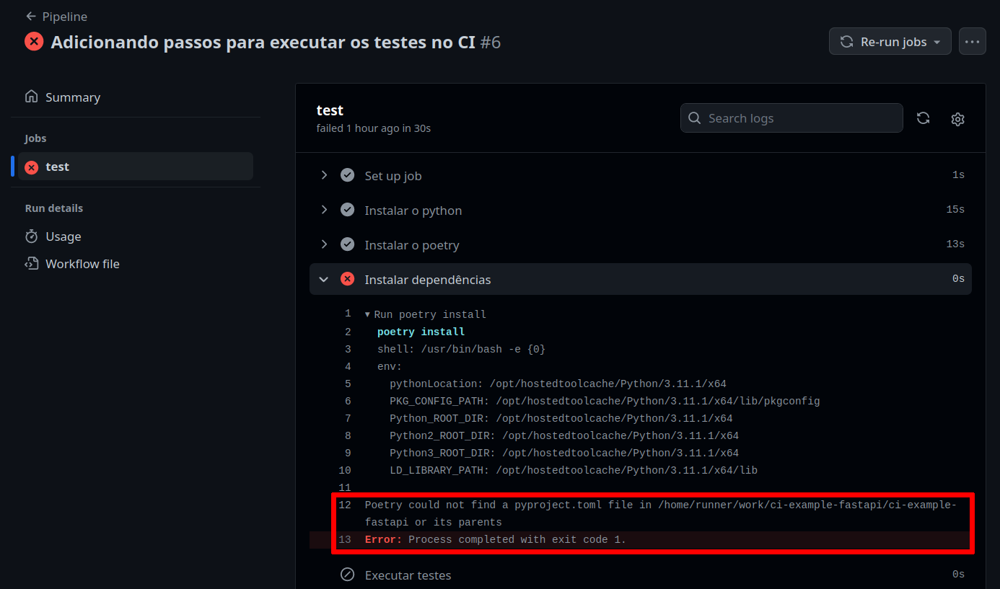

# [WIP] Automatizando os testes com Integração Contínua (CI)

Tópico de manutenção: https://github.com/dunossauro/fastapi-do-zero/issues/34

---
Objetivos da aula:

- Compreender a prática de Integração Contínua (CI) e sua importância no processo de desenvolvimento de software.
- Aprender a usar o GitHub Actions para criar workflows de CI que automatizem a execução de testes a cada commit.
- Configurar um pipeline de CI para nossa aplicação FastAPI que execute testes automaticamente.
- Reconhecer a importância de manter uma cobertura de testes abrangente e consistente.

??? tip "Caso prefira ver a aula em vídeo"
	

[Aula :fontawesome-brands-youtube:](#){ .md-button }
[Slides :fontawesome-solid-file-powerpoint:](#){ .md-button }
[Código :fontawesome-solid-code:](https://github.com/dunossauro/fastapi-do-zero/tree/main/codigo_das_aulas/10/){ .md-button }

---

Na aula anterior, preparamos nossa aplicação para execução em containers Docker, um passo fundamental para replicar o ambiente de produção. Agora, vamos garantir que nossa aplicação mantenha sua integridade a cada mudança, implementando Integração Contínua.

## Integração Contínua (CI)

Integração Contínua (CI) é uma prática de desenvolvimento que envolve a integração regular do código-fonte ao repositório principal, acompanhada de testes automatizados para garantir a qualidade. O objetivo dessa prática é identificar e corrigir erros de forma precoce, facilitando o desenvolvimento contínuo e colaborativo. Pois, caso alguém esqueça de rodar os testes ou exista algum problema na integração entre dois commits, ou em algum merge, isso seja detectado no momento em que a integração contínua é executada.


### GitHub Actions

Entre as ferramentas disponíveis para CI, o [GitHub Actions](https://github.com/features/actions){:target="_blank"} é um serviço do GitHub que automatiza workflows dentro do seu repositório. Você pode configurar o GitHub Actions para executar ações específicas — como testes automatizados — cada vez que um novo código é commitado no repositório.

### Exemplo de workflow

Workflows no GitHub Actions começam com a construção de um ambiente (escolher um sistema operacional e instalar suas dependências) e criar diversos passos (*steps* em inglês) para executar todas as etapas que fazemos no nosso computador durante o desenvolvimento. É uma forma de garantir que o sistema funciona em um ambiente controlado. Dessa forma, todas às vezes que subimos o código para o repositório (damos push) esse ambiente e a sequência de passos será executada.

Por exemplo, como nosso sistema usará um sistema operacional GNU/Linux podemos selecionar uma distribuição como [Ubuntu](https://ubuntu.com/){:target="_blank"} para executar todos os passos da execução dos nossos testes. Isso inclui diversas etapas como preparar o banco de dados, ler as variáveis de ambiente, instalar o python e o poetry, etc.

Antes de mergulharmos na configuração do YAML, vamos visualizar o processo de construção do nosso ambiente de CI com um fluxograma. Este diagrama mostra os passos essenciais, desde a instalação do Python até a execução dos testes, ajudando a entender a sequência de operações no GitHub Actions.



Com o fluxograma em mente, nosso objetivo de aula é traduzir esses passos para a configuração prática no GitHub Actions. Agora que temos uma visão clara do que nosso workflow envolve, vamos nos aprofundar em como transformar essa teoria em prática. 

## Configurando o workflow de CI

As configurações dos workflows no GitHub Actions são definidas em um arquivo [YAML](https://yaml.org/){:target="_blank"} localizado em um path especificado pelo github no repositório `.github/workflows/`. Dentro desse diretório podemos criar quantos workflows quisermos. Iniciaremos nossa configuração com um único arquivo que chamaremos de `pipeline.yaml`:

```yaml title=".github/workflows/pipeline.yaml" linenums="1"
name: Pipeline
on: [push, pull_request]

jobs:
  test:
    runs-on: ubuntu-latest

    steps:
      - name: Instalar o python
        uses: actions/setup-python@v4
        with:
          python-version: '3.11.1'
```

Basicamente um arquivo de workflow precisa de três componentes essenciais para serem definidos:

- Um nome para o workflow (`name`);
- Uma condição de execução (a chave `on`) para sabermos o que iniciará o processo de workflow; e
- Um `job`: Onde escolheremos um sistema e descreveremos a lista de passos para serem executados.

Nesse bloco de código definimos que toda vez em que um `push` ou um `pull_request` ocorrer no nosso repositório o `Pipeline` será executado. Esse workflow tem um job chamado `test` que roda na última versão do Ubuntu `runs-on: ubuntu-latest`. Nesse job chamado `test` temos uma lista de passos para serem executados, os `steps`.

O único step que definimos é a instalação do Python na versão "3.11.1":

```yaml linenums="8"
    steps:
      - name: Instalar o python
        uses: actions/setup-python@v4
        with:
          python-version: '3.11.1'
```

Nesse momento, se executarmos um commit do arquivo `.github/workflows/pipeline.yaml` e um push em nosso repositório, um workflow será iniciado.

```shell title="$ Execução no terminal!"
git add .
git commit -m "Instalação do Python"
git push
```

Nisso, podemos ir até a página do nosso repositório no github e clicar na aba `Actions`, isso exibirá todas às vezes que um workflow for executado. Se clicarmos no wokflow seremos levados a página dos jobs executados e se clicarmos nos jobs, temos uma descrição dos steps executados:

=== "Guia Actions ->"
	{: .center .shadow }

=== "Jobs executados ->"

	{: .center .shadow }

=== "Steps executados"
	{: .center .shadow }


Isso nos mostra que tudo que configuramos no arquivo `pipelines.yaml` foi executado pelo actions no momento que em executamos um `push` no git.

Agora que temos essa visão geral de como o Actions monta e executa workflows, podemos nos concentrar em construir o nosso ambiente.

### [WIP] Construção do nosso ambiente de CI

Para executar nossos testes no workflow, precisamos seguir alguns passos essenciais:

1. **Instalar o Python**: Fundamental para executar nosso código e testes, pois é a linguagem base da nossa aplicação.
2. **Instalar o Poetry**: Pois toda a nossa aplicação e dependências foram construídas com ele.
3. **Instalar as dependências do projeto**: Garante que todas as bibliotecas necessárias estão disponíveis para a execução dos testes.
4. **Executar os testes**: Passo crucial para validar a integridade e funcionalidade do código antes de integrá-lo ao repositório principal.



Cada um desses passos contribui para estabelecer um ambiente de CI robusto e confiável, assegurando que cada mudança no código seja validada automaticamente, mantendo a qualidade e a estabilidade da nossa aplicação.


Para isso, devemos criar um `step` para cada uma dessas ações no nosso job `test`. Desta:

```yaml title=".github/workflows/pipeline.yaml" linenums="8"
    steps:
      - name: Instalar o python
        uses: actions/setup-python@v4
        with:
          python-version: '3.11.1'

      - name: Instalar o poetry
        run: pipx install poetry

      - name: Instalar dependências
        run: poetry install

      - name: Executar testes
        run: poetry run task test
```

Para testar essa implementação no Actions, temos que fazer um commit[^1], para executar o trigger do CI:

[^1]: Há alternativas para testar o workflow de CI sem fazer um commit, como a ferramenta [Act](https://github.com/nektos/act){:target="_blank"} que simula a execução do workflow localmente usando Docker.

```shell title="$ Execução no terminal!"
git add .
git commit -m "Adicionando passos para executar os testes no CI"
git push
```

Assim, podemos avaliar o impacto desses passos no nosso workflow.:

{: .center .shadow }

Se analisarmos com calma o resultado, veremos que a execução do nosso workflow apesenta um erro de execução. O erro está descrito na linhas `#!py 12`: `Poetry could not find a pyproject.toml file in <path> or its parents`. Se traduzirmos de maneira literal, a linha nos disse `Poetry não encontrou o arquivo pyproject.toml no <path> ou em seus parentes`.

Para solucionar esse problema, adicionaremos um passo antes da execução dos testes para copiar o código do nosso repositório para o ambiente do workflow. O GitHub Actions oferece uma ação específica para isso, chamada actions/checkout. Vamos incluí-la como o primeiro passo:

```yaml title=".github/workflows/pipeline.yaml" linenums="4" hl_lines="6-7"
jobs:
  test:
    runs-on: ubuntu-latest

    steps:
      - name: Copia os arquivos do repositório
        uses: actions/checkout@v3

      - name: Instalar o python
        uses: actions/setup-python@v4
        with:
          python-version: '3.11.1'

      # continua com os passos anteriormente definidos
```

Para testar a execução desse passo iremos fazer um novo commit para triggar o Actions:

```shell title="$ Execução no terminal!"
git add .
git commit -m "Adicionando o checkout ao pipeline"
git push
```

Com isso, o erro anterior deve ser resolvido e teremos os testes sendo executados no workflow:

> Atualizar esse print

{: .center .shadow }

Após resolver este problema, nos deparamos com outro desafio. Evidenciado no bloco a seguir:

```py title="Erro do CI!" hl_lines="9-15"
ImportError while loading conftest '/home/runner/work/<path>/tests/conftest.py'.
tests/conftest.py:6: in <module>
    from fast_zero.app import app
fast_zero/app.py:3: in <module>
    from fast_zero.routes import auth, todos, users
fast_zero/routes/auth.py:8: in <module>
    from fast_zero.database import get_session
fast_zero/database.py:6: in <module>
    engine = create_engine(Settings().DATABASE_URL)
../../../.cache/pypoetry/virtualenvs/fast-zero-IubsqyUK-py3.11/lib/python3.11/site-packages/pydantic_settings/main.py:61: in __init__
    super().__init__(
E   pydantic_core._pydantic_core.ValidationError: 4 validation errors for Settings
E   DATABASE_URL
E     Field required [type=missing, input_value={}, input_type=dict]
E       For further information visit https://errors.pydantic.dev/2.1.2/v/missing
```

Ao iniciar a execução dos testes, encontramos um erro relacionado à nossa classe `settings.Settings`. Isso ocorreu porque as variáveis de ambiente necessárias, como `DATABASE_URL`, não estavam definidas no workflow do CI. Este problema é comum quando as variáveis do arquivo `.env`, que utilizamos localmente, não são transferidas para o ambiente de CI.

### [WIP] Configuração de variáveis de ambiente no Actions

Como vimos anteriormente, nossa configuração de CI encontrou um problema devido à ausência de variáveis de ambiente. Para resolver isso, utilizaremos uma funcionalidade dos repositórios do GitHub chamada 'Secrets'. Os 'Secrets' são uma maneira segura de armazenar informações confidenciais, como variáveis de ambiente, de forma criptografada. Eles são acessíveis dentro do nosso workflow, permitindo que o GitHub Actions utilize esses valores sem expô-los publicamente.

#### Definindo Secrets no Repositório

Para definirmos as variáveis de ambiente como 'Secrets', temos duas alternativas. A primeira é acessar a aba `Settings -> Secrets and variables` do nosso repositório no GitHub. Neste local, podemos inserir manualmente cada 'Secret', como URLs de banco de dados e chaves secretas.

A segunda alternativa é utilizar o CLI do GitHub (`gh`) para adicionar todas as variáveis de ambiente que temos no nosso arquivo `.env`. Isso pode ser feito com o seguinte comando:

```shell title="$ Execução no terminal!"
gh secret set -f .env
```

Este comando pega todas as variáveis de ambiente do arquivo `.env` e as configura como 'Secrets' no seu repositório GitHub.

??? info "Configurando Secrets pela Interface Web"
	> Inserir prints dessas operações

	Se preferir configurar 'Secrets' pela interface web do GitHub, siga estes passos:

	1. Acesse Settings no seu repositório GitHub.
	2. Navegue até Secrets and variables.
	3. Clique em New repository secret.
	4. Insira o nome e o valor para cada 'Secret'.
	5. Salve as alterações.

#### [WIP] Implementação no Arquivo YAML

Após definir as 'Secrets', o próximo passo é integrá-las ao nosso arquivo de workflow (`.github/workflows/pipeline.yaml`). Aqui, utilizamos uma sintaxe especial para acessar os valores armazenados como 'Secrets'. Cada 'Secret' é mapeado para uma variável de ambiente dentro do job do nosso workflow, tornando esses valores seguros e acessíveis durante a execução do workflow. Vejamos como isso é feito:

```yaml title=".github/workflows/pipeline.yaml" linenums="4" hl_lines="5-9"
jobs:
  test:
    runs-on: ubuntu-latest

    env:
      DATABASE_URL: ${{ secrets.DATABASE_URL }}
      SECRET_KEY: ${{ secrets.SECRET_KEY }}
      ALGORITHM: ${{ secrets.ALGORITHM }}
      ACCESS_TOKEN_EXPIRE_MINUTES: ${{ secrets.ACCESS_TOKEN_EXPIRE_MINUTES }}
```

Neste trecho de código, a sintaxe `${{ secrets.NOME_DA_VARIAVEL }}` é usada para referenciar os 'Secrets' que definimos no repositório. Por exemplo, `secrets.DATABASE_URL` buscará o valor da 'Secret' chamada `DATABASE_URL` que definimos. Assim que o workflow é acionado, esses valores são injetados no ambiente do job, permitindo que nosso código os acesse como variáveis de ambiente normais.

Essa abordagem não só mantém nossos dados confidenciais seguros, mas também nos permite gerenciar configurações sensíveis de forma centralizada, facilitando atualizações e manutenção.

#### [WIP] Atualizando o Workflow

Com as 'Secrets' agora configuradas, precisamos atualizar o nosso workflow para incorporar essas mudanças. Isso é feito por meio de um novo commit e push para o repositório, que acionará o workflow com as novas configurações.

```shell title="$ Execução no terminal!"
git add .
git commit -m "Adicionando as variáveis de ambiente para o CI"
git push
```

A execução do workflow com as novas 'Secrets' nos permitirá verificar se os problemas anteriores foram resolvidos.

> Adicionar print do novo erro do CI

Como podemos ver, agora os testes começam a ser executados, porém, eles falham por não encontrar o banco de dados disponível. Para isso teremos que partir para a configuração do postgres no workflow.

### [WIP] Configuração do PostgreSQL

> Explicar que na aula 09 mudamos os testes para serem executados com postgres, e para que os testes sejam executados o serviço dele deve ser iniciado

```py title=".github/workflows/pipeline.yaml" linenums="8" hl_lines="7-15"
    env:
      DATABASE_URL: ${{ secrets.DATABASE_URL }}
      SECRET_KEY: ${{ secrets.SECRET_KEY }}
      ALGORITHM: ${{ secrets.ALGORITHM }}
      ACCESS_TOKEN_EXPIRE_MINUTES: ${{ secrets.ACCESS_TOKEN_EXPIRE_MINUTES }}

    services:
      postgres:
        image: postgres
        env:
		  POSTGRES_DB: app_db
          POSTGRES_PASSWORD: app_password
          POSTGRES_USER: app_user
        ports:
          - 5432:5432
```

> Dizer que agora que adicionamos o serviço do postgres, podemos fazer um novo commit e ver o que irá acontecer

```shell title="$ Execução no terminal!"
git add .
git commit -m "Adicionando o serviço do postgres no CI"
git push
```

> Dizer que com isso, nosso pipeline foi executado da forma correta.

> Adicionar aqui um print do CI sendo executado com sucesso

> Dizer aqui que a cada push ou pull request em nosso repositório, o Actions levantará essa estrutura e fará uma validação se o código novo pode ser integrado a nossa estrutura.


??? tip "Caso queira ver o arquivo completo"

	Como o arquivo foi apresentado em pedaços até esse momento, é sempre importante ter uma visualização do arquivo completo para podermos validar se escrevemos tudo corretamente:

	```yaml title=".github/workflows/pipeline.yaml" linenums="1"
	name: Pipeline
	on: [push, pull_request]

	jobs:
	  test:
        runs-on: ubuntu-latest

	    env:
          DATABASE_URL: ${{ secrets.DATABASE_URL }}
          SECRET_KEY: ${{ secrets.SECRET_KEY }}
          ALGORITHM: ${{ secrets.ALGORITHM }}
          ACCESS_TOKEN_EXPIRE_MINUTES: ${{ secrets.ACCESS_TOKEN_EXPIRE_MINUTES }}

        services:
          postgres:
            image: postgres
            env:
              POSTGRES_DB: app_db
              POSTGRES_PASSWORD: app_password
              POSTGRES_USER: app_user
            ports:
              - 5432:5432

        steps:
          - name: Copia os arquivos do repositório
            uses: actions/checkout@v3

          - name: Instalar o python
            uses: actions/setup-python@v4
            with:
              python-version: '3.11.1'

          - name: Instalar o poetry
            run: pipx install poetry

          - name: Instalar dependências
            run: poetry install

          - name: Executar testes
            run: poetry run task test
	```

## [WIP] Conclusão

A Integração Contínua é uma prática fundamental no desenvolvimento moderno de software, e o GitHub Actions é uma ferramenta poderosa para implementar essa prática. Ele não apenas ajuda a manter a qualidade do código ao garantir que todos os testes sejam executados a cada commit, mas também permite detectar e corrigir problemas mais cedo no ciclo de desenvolvimento.

Além disso, monitorar a cobertura de testes com o Codecov nos permite manter um alto padrão de qualidade, garantindo que todas as partes do nosso código sejam testadas.

Na próxima aula, vamos levar nossa aplicação ao próximo nível, preparando-a para o deployment em produção!
