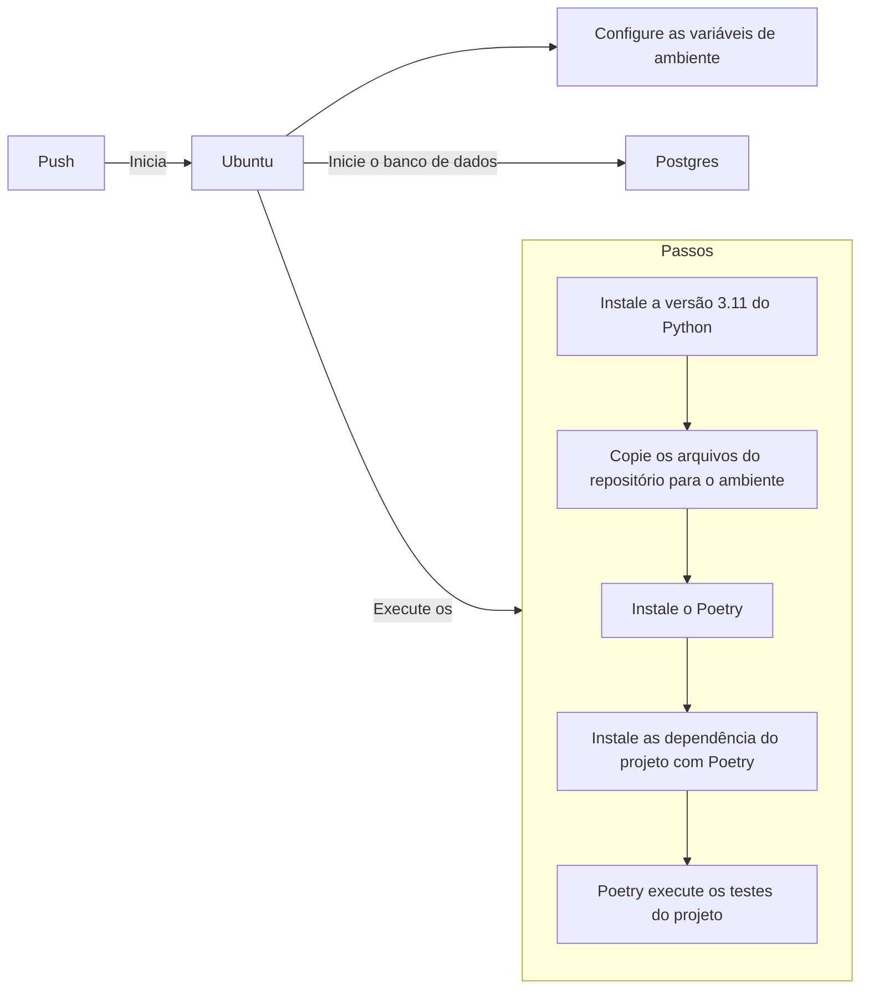

# [WIP] Automatizando os testes com Integração Contínua (CI)

Tópico de manutenção: https://github.com/dunossauro/fastapi-do-zero/issues/34

---
Objetivos da aula:

- Compreender a prática de Integração Contínua (CI) e sua importância no processo de desenvolvimento de software.
- Aprender a usar o GitHub Actions para criar workflows de CI que automatizem a execução de testes a cada commit.
- Configurar um pipeline de CI para nossa aplicação FastAPI que execute testes automaticamente.
- Reconhecer a importância de manter uma cobertura de testes abrangente e consistente.

---

Na aula anterior, preparamos nossa aplicação para execução em containers Docker, um passo fundamental para replicar o ambiente de produção. Agora, vamos garantir que nossa aplicação mantenha sua integridade a cada mudança, implementando Integração Contínua (CI).

## Integração Contínua (CI)

Integração Contínua é uma metodologia de desenvolvimento onde o código-fonte é integrado ao repositório principal de forma regular e verificado por testes automatizados. O objetivo dessa prática é identificar e corrigir erros de forma precoce, facilitando o desenvolvimento contínuo e colaborativo. Pois, caso alguém esqueça de rodar os testes ou exista algum problema na integração entre dois commits ou em algum merge, isso seja detectado no momento em que a integração contínua é executada.


### GitHub Actions

Entre as ferramentas disponíveis para CI, o [GitHub Actions](https://github.com/features/actions){:target="_blank"} é um serviço do GitHub que automatiza workflows dentro do seu repositório. Você pode configurar o GitHub Actions para executar ações específicas — como testes automatizados — cada vez que um novo código é commitado no repositório.

### Exemplo de workflow

A ideia por trás dos workflows é primeiramente construir um ambiente (escolher um sistema operação e instalar suas dependências) e criar diversos passos (*steps* em inglês) para executar todas as etapas que fazemos no nosso computador durante o desenvolvimento. É uma forma de garantir que o sistema funciona em um ambiente controlado. Dessa forma todas às vezes que subimos o cogido para o repositório (damos push) esse ambiente e a sequência de passos será executada.

Por exemplo, como nosso sistema usará um sistema operacional GNU/Linux podemos selecionar uma distribuição como [Ubuntu](https://ubuntu.com/){:target="_blank"} para executar todos os passos da execução dos nossos testes. Isso incluí diversas etapas como preparar o banco de dados, ler as variáveis de ambiente, instalar o python e o poetry, etc.



A ideia por trás de todo esse conjunto de operações é o que chamamos de workflow de integração contínua.


## Configurando o workflow de CI

Toda a configuração dos workflows no Github Actions é feita por um arquivo no formato [YAML](https://yaml.org/){:target="_blank"} localizado em um path especificado pelo github no repositório `.github/workflows/`. Dentro desse diretório podemos criar quantos workflows quisermos. Iniciaremos nossa configuração com um único arquivo que chamaremos de `pipeline.yaml`:

```yaml title=".github/workflows/pipeline.yaml" linenums="1"
name: Pipeline
on: [push, pull_request]

jobs:
  test:
    runs-on: ubuntu-latest

    steps:
      - name: Instalar o python
        uses: actions/setup-python@v4
        with:
          python-version: '3.11.1'
```

Basicamente um arquivo de workflow precisa de três componentes essenciais para serem definidos:

- Um nome para o workflow (`name`);
- Uma condição de execução (a chave `on`) para sabermos o que iniciará o processo de workflow; e
- Um `job`: Onde escolheremos um sistema e descreveremos a lista de passos para serem executados.

Nesse bloco de código definimos que toda vez em que um `push` ou um `pull_request` ocorrer no nosso repositório o `Pipeline` será executado. Esse workflow tem um job chamado `test` que roda na última versão do Ubuntu `runs-on: ubuntu-latest`. Nesse job chamado `test` temos uma lista de passos para serem executados, os `steps`.

O único step que definimos é a instalação do Python na versão "3.11.1":

```yaml linenums="8"
    steps:
      - name: Instalar o python
        uses: actions/setup-python@v4
        with:
          python-version: '3.11.1'
```

Nesse momento, se executarmos um commit do arquivo `.github/workflows/pipeline.yaml` e um push em nosso repositório, um workflow será iniciado.

```shell title="$ Execução no terminal!"
git add .
git commit -m "Instalação do Python"
git push
```

Nisso, podemos ir até a página do nosso repositório no github e clicar na aba `Actions`, isso exibirá todas às vezes que um workflow for executado. Se clicarmos no wokflow seremos levados a página dos jobs executados e se clicarmos nos jobs, temos uma descrição dos steps executados:

=== "Guia Actions ->"
	{: .center .shadow }

=== "Jobs executados ->"

	{: .center .shadow }

=== "Steps executados"
	{: .center .shadow }


Isso nos mostra que tudo que configuramos no arquivo `pipelines.yaml` foi executado pelo actions no momento que em executamos um `push` no git.

Agora que temos essa visão geral de como o Actions monta e executa workflows, podemos nos concentrar em construir o nosso ambiente.

### Construção do nosso ambiente de CI

---

> Texto Antigo

Vamos configurar um workflow de CI para nossa aplicação utilizando o GitHub Actions. Crie um novo arquivo em seu repositório, sob o diretório `.github/workflows/`, e copie o seguinte código:

```yaml title=".github/workflows/pipeline.yaml"
name: Pipeline
on: [push, pull_request]

jobs:
  test:
    runs-on: ubuntu-latest

    steps:
      - name: Copia os arquivos do repo
        uses: actions/checkout@v3

      - name: Instalar o python
        uses: actions/setup-python@v4
        with:
          python-version: '3.11.1'

      - name: Instalar Poetry
        run: pip install poetry

      - name: Instalar dependências do projeto
        run: poetry install

      - name: Rodar os testes
        run: poetry run task test --cov-report=xml

      - name: Subir cobertura para o codecov
        uses: codecov/codecov-action@v3
        with:
          token: ${{ secrets.CODECOV_TOKEN }}
```

Vamos analisar este arquivo:

- `name`: Define o nome do workflow.
- `on`: Define os eventos que acionarão o workflow (neste caso, push e pull requests).
- `jobs`: Define os jobs que serão executados. Nesse caso, temos um job chamado "test".
- `runs-on`: Define o ambiente em que o job será executado (neste caso, a última versão do Ubuntu).
- `steps`: Define os passos do job:
  - `actions/checkout@v3`: Faz o checkout do repositório.
  - `actions/setup-python@v4`: Instala a versão especificada do Python.
  - `pip install poetry`: Instala a ferramenta Poetry.
  - `poetry install`: Instala as dependências do projeto.
  - `poetry run task test --cov-report=xml`: Executa os testes e gera um relatório de cobertura em formato xml.
  - `codecov/codecov-action@v3`: Faz o upload do relatório de cobertura para o Codecov. O token é fornecido através de uma variável de ambiente segura definida nas configurações do repositório.

## Commit

Após adicionar e configurar o arquivo do workflow, você deve commitar as mudanças em seu repositório. Siga os passos:

```shell title="$ Execução no terminal!"
git add .github/workflows/pipeline.yaml
git commit -m "Add CI pipeline"
git push
```

## Conclusão

A Integração Contínua é uma prática fundamental no desenvolvimento moderno de software, e o GitHub Actions é uma ferramenta poderosa para implementar essa prática. Ele não apenas ajuda a manter a qualidade do código ao garantir que todos os testes sejam executados a cada commit, mas também permite detectar e corrigir problemas mais cedo no ciclo de desenvolvimento.

Além disso, monitorar a cobertura de testes com o Codecov nos permite manter um alto padrão de qualidade, garantindo que todas as partes do nosso código sejam testadas.

Na próxima aula, vamos levar nossa aplicação ao próximo nível, preparando-a para o deployment em produção!
