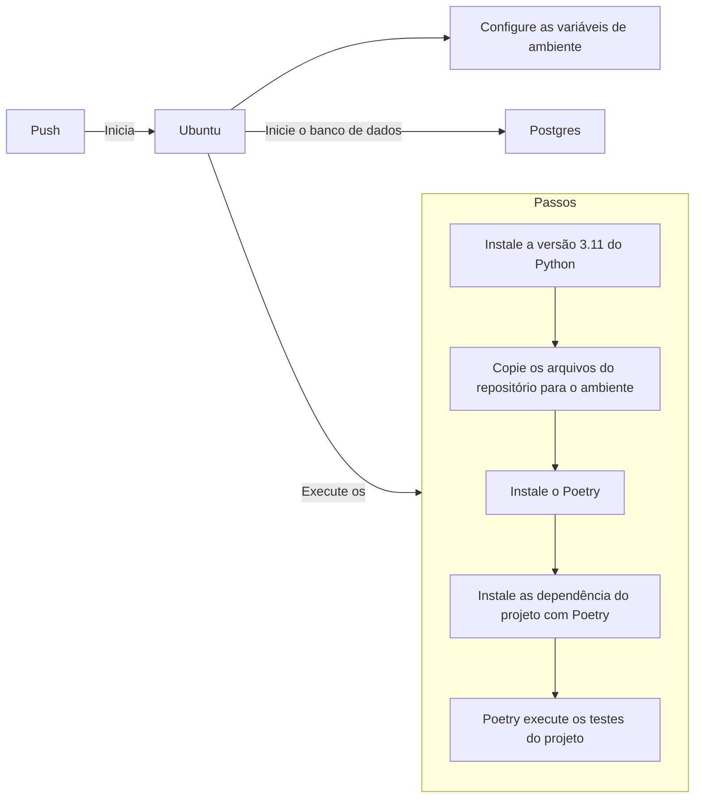
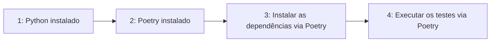

# [WIP] Automatizando os testes com Integração Contínua (CI)

Tópico de manutenção: https://github.com/dunossauro/fastapi-do-zero/issues/34

---
Objetivos da aula:

- Compreender a prática de Integração Contínua (CI) e sua importância no processo de desenvolvimento de software.
- Aprender a usar o GitHub Actions para criar workflows de CI que automatizem a execução de testes a cada commit.
- Configurar um pipeline de CI para nossa aplicação FastAPI que execute testes automaticamente.
- Reconhecer a importância de manter uma cobertura de testes abrangente e consistente.

---

Na aula anterior, preparamos nossa aplicação para execução em containers Docker, um passo fundamental para replicar o ambiente de produção. Agora, vamos garantir que nossa aplicação mantenha sua integridade a cada mudança, implementando Integração Contínua (CI).

## Integração Contínua (CI)

Integração Contínua é uma metodologia de desenvolvimento onde o código-fonte é integrado ao repositório principal de forma regular e verificado por testes automatizados. O objetivo dessa prática é identificar e corrigir erros de forma precoce, facilitando o desenvolvimento contínuo e colaborativo. Pois, caso alguém esqueça de rodar os testes ou exista algum problema na integração entre dois commits ou em algum merge, isso seja detectado no momento em que a integração contínua é executada.


### GitHub Actions

Entre as ferramentas disponíveis para CI, o [GitHub Actions](https://github.com/features/actions){:target="_blank"} é um serviço do GitHub que automatiza workflows dentro do seu repositório. Você pode configurar o GitHub Actions para executar ações específicas — como testes automatizados — cada vez que um novo código é commitado no repositório.

### Exemplo de workflow

A ideia por trás dos workflows é primeiramente construir um ambiente (escolher um sistema operação e instalar suas dependências) e criar diversos passos (*steps* em inglês) para executar todas as etapas que fazemos no nosso computador durante o desenvolvimento. É uma forma de garantir que o sistema funciona em um ambiente controlado. Dessa forma todas às vezes que subimos o cogido para o repositório (damos push) esse ambiente e a sequência de passos será executada.

Por exemplo, como nosso sistema usará um sistema operacional GNU/Linux podemos selecionar uma distribuição como [Ubuntu](https://ubuntu.com/){:target="_blank"} para executar todos os passos da execução dos nossos testes. Isso incluí diversas etapas como preparar o banco de dados, ler as variáveis de ambiente, instalar o python e o poetry, etc.



A ideia por trás de todo esse conjunto de operações é o que chamamos de workflow de integração contínua.


## Configurando o workflow de CI

Toda a configuração dos workflows no Github Actions é feita por um arquivo no formato [YAML](https://yaml.org/){:target="_blank"} localizado em um path especificado pelo github no repositório `.github/workflows/`. Dentro desse diretório podemos criar quantos workflows quisermos. Iniciaremos nossa configuração com um único arquivo que chamaremos de `pipeline.yaml`:

```yaml title=".github/workflows/pipeline.yaml" linenums="1"
name: Pipeline
on: [push, pull_request]

jobs:
  test:
    runs-on: ubuntu-latest

    steps:
      - name: Instalar o python
        uses: actions/setup-python@v4
        with:
          python-version: '3.11.1'
```

Basicamente um arquivo de workflow precisa de três componentes essenciais para serem definidos:

- Um nome para o workflow (`name`);
- Uma condição de execução (a chave `on`) para sabermos o que iniciará o processo de workflow; e
- Um `job`: Onde escolheremos um sistema e descreveremos a lista de passos para serem executados.

Nesse bloco de código definimos que toda vez em que um `push` ou um `pull_request` ocorrer no nosso repositório o `Pipeline` será executado. Esse workflow tem um job chamado `test` que roda na última versão do Ubuntu `runs-on: ubuntu-latest`. Nesse job chamado `test` temos uma lista de passos para serem executados, os `steps`.

O único step que definimos é a instalação do Python na versão "3.11.1":

```yaml linenums="8"
    steps:
      - name: Instalar o python
        uses: actions/setup-python@v4
        with:
          python-version: '3.11.1'
```

Nesse momento, se executarmos um commit do arquivo `.github/workflows/pipeline.yaml` e um push em nosso repositório, um workflow será iniciado.

```shell title="$ Execução no terminal!"
git add .
git commit -m "Instalação do Python"
git push
```

Nisso, podemos ir até a página do nosso repositório no github e clicar na aba `Actions`, isso exibirá todas às vezes que um workflow for executado. Se clicarmos no wokflow seremos levados a página dos jobs executados e se clicarmos nos jobs, temos uma descrição dos steps executados:

=== "Guia Actions ->"
	{: .center .shadow }

=== "Jobs executados ->"

	{: .center .shadow }

=== "Steps executados"
	{: .center .shadow }


Isso nos mostra que tudo que configuramos no arquivo `pipelines.yaml` foi executado pelo actions no momento que em executamos um `push` no git.

Agora que temos essa visão geral de como o Actions monta e executa workflows, podemos nos concentrar em construir o nosso ambiente.

### [WIP] Construção do nosso ambiente de CI

> Reescrever todo esse tópico!

Para que nossos testes sejam executados no workflow, temos que passar por diversos passos:

1. O Python deve ser instalado;
2. O Poetry deve ser instalado;
3. As dependências do projeto devem ser instaladas; e por fim
4. Os testes podem ser executados



Para isso, devemos criar um `step` para cada uma dessas ações no nosso job `test`. Desta:

```yaml title=".github/workflows/pipeline.yaml" linenums="8"
    steps:
      - name: Instalar o python
        uses: actions/setup-python@v4
        with:
          python-version: '3.11.1'

      - name: Instalar o poetry
        run: pipx install poetry

      - name: Instalar dependências
        run: poetry install

      - name: Executar testes
        run: poetry run task test
```

Para testar essa implementação no Actions, temos que fazer um commit[^1], para executar o trigger do CI:

[^1]: Existem formas de executar o workflow de CI sem ter que executar um commit no repositório, como a ferramenta [Act](https://github.com/nektos/act){:target="_blank"} que usa os mesmos containers que o Act e executa o workflow usando docker localmente, TESTE!

```shell title="$ Execução no terminal!"
git add .
git commit -m "Adicionando passos para executar os testes no CI"
git push
```

Dessa forma podemos analisar os efeitos que esses steps tiveram no nosso workflow:

{: .center .shadow }

Se analisarmos com calma o resultado, veremos que a execução do nosso workflow apesenta um erro de execução. O erro está descrito na linhas `#!py 12`: `Poetry could not find a pyproject.toml file in <path> or its parents`. Se traduzirmos de maneira literal, a linha nos disse `Poetry não encontrou o arquivo pyproject.toml no <path> ou em seus parentes`.

Para resolver esse problema, precisamos criar um passo antes da execução dos testes que copie o código do nosso repositório para o workflow. O Actions tem uma ação específica para fazer isso. Podemos adicioná-la como nosso primeiro passo:

```yaml title=".github/workflows/pipeline.yaml" linenums="4" hl_lines="6-7"
jobs:
  test:
    runs-on: ubuntu-latest

    steps:
      - name: Copia os arquivos do repositório
        uses: actions/checkout@v3

      - name: Instalar o python
        uses: actions/setup-python@v4
        with:
          python-version: '3.11.1'

	  # continua com os passos anteriormente definidos
```

Para testar a execução desse passo iremos fazer um novo commit para triggar o Actions:

```shell title="$ Execução no terminal!"
git add .
git commit -m "Adicionando o checkout ao pipeline"
git push
```

Com isso, o erro anterior deve ser resolvido e teremos os testes sendo executados no workflow:

> Atualizar esse print

{: .center .shadow }

E isso nos leva a mais um erro de execução. Evidenciado no bloco a seguir:

```py title="Erro do CI!" hl_lines="9-15"
ImportError while loading conftest '/home/runner/work/<path>/tests/conftest.py'.
tests/conftest.py:6: in <module>
    from fast_zero.app import app
fast_zero/app.py:3: in <module>
    from fast_zero.routes import auth, todos, users
fast_zero/routes/auth.py:8: in <module>
    from fast_zero.database import get_session
fast_zero/database.py:6: in <module>
    engine = create_engine(Settings().DATABASE_URL)
../../../.cache/pypoetry/virtualenvs/fast-zero-IubsqyUK-py3.11/lib/python3.11/site-packages/pydantic_settings/main.py:61: in __init__
    super().__init__(
E   pydantic_core._pydantic_core.ValidationError: 4 validation errors for Settings
E   DATABASE_URL
E     Field required [type=missing, input_value={}, input_type=dict]
E       For further information visit https://errors.pydantic.dev/2.1.2/v/missing

```

O ao inciar a execução dos testes encontrou um erro relacionado a nossa classe `settings.Settings`. As variáveis de ambiente não estão definidas no workflow do CI. Isso se deve ao fato das variáveis descritas no arquivo `.env` não estarem descritas em nenhum lugar.

### Configuração de variáveis de ambiente no Actions

> Descrever os secrets

> Explicar como configurar na interface/settings

```yaml title=".github/workflows/pipeline.yaml" linenums="4" hl_lines="5-9"
jobs:
  test:
    runs-on: ubuntu-latest

    env:
      DATABASE_URL: ${{ secrets.DATABASE_URL }}
      SECRET_KEY: ${{ secrets.SECRET_KEY }}
      ALGORITHM: ${{ secrets.ALGORITHM }}
      ACCESS_TOKEN_EXPIRE_MINUTES: ${{ secrets.ACCESS_TOKEN_EXPIRE_MINUTES }}
```

> Adicionando todos os segredos ao repositório

```shell title="$ Execução no terminal!"
gh secret set -f .env
```

### Configuração do PostgreSQL

> Explicar que na aula 09 mudamos os testes para serem executados com postgres, e para que os testes sejam executados o serviço dele deve ser iniciado

```py title=".github/workflows/pipeline.yaml" linenums="8" hl_lines="7-15"
    env:
      DATABASE_URL: ${{ secrets.DATABASE_URL }}
      SECRET_KEY: ${{ secrets.SECRET_KEY }}
      ALGORITHM: ${{ secrets.ALGORITHM }}
      ACCESS_TOKEN_EXPIRE_MINUTES: ${{ secrets.ACCESS_TOKEN_EXPIRE_MINUTES }}

    services:
      postgres:
        image: postgres
        env:
		  POSTGRES_DB: app_db
          POSTGRES_PASSWORD: app_password
          POSTGRES_USER: app_user
        ports:
          - 5432:5432
```

> Commit

Depois disso

> Mais um print

??? hot "Caso queira ver o arquivo completo"

	```yaml title=".github/workflows/pipeline.yaml" linenums="1"
	name: Pipeline
	on: [push, pull_request]

	jobs:
	  test:
        runs-on: ubuntu-latest

	    env:
          DATABASE_URL: ${{ secrets.DATABASE_URL }}
          SECRET_KEY: ${{ secrets.SECRET_KEY }}
          ALGORITHM: ${{ secrets.ALGORITHM }}
          ACCESS_TOKEN_EXPIRE_MINUTES: ${{ secrets.ACCESS_TOKEN_EXPIRE_MINUTES }}

        services:
          postgres:
            image: postgres
            env:
              POSTGRES_DB: app_db
              POSTGRES_PASSWORD: app_password
              POSTGRES_USER: app_user
            ports:
              - 5432:5432

        steps:
          - name: Copia os arquivos do repositório
            uses: actions/checkout@v3

          - name: Instalar o python
            uses: actions/setup-python@v4
            with:
              python-version: '3.11.1'

          - name: Instalar o poetry
            run: pipx install poetry

          - name: Instalar dependências
            run: poetry install

          - name: Executar testes
            run: poetry run task test
	```

## Conclusão

A Integração Contínua é uma prática fundamental no desenvolvimento moderno de software, e o GitHub Actions é uma ferramenta poderosa para implementar essa prática. Ele não apenas ajuda a manter a qualidade do código ao garantir que todos os testes sejam executados a cada commit, mas também permite detectar e corrigir problemas mais cedo no ciclo de desenvolvimento.

Além disso, monitorar a cobertura de testes com o Codecov nos permite manter um alto padrão de qualidade, garantindo que todas as partes do nosso código sejam testadas.

Na próxima aula, vamos levar nossa aplicação ao próximo nível, preparando-a para o deployment em produção!
