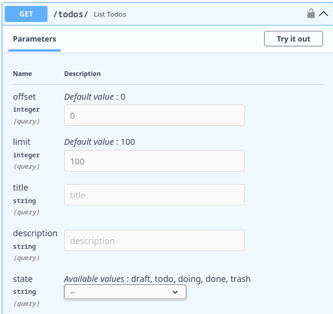

# [WIP] Criando Rotas CRUD para Gerenciamento de Tarefas em FastAPI

---
Objetivos da Aula:

- Criação das rotas para as operações CRUD das tarefas
- Fazer com que só o usuário dono da tarefa possa acessar e modificar suas tarefas
- Escrita e execução dos testes para cada operação das tarefas





---

Após termos cumprido todos os passos essenciais para estabelecer um sistema eficiente de gerenciamento de usuários, estamos agora preparados para levar nossa aplicação a um novo momento, introduzindo um sistema de gerenciamento de tarefas, mais conhecido como *todo list*. Nesta nova etapa, garantiremos que somente o usuário que criou uma tarefa tenha o direito de acessar e editar tal tarefa, reforçando a segurança e a privacidade dos dados. Para isso, desenvolveremos diversos endpoints e implementaremos as medidas de restrição e autenticação que aprimoramos na última aula.


## Estrutura inicial do código

Primeiro, criaremos um novo arquivo chamado `todos.py` no diretório de `routers`:

```python title="fast_zero/routers/todos.py"
from fastapi import APIRouter

router = APIRouter(prefix='/todos', tags=['todos'])
```

Neste código, criamos uma nova instância da classe `APIRouter` do FastAPI. Esta classe é usada para definir as rotas de nossa aplicação. A instância `router` funcionará como um mini aplicativo FastAPI, que poderá ter suas próprias rotas, modelos de resposta, etc.

A opção `prefix` no construtor do `APIRouter` é usada para definir um prefixo comum para todas as rotas definidas neste roteador. Isso significa que todas as rotas que definirmos neste roteador começarão com `/todos`. Usamos um prefixo aqui porque queremos agrupar todas as rotas relacionadas a tarefas em um lugar. Isso torna nossa aplicação mais organizada e fácil de entender.

A opção `tags` é usada para agrupar as rotas em seções no documento interativo de API gerado pelo FastAPI (como Swagger UI e ReDoc). Todas as rotas que definirmos neste roteador aparecerão na seção "todos" da documentação da API.


Após definir o roteador, precisamos incluí-lo em nossa aplicação principal. Atualizaremos o arquivo `fast_zero/app.py` para incluir as rotas de tarefas que criaremos:

```python title="fast_zero/app.py"
from http import HTTPStatus

from fastapi import FastAPI

from fast_zero.routers import auth, todos, users
from fast_zero.schemas import Message

app = FastAPI()

app.include_router(users.router)
app.include_router(auth.router)
app.include_router(todos.router)


@app.get('/', status_code=HTTPStatus.OK, response_model=Message)
def read_root():
    return {'message': 'Olá Mundo!'}
```

Neste código, chamamos o método `include_router` do FastAPI para cada roteador que definimos. Este método adiciona todas as rotas do roteador à nossa aplicação. Com isso, nossa aplicação agora terá todas as rotas definidas nos roteadores `users`, `auth` e `todos`.

## Implementação da tabela no Banco de dados

Agora, implementaremos a tabela 'Todos' no nosso banco de dados. Esta tabela estará diretamente relacionada à tabela 'User', pois toda tarefa pertence a um usuário. Esta relação é crucial para garantir que só o usuário dono da tarefa possa acessar e modificar suas tarefas.

```python title="fast_zero/models.py" linenums="1" hl_lines="30-34 44 46"
from datetime import datetime
from enum import Enum

from sqlalchemy import ForeignKey, func
from sqlalchemy.orm import Mapped, mapped_column, registry, relationship

table_registry = registry()


class TodoState(str, Enum): #(1)!
    draft = 'draft'
    todo = 'todo'
    doing = 'doing'
    done = 'done'
    trash = 'trash'


@table_registry.mapped_as_dataclass
class User:
    __tablename__ = 'users'

    id: Mapped[int] = mapped_column(init=False, primary_key=True)
    username: Mapped[str] = mapped_column(unique=True)
    password: Mapped[str]
    email: Mapped[str] = mapped_column(unique=True)
    created_at: Mapped[datetime] = mapped_column(
        init=False, server_default=func.now()
    )

    todos: Mapped[list['Todo']] = relationship( #(2)!
        init=False,
		cascade='all, delete-orphan',
		lazy='selectin',
    )


@table_registry.mapped_as_dataclass
class Todo:
    __tablename__ = 'todos'

    id: Mapped[int] = mapped_column(init=False, primary_key=True)
    title: Mapped[str]
    description: Mapped[str]
    state: Mapped[TodoState] #(3)!

    user_id: Mapped[int] = mapped_column(ForeignKey('users.id')) #(4)!
```

1. Enums de strings no podem validar se o texto está entre as alternativas válidas. Algo como:

    ```python
    >>> TodoState('draft') # Valor encontrado
    <TodoState.draft: 'draft'>
    >>> TodoState('batatinha')
	Traceback (most recent call last):
      File "<python-input-22>", line 1, in <module>
        TodoState('batatinha')
        ~~~~~~~~~^^^^^^^^^^^^^
      # ...
    ValueError: 'batatinha' is not a valid TodoState
    ```

2. Aqui criamos uma relação com a tabela `Todos`. Onde temos uma relação 1:N. Cada `User` pode ter `N` `Todo`s associados a ele. No `cascade` dizemos `#!python 'all, delete-orphan'` para que quando um `User` for deletado, todos os todos associados a ele também serão deletados. No campo `lazy` estamos usando `#!python 'selectin'`. O que quer dizer que quando fizermos um `select` em `Users` também vamos obter os objetos `Todo` associados a ele.
3. `TodoState` cria uma relação entre o `Enum` e o campo `state`. Isso quer dizer que somente os valores no enum serão considerados válidos para esse campo.
4. Aqui temos um relacionamento via chave estrangeira. Onde todo `Todo` é associado a um `id` de `User`.

Neste ponto, é importante compreender o conceito de `relationship` no SQLAlchemy. A função `relationship` define como as duas tabelas irão interagir. Por exemplo, a tabela `User`, em seu campo `todo` pode exibir todos os objetos `Todo` associados a ela. Por exemplo, quando buscarmos por um `User` por meio de um `select` obteremos todos N objetos `Todo` associados ao seu `id`:


Nesse caso temos uma relação de 1 `User`, para N `Todo`.

O argumento `cascade` determina o que ocorre com as tarefas quando o usuário associado a elas é deletado. Ao definir `#!python 'all, delete-orphan'`, estamos instruindo o SQLAlchemy a deletar todas as tarefas de um usuário quando este for deletado.

Se formos executar nosso teste do db, ele deve falhar. Pois, temos um novo campo `todo` sendo retornado:

```shell title="$ Execução no terminal!" hl_lines="11"
task test -k db
# ...
tests/test_db.py::test_create_user FAILED
# ...
E         Full diff:
E           {
E               'created_at': datetime.datetime(2024, 1, 1, 0, 0),
E               'email': 'teste@test',
E               'id': 1,
E               'password': 'secret',
E         +     'todos': [],
E               'username': 'alice',
E           }
# ...
```

Esse comportamento acontece por termos usado [`#!python lazy='selectin'`](/10/#__codelineno-2-33){:target="_blank"} no `relationship`. Isso faz com que o novo campo traga os resultados de `Todo`s associados a esse `User` quando for buscado via `select`. Por esse motivo devemos alterar nosso teste de criação de users:

```py title="tests/test_db.py" hl_lines="18"
@pytest.mark.asyncio
async def test_create_user(session, mock_db_time):
    with mock_db_time(model=User) as time:
        new_user = User(
            username='alice', password='secret', email='teste@test'
        )
        session.add(new_user)
        await session.commit()

    user = await session.scalar(select(User).where(User.username == 'alice'))

    assert asdict(user) == {
        'id': 1,
        'username': 'alice',
        'password': 'secret',
        'email': 'teste@test',
        'created_at': time,
        'todos': [],
    }
```

Assim, o comportamento esperado deve estar sendo validado:

```shell title="$ Execução no terminal!" hl_lines="11"
task test -k db
# ...
tests/test_db.py::test_create_user PASSED
```

Com isso funcionando, podemos testar nossa nova tabela.

### Testando as novas implementações do banco de dados

Embora tenhamos 100% de cobertura de código, isso não garante que tudo esteja funcionando corretamente. Só implementamos a estrutura do banco de dados, mas não testamos a lógica de como as tabelas e as relações funcionam na prática.

{: .center }

Pra começar, vamos escrever um teste que valida se os campos da tabela foram criados da maneira correta e com os tipos corretos:

```python title="tests/test_db.py"
# ...

from fast_zero.models import Todo, User
# ...

@pytest.mark.asyncio
async def test_create_todo(session, user):
    todo = Todo(
        title='Test Todo',
        description='Test Desc',
        state='draft',
        user_id=user.id, #(1)!
    )

    session.add(todo)
    await session.commit()

    todo = await session.scalar(select(Todo))

    assert asdict(todo) == {
        'description': 'Test Desc',
        'id': 1,
        'state': 'draft',
        'title': 'Test Todo',
        'user_id': 1,  #(2)!
    }
```

1. Precisa que um `User` esteja criado, pois existe um relacionamento nessa tabela.
2. Validação se o `Todo` conta com o campo de relacionamento.

Nesse teste fizemos a criação de um `Todo`, só que para que um `Todo` fosse criado, um `User` precisava ser criado antes, pois um `Todo` sempre é associado a um `User`.

Com isso, você pode executar os testes:

```shell title="$ Execução no terminal!"
task test -k db
# ...
tests/test_db.py::test_create_user_without_todos PASSED
tests/test_db.py::test_create_todo PASSED
```

Embora tenhamos cenários que pareçam suficientes, temos que pensar que não testamos a relação de todos realmente existindo e sendo retornados com users. Para isso, criamos um teste para verificar se a relação entre tarefas e usuários está funcionando corretamente:

```python title="tests/test_db.py"
@pytest.mark.asyncio
async def test_user_todo_relationship(session, user: User):
    todo = Todo(
        title='Test Todo',
        description='Test Desc',
        state='draft',
        user_id=user.id,
    )

    session.add(todo)
    await session.commit()
    await session.refresh(user) #(1)!

    user = await session.scalar(
        select(User).where(User.id == user.id)
    )

    assert user.todos == [todo]
```

1. alguma explicação legal!

Este teste cria uma nova tarefa para um usuário e verifica se essa tarefa aparece na lista de tarefas desse usuário.

```shell title="$ Execução no terminal!"
task test -k db
# ...
tests/test_db.py::test_create_user PASSED
tests/test_db.py::test_create_todo PASSED
tests/test_db.py::test_user_todo_relationship PASSED
```

Isso mostra que os testes foram bem-sucedidos. Agora, com o modelo já em funcionamento, podemos ir para a parte dos schemas.

## Schemas para Todos

Criaremos dois esquemas para nosso modelo de tarefas (todos): `TodoSchema` e `TodoPublic`.

```python title="fast_zero/schemas.py"
from fast_zero.models import TodoState

#...

class TodoSchema(BaseModel):
    title: str
    description: str
    state: TodoState


class TodoPublic(TodoSchema):
    id: int


class TodoList(BaseModel):
    todos: list[TodoPublic]
```

`TodoSchema` será usado para validar os dados de entrada quando uma nova tarefa é criada e `TodoPublic` será usado para validar os dados de saída quando uma tarefa é retornada em um endpoint.

## Endpoint de criação

Criamos o primeiro endpoint para a criação de tarefas. Este é um endpoint POST na rota '/todos'. É importante destacar que, para criar uma tarefa, um usuário precisa estar autenticado e só esse usuário autenticado será o proprietário da tarefa.

```python title="fast_zero/routers/todos.py"
from typing import Annotated

from fastapi import APIRouter, Depends
from sqlalchemy.ext.asyncio import AsyncSession

from fast_zero.database import get_session
from fast_zero.models import Todo, User
from fast_zero.schemas import TodoPublic, TodoSchema
from fast_zero.security import get_current_user

router = APIRouter()

Session = Annotated[AsyncSession, Depends(get_session)]
CurrentUser = Annotated[User, Depends(get_current_user)]

router = APIRouter(prefix='/todos', tags=['todos'])


@router.post('/', response_model=TodoPublic)
async def create_todo(
    todo: TodoSchema,
    user: CurrentUser,
    session: Session,
):
    db_todo = Todo(
        title=todo.title,
        description=todo.description,
        state=todo.state,
        user_id=user.id,
    )
    session.add(db_todo)
    await session.commit()
    await session.refresh(db_todo)

    return db_todo
```

Neste endpoint, fazemos uso da dependência `get_current_user` que garante que somente usuários autenticados possam criar tarefas, protegendo assim nossa aplicação.


### Testando o endpoint de criação

Para garantir que nosso endpoint está funcionando corretamente, criamos um teste para ele. Este teste verifica se o endpoint '/todos' está criando tarefas corretamente.

```python title="tests/test_todos.py"
def test_create_todo(client, token):
    response = client.post(
        '/todos/',
        headers={'Authorization': f'Bearer {token}'},
        json={
            'title': 'Test todo',
            'description': 'Test todo description',
            'state': 'draft',
        },
    )
    assert response.json() == {
        'id': 1,
        'title': 'Test todo',
        'description': 'Test todo description',
        'state': 'draft',
    }
```

No teste, fazemos uma requisição POST para o endpoint '/todos' passando um token de autenticação válido e um JSON com os dados da tarefa a ser criada. Em seguida, verificamos se a resposta contém os dados corretos da tarefa criada.

Para executar este teste, você deve usar o comando abaixo no terminal:

```shell title="$ Execução no terminal!"
task test tests/test_todos.py
# ...
tests/test_todos.py::test_create_todo PASSED
```

Com essa implementação, os testes devem passar. Porém, apesar do sucesso dos testes, nosso código ainda não está completamente pronto. Ainda é necessário criar uma migração para a tabela de tarefas no banco de dados.

## Criando a migração da nova tabela

Agora que temos nosso modelo de tarefas definido, precisamos criar uma migração para adicionar a tabela de tarefas ao nosso banco de dados. Usamos o Alembic para criar e gerenciar nossas migrações.

```shell title="$ Execução no terminal!"
alembic revision --autogenerate -m "create todos table"

# ...

Generating /<caminho>/fast_zero/migrations/versions/de865434f506_create_todos_table.py

```

Este comando gera um arquivo de migração, que se parece com o código abaixo:

```python title="migrations/versions/de865434f506_create_todos_table.py"
def upgrade() -> None:
    # ### commands auto generated by Alembic - please adjust! ###
    op.create_table('todos',
    sa.Column('id', sa.Integer(), nullable=False),
    sa.Column('title', sa.String(), nullable=False),
    sa.Column('description', sa.String(), nullable=False),
    sa.Column('state', sa.Enum('draft', 'todo', 'doing', 'done', 'trash', name='todostate'), nullable=False),
    sa.Column('user_id', sa.Integer(), nullable=False),
    sa.ForeignKeyConstraint(['user_id'], ['users.id'], ),
    sa.PrimaryKeyConstraint('id')
    )
    # ### end Alembic commands ###


def downgrade() -> None:
    # ### commands auto generated by Alembic - please adjust! ###
    op.drop_table('todos')
    # ### end Alembic commands ###
```

Depois que a migração for criada, precisamos aplicá-la ao nosso banco de dados. Execute o comando `alembic upgrade head` para aplicar a migração.

```shell title="$ Execução no terminal!"
alembic upgrade head
INFO  [alembic.runtime.migration] Context impl SQLiteImpl.
INFO  [alembic.runtime.migration] Will assume non-transactional DDL.
INFO  [alembic.runtime.migration] Running upgrade e018397cecf4 -> de865434f506, create todos table
```

Agora que a migração foi aplicada, nosso banco de dados deve ter uma nova tabela de tarefas. Para verificar, você pode abrir o banco de dados com o comando `sqlite3 database.db` e depois executar o comando `.schema` para ver o esquema do banco de dados.


```sql title="$ Execução no terminal!"
sqlite3 database.db
# ...
sqlite> .schema
# ...
CREATE TABLE todos (
	id INTEGER NOT NULL,
	title VARCHAR NOT NULL,
	description VARCHAR NOT NULL,
	state VARCHAR(5) NOT NULL,
	user_id INTEGER NOT NULL,
	PRIMARY KEY (id),
	FOREIGN KEY(user_id) REFERENCES users (id)
);
```

Finalmente, agora que temos a tabela de tarefas em nosso banco de dados, podemos testar nosso endpoint de criação de tarefas no Swagger. Para fazer isso, execute nosso servidor FastAPI e abra o Swagger no seu navegador.

## Endpoint de listagem

Agora que criamos a nossa migração e temos o endpoint de criação de Todos, temos que criar nosso endpoint de listagem de tarefas. Ele deve listar todas as tarefas de acordo com o `CurrentUser`.

Algumas coisas adicionais e que podem ser importantes na hora de recuperar as tarefas é fazer um filtro de busca. Em alguns momentos queremos buscar uma tarefa por título, em outro momento por descrição, às vezes só pelo estado. Por exemplo, somente tarefas concluídas.

Por exemplo, uma query string simples pode ser: `todos/?title="batatinha"`.

Uma característica importante das queries é que podemos juntar mais de um atributo em uma busca. Por exemplo, podemos buscar somente as tarefas a fazer que contenham no título "trabalho". Dessa forma, temos um endpoint mais eficiente, já que podemos realizar buscas complexas e refinadas com uma única chamada.

A combinação poderia ser algo como: `todos/?title="batatinha"&status=todo`.

A combinação de diferentes parâmetros de query não só torna o endpoint mais flexível, mas também permite que os usuários obtenham os dados de que precisam de maneira mais rápida e conveniente. Isso contribui para uma melhor experiência do usuário e otimiza a interação com o banco de dados.

### O modelo da query

Como agora temos vários parâmetros de query como `title`, `description` e `state`, podemos criar um modelo como esse:

```python title="fast_zero/schemas.py"
class FilterTodo(FilterPage):
    title: str | None = None
    description: str | None = None
    state: TodoState | None = None
```

Uma coisa interessante de observar nesse modelo é que ele usa `FilterPage` como base, para que além dos campos propostos, tenhamos o `limit` e `offset` também.

A definição de `state` tem um comportamento bastante interessante na documentação, gerando uma caixa de seleção para garantir que o valor correto seja enviado.

{: .center .shadow }

### Implementação do endpoint

Agora, com o modelo em mãos, podemos escrever nosso endpoint de listagem que leva em consideração todos os filtros possíveis na hora de fazer a busca:

```python title="fast_zero/routers/todos.py"
from typing import Annotated
# ...
from fastapi import APIRouter, Depends, Query
from sqlalchemy import select
# ...
from fast_zero.schemas import (
    FilterTodo,
    Message,
    TodoList,
    TodoPublic,
    TodoSchema,
    TodoUpdate,
)

# ...

@router.get('/', response_model=TodoList)
async def list_todos(
    session: Session,
    user: CurrentUser,
    todo_filter: Annotated[FilterTodo, Query()],
):
    query = select(Todo).where(Todo.user_id == user.id)

    if todo_filter.title:
        query = query.filter(Todo.title.contains(todo_filter.title))

    if todo_filter.description:
        query = query.filter(
            Todo.description.contains(todo_filter.description)
        )

    if todo_filter.state:
        query = query.filter(Todo.state == todo_filter.state)

    todos = await session.scalars(
        query.offset(todo_filter.offset).limit(todo_filter.limit)
    )

    return {'todos': todos.all()}
```

Essa abordagem equilibra a flexibilidade e a eficiência, tornando o endpoint capaz de atender a uma variedade de necessidades de negócio. Utilizando os recursos do FastAPI, conseguimos implementar uma solução robusta e fácil de manter, que será testada posteriormente para garantir sua funcionalidade e integridade.

No código acima, estamos utilizando filtros do SQLAlchemy, uma biblioteca ORM (Object-Relational Mapping) do Python, para adicionar condições à nossa consulta. Esses filtros correspondem aos parâmetros que o usuário pode passar na URL.

- `Todo.title.contains(todo_filter.title)`: verifica se o título da tarefa contém a string fornecida.
- `Todo.description.contains(todo_filter.description)`: verifica se a descrição da tarefa contém a string fornecida.
- `Todo.state == todo_filter.state`: compara o estado da tarefa com o valor fornecido.

Essas condições são traduzidas em cláusulas SQL pelo SQLAlchemy, permitindo que o banco de dados filtre os resultados de acordo com os critérios especificados pelo usuário. Essa integração entre FastAPI e SQLAlchemy torna o processo de filtragem eficiente e a codificação mais expressiva e clara.


### Criando uma factory para simplificar os testes

Criar uma factory para o endpoint facilitaria os testes por diversas razões, especialmente quando se trata de testar o nosso endpoint de listagem que usa múltiplas queries. Primeiro, a factory ajuda a encapsular a lógica de criação dos objetos necessários para o teste, como no caso dos objetos `Todo`. Isso significa que você pode criar objetos consistentes e bem-formados sem ter que repetir o mesmo código em vários testes.

Com a complexidade das queries que nosso endpoint permite, precisamos cobrir todos os usos possíveis dessas queries. A factory vai nos ajudar a criar muitos casos de testes de forma prática e eficiente, já que podemos gerar diferentes combinações de títulos, descrições, estados, entre outros atributos, simulando diversas situações de uso.

Além disso, ao utilizar bibliotecas como o `factory`, é possível gerar dados aleatórios e válidos, o que pode ajudar a garantir que os testes sejam abrangentes e testem o endpoint em uma variedade de condições. Ao simplificar o processo de configuração dos testes, você pode economizar tempo e esforço, permitindo que a equipe se concentre mais na lógica do teste.

```python title="tests/test_todos.py"
import factory.fuzzy

from fast_zero.models import Todo, TodoState

# ...

class TodoFactory(factory.Factory):
    class Meta:
        model = Todo

    title = factory.Faker('text')
    description = factory.Faker('text')
    state = factory.fuzzy.FuzzyChoice(TodoState)
    user_id = 1
```

A fixture acima pode ser usada em diversos testes, reduzindo a duplicação de código e melhorando a manutenção. Por exemplo, em um teste que precisa criar vários objetos `Todo`, você pode simplesmente usar a `TodoFactory` para criar esses objetos com uma única linha de código. A factory já contém a lógica necessária para criar um objeto válido, e você pode facilmente sobrescrever qualquer um dos atributos, se necessário, para o caso de teste específico.

A utilização de fábricas também promove uma melhor separação entre a lógica de criação do objeto e a lógica do teste, tornando os testes mais legíveis e fáceis de seguir. Com a `TodoFactory`, somos capazes de simular e testar diversos cenários de busca e filtragem, garantindo que nosso endpoint de listagem funcione corretamente em todas as situações possíveis, aumentando assim a robustez e confiabilidade de nosso sistema.

### Testes para esse endpoint

Ao trabalhar com o endpoint de listagem de tarefas, temos várias variações de query strings que precisam ser testadas. Cada uma dessas variações representa um caso de uso diferente, e queremos garantir que o sistema funcione corretamente em todos eles. Separaremos os testes em pequenos blocos e explicar cada um deles.

#### Testando a Listagem de Todos

Primeiro, criaremos um teste básico que verifica se o endpoint está listando todos os objetos `Todo`.

```python title="tests/test_todos.py"
import pytest

# ...

@pytest.mark.asyncio
async def test_list_todos_should_return_5_todos(session, client, user, token):
    expected_todos = 5
    session.add_all(TodoFactory.create_batch(5, user_id=user.id))
    await session.commit()

    response = client.get(
        '/todos/',
        headers={'Authorization': f'Bearer {token}'},
    )

    assert len(response.json()['todos']) == expected_todos
```

Este teste valida que todos os 5 objetos `Todo` são retornados pelo endpoint.

#### Testando a Paginação

Em seguida, testaremos a paginação para garantir que o offset e o limite estejam funcionando corretamente.

```python title="tests/test_todos.py"
@pytest.mark.asyncio
async def test_list_todos_pagination_should_return_2_todos(
    session, user, client, token
):
    expected_todos = 2
    session.add_all(TodoFactory.create_batch(5, user_id=user.id))
    await session.commit()

    response = client.get(
        '/todos/?offset=1&limit=2',
        headers={'Authorization': f'Bearer {token}'},
    )

    assert len(response.json()['todos']) == expected_todos
```

Este teste verifica que, quando aplicado o offset de 1 e o limite de 2, apenas 2 objetos `Todo` são retornados.

#### Testando o Filtro por Título

Também queremos verificar se a filtragem por título está funcionando conforme esperado.

```python title="tests/test_todos.py"
@pytest.mark.asyncio
async def test_list_todos_filter_title_should_return_5_todos(
    session, user, client, token
):
    expected_todos = 5
    session.add_all(
        TodoFactory.create_batch(5, user_id=user.id, title='Test todo 1')
    )
    await session.commit()

    response = client.get(
        '/todos/?title=Test todo 1',
        headers={'Authorization': f'Bearer {token}'},
    )

    assert len(response.json()['todos']) == expected_todos
```

Este teste garante que quando o filtro de título é aplicado, apenas as tarefas com o título correspondente são retornadas.

#### Testando o Filtro por Descrição

Da mesma forma, queremos testar o filtro de descrição.

```python title="tests/test_todos.py"
@pytest.mark.asyncio
async def test_list_todos_filter_description_should_return_5_todos(
    session, user, client, token
):
    expected_todos = 5
    session.add_all(
        TodoFactory.create_batch(5, user_id=user.id, description='description')
    )
    await session.commit()

    response = client.get(
        '/todos/?description=desc',
        headers={'Authorization': f'Bearer {token}'},
    )

    assert len(response.json()['todos']) == expected_todos
```

Este teste verifica que, quando filtramos pela descrição, apenas as tarefas com a descrição correspondente são retornadas.

#### Testando o Filtro por Estado

Finalmente, precisamos testar o filtro de estado.

```python title="tests/test_todos.py"
@pytest.mark.asyncio
async def test_list_todos_filter_state_should_return_5_todos(
    session, user, client, token
):
    expected_todos = 5
    session.add_all(
        TodoFactory.create_batch(5, user_id=user.id, state=TodoState.draft)
    )
    await session.commit()

    response = client.get(
        '/todos/?state=draft',
        headers={'Authorization': f'Bearer {token}'},
    )

    assert len(response.json()['todos']) == expected_todos
```

Este teste garante que quando filtramos pelo estado, apenas as tarefas com o estado correspondente são retornadas.

#### Testando a Combinação de Filtros de Estado, Título e Descrição

Em nosso conjunto de testes, também é importante verificar se o endpoint é capaz de lidar com múltiplos parâmetros de consulta simultaneamente. Para isso, criaremos um teste que combine os filtros de estado, título e descrição. Isso assegurará que, quando esses parâmetros são usados juntos, o endpoint retornará apenas as tarefas que correspondem a todas essas condições.

Este teste é vital para garantir que os usuários podem realizar buscas complexas usando vários critérios ao mesmo tempo, e que o endpoint irá retornar os resultados esperados.

A seguir, apresento o código do teste:

```python title="tests/test_todos.py"
@pytest.mark.asyncio
async def test_list_todos_filter_combined_should_return_5_todos(
    session, user, client, token
):
    expected_todos = 5
    session.add_all(
        TodoFactory.create_batch(
            5,
            user_id=user.id,
            title='Test todo combined',
            description='combined description',
            state=TodoState.done,
        )
    )

    session.add_all(
        TodoFactory.create_batch(
            3,
            user_id=user.id,
            title='Other title',
            description='other description',
            state=TodoState.todo,
        )
    )
    await session.commit()

    response = client.get(
        '/todos/?title=Test todo combined&description=combined&state=done',
        headers={'Authorization': f'Bearer {token}'},
    )

    assert len(response.json()['todos']) == expected_todos
```

Com esses testes, cobrimos todas as possíveis variações de query strings para o nosso endpoint, garantindo que ele funciona corretamente em todas essas situações. A abordagem modular para escrever esses testes facilita a leitura e a manutenção, além de permitir uma cobertura de teste abrangente e robusta.

### Executando os testes

É importante não esquecermos de executar os testes para ver se tudo corre bem:

```shell
task test tests/test_todos.py
# ...
tests/test_todos.py::test_create_todo PASSED
tests/test_todos.py::test_list_todos PASSED
tests/test_todos.py::test_list_todos_pagination PASSED
tests/test_todos.py::test_list_todos_filter_title PASSED
tests/test_todos.py::test_list_todos_filter_description PASSED
tests/test_todos.py::test_list_todos_filter_state PASSED
tests/test_todos.py::test_list_todos_filter_combined PASSED
```

## Endpoint de Alteração

Para fazer a alteração de uma tarefa, precisamos de um modelo onde tudo seja opcional, já que poderíamos querer atualizar apenas um ou alguns campos da tarefa. Criaremos o esquema `TodoUpdate`, no qual todos os campos são opcionais:

```python title="fast_zero/schemas.py"
class TodoUpdate(BaseModel):
    title: str | None = None
    description: str | None = None
    state: TodoState | None = None
```

Para podermos alterar somente os valores que recebemos no modelo, temos que fazer um `dump` somente dos valores que recebemos e os atualizar no objeto que pegamos da base de dados:

```python title="fast_zero/routers/todos.py" hl_lines="23 24"
from http import HTTPStatus
from typing import Annotated

from fastapi import APIRouter, Depends, HTTPException, Query
# ...
from fast_zero.schemas import TodoList, TodoPublic, TodoSchema, TodoUpdate

# ...

@router.patch('/{todo_id}', response_model=TodoPublic)
async def patch_todo(
    todo_id: int, session: Session, user: CurrentUser, todo: TodoUpdate
):
    db_todo = await session.scalar(
        select(Todo).where(Todo.user_id == user.id, Todo.id == todo_id)
    )

    if not db_todo:
        raise HTTPException(
            status_code=HTTPStatus.NOT_FOUND, detail='Task not found.'
        )

    for key, value in todo.model_dump(exclude_unset=True).items():
        setattr(db_todo, key, value)

    session.add(db_todo)
    await session.commit()
    await session.refresh(db_todo)

    return db_todo
```

A linha `for key, value in todo.model_dump(exclude_unset=True).items():` está iterando através de todos os campos definidos na instância `todo` do modelo de atualização. A função `model_dump` é um método que vem do modelo `BaseModel` do Pydantic e permite exportar o modelo para um dicionário.

O parâmetro `exclude_unset=True` é importante aqui, pois significa que apenas os campos que foram explicitamente definidos (ou seja, aqueles que foram incluídos na solicitação PATCH) serão incluídos no dicionário resultante. Isso permite que você atualize apenas os campos que foram fornecidos na solicitação, deixando os outros inalterados.

Após obter a chave e o valor de cada campo definido, a linha `setattr(db_todo, key, value)` é usada para atualizar o objeto `db_todo` que representa a tarefa no banco de dados. A função `setattr` é uma função embutida do Python que permite definir o valor de um atributo em um objeto. Neste caso, ele está definindo o atributo com o nome igual à chave (ou seja, o nome do campo) no objeto `db_todo` com o valor correspondente.

Dessa forma, garantimos que somente os campos enviados ao schema sejam atualizados no objeto.

### Testes para o Endpoint de Alteração

Os testes aqui incluem o caso de atualização bem-sucedida e o caso de erro quando a tarefa não é encontrada:

```python title="fast_zero/tests/test_todos.py"
from http import HTTPStatus

# ...

def test_patch_todo_error(client, token):
    response = client.patch(
        '/todos/10',
        json={},
        headers={'Authorization': f'Bearer {token}'},
    )
    assert response.status_code == HTTPStatus.NOT_FOUND
    assert response.json() == {'detail': 'Task not found.'}


@pytest.mark.asyncio
async def test_patch_todo(session, client, user, token):
    todo = TodoFactory(user_id=user.id)

    session.add(todo)
    await session.commit()

    response = client.patch(
        f'/todos/{todo.id}',
        json={'title': 'teste!'},
        headers={'Authorization': f'Bearer {token}'},
    )
    assert response.status_code == HTTPStatus.OK
    assert response.json()['title'] == 'teste!'
```

Agora precisamos executar os testes para ver se está tudo correto:

```shell title="$ Execução no terminal!"
task test tests/test_todos.py

# ...

tests/test_todos.py::test_create_todo PASSED
tests/test_todos.py::test_list_todos PASSED
tests/test_todos.py::test_list_todos_pagination PASSED
tests/test_todos.py::test_list_todos_filter_title PASSED
tests/test_todos.py::test_list_todos_filter_description PASSED
tests/test_todos.py::test_list_todos_filter_state PASSED
tests/test_todos.py::test_list_todos_filter_combined PASSED
tests/test_todos.py::test_patch_todo_error PASSED
tests/test_todos.py::test_patch_todo PASSED
```

Com tudo funcionando, podemos partir para o nosso endpoint de DELETE.

## Endpoint de Deleção

A rota para deletar uma tarefa é simples e direta. Caso o `todo` exista, deletaremos ele com a `sesion` caso não, retornamos `404`:

```python title="fast_zero/routers/todos.py"
from fast_zero.schemas import (
    TodoList,
    TodoPublic,
    TodoSchema,
)

# ...


@router.delete('/{todo_id}', response_model=Message)
async def delete_todo(todo_id: int, session: Session, user: CurrentUser):
    todo = await session.scalar(
        select(Todo).where(Todo.user_id == user.id, Todo.id == todo_id)
    )

    if not todo:
        raise HTTPException(
            status_code=HTTPStatus.NOT_FOUND, detail='Task not found.'
        )

    await session.delete(todo)
    await session.commit()

    return {'message': 'Task has been deleted successfully.'}
```

### Testes para o Endpoint de Deleção

Esses testes verificam tanto a remoção bem-sucedida quanto o caso de erro quando a tarefa não é encontrada:

```python title="fast_zero/tests/test_todos.py"
@pytest.mark.asyncio
async def test_delete_todo(session, client, user, token):
    todo = TodoFactory(user_id=user.id)

    session.add(todo)
    await session.commit()

    response = client.delete(
        f'/todos/{todo.id}', headers={'Authorization': f'Bearer {token}'}
    )

    assert response.status_code == HTTPStatus.OK
    assert response.json() == {
        'message': 'Task has been deleted successfully.'
    }


def test_delete_todo_error(client, token):
    response = client.delete(
        f'/todos/{10}', headers={'Authorization': f'Bearer {token}'}
    )

    assert response.status_code == HTTPStatus.NOT_FOUND
    assert response.json() == {'detail': 'Task not found.'}
```

Por fim, precisamos executar os testes para ver se está tudo correto:

```shell title="$ Execução no terminal!"
task test tests/test_todos.py

# ...

tests/test_todos.py::test_create_todo PASSED
tests/test_todos.py::test_list_todos PASSED
tests/test_todos.py::test_list_todos_pagination PASSED
tests/test_todos.py::test_list_todos_filter_title PASSED
tests/test_todos.py::test_list_todos_filter_description PASSED
tests/test_todos.py::test_list_todos_filter_state PASSED
tests/test_todos.py::test_list_todos_filter_combined PASSED
tests/test_todos.py::test_delete_todo PASSED
tests/test_todos.py::test_delete_todo_error PASSED
tests/test_todos.py::test_patch_todo_error PASSED
tests/test_todos.py::test_patch_todo PASSED
```

## Commit

Agora que você finalizou a implementação desses endpoints, é um bom momento para fazer um commit das suas mudanças. Para isso, você pode seguir os seguintes passos:

1. Adicione as mudanças para a stage area: `git add .`
2. Commit as mudanças: `git commit -m "Implementado os endpoints de tarefas"`

## Exercícios

1. Adicione os campos `created_at` e `updated_at` na tabela `Todo`
	- Eles devem ser `init=False`
	- Deve usar `func.now()` para criação
	- O campo `updated_at` deve ter `onupdate`

2. Criar uma migração para que os novos campos sejam versionados e também aplicar a migração
3. Adicionar os campos `created_at` e `updated_at` no schema de saída dos endpoints. Para que esse valores sejam retornados na API. Essa alteração deve ser refletida nos testes também!
4. Crie um teste para o endpoint de busca (GET) que valide todos os campos contidos no `Todo` de resposta. Até o momento, todas as validações foram feitas pelo tamanho do resultado de todos.
5. Crie um teste para validar o caso do `Enum` em [`state: Mapped[TodoState]`](/10/#__codelineno-2-44){:target="_blank"} na tabela `TODO`, onde o valor esteja fora dos valores mapeados por ele. Isso forçará um erro que pode ser validado com [`pytest.raises`](https://docs.pytest.org/en/4.6.x/reference.html#pytest-raises){:target="_blank"}



## Conclusão

Nesta aula exploramos os aspectos essenciais para construir uma API completa e funcional para gerenciar tarefas, integrando-se ao sistema de autenticação que já tínhamos desenvolvido.

Iniciamos criando a estrutura de banco de dados para as tarefas, incluindo tabelas e migrações, e em seguida definimos os schemas necessários. A partir daí, trabalhamos na criação dos endpoints para as operações CRUD: criação, leitura (listagem com filtragem), atualização (edição) e exclusão (deleção).

Em cada estágio, focamos na qualidade e na robustez, utilizando testes rigorosos para assegurar que os endpoints se comportassem conforme esperado. Exploramos também técnicas específicas como atualização parcial e filtragem avançada, tornando a API flexível e poderosa.

O resultado foi um sistema integrado de gerenciamento de tarefas, ou um "todo list", ligado aos usuários e à autenticação que já havíamos implementado. Esta aula reforçou a importância de um design cuidadoso e uma implementação criteriosa, ilustrando como a FastAPI pode ser usada para criar APIs eficientes e profissionais.

Agora que a nossa aplicação está crescendo e ganhando mais funcionalidades, na próxima aula, mergulharemos no mundo da dockerização. Aprenderemos a colocar a nossa aplicação dentro de um container Docker, facilitando o deploy e o escalonamento. Este é um passo vital no desenvolvimento moderno de aplicações e estou ansioso para guiá-lo através dele. Até lá!



