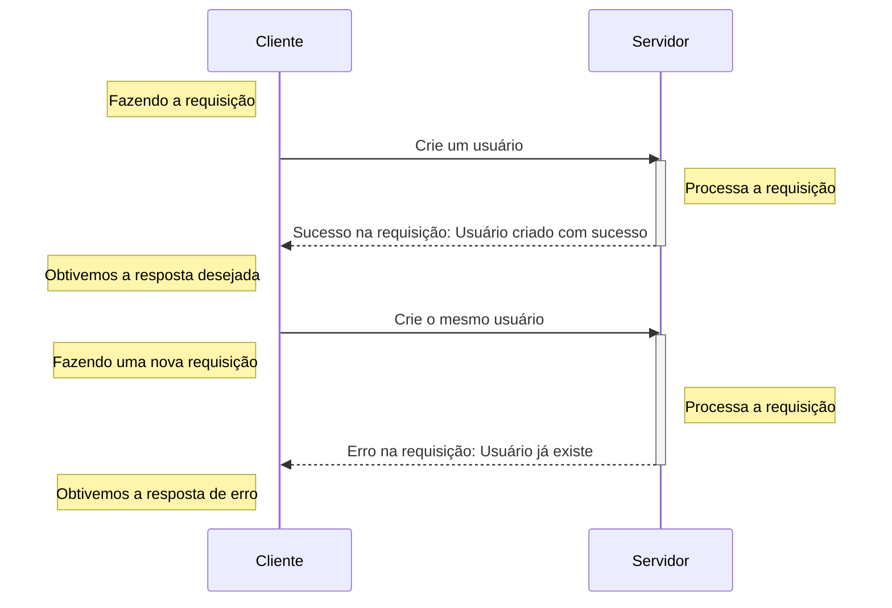
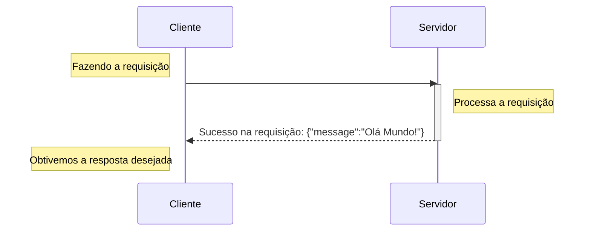
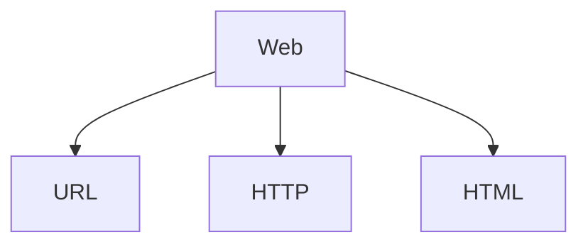

Boas-vindas a segunda aula do nosso curso de FastAPI. Agora que já temos o ambiente preparado e algum código escrito e testado. Nada melhor do que entender o que viemos fazer aqui. Até esse ponto, você já deve saber que o FastAPI é um framework para desenvolvimento de aplicações web, mais especificamente para o desenvolvimento de APIs web. É nesse ponto que ter um bom referencial e um pouco de teoria se torna importante para entendermos exatamente o que o framework é capaz de fazer.


## A web

Sempre que nos referimos a aplicações web, o que queremos dizer é que são aplicações que de fato funcionam em rede. A rede pode ser tanto privativa, como a sua rede doméstica ou uma rede empresarial, ou nos referimos a rede como a [WWW](https://pt.wikipedia.org/wiki/World_Wide_Web){:target="_blank"} (a rede mundial de computadores) ou como costumamos dizer, a "internet". Que tem uma longa história (iniciando em 1960), diversos padrões definidos e que vem se aperfeiçoando desde então. O que pode ser extremamente complexo, quando nós, 60 anos após o início, tentamos entender a essência desse funcionamento.


Quanto nos referimos a comunicação em rede, estamos geralmente falando sobre a comunicação entre dois (ou mais) dispositivos interconectados. A ideia é que possamos nos comunicar com outro dispositivos usando a rede.

### O modelo cliente-servidor

Geralmente, quando falamos de aplicações web, estamos nos referindo a um modelo bastante específico de comunicação. Onde temos clientes, como aplicativos móveis, clientes de terminal, navegadores e etc. Acessando recursos servidos por um outro computador, que damos o nome de servidor.

Neste modelo fazemos chamadas de um cliente, via rede, [seguindo alguns padrões](#o-modelo-padrao-da-web){:target="_blank"} e obtemos respostas da nossa aplicação, o servidor.

Podemos dizer "servidor, crie um usuário para mim" e então enviamos essa requisição, um pedido, e ele nos fornecerá uma resposta. Sendo positiva ou negativa. Se algo deu certo ou deu errado.



A comunicação funciona de forma bi-direcional. Onde um cliente faz uma requisição ao servidor e o servidor emite uma resposta dessa requisição.

Por exemplo, quando vamos construir um servidor, precisamos de uma biblioteca que consiga "servir" nossa aplicação. Aqui entra o Uvicorn, ele tem a responsabilidade de servir a nossa aplicação com FastAPI.

Quando executamos:

```shell title="$ Execução no terminal!"
uvicorn fast_zero.app:app
```

Estamos iniciando um servidor em loopback, o que significa que ele está disponível na rede interna do nosso computador. Só está acessível pelo nosso computador!

Por isso, quando acessamos [http://127.0.0.1:8000/](http://127.0.0.1:8000/){:target="_blank"} no navegador, um cliente, estamos fazendo uma requisição ao servidor em `127.0.0.1:8000`.



#### Usando o uvicorn na rede local

Aproveitando que estamos falando sobre rede. O uvicorn em seu pc, pode servir o FastAPI na sua rede local também:

```shell title="$ Execução no terminal!"
uvicorn fast_zero.app:app --host 0.0.0.0
```

Desta forma, você pode acessar por um cliente em outro computador, em sua rede, usando o endereço IP da sua máquina.

??? tip "Descobrindo o seu endereço local usando python"
	Caso você não tenha domínio do terminal ou de ferramentas para descobrir o seu 
	```py title=">>> Terminal interativo!"
	>>> import socket
	>>> s = socket.socket(socket.AF_INET, socket.SOCK_DGRAM)
	>>> s.connect(("8.8.8.8", 80))
	>>> s.getsockname()[0]
	'192.168.0.100'# (1)!
	```

	1. O endereço do meu computador na rede local

{: .center .shadow }

### O modelo padrão da web

Ignorando muita história e diversas camadas de padrões. Podemos nos basear nos 3 padrões pilares, que serão mais importantes para nós nesse momento:



- [URL](https://pt.wikipedia.org/wiki/URL){:target="_blank"}: *localizador uniforme de recursos*. Um endereço de rede onde podemos nos comunicar com computador na rede.
- [HTTP](https://pt.wikipedia.org/wiki/Hypertext_Transfer_Protocol){:target="_blank"}: Um protocolo que especifica como deve ocorrer a comunicação entre os dispositivos.
- [HTML](https://pt.wikipedia.org/wiki/HTML){:target="_blank"}: a linguagem que usamos para criar e estruturar páginas na web.

#### URL

Uma URL (Uniform Resource Locator) é como um endereço que nos ajuda a encontrar um recurso específico em uma rede. Como por exemplo a URL que usamos até agora para acessar nossa aplicação `http://127.0.0.1:8000`.

Uma URL é formada por diversas partes, como nesse exemplo: `protocolo://endereço:porta/caminho/recurso?query_string#fragmento`. Nesse primeiro momento, focarei nos primeiros 4 pontos, que serão triviais para o andamento da aula:

1. Protocolo: a primeira parte da URL e termina com "://". Os mais comuns são "http://" e "https://". Este protocolo define como os dados são trocados entre o seu computador e o local onde o recurso está armazenado, independentemente de estar na internet ou em uma rede local.

2. Endereço do Host: este pode ser um endereço IP (como "192.168.1.10") ou um endereço de [DNS](https://pt.wikipedia.org/wiki/Sistema_de_Nomes_de_Dom%C3%ADnio){:target="_blank"} (como "youtube.com"). Ele identifica o dispositivo na rede que contém o recurso desejado.

3. Porta (opcional): Após o endereço do host, você pode ver um número após dois pontos, como em "192.168.1.10:8080". Esse número é a porta. Ela é usada para direcionar sua solicitação ao serviço específico dentro do dispositivo que está ouvindo em uma porta específica. Diferentes aplicações em um mesmo dispositivo usam portas diferentes. Por padrão, quando não especificado, a porta é `80` para HTTP e `443` para HTTPS.

4. Caminho: o caminho indica a localização exata do recurso dentro do servidor ou dispositivo. Por exemplo, "192.168.1.10:8000/busca". Onde `/busca` é o nome do recurso. Quando o recurso não é especificado, por padrão, o servidor responde o recurso `/`.


Desta forma, quando acessamos via navegador a URL `http://127.0.0.1:8000`. Estamos acessando o servidor via protocolo `HTTP`, o endereço do nosso `próprio computador`, na porta `8000`, fazendo um pedido do recurso `/`.

#### HTTP

Quando o cliente inicia uma requisição para um endereço na rede, isso é encapsulado em um protocolo e trafegado em direção a quem serve um determinado recurso. Quando falamos em aplicações WEB, grande parte da comunicação é feita via o protocolo HTTP, ou sua versão segura, o HTTPS.

HTTP, ou Hypertext Transfer Protocol (Protocolo de Transferência de Hipertexto), é o protocolo fundamental na web para a transferência de dados e comunicação entre clientes e servidores. O HTTP é baseado no modelo de requisição-resposta: o cliente faz uma requisição para o servidor, e o servidor responde a essa requisição. Essas requisições e respostas são formatadas conforme as regras do protocolo HTTP.

##### Verbos

Quando um cliente faz uma requisição HTTP, ele anuncia a sua intensão para o servidor utilizando verbos. Os verbos sinalizam ações dentro do protocolo HTTP. Alguns exemplos:

- **GET**: recupera recursos. Usamos quando queremos pedir um dado existente no servidor.
- **POST**: cria um novo recurso.
- **PUT**: Atualiza um recurso existente.
- **DELETE**: Exclui um recurso.


##### Código de resposta


Os códigos de resposta HTTP informam ao cliente sobre o resultado de sua solicitação. Aqui estão alguns dos códigos de resposta mais comuns:

- **200 OK**: A solicitação foi bem-sucedida. O significado exato depende do método HTTP utilizado na solicitação.
- **201 Created**: A solicitação foi bem-sucedida e um novo recurso foi criado como resultado.
- **404 Not Found**: O recurso solicitado não pôde ser encontrado. Este código é frequentemente usado quando o recurso é inexistente.

##### Relacionando isso ao nosso código
ref: https://fastapi.tiangolo.com/tutorial/response-status-code/#response-status-code

```py title="aula_00.py" linenums="1" hl_lines="1"
@app.get("/", status_code=200)
def read_root():
    return {'message': 'Olá Mundo!'}
```

---

```python title="Exemplo do código que fizemos"
@app.get('/')
def read_root():
    return {'message': 'Olá Mundo!'}
```

Desta forma o cliente chama o Uvicorn, o Uvicorn procura a função responsável pelo recurso `/` em nosso aplicativo FastAPI e executa a função `read_root()`. Fazendo com que o valor retornado, seja o objeto JSON ` {"message": "Olá Mundo!"}`


#### HTML

> Vou ser **BEM** breve

## APIs

Acrônimo de Application Programming Interface (Interface de Programação de Aplicações), uma API é um conjunto de regras e protocolos que permitem a comunicação entre diferentes softwares. As APIs servem como uma ponte entre diferentes programas, permitindo que eles se comuniquem e compartilhem informações de maneira eficiente e segura.

No mundo moderno, as APIs geralmente comunicam usando o formato de dados JSON (JavaScript Object Notation), que é uma maneira leve e eficiente de transmitir dados entre a API e o cliente.

As APIs são fundamentais no mundo da programação moderna, ao permitirem a interação entre diferentes sistemas, independentemente de como foram projetados ou em que linguagem foram escritos.


### JSON

> O formato que vamos usar pra trafegar informação

```py title="aula_00.py" linenums="1" hl_lines="3"
@app.get("/", status_code=200)
def read_root():
    return {'message': 'Olá Mundo!'}
```

#### Schema

```python title="fast_zero/schemas.py"
class Message(BaseModel):
    detail: str
```

### OpenAPI

> Contratos entre cliente e servidor!

- Swagger/ Redoc
