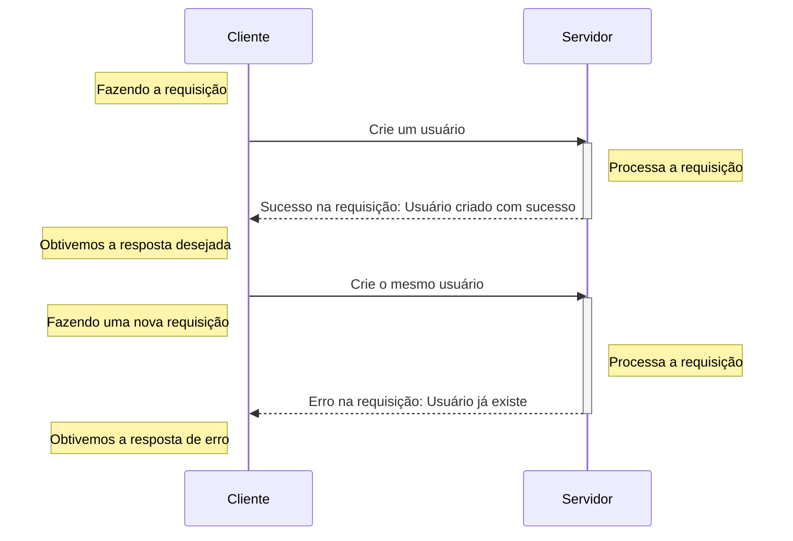
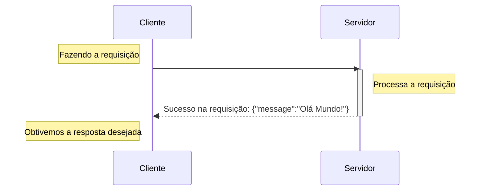
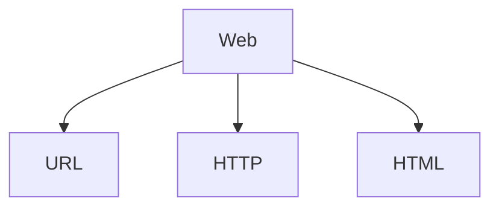

Boas-vindas a segunda aula do nosso curso de FastAPI. Agora que já temos o ambiente preparado e algum código escrito e testado. Nada melhor do que entender o que viemos fazer aqui. Até esse ponto, você já deve saber que o FastAPI é um framework para desenvolvimento de aplicações web, mais especificamente para o desenvolvimento de APIs web. É nesse ponto que ter um bom referencial e um pouco de teoria se torna importante para entendermos exatamente o que o framework é capaz de fazer.


## A web

Sempre que nos referimos a aplicações web, o que queremos dizer é que são aplicações que de fato funcionam em rede. A rede pode ser tanto privativa, como a sua rede doméstica ou uma rede empresarial, ou nos referimos a rede como a [WWW](https://pt.wikipedia.org/wiki/World_Wide_Web){:target="_blank"} (a rede mundial de computadores) ou como costumamos dizer, a "internet". Que tem uma longa história (iniciando em 1960), diversos padrões definidos e que vem se aperfeiçoando desde então. O que pode ser extremamente complexo, quando nós, 60 anos após o início, tentamos entender a essência desse funcionamento.


Quanto nos referimos a comunicação em rede, estamos geralmente falando sobre a comunicação entre dois (ou mais) dispositivos interconectados. A ideia é que possamos nos comunicar com outro dispositivos usando a rede.

### O modelo cliente-servidor

Geralmente, quando falamos de aplicações web, estamos nos referindo a um modelo bastante específico de comunicação. Onde temos clientes, como aplicativos móveis, clientes de terminal, navegadores e etc. Acessando recursos servidos por um outro computador, que damos o nome de servidor.

Neste modelo fazemos chamadas de um cliente, via rede, [seguindo alguns padrões](#o-modelo-padrao-da-web){:target="_blank"} e obtemos respostas da nossa aplicação, o servidor.

Podemos dizer "servidor, crie um usuário para mim" e então enviamos essa requisição, um pedido, e ele nos fornecerá uma resposta. Sendo positiva ou negativa. Se algo deu certo ou deu errado.



A comunicação funciona de forma bi-direcional. Onde um cliente faz uma requisição ao servidor e o servidor emite uma resposta dessa requisição.

Por exemplo, quando vamos construir um servidor, precisamos de uma biblioteca que consiga "servir" nossa aplicação. Aqui entra o Uvicorn, ele tem a responsabilidade de servir a nossa aplicação com FastAPI.

Quando executamos:

```shell title="$ Execução no terminal!"
uvicorn fast_zero.app:app
```

Estamos iniciando um servidor em loopback, o que significa que ele está disponível na rede interna do nosso computador. Só está acessível pelo nosso computador!

Por isso, quando acessamos [http://127.0.0.1:8000/](http://127.0.0.1:8000/){:target="_blank"} no navegador, um cliente, estamos fazendo uma requisição ao servidor em `127.0.0.1:8000`.



#### Usando o uvicorn na rede local

Aproveitando que estamos falando sobre rede. O uvicorn em seu pc, pode servir o FastAPI na sua rede local também:

```shell title="$ Execução no terminal!"
uvicorn fast_zero.app:app --host 0.0.0.0
```

Desta forma, você pode acessar por um cliente em outro computador, em sua rede, usando o endereço IP da sua máquina.

??? tip "Descobrindo o seu endereço local usando python"
	Caso você não tenha domínio do terminal ou de ferramentas para descobrir o seu 
	```py title=">>> Terminal interativo!"
	>>> import socket
	>>> s = socket.socket(socket.AF_INET, socket.SOCK_DGRAM)
	>>> s.connect(("8.8.8.8", 80))
	>>> s.getsockname()[0]
	'192.168.0.100'# (1)!
	```

	1. O endereço do meu computador na rede local

{: .center .shadow }

### O modelo padrão da web

Ignorando muita história e diversas camadas de padrões. Podemos nos basear nos 3 padrões pilares, que serão mais importantes para nós nesse momento:



- [URL](https://pt.wikipedia.org/wiki/URL){:target="_blank"}: *localizador uniforme de recursos*. Um endereço de rede onde podemos nos comunicar com computador na rede.
- [HTTP](https://pt.wikipedia.org/wiki/Hypertext_Transfer_Protocol){:target="_blank"}: Um protocolo que especifica como deve ocorrer a comunicação entre os dispositivos.
- [HTML](https://pt.wikipedia.org/wiki/HTML){:target="_blank"}: a linguagem que usamos para criar e estruturar páginas na web.
