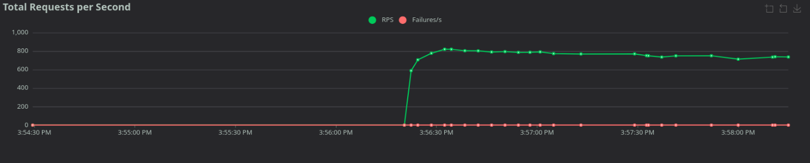

# Uma introdução a testes de carga com Locust



Fico muito feliz em te ver aqui. Isso significa que você conseguiu superar o início de ter que colocar a API para rodar. É importante para seguir nesse módulo que sua aplicação já esteja com:

- FastAPI rodando
- Async SQLAlchemy se comunicando com PostgreSQL
- Docker Compose controlando seus serviços
- CRUD funcionando, autenticação pronta, testes unitários e integração funcionando

Esta é a base para entendermos o comportamento da aplicação em cenários mais próximos da realidade, quando múltiplos usuários acessam ao mesmo tempo.

Ela funciona. Mas, até o momento o que podemos garantir é que funciona sozinha, ambiente local, um usuário por vez.

Veja, isso não é exatamente um problema. Mas, a pergunta que fica é:

> "Quantos requests simultâneos a minha aplicação suporta?"

No sentido de quantas pessoas conseguem, em teoria, usar a minha aplicação simultaneamente.

## Testes de carga

Uma forma [sintética](inserir-ref-aqui){:target="_blank"} de entender o quanto a aplicação suporta, é fazendo testes de carga.

Os testes de carga tem duas responsabilidades específicas:

1. Nos mostrar o quanto a nossa aplicação, no estado atual, consegue responder de requisições simultâneas e o tempo que elas levam;
2. Evidenciar possíveis gargalos na nossa aplicação. Endpoints, problemáticos, latências problemáticas, etc; que podem por consequência nos levar a melhorias no código.

---

Alguém pode estar se perguntando o como esses testes são diferentes dos testes que fizemos até agora via pytest. E, claro, é uma pergunta bastante válida.

Os testes padrões que fizemos, são testes **funcionais**, ou seja, eles garantem que a aplicação funcione como o esperado.

**Uma analogia**

Imagine que você construiu um carro no quintal.

- Você liga, acelera e ele funciona: ok, teste funcional passado.
- Mas se você colocar cinco pessoas dentro, subir uma serra com o tanque cheio, o carro pode travar, superaquecer ou fazer barulho estranho: teste de carga mostra isso.

O mesmo vale para uma API: Ela funciona sozinha, mas e quando 50 usuários aparecem ao mesmo tempo?

### O que conseguimos medir

Mesmo usando seu computador local, você consegue observar:

- **Latência**: quanto tempo a API demora para responder
- **Throughput (RPS)**: quantas requisições por segundo ela atende
- **Erros inesperados**: 500, 502, timeouts
- **Estrangulamentos**: CPU, pool de conexões, consultas lentas, async bloqueado

Isso te dá **insights reais** antes de ir para produção.

Esses dados nos permitem identificar rapidamente se a aplicação está escalando de forma saudável. Por exemplo, latência alta indica lentidão, RPS baixo indica que o throughput está limitado, e erros crescentes mostram possíveis gargalos que precisam ser resolvidos.

## Locust

Existe uma gama de ferramentas de carga e cada pessoa tem suas preferências. Mas, estamos em um material de Python! Eu esperaria que a ferramenta também fosse em Python.

{: .center .shadow width="200"}

Vamos usar o [Locust](https://locust.io/):

- Os testes de carga são feitos usando arquivos `.py` que podem ser versionados e é um idioma que entendemos.
- Possui uma interface web interativa, que pode nos ajudar a ver os dados em tempo real
- É bastante simples de executar e integrar com nosso ecossistema de ferramentas

Instalar é bastante simples:

```bash
poetry add -G dev locust #(1)!
```

1. Insere o `locust` no nosso grupo de desenvolvimento

### Conceitos do Locust

O código do locust é bastante simples:

```python title="locustfile.py"
from locust import HttpUser, task


class FastAPIUser(HttpUser): #(1)!

    @task #(2)!
    def read_users(self):
        self.client.get('/users/')
```

1. **Usuário virtual (`HttpUser`)**: representa alguém usando a API
2. **Tarefa (`@task`)**: ação que o usuário faz (GET, POST…)

A classe `HttpUser` representa um usuário único na sua API e cada `#!py @task` representa um ação possível que ele pode executar na aplicação.

Com base nisso, podemos entender as ações e métricas geradas por cada `HttpUser` de forma diferente.


## Executando nosso primeiro teste

Primeiro, garanta que sua aplicação via [docker-compose](../11.md#simplificando-nosso-fluxo-com-docker-compose):

```bash
docker compose up

# O que deve resultar em algo parecido com isso:
[+] up 3/3
 ✔ Network 14_default               Created     0.0s
 ✔ Container 14-fastzero_database-1 Created     0.0s
 ✔ Container 14-fastzero_app-1      Created     0.0s
```

Após isso, vamos iniciar o locust apontando para a nossa aplicação rodando na porta `8000`:

```bash
locust -f locustfile.py --host=http://localhost:8000
```

Com isso, podemos acessar a interface web do `locust` em [http://localhost:8089](http://localhost:8089){:target="_blank"}

### Interface inicial

Ao acessar no browser, temos algo parecido com isso:

{: .center .shadow }

Os três campos exibidos são:

- **Numbers of users**: quantos usuários vamos simular ao mesmo tempo
- **Ramp up**: a quantidade que vão iniciar juntos
- **Host**: o endereço da nossa aplicação na rede

Nesse primeiro momento não vamos alterar nada. Vai ser mais simples para entender o comportamento. Mas vamos chegar lá... Clique em `START`.

### Tabela de resultado

Após iniciarmos os testes, vamos ver uma tabela como essa:

{: .center .shadow }

Que mostra em tempo real os dados do teste de carga. São muitos dados e todos eles são importantes, portanto, vou criar uma tabela horizontal da mesma tabela do locust:

| Métrica                  | Valor   | O que significa                        | Observações pedagógicas                                                                  |
|--------------------------|---------|----------------------------------------|------------------------------------------------------------------------------------------|
| **Type**                 | GET     | Tipo de requisição HTTP                | Indica o método usado; se você tiver POST, PUT ou DELETE, cada um terá sua linha própria |
| **Name**                 | /users/ | Endpoint ou tarefa testada             | Mostra qual endpoint está sendo medido; a linha "Aggregated" soma todas as tarefas       |
| **# Requests**           | 61524   | Total de requisições feitas            | Inclui requisições bem-sucedidas e falhas; indica volume total de tráfego gerado         |
| **# Fails**              | 0       | Número de requisições que falharam     | Erros como 500, 502, timeout; se subir, é sinal de saturação ou gargalo                  |
| **Median (ms)**          | 1       | Latência mediana                       | 50% das requisições responderam em ≤1ms; mostra o tempo “típico” de resposta             |
| **95%ile (ms)**          | 2       | Percentil 95                           | 95% das requisições responderam em ≤2ms; mostra picos raros                              |
| **99%ile (ms)**          | 2       | Percentil 99                           | 99% das requisições responderam em ≤2ms; revela outliers extremos                        |
| **Average (ms)**         | 1,25    | Latência média                         | Média de todas as requisições; importante analisar junto com median e percentis          |
| **Min (ms)**             | 1       | Menor tempo registrado                 | Indica a performance mínima alcançada pelo endpoint                                      |
| **Max (ms)**             | 20      | Maior tempo registrado                 | Indica picos de latência; atenção para possíveis gargalos                                |
| **Average size (bytes)** | 12      | Tamanho médio da resposta              | Respostas pequenas tendem a ser mais rápidas; endpoints grandes impactam latência e RPS  |
| **Current RPS**          | 736,1   | Requests por segundo no instante atual | Mostra a taxa de requisições processadas; RPS caindo = saturação                         |
| **Current Failures/s**   | 0       | Número de erros por segundo            | Indica problemas imediatos durante o teste; 0 é ótimo                                    |

### Inteprentado o resultado

Agora que temos uma noção do que cada um desses dados representa. Como podemos interpretar ela? Aqui vão algumas dicas:

#### Comece por `Requests` e `Fails`

Por ser um teste de "carga" você pode estar pensando que a velocidade ou a quantidade ao mesmo tempo, são os dados mais importantes. Talvez você não esteja totalmente errado, mas o ponto principal aqui é **ESTABILIDADE**.

Vamos montar uma conta simples:

$$
\frac{\#Fails}{\#Requests} \times 100
$$

Isso nos dá a taxa percentual de erro.

Por exemplo, se tivermos:

- `Requests`: 10.000
- `Fails`: 1

Teremos:

$$
\frac{1}{10000} \times 100 = 0{,}01\%
$$

Isso significa que somente 0,01% das requisições falharam. O que não parece preocupante ou assustador. Mas, vamos pensar um pouco diferente.

Se tivermos:

- `Requests`: 1.000
- `Fails`: 10

$$
\frac{10}{1000} \times 100 = 1\%
$$

1% de erro parece pequeno. Mas em 1 milhão de requisições, isso significa 10 mil falhas. Percebe como o número absoluto pode enganar?

Por isso é sempre bom pensar em taxas de erro, no lugar de valores absolutos.

#### Observe `Current Failures/s`

Enquanto `#Fails` é acumulado desde o início do teste, `Current Failures/s` mostra o que está acontecendo agora.

Se ele sobe para 5, significa que estamos falhando 5 vezes por segundo neste exato momento. Isso geralmente indica que atingimos um limite estrutural da aplicação.

Pode ser:

- Pool de conexões esgotado
- Banco demorando para responder
- CPU saturada
- Worker bloqueado

Essa métrica ajuda a identificar o momento exato da degradação.

#### Observe os dados de tempo (ms)

Agora vem a parte que estávamos nos coçando para olhar primeiro :)

##### Min e Max

Na tabela temos valores absolutos como `Min` e `Max`. Eles nos dizem exatamente qual foi o request mais rápido e qual foi o mais lento durante o teste.

- `Min`: melhor cenário observado.
- `Max`: pior caso observado.

O `Min` geralmente não ajuda muito na análise. Ele mostra apenas que em algum momento tudo estava livre.
Já o `Max` pode indicar um pico isolado ou o início de um problema estrutural. Se ele estiver muito distante do `p99`, pode ter sido apenas um evento pontual. Mas se começar a crescer conforme aumentamos usuários, provavelmente temos fila interna se formando.

##### Média 

Agora entram duas medidas estatísticas fundamentais: `Median` (Mediana) e `Average` (Média).

A **média (Average)** é o valor mais intuitivo. Ela soma todos os tempos de resposta e divide pelo número total de requisições. Parece simples. E é.

Mas a média é extremamente sensível a valores extremos.

Imagine que você tenha 5 requisições com os seguintes tempos:

```text
1ms, 1ms, 1ms, 1ms, 100ms
```

A média será:

$$
\text{Average} = \frac{1 + 1 + 1 + 1 + 100}{5} = 20{,}8 \text{ ms}
$$

Quatro requisições foram extremamente rápidas e uma foi muito lenta. Mesmo assim, a média ficou em 20,8ms, mostrando como valores extremos distorcem a percepção geral.

##### Mediana

Já **mediana (Median)** funciona diferente.

Para calcular a mediana, primeiro ordenamos os tempos de resposta do menor para o maior:

```
1ms, 1ms, 1ms, 1ms, 100ms
```

Como temos **5 valores** (ímpar), a mediana é o valor central, ou seja, o **terceiro valor**:

$$
\text{Median} = 1 \text{ ms}
$$

Se tivéssemos um número **par** de requisições, por exemplo 6:

```
1ms, 1ms, 1ms, 1ms, 100ms, 100ms
```

A mediana seria a média dos dois valores centrais (3º e 4º):

$$
\text{Median} = \frac{1 + 1}{2} = 1 \text{ ms}
$$

A mediana representa o comportamento típico da aplicação. Ela ignora extremos, mostrando como a maioria dos usuários percebe a performance.

##### Percentis

Por fim, temos os **percentis**.

Quando o Locust mostra `95%ile`, ele está dizendo: 95% das requisições responderam em até aquele tempo.

Se o `p95` for `200ms`, significa que somente 5% das requisições foram mais lentas que isso.
O `p99` mostra o comportamento das caudas mais extremas, ou seja, 1% das requisições mais lentas.

Mesmo que pareça pouco, em 1 milhão de requisições, 1% representa **10 mil requisições lentas**, impactando diretamente a experiência do usuário.

##### Analisando os tempos

Existe um padrão bastante evidente ao observar os resultados numéricos.

Se:

$$
\text{Median} \approx \text{Average} \approx p95
$$

Temos um sistema estável e previsível.

Se:

* `Average` começa a se afastar da `Median`
* `p95` sobe
* `p99` dispara

Temos degradação.

E essa degradação quase sempre começa nos percentis mais altos:

1. Primeiro piora o `p99`.
2. Depois o `p95`.
3. Depois a média.
4. A mediana é a última a sofrer.

Isso mostra que os extremos sofrem antes do sistema "parecer lento". Por isso, percentis são mais importantes que a média em análise de carga.

### Gráficos

Uma das coisas legais da interface do Locust é que ele permite a visualização dos gráficos em tempo real. Ao clicar em `Charts` no menu superior:

{: .center .shadow }

Ele nos exibe três gráficos interessantes:

{: .center .shadow }

Onde temos duas linhas, a verde, que nos mostra o RPS (Requests por segundo) e a vermelha que nos mostra os erros por segundo.

Também podemos analisar os percentis:

{: .center .shadow }

Com as linhas para indicar o valor de 50% (amarela), um dado que não é disponibilizado na tabela original e o 95% (roxa).


E por fim, temos o gráfico de linha que exibe a quantidade de usuários que estão enviando requisições para a aplicação:

{: .center .shadow }

Note que como nosso exemplo foi basicamente para entender as métricas, somente um usuário está sendo usado durante todo o teste.

## Exercícios

1. Aumentando o número de usuários.
    Na interface web do Locust:
    - Configure **Number of users** para 10 ou mais.
    - Mantenha o `Ramp up` baixo (ex: 1-2).
    - Observe como mudam as métricas de **RPS**, **latência** e **erros**.
    - **Objetivo:** entender como a aplicação se comporta com múltiplos usuários simultâneos.

2. Ramp up alto
    Ainda na interface web do Locust:
    - Configure **Number of users** para 30 ou mais.
    - Configure o **Ramp up** para um valor alto (ex: 30-60).
    - Observe como o tempo de resposta e os erros evoluem à medida que os usuários entram gradualmente.
    - **Objetivo:** analisar o efeito do ramp-up alto e identificar possíveis gargalos na aplicação.


3. Criando uma nova `task`. O objetivo desse exercício é que você crie um request para o endpoint `read_users`. Com isso você deve analisar se a latência desse endpoint é maior ou menor e descrever o porquê esse comportamento é diferente em tempo do endpoint que usamos nessa aula.


## Conclusão

Nesta aula você aprendeu como iniciar testes de carga com Locust, interpretar métricas básicas como latência, RPS e erros, e entender o comportamento da sua aplicação sob múltiplos usuários. Nas próximas aulas vamos avançar para cenários mais complexos, criar tarefas personalizadas e analisar de forma mais detalhada o desempenho da aplicação.



