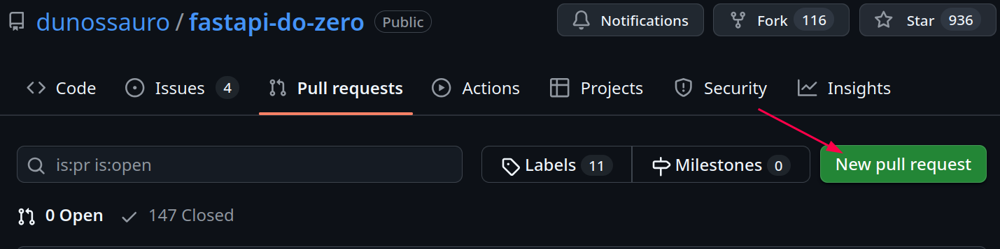

# Guia de contribuição

Algumas instruções legais, caso você queira contribuir com esse projeto :heart:

## O básico

Faça um fork do repositório do git na sua conta:

{: .center .shadow }

Clone o seu fork do repositório:

```shell title="$ Execução no terminal!"
git clone https://github.com/seu_handle/fastapi-do-zero
```

Crie uma branch:

```shell title="$ Execução no terminal!"
git branch -m fix/aula-01-gramatica
```

> Embora essa branch use [conventional branch](https://conventional-branch.github.io/pt-br/){:target="_blank"}, isso não é um requisito, somente um exemplo.

**Inicie seu ambiente:**

??? warning "Esse projeto é gerenciado pelo poetry"
	Caso você não o tenha instalado, pode instalar via `pipx`:
	
	```shell title="$ Execução no terminal!"
	pipx install poetry
	```

```shell title="$ Execução no terminal!"
poetry install
```

Faça suas alterações: **...**

Veja o material renderizado, caso sua alteração seja no texto:

```shell title="$ Execução no terminal!"
poetry run task serve #(1)!
```

1. Inicia o servidor do mkdocs

Execute os testes, caso sua alteração envolva código:

```shell title="$ Execução no terminal!"
poetry run task test #(1)!
```

1. executa os testes do projeto

Adicione um changelog:

```shell title="$ Execução no terminal!"
towncrier create #(1)!
Issue number (`+` if none): + #(2)!
Fragment type (adicionado, correcoes, alterado, ...): #(3)!
```

1. Esse é o comando. Após isso o o cli exibirá uma opção.
2. Aqui você deve adicionar o número da issue, caso houver
3. Aqui você deve escolher um dos tipos, o que mais se aproxima da contribuição que fizer. Após isso o editor se abrirá em modo de texto.

> Para mais informações sobre isso, vá para [changelogs](#changelogs)

Faça um commit e push:

```shell title="$ Execução no terminal!"
git add .
git commit -m "fix: corrige a gramática na aula 01"
git push
```
> Embora esse commit use [conventional commits](https://www.conventionalcommits.org/pt-br/v1.0.0/){:target="_blank"}, isso não é um requisito, somente um exemplo.

Abra um pull request:

{: .center .shadow }


## Changelogs

A ferramenta usada para os changelogs é o [`towncrier`](https://towncrier.readthedocs.io/en/stable/tutorial.html){:target="_blank"}.

Uso básico:

```shell title="$ Execução no terminal!"
towncrier create #(1)!
Issue number (`+` if none): + #(2)!
Fragment type (adicionado, correcoes, alterado, ...): #(3)!
```

1. Esse é o comando. Após isso o o cli exibirá uma opção.
2. Aqui você deve adicionar o número da issue, caso houver
3. Aqui você deve escolher um dos tipos, o que mais se aproxima da contribuição que fizer. Após isso o editor se abrirá em modo de texto.


> As entradas vão automaticamente para o diretório `changelogs`, caso isso apareça no seu diff.

Algumas coisas são importantes para geração do changelog

- É importante que sua mensagem de mudança não tenha mais de uma linha.
- Após o texto da alteração, adicione o seu @ do git:
  ```md
  Correções gramaticais na aula 01, por [@dunossauro](https://github.com/dunossauro){:target="_blank"}
  ```

Após o Pull Request ser aceito, essas mensagens são exibidas na página de [alterações](/alteracoes){:target="_blank"}.
